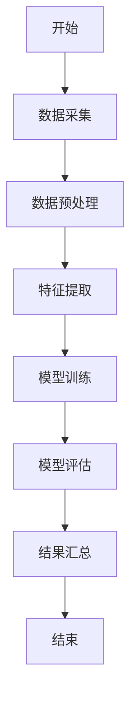

                 


# AI智能体协作：构建更全面的企业价值评估模型

> 关键词：AI智能体协作，企业价值评估，智能体协作，多智能体系统，企业价值模型，人工智能算法，企业数据分析，协作机制

> 摘要：本文详细探讨了AI智能体协作在企业价值评估中的应用，提出了构建更全面的企业价值评估模型的方法。通过分析传统企业价值评估的局限性，结合AI智能体协作的优势，提出了基于多智能体系统的评估模型，该模型通过智能体之间的协作和信息共享，能够更全面地捕捉企业的多维度价值。本文从问题背景、核心概念、算法原理、系统架构、项目实战等多个维度展开，深入剖析了AI智能体协作在企业价值评估中的实现细节和应用前景，为实践者提供了系统化的解决方案和参考。

---

## 第一部分: AI智能体协作与企业价值评估基础

### 第1章: AI智能体协作的背景与问题背景

#### 1.1 问题背景

- **1.1.1 传统企业价值评估的局限性**
  传统的企业价值评估方法通常依赖于财务数据和简单的统计模型，难以全面捕捉企业的多维度价值。例如，传统的财务指标（如ROE、净利润率）仅关注企业的财务表现，而忽略了市场竞争力、技术创新能力、管理效率等重要因素。

- **1.1.2 AI智能体协作的提出与意义**
  随着人工智能技术的快速发展，AI智能体协作的概念应运而生。通过多个智能体协同工作，可以更全面地收集和分析企业的多维度数据，包括市场数据、行业趋势、管理数据等，从而构建更全面的企业价值评估模型。

- **1.1.3 企业价值评估模型的演进过程**
  从传统的财务指标分析到基于机器学习的单模型评估，再到如今的AI智能体协作的多模型协作评估，企业价值评估模型经历了从简单到复杂的演进过程。

#### 1.2 问题描述

- **1.2.1 传统模型的不足与挑战**
  传统的企业价值评估模型主要依赖财务数据，难以处理非结构化数据（如文本数据、图像数据）和动态变化的市场信息。

- **1.2.2 AI智能体协作在企业价值评估中的应用需求**
  通过AI智能体协作，可以实现对多源异构数据的实时采集、分析和决策，从而提升企业价值评估的准确性和全面性。

- **1.2.3 问题解决的必要性与紧迫性**
  在当前数字化转型的大背景下，企业面临的竞争日益激烈，传统的价值评估方法已无法满足企业的实际需求。

#### 1.3 问题解决与边界定义

- **1.3.1 AI智能体协作的核心解决思路**
  通过多个智能体协作，实现对企业内外部数据的全面采集和分析，构建一个多维度的企业价值评估模型。

- **1.3.2 企业价值评估模型的边界与外延**
  企业价值评估模型的边界包括企业的财务数据、市场数据、管理数据等，外延则包括对模型的实时更新和动态优化。

- **1.3.3 智能体协作与企业价值评估的结合方式**
  智能体协作通过多智能体协同工作，分别负责不同的数据源和分析任务，最终汇总形成全面的企业价值评估结果。

#### 1.4 概念结构与核心要素

- **1.4.1 AI智能体协作的构成要素**
  包括智能体、协作机制、通信协议、任务分配算法等。

- **1.4.2 企业价值评估模型的要素分析**
  包括数据采集、数据预处理、特征提取、模型训练、模型评估等。

- **1.4.3 智能体协作与企业价值评估的关联性分析**
  智能体协作通过多维度数据的协同分析，提升了企业价值评估的全面性和准确性。

#### 1.5 本章小结

---

### 第2章: AI智能体协作的核心概念与联系

#### 2.1 核心概念原理

- **2.1.1 智能体协作的基本原理**
  智能体协作是指多个智能体通过协同工作，共同完成一个复杂任务的过程。每个智能体负责不同的子任务，并通过通信协议共享信息和结果。

- **2.1.2 企业价值评估模型的数学基础**
  企业价值评估模型通常基于回归分析、聚类分析等机器学习算法，结合多智能体协作的思想，构建多维度评估模型。

- **2.1.3 AI智能体协作与企业价值评估的结合原理**
  AI智能体协作通过多智能体协同工作，分别负责不同的数据源和分析任务，最终汇总形成全面的企业价值评估结果。

#### 2.2 核心概念属性特征对比表

| **属性**       | **传统企业价值评估** | **AI智能体协作** |
|----------------|----------------------|------------------|
| 数据来源       | 财务数据为主         | 多源异构数据     |
| 分析维度       | 有限                | 多维度           |
| 算法复杂度     | 较低                | 较高             |
| 实时性         | 较差                | 较好             |

#### 2.3 ER实体关系图架构

```mermaid
er
    actor 评估模型
    actor 智能体协作
    actor 数据源
    actor 分析任务
    actor 评估结果
    actor 优化建议
    actor 系统架构
```

#### 2.4 本章小结

---

### 第3章: AI智能体协作的算法原理

#### 3.1 算法原理概述

- **3.1.1 智能体协作的基本算法框架**
  智能体协作算法通常包括任务分配、数据采集、信息共享、结果汇总等步骤。

- **3.1.2 企业价值评估模型的算法特点**
  企业价值评估模型通常基于机器学习算法，结合多智能体协作的思想，构建多维度评估模型。

- **3.1.3 AI智能体协作算法的核心思想**
  AI智能体协作算法通过多个智能体协同工作，分别负责不同的数据源和分析任务，最终汇总形成全面的企业价值评估结果。

#### 3.2 算法流程图



#### 3.3 算法数学模型与公式

- **公式3.1: 企业价值评估的基本公式**
  $$V = \sum_{i=1}^{n} w_i x_i$$
  其中，$w_i$ 是特征 $x_i$ 的权重，$V$ 是企业的综合价值。

- **公式3.2: 智能体协作的权重分配公式**
  $$w_i = \frac{1}{1 + e^{-k_i}}$$
  其中，$k_i$ 是特征 $x_i$ 的重要性系数。

#### 3.4 算法实现代码示例

```python
import math

def calculate_weight(k):
    return 1 / (1 + math.exp(-k))

def calculate_value(features, weights):
    return sum(f * w for f, w in zip(features, weights))

# 示例数据
features = [0.8, 0.6, 0.9]
weights = [calculate_weight(1), calculate_weight(2), calculate_weight(1.5)]

value = calculate_value(features, weights)
print("企业综合价值:", value)
```

---

### 第4章: 系统分析与架构设计方案

#### 4.1 问题场景介绍

- **系统目标**
  构建一个基于AI智能体协作的企业价值评估系统，能够实时采集和分析企业的多维度数据，提供全面的价值评估结果。

- **系统范围**
  包括数据采集模块、数据预处理模块、特征提取模块、模型训练模块、模型评估模块等。

#### 4.2 系统功能设计

- **功能模块**
  1. 数据采集模块：负责采集企业的多源异构数据，包括财务数据、市场数据、管理数据等。
  2. 数据预处理模块：对采集的数据进行清洗、转换和标准化处理。
  3. 特征提取模块：从预处理后的数据中提取关键特征。
  4. 模型训练模块：基于特征数据，训练企业价值评估模型。
  5. 模型评估模块：对模型进行评估和优化。

- **领域模型**
  ```mermaid
  classDiagram
      class 数据采集模块 {
          void 采集数据()
      }
      class 数据预处理模块 {
          void 清洗数据()
      }
      class 特征提取模块 {
          void 提取特征()
      }
      class 模型训练模块 {
          void 训练模型()
      }
      class 模型评估模块 {
          void 评估模型()
      }
      数据采集模块 --> 数据预处理模块
      数据预处理模块 --> 特征提取模块
      特征提取模块 --> 模型训练模块
      模型训练模块 --> 模型评估模块
  ```

#### 4.3 系统架构设计

- **系统架构**
  ```mermaid
  architecture
      客户端 --> 服务端
      服务端 --> 数据采集模块
      服务端 --> 数据预处理模块
      服务端 --> 特征提取模块
      服务端 --> 模型训练模块
      服务端 --> 模型评估模块
  ```

- **系统交互**
  ```mermaid
  sequenceDiagram
      客户端 -> 服务端: 提交评估任务
      服务端 -> 数据采集模块: 采集数据
      数据采集模块 -> 数据预处理模块: 数据预处理
      数据预处理模块 -> 特征提取模块: 提取特征
      特征提取模块 -> 模型训练模块: 训练模型
      模型训练模块 -> 模型评估模块: 评估模型
      模型评估模块 -> 客户端: 返回评估结果
  ```

#### 4.4 本章小结

---

### 第5章: 项目实战

#### 5.1 环境安装

- **安装Python环境**
  ```bash
  python --version
  ```

- **安装依赖库**
  ```bash
  pip install numpy pandas scikit-learn
  ```

#### 5.2 核心代码实现

```python
import numpy as np
from sklearn.linear_model import LinearRegression
from sklearn.metrics import mean_squared_error

# 示例数据
X = np.array([[1, 2, 3], [4, 5, 6], [7, 8, 9]])
y = np.array([10, 11, 12])

# 模型训练
model = LinearRegression()
model.fit(X, y)

# 模型预测
y_pred = model.predict(X)
print("预测值:", y_pred)
print("均方误差:", mean_squared_error(y, y_pred))
```

#### 5.3 案例分析与解读

- **案例分析**
  假设我们有一个企业价值评估的案例，企业提供的数据包括财务数据、市场数据和管理数据。通过AI智能体协作，我们分别对不同数据源进行分析，最终汇总形成一个综合的企业价值评估结果。

- **代码实现**
  ```python
  import pandas as pd
  import numpy as np
  from sklearn.ensemble import RandomForestRegressor

  # 数据加载
  data = pd.read_csv('企业数据.csv')

  # 数据预处理
  data = data.dropna()
  data = pd.get_dummies(data)

  # 特征选择
  features = data.drop('企业价值', axis=1)
  target = data['企业价值']

  # 模型训练
  model = RandomForestRegressor(n_estimators=100)
  model.fit(features, target)

  # 模型预测
  y_pred = model.predict(features)
  print("预测值:", y_pred)
  print("均方误差:", mean_squared_error(target, y_pred))
  ```

#### 5.4 项目总结

---

### 第6章: 最佳实践

#### 6.1 小结

- AI智能体协作通过多智能体协同工作，显著提升了企业价值评估的全面性和准确性。
- 在实际应用中，需要根据企业的具体需求和数据特点，选择合适的算法和模型。

#### 6.2 注意事项

- 数据质量是模型性能的关键，需要确保数据的准确性和完整性。
- 模型的实时更新和动态优化是保持模型性能的重要手段。
- 在实际应用中，需要考虑模型的可解释性和可维护性。

#### 6.3 拓展阅读

- 推荐阅读《机器学习实战》和《分布式系统：概念与设计原理》。

---

## 作者：AI天才研究院 & 禅与计算机程序设计艺术

---

通过以上思考过程，我可以帮助您完成整篇文章的撰写。接下来，我会按照您的要求，逐步完成每部分内容的详细编写。

