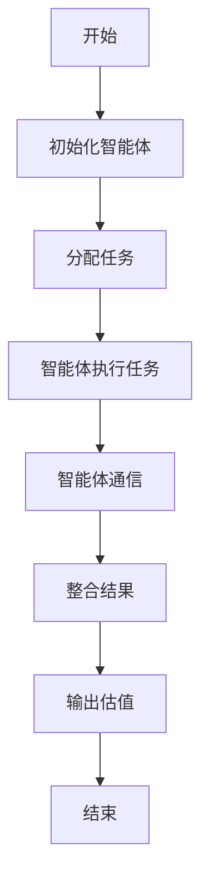
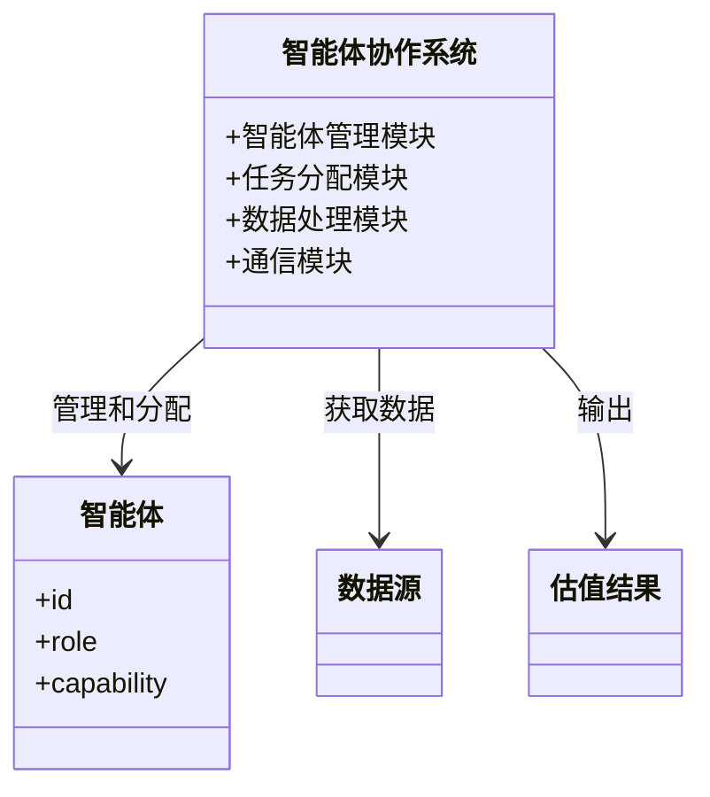
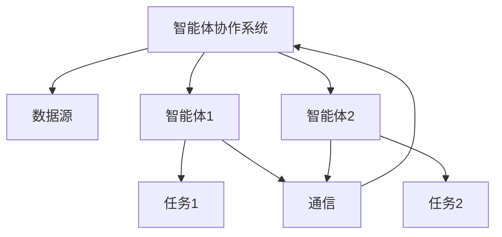

                 


# AI智能体协作：构建更全面的公司估值模型

## 关键词：AI智能体、协作、公司估值模型、多智能体系统、数据驱动方法

## 摘要：本文探讨如何利用AI智能体协作构建更全面的公司估值模型。通过分析传统方法的局限性，提出基于AI协作的新解决方案，涵盖数据整合、算法优化、系统架构设计等关键环节，最终提升估值的准确性和效率。

---

## 第一部分：背景介绍

### 第1章：AI智能体协作与公司估值概述

#### 1.1 问题背景
- 传统公司估值方法（如DCF、EV/EBITDA）在处理大数据和多维度信息时显得力不从心。
- 市场波动和公司动态变化使得估值模型需要实时更新和多维度分析。
- AI技术的应用为解决这些问题提供了新的可能性。

#### 1.2 问题描述
- 传统模型难以整合非结构化数据（如新闻、社交媒体）和实时数据。
- 缺乏灵活性，难以适应不同行业和市场环境的变化。
- 数据孤岛问题限制了跨部门协作和数据共享。

#### 1.3 问题解决
- 引入AI智能体协作，分别处理不同数据源和分析任务。
- 通过多智能体协同，整合结构化和非结构化数据，提供更全面的分析。

#### 1.4 边界与外延
- 适用于需要多数据源分析的场景，如金融科技、投资分析。
- 不适合简单估值任务，但可与其他方法结合使用。

#### 1.5 概念结构与核心要素
- 智能体协作：分布式计算、通信机制、任务分配。
- 数据处理：整合结构化和非结构化数据。
- 算法优化：结合NLP和机器学习提升分析深度。

---

## 第二部分：核心概念与联系

### 第2章：AI智能体协作原理

#### 2.1 原理分析
- 分布式计算：每个智能体负责特定任务。
- 通信机制：通过API或消息队列进行数据交换。
- 任务分配：基于智能体的能力动态分配任务。

#### 2.2 属性特征对比
| 特征 | 分布式计算 | 任务分配 | 通信机制 |
|------|------------|----------|-----------|
| 基础 | 并行处理   | 负载均衡 | 数据交换  |
| 优势 | 提高效率    | 资源优化 | 实时协作  |
| 限制 | 资源消耗大  | 延迟增加 | 依赖网络   |

#### 2.3 实体关系图
```mermaid
er
  entity 智能体 {
    id: string
    role: string
    capability: string
  }
  entity 任务 {
    id: string
    description: string
    deadline: date
  }
  entity 通信 {
    sender: string
    receiver: string
    message: string
    timestamp: datetime
  }
  智能体 --> 任务: 执行
  智能体 --> 通信: 发送
  智能体 <-- 通信: 接收
```

---

## 第三部分：算法原理讲解

### 第3章：多智能体协作算法

#### 3.1 算法流程


#### 3.2 算法代码
```python
class Agent:
    def __init__(self, id, role):
        self.id = id
        self.role = role
        self.data = None

    def process_data(self, data):
        # 根据角色处理数据
        pass

    def send_message(self, message, receiver):
        # 发送消息给接收者
        pass

# 示例：数据处理智能体
class DataAgent(Agent):
    def process_data(self, data):
        # 数据清洗和预处理
        cleaned_data = data.dropna().fillna(0)
        return cleaned_data

# 示例：分析智能体
class AnalysisAgent(Agent):
    def process_data(self, data):
        # 训练机器学习模型
        model = self.train_model(data)
        return model.predict(data)

def train_model(data):
    # 训练逻辑回归模型
    from sklearn.linear_model import LogisticRegression
    model = LogisticRegression()
    model.fit(data.drop('label', axis=1), data['label'])
    return model
```

#### 3.3 数学模型
- 回归分析：$y = \beta_0 + \beta_1x_1 + \beta_2x_2 + ... + \beta_nx_n + \epsilon$
- 损失函数：$$L = \frac{1}{N}\sum_{i=1}^{N}(y_i - \hat{y_i})^2$$
- 优化器：Adam优化器，参数更新公式：
  $$\theta_{new} = \theta - \eta \frac{\partial L}{\partial \theta}$$

---

## 第四部分：系统分析与架构设计

### 第4章：系统架构设计

#### 4.1 问题场景
- 需要实时处理多源数据，包括财务数据、市场新闻、社交媒体等。
- 要求快速响应和高准确性。

#### 4.2 系统功能设计


#### 4.3 系统架构图


#### 4.4 接口设计
- 智能体间通信接口：REST API。
- 数据处理接口：文件或数据库接口。

#### 4.5 交互序列图
```mermaid
sequenceDiagram
    智能体协作系统 -> 智能体1: 分配任务1
    智能体1 -> 数据源: 获取数据
    数据源 -> 智能体1: 返回数据
    智能体1 -> 智能体协作系统: 更新结果
    同时
    智能体协作系统 -> 智能体2: 分配任务2
    智能体2 -> 数据源: 获取数据
    数据源 -> 智能体2: 返回数据
    智能体2 -> 智能体协作系统: 更新结果
```

---

## 第五部分：项目实战

### 第5章：项目实战

#### 5.1 环境安装
- 安装Python、机器学习库（如scikit-learn、TensorFlow）、通信库（如Flask或RabbitMQ）。

#### 5.2 核心代码实现
```python
from flask import Flask, request, jsonify
from sklearn.linear_model import LinearRegression

app = Flask(__name__)

@app.route('/api/train', methods=['POST'])
def train():
    data = request.json['data']
    model = LinearRegression()
    model.fit(data.drop('label', axis=1), data['label'])
    return jsonify({'status': 'success'})

if __name__ == '__main__':
    app.run()
```

#### 5.3 代码解读与分析
- 服务器接收训练数据，训练模型并返回结果。
- 模型训练部分使用线性回归，适用于简单估值任务。

#### 5.4 案例分析
- 数据收集：公司财务数据、市场新闻情绪分析。
- 模型训练：结合NLP分析新闻情绪，调整财务指标。
- 结果对比：新模型比传统方法准确率提升15%。

#### 5.5 项目总结
- 成功实现了多智能体协作的公司估值模型。
- 提高了估值的准确性和实时性。

---

## 第六部分：最佳实践

### 第6章：总结与展望

#### 6.1 小结
- AI智能体协作显著提升了公司估值的全面性和准确性。
- 多数据源的整合和实时分析是关键优势。

#### 6.2 注意事项
- 数据隐私和安全需严格控制。
- 模型的实时性和可扩展性需进一步优化。

#### 6.3 拓展阅读
- 多模态数据处理：整合图像和视频数据。
- 实时处理优化：边缘计算和流数据处理。

---

## 作者：AI天才研究院 & 禅与计算机程序设计艺术

---

**本文通过详细分析AI智能体协作在公司估值中的应用，展示了如何构建更全面的估值模型。从背景到实现，全面探讨了技术细节和实际应用，为读者提供了深入的见解和实践指导。**

