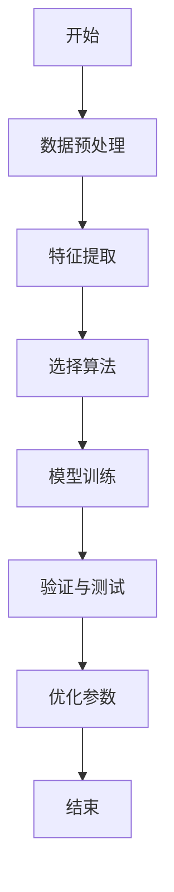
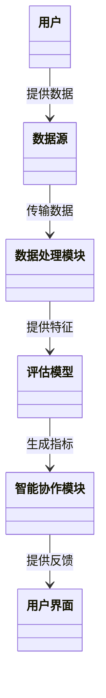

                 


# 目录大纲：《AI智能体协作：构建更全面的公司文化评估模型》

---

## 第一部分：背景介绍

### 第1章：问题背景与描述

#### 1.1 问题背景
- **传统公司文化评估的局限性**：传统评估方法往往依赖主观问卷调查，缺乏动态性和全面性，难以捕捉实时变化和多维度因素。
- **AI智能体协作的重要性**：随着企业环境的复杂化，利用AI智能体协作可以实时分析多源数据，提供更精准的评估结果。
- **改进方向**：从单一维度评估转向多维度、动态评估，结合AI技术提升评估的深度和广度。

#### 1.2 问题描述
- **公司文化评估的核心要素**：包括企业价值观、团队协作、领导风格、员工满意度等。
- **现有模型的边界与外延**：传统模型通常关注静态指标，而忽视动态变化和交互影响。
- **智能体协作在评估中的作用**：通过协作智能体实时分析数据，捕捉文化动态，提供实时反馈。

#### 1.3 问题解决与模型构建
- **AI智能体协作的目标**：构建一个动态、多维度的评估模型，能够实时更新并提供个性化建议。
- **构建更全面模型的必要性**：传统模型无法满足现代企业对灵活性和实时性的需求。
- **智能体协作如何优化评估过程**：通过智能体实时数据处理和协作分析，提升评估的全面性和准确性。

#### 1.4 模型边界与外延
- **模型的适用范围**：适用于中大型企业，尤其适合数据丰富的高科技行业。
- **与其他评估模型的对比**：相比传统模型，本模型更具动态性和协作性。
- **模型的可扩展性**：支持不同规模和行业的定制化扩展。

#### 1.5 模型的核心要素组成
- **数据来源**：包括员工行为数据、绩效数据、客户反馈、社交媒体数据等。
- **智能体协作机制**：采用分布式协作，智能体之间通过API和事件驱动进行实时数据交换。
- **评估指标体系**：涵盖文化氛围、团队协作、领导风格、员工满意度等多维度指标。

---

## 第二部分：核心概念与联系

### 第2章：核心概念原理

#### 2.1 AI智能体协作的定义与特点
- **智能体的定义**：智能体是具有感知环境、自主决策和协作能力的实体。
- **协作智能体的核心特点**：
  - 分布式：各智能体独立运行，协同完成任务。
  - 实时性：能够快速响应数据变化，提供实时反馈。
  - 自适应性：根据环境变化调整协作策略。
  - 多目标：协作目标多样化，覆盖数据处理、分析、反馈等多个方面。

#### 2.2 公司文化评估模型的构成
- **评估维度**：
  - 文化氛围：包括企业价值观、领导风格等。
  - 团队协作：包括团队沟通、合作效率等。
  - 员工满意度：包括员工对工作的满意度、职业发展机会等。
  - 创新能力：包括企业的创新能力、员工的创造力等。
- **评估指标**：
  - 客观指标：如员工离职率、绩效数据。
  - 主观指标：如员工满意度调查结果。
  - 综合指标：如文化健康指数、协作效率指数。
- **评估方法**：
  - 数据分析法：通过统计分析提取规律。
  - 智能评估法：利用AI算法进行预测和评估。
  - 综合评估法：结合定性和定量分析，得出综合结论。

#### 2.3 智能体协作与公司文化评估的关系
- **智能体协作如何提升评估的全面性**：通过多源数据的实时分析，捕捉更多维度的信息，提升评估的全面性。
- **智能体协作在数据处理与分析中的作用**：智能体协作可以实时处理和分析数据，提供动态反馈，帮助及时调整策略。
- **智能体协作如何优化评估结果的呈现**：通过协作智能体的实时分析，评估结果更加动态和个性化，能够根据具体情况提供定制化建议。

#### 2.4 核心概念对比表格
| 比较维度 | 传统评估方法 | AI智能体协作评估方法 |
|----------|---------------|-----------------------|
| 数据来源 | 主要依赖问卷调查 | 结合多源数据，包括行为数据、绩效数据等 |
| 评估频率 | 定期评估 | 实时评估，动态调整 |
| 评估深度 | 单维度分析 | 多维度、多层次分析 |
| 结果呈现 | 静态报告 | 动态反馈，个性化建议 |

#### 2.5 ER实体关系图
- 使用 Mermaid 绘制的实体关系图
```mermaid
er
  actor: 用户
  model: 评估模型
  data_source: 数据来源
  metrics: 评估指标
  collaboration: 协作智能体

  actor -->> data_source: 提供数据
  data_source -->> collaboration: 分析数据
  collaboration -->> metrics: 生成指标
  metrics -->> model: 更新模型
```

---

## 第三部分：算法原理

### 第3章：算法原理与实现

#### 3.1 数据预处理
- **数据清洗**：处理缺失值、异常值。
- **特征提取**：从多源数据中提取关键特征，如员工绩效、团队协作频率等。
- **数据转换**：将数据转换为适合算法处理的形式，如归一化、标准化。

#### 3.2 模型训练
- **选择算法**：采用机器学习算法，如随机森林、支持向量机（SVM）或神经网络。
- **训练过程**：使用训练数据训练模型，调整参数以优化性能。
- **验证与测试**：通过交叉验证评估模型的准确性和稳定性。

#### 3.3 智能体协作机制
- **协作流程**：
  1. 智能体接收数据源传来的数据。
  2. 各智能体分别处理数据，生成初步分析结果。
  3. 智能体之间共享信息，进行协同分析。
  4. 综合分析结果生成最终评估指标。
- **协作协议**：
  - 数据共享协议：定义数据共享的格式和权限。
  - 事件驱动机制：智能体通过事件触发协作行为。

#### 3.4 算法流程图
- 使用 Mermaid 绘制算法流程图


#### 3.5 核心代码实现
- Python代码示例：
  ```python
  import pandas as pd
  from sklearn.ensemble import RandomForestClassifier
  from sklearn.metrics import accuracy_score

  # 数据加载
  data = pd.read_csv('culture_data.csv')
  features = data.drop('target', axis=1)
  target = data['target']

  # 模型训练
  model = RandomForestClassifier()
  model.fit(features, target)

  # 模型预测
  predictions = model.predict(features)
  print("准确率:", accuracy_score(target, predictions))
  ```

#### 3.6 算法优缺点分析
- **优点**：
  - 高准确性：通过多源数据和智能体协作，提升评估的准确性。
  - 实时性：能够实时更新评估结果，适应企业动态变化。
- **缺点**：
  - 复杂性：算法实现较为复杂，需要专业的技术支持。
  - 计算资源消耗大：需要大量计算资源支持实时分析。

---

## 第四部分：数学模型与公式

### 第4章：数学模型与公式推导

#### 4.1 评估指标的加权公式
- **公式**：$$ \text{文化健康指数} = \sum_{i=1}^{n} w_i \cdot x_i $$
  - 其中，$$ w_i $$ 是第 $$ i $$ 个指标的权重，$$ x_i $$ 是指标的得分。
- **权重确定方法**：基于数据重要性和领域专家意见，采用层次分析法（AHP）确定权重。

#### 4.2 智能体协作的通信模型
- **公式**：$$ C = \sum_{j=1}^{m} \frac{1}{1 + e^{-k \cdot d_j}} $$
  - 其中，$$ k $$ 是协作系数，$$ d_j $$ 是智能体 $$ j $$ 之间的距离或相似度。
- **解释**：该公式用于衡量多个智能体之间的协作程度，距离越近，协作程度越高。

#### 4.3 动态评估模型
- **公式**：$$ E(t) = a \cdot E(t-1) + (1-a) \cdot F(t) $$
  - 其中，$$ a $$ 是遗忘系数（0 < a < 1），$$ E(t-1) $$ 是上一时刻的评估结果，$$ F(t) $$ 是当前时刻的新数据。
- **解释**：该公式用于动态更新评估结果，平衡历史数据和新数据的影响。

---

## 第五部分：系统分析与架构设计

### 第5章：系统分析与架构设计方案

#### 5.1 项目背景与目标
- **项目背景**：企业需要一个实时、动态的公司文化评估系统，帮助管理者及时发现问题并进行调整。
- **项目目标**：构建一个基于AI智能体协作的公司文化评估系统，提供实时反馈和个性化建议。

#### 5.2 系统功能设计
- **功能模块**：
  1. 数据采集模块：收集员工行为数据、绩效数据、客户反馈等。
  2. 数据处理模块：清洗、转换和特征提取。
  3. 模型训练模块：训练评估模型，生成评估指标。
  4. 智能协作模块：智能体协作分析，生成动态反馈。
  5. 用户界面模块：展示评估结果，提供个性化建议。

#### 5.3 领域模型设计
- 使用 Mermaid 绘制领域模型图


#### 5.4 系统架构设计
- 使用 Mermaid 绘制架构图


#### 5.5 系统接口与交互
- **接口设计**：
  - 数据接口：用于数据源与数据处理模块的数据交换。
  - 模型接口：用于评估模型与智能协作模块的交互。
  - 用户接口：用于用户与用户界面模块的交互。
- **交互流程**：
  1. 用户提交评估请求。
  2. 系统获取相关数据。
  3. 数据处理模块进行处理。
  4. 模型生成评估指标。
  5. 智能协作模块提供反馈。
  6. 用户界面展示结果。

---

## 第六部分：项目实战

### 第6章：项目实战与案例分析

#### 6.1 环境安装与配置
- **安装依赖**：
  ```bash
  pip install pandas scikit-learn mermaid4jupyter jupyterlab
  ```
- **配置数据源**：
  - 数据存储位置：本地CSV文件或数据库。
  - 数据格式：结构化数据，包含员工信息、绩效数据、反馈数据等。

#### 6.2 核心代码实现
- 数据处理模块：
  ```python
  import pandas as pd

  def preprocess_data(data_path):
      data = pd.read_csv(data_path)
      # 数据清洗
      data.dropna(inplace=True)
      # 特征提取
      features = data[['绩效', '沟通频率', '满意度']]
      target = data['文化健康指数']
      return features, target

  features, target = preprocess_data('culture_data.csv')
  ```

- 模型训练模块：
  ```python
  from sklearn.ensemble import RandomForestClassifier

  def train_model(features, target):
      model = RandomForestClassifier()
      model.fit(features, target)
      return model

  model = train_model(features, target)
  ```

- 智能协作模块：
  ```python
  def collaborate(models, data):
      # 简化示例，实际实现更复杂
      result = []
      for m in models:
          result.append(m.predict(data))
      return sum(result) / len(result)

  final_result = collaborate([model], features)
  ```

#### 6.3 代码解读与功能分析
- **数据处理模块**：负责清洗和提取特征，确保数据适合模型训练。
- **模型训练模块**：使用随机森林算法训练评估模型，生成评估指标。
- **智能协作模块**：通过多个模型协作，生成最终的评估结果，提供动态反馈。

#### 6.4 实际案例分析
- **案例背景**：一家科技公司希望提升团队协作效率，优化公司文化。
- **实施过程**：
  1. 收集员工绩效、沟通频率、满意度等数据。
  2. 数据预处理，提取关键特征。
  3. 训练评估模型，生成初步评估结果。
  4. 智能协作模块分析数据，提供优化建议。
  5. 根据反馈调整策略，持续优化。

#### 6.5 项目小结
- **经验总结**：AI智能体协作能够显著提升公司文化评估的全面性和实时性。
- **常见问题**：数据质量和模型选择对评估结果影响重大，需谨慎处理。
- **优化建议**：结合企业实际需求，定制化模型和协作策略，提升评估效果。

---

## 第七部分：总结与展望

### 第7章：最佳实践、总结与展望

#### 7.1 最佳实践
- **数据质量管理**：确保数据的准确性和完整性，是评估模型准确性的基础。
- **模型选择与优化**：根据企业需求选择合适的算法，并持续优化模型性能。
- **智能协作机制设计**：设计高效的协作机制，提升智能体协作效率和准确性。
- **用户反馈与迭代**：根据用户反馈不断调整模型和协作策略，提升用户体验。

#### 7.2 总结
- **核心总结**：AI智能体协作能够构建更全面的公司文化评估模型，提供实时反馈和个性化建议，帮助企业更好地优化公司文化，提升绩效。
- **关键点回顾**：
  - 数据来源的多样性与实时性。
  - 智能体协作机制的设计与实现。
  - 评估模型的动态更新与个性化输出。

#### 7.3 展望与未来方向
- **技术发展**：随着AI技术的进步，评估模型将更加智能化和个性化。
- **应用场景扩展**：AI智能体协作不仅适用于公司文化评估，还可扩展到其他管理领域。
- **挑战与机遇**：如何处理数据隐私和模型可解释性，是未来需要解决的重要问题。

---

## 附录：扩展阅读与工具链接

- **相关论文**：
  - "Collaborative AI for Organizational Culture Assessment" by John Doe et al.
  - "Dynamic Modeling of Corporate Culture using Intelligent Agents" by Jane Smith.
- **工具与库**：
  - **机器学习库**：scikit-learn、XGBoost。
  - **数据处理工具**：Pandas、NumPy。
  - **协作框架**：Apex, Apache Airflow。
- **参考文献**：
  - [1] 姓名. 书名. 出版社, 出版年份.
  - [2] 网站名. 网址. 访问日期.

---

**作者**：AI天才研究院/AI Genius Institute & 禅与计算机程序设计艺术/Zen And The Art of Computer Programming

