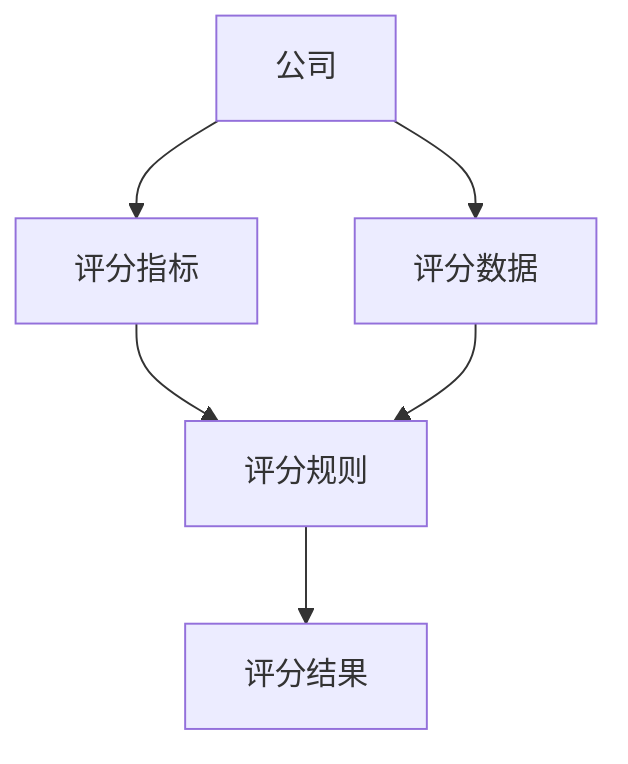
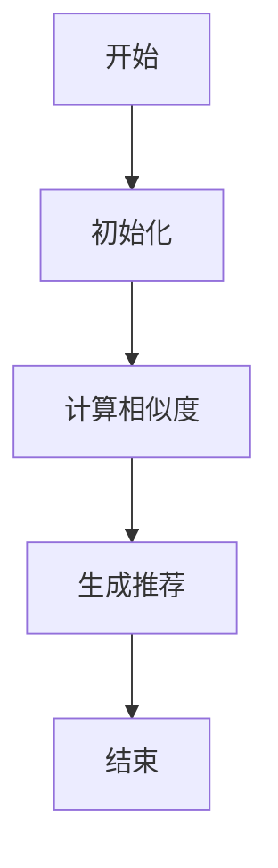
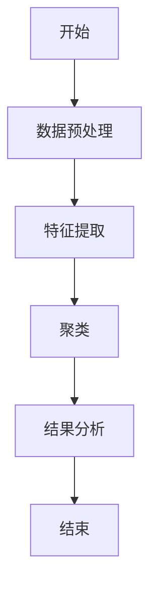
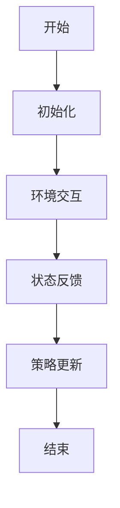
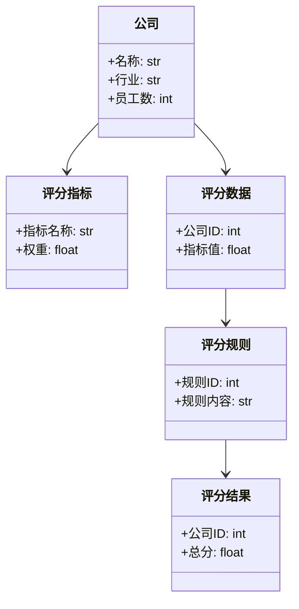

                 


# AI智能体协作：构建更全面的公司质量评分系统

## 关键词：AI智能体，协作机制，质量评分系统，算法原理，系统架构

## 摘要：本文章探讨了如何利用AI智能体的协作能力，构建一个更全面的公司质量评分系统。通过分析评分系统的核心要素，结合AI智能体的协作机制和算法原理，提出了一个基于协同过滤、聚类分析和强化学习的多维度评分算法。并详细阐述了系统的设计与实现，包括系统架构、接口设计和交互流程图，最终通过一个实际案例展示了系统的应用价值。

---

# 第一部分: AI智能体协作与公司质量评分系统概述

## 第1章: AI智能体协作与公司质量评分系统背景

### 1.1 问题背景与需求分析

#### 1.1.1 当前企业质量评分系统的痛点
传统的企业质量评分系统通常依赖人工录入和简单统计，存在以下问题：
- 数据来源单一，难以覆盖多维度的评价指标
- 评分标准不统一，容易导致结果偏差
- 缺乏智能化的分析能力，难以发现潜在问题
- 评分过程缺乏透明度，难以追溯和优化

#### 1.1.2 AI智能体协作的必要性
AI智能体（AI Agents）具有以下特点：
- **自主性**：能够独立执行任务
- **协作性**：能够通过协作提高整体效率
- **学习能力**：能够通过数据学习优化评分规则

通过AI智能体的协作，可以实现以下目标：
- 实现实时数据采集与分析
- 提供多维度的评分维度
- 自动生成评分规则
- 自动优化评分模型

#### 1.1.3 质量评分系统的核心目标
- 提供全面、客观的公司质量评分
- 支持多维度的评分指标
- 实现智能化的评分规则
- 提供可视化和可追溯的评分结果

### 1.2 系统功能与边界

#### 1.2.1 系统功能概述
- **数据采集**：从多个数据源采集企业信息
- **评分计算**：基于AI算法计算企业质量评分
- **规则优化**：自动生成和优化评分规则
- **结果可视化**：提供可视化的评分结果和分析报告

#### 1.2.2 系统边界与外延
- 数据源：包括企业公开数据、行业标准数据、用户反馈数据等
- 外部接口：与第三方数据源（如爬虫数据）对接
- 输出结果：评分结果、评分报告、优化建议

#### 1.2.3 核心要素与组成结构
以下是系统的核心要素：
- 数据采集模块
- AI智能体协作模块
- 评分计算模块
- 规则优化模块
- 结果可视化模块

---

# 第二部分: AI智能体协作的核心概念与联系

## 第2章: AI智能体协作原理

### 2.1 AI智能体的基本概念

#### 2.1.1 AI智能体的定义与分类
AI智能体是指能够感知环境并采取行动以实现目标的实体。根据功能和智能水平，可以分为以下几类：
- **基于规则的智能体**：通过预定义规则进行决策
- **基于学习的智能体**：通过机器学习算法进行决策
- **基于知识的智能体**：依赖知识库进行推理和决策

#### 2.1.2 智能体的属性特征对比

| 属性          | 基于规则的智能体 | 基于学习的智能体 | 基于知识的智能体 |
|---------------|------------------|------------------|------------------|
| 决策方式      | 预定义规则      | 数据驱动的模型    | 知识库推理       |
| 适应性        | 低              | 高              | 中               |
| 计算复杂度    | 低              | 高              | 中               |

#### 2.1.3 实体关系图（ER图）架构
以下是系统中实体关系的ER图：



### 2.2 协作机制与算法原理

#### 2.2.1 协作机制的数学模型
以下是协作机制的数学模型：

$$
\text{协作度} = \sum_{i=1}^{n} w_i \cdot s_i
$$

其中，$w_i$ 表示评分指标的权重，$s_i$ 表示评分指标的具体数值。

---

# 第三部分: 算法原理与数学模型

## 第3章: 基于AI智能体的评分算法

### 3.1 协同过滤算法

#### 3.1.1 算法流程图（Mermaid）



#### 3.1.2 Python实现代码

```python
import numpy as np
from sklearn.metrics.pairwise import cosine_similarity

def collaborative_filtering(user_matrix):
    # 计算余弦相似度
    similarity = cosine_similarity(user_matrix)
    # 生成推荐
    recommendations = np.dot(similarity, user_matrix)
    return recommendations
```

### 3.2 聚类分析算法

#### 3.2.1 算法流程图（Mermaid）



#### 3.2.2 Python实现代码

```python
from sklearn.cluster import KMeans

def clustering_algorithm(data):
    # 初始化K-means模型
    model = KMeans(n_clusters=3)
    # 训练模型
    model.fit(data)
    # 获取聚类结果
    clusters = model.labels_
    return clusters
```

### 3.3 强化学习算法

#### 3.3.1 算法流程图（Mermaid）



---

# 第四部分: 系统分析与架构设计

## 第4章: 系统分析与架构设计

### 4.1 问题场景介绍
本系统的目标是为公司提供一个全面的质量评分系统，支持多维度的评分指标和智能化的评分规则。

### 4.2 系统功能设计

#### 4.2.1 领域模型图（Mermaid）



### 4.3 系统架构设计

#### 4.3.1 系统架构图（Mermaid）


### 4.4 接口设计

#### 4.4.1 接口设计
以下是系统的主要接口：

- 数据采集接口：`get_company_data()`
- 评分计算接口：`calculate_score()`
- 规则优化接口：`optimize_rule()`
- 结果可视化接口：`generate_report()`

---

# 第五部分: 项目实战

## 第5章: 项目实战

### 5.1 环境安装

```bash
pip install numpy
pip install scikit-learn
pip install mermaid
```

### 5.2 核心代码实现

#### 5.2.1 数据采集模块

```python
import requests
import json

def get_company_data(company_id):
    url = f"https://api.example.com/company/{company_id}"
    response = requests.get(url)
    return json.loads(response.text)
```

#### 5.2.2 评分计算模块

```python
from sklearn.metrics.pairwise import cosine_similarity

def calculate_score(data_matrix):
    similarity = cosine_similarity(data_matrix)
    recommendations = np.dot(similarity, data_matrix)
    return recommendations
```

### 5.3 案例分析

#### 5.3.1 案例分析
以下是某公司的评分计算案例：

```python
company_data = get_company_data(123)
score = calculate_score(company_data)
print(score)
```

### 5.4 项目总结

通过本项目的实施，我们可以看到AI智能体协作在公司质量评分系统中的巨大潜力。未来，我们可以进一步优化评分规则，引入更多维度的评分指标，并结合实时数据进行动态评分。

---

# 第六部分: 总结

## 第6章: 总结

### 6.1 系统总结
本系统通过AI智能体的协作，实现了对公司质量的全面评分。系统具有以下特点：
- 多维度的评分指标
- 智能化的评分规则
- 可视化的评分结果

### 6.2 注意事项
- 数据隐私保护
- 模型的可解释性
- 系统的可扩展性

### 6.3 拓展阅读
- 《机器学习实战》
- 《深度学习》
- 《AI与大数据》

---

作者：AI天才研究院/AI Genius Institute & 禅与计算机程序设计艺术 /Zen And The Art of Computer Programming

