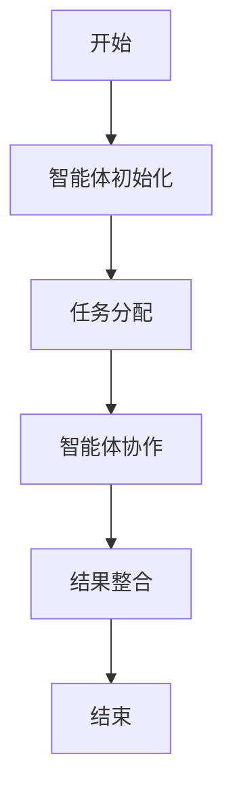
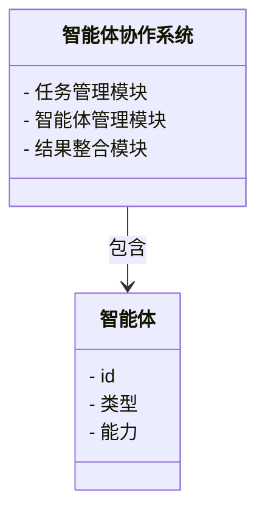
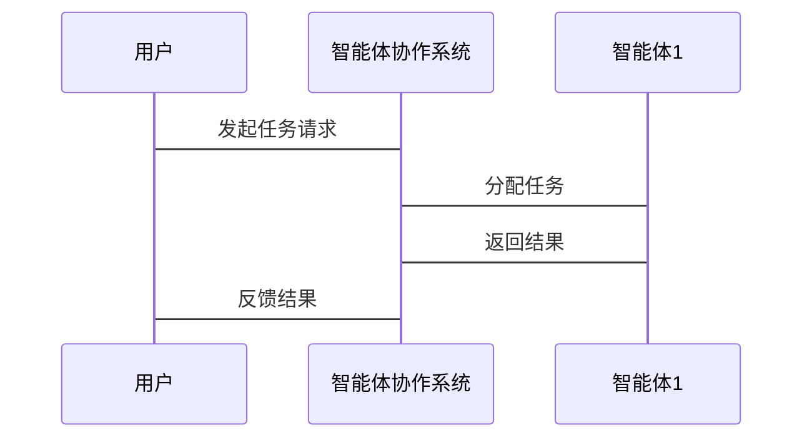

                 


# AI智能体协作：构建更精准的公司价值创造模型

## 关键词：AI智能体，协作，价值创造，企业模型，系统架构，算法原理

## 摘要：  
随着人工智能技术的快速发展，AI智能体协作正在成为企业价值创造的重要驱动力。本文从AI智能体协作的核心概念出发，结合实际应用场景，详细探讨了构建更精准的公司价值创造模型的方法。通过分析智能体协作的背景、核心原理、算法实现、系统架构以及项目实战，本文为读者提供了一个全面的视角，帮助企业在数字化转型中更好地利用AI智能体协作技术，实现价值的最大化。

---

# 第1章: AI智能体协作的背景与现状

## 1.1 智能体协作的定义与核心概念

### 1.1.1 智能体协作的基本概念  
AI智能体协作是指多个智能体通过交互和合作，共同完成复杂任务的过程。智能体可以是软件程序、机器人或其他具备自主决策能力的实体。协作的核心在于智能体之间的信息共享、任务分配和协同执行。

### 1.1.2 智能体协作的核心要素  
智能体协作涉及以下关键要素：  
1. **智能体能力**：每个智能体具备特定的功能和知识。  
2. **通信机制**：智能体之间的信息交换方式。  
3. **协作目标**：共同完成的任务或目标。  
4. **决策机制**：智能体如何做出协作决策。  

### 1.1.3 智能体协作的边界与外延  
智能体协作的边界包括智能体的数量、能力范围以及协作场景。其外延则涉及分布式系统、多智能体系统和人机协作等领域。

## 1.2 AI智能体协作的现状与趋势

### 1.2.1 当前AI智能体协作的发展现状  
当前，AI智能体协作在多个领域得到广泛应用，例如自动驾驶、机器人协作、分布式任务分配等。技术进步使得智能体协作更加高效和智能。

### 1.2.2 智能体协作在企业中的应用趋势  
企业逐渐意识到智能体协作的价值，应用场景包括供应链优化、客户服务、数据处理等。

### 1.2.3 智能体协作的未来发展方向  
未来，智能体协作将更加注重智能化、自适应性和可扩展性，同时结合边缘计算和区块链技术，提升协作的安全性和效率。

## 1.3 智能体协作的价值与挑战

### 1.3.1 智能体协作对企业价值的提升  
智能体协作能够提高企业的运营效率、降低成本，并增强决策的准确性。

### 1.3.2 智能体协作的主要挑战  
智能体协作面临通信延迟、任务冲突和隐私保护等挑战。

### 1.3.3 智能体协作的实现难点与解决方案  
实现难点包括智能体间的信任建立和协作协议的设计。解决方案包括使用分布式算法和区块链技术。

---

# 第2章: AI智能体协作的核心概念与联系

## 2.1 智能体协作的核心概念原理

### 2.1.1 智能体协作的基本原理  
智能体协作基于分布式计算和多智能体系统理论，通过信息共享和任务分配实现协作。

### 2.1.2 智能体协作的关键属性特征  
智能体协作具有实时性、自主性和可扩展性等特征。

### 2.1.3 智能体协作的核心要素对比  
通过对比分析，智能体协作的核心要素包括任务分配、信息共享和决策机制。

## 2.2 智能体协作的ER实体关系图

```mermaid
er
    entity 智能体协作 {
        id
        名称
        功能
    }
    entity 智能体 {
        id
        类型
        能力
    }
    entity 协作关系 {
        id
        关系类型
        关联智能体
    }
    智能体协作 --> 智能体: 包含
    智能体协作 --> 协作关系: 包含
```

## 2.3 智能体协作的流程图



## 2.4 本章小结  
通过本章的分析，读者可以清晰理解智能体协作的核心概念、原理及其在企业中的应用。

---

# 第3章: AI智能体协作的算法原理

## 3.1 智能体协作算法的基本原理

### 3.1.1 分布式优化算法  
分布式优化算法通过局部计算实现全局优化，适用于多智能体协作场景。

### 3.1.2 多智能体协同算法  
多智能体协同算法基于一致性协议，实现智能体间的协调与同步。

### 3.1.3 联合学习算法  
联合学习算法通过数据共享，提升多个智能体的模型性能。

## 3.2 分布式优化算法的数学模型

### 3.2.1 分布式优化的基本公式  
$$ f(x) = \sum_{i=1}^{n} f_i(x_i) $$

### 3.2.2 分布式优化的实现步骤  
1. 初始化智能体参数。  
2. 智能体本地优化。  
3. 参数同步与更新。  

## 3.3 多智能体协同算法的实现

### 3.3.1 多智能体一致性协议  
使用一致性协议实现智能体间的同步，例如通过广播和确认机制。

### 3.3.2 多智能体协作的代码示例  

```python
def distributed_optimization(local_optimization):
    # 初始化参数
    global_params = initialize_params()
    while True:
        # 参数分发
        for agent in agents:
            agent.receive_params(global_params)
        # 本地优化
        for agent in agents:
            updated_params = agent.local_optimization()
        # 参数聚合
        global_params = aggregate_params(updated_params)
```

## 3.4 联合学习算法的应用

### 3.4.1 联合学习的基本流程  
1. 数据预处理。  
2. 数据分发。  
3. 模型训练与更新。  

### 3.4.2 联合学习的数学模型  
$$ y = \sum_{i=1}^{n} w_i x_i $$

---

# 第4章: 系统架构与设计

## 4.1 系统架构设计

### 4.1.1 问题场景介绍  
以企业供应链优化为例，智能体协作可以帮助企业实现库存管理和物流调度。

### 4.1.2 系统功能设计  
设计智能体协作系统包括任务分配、信息共享、结果整合等功能。

### 4.1.3 系统架构设计  
采用微服务架构，包括智能体管理模块、任务分配模块和结果整合模块。

## 4.2 系统架构的类图设计



## 4.3 系统接口设计

### 4.3.1 接口定义  
1. `assign_task(agent_id, task)`：分配任务。  
2. `receive_result(agent_id, result)`：接收结果。  

### 4.3.2 接口实现  
使用RESTful API实现，确保智能体之间的通信高效可靠。

## 4.4 系统交互设计

### 4.4.1 交互流程  
1. 用户发起任务请求。  
2. 系统分配任务给智能体。  
3. 智能体执行任务并返回结果。  
4. 系统整合结果并反馈给用户。  

### 4.4.2 交互流程图



---

# 第5章: 项目实战与案例分析

## 5.1 项目实战

### 5.1.1 环境安装  
安装必要的Python库，例如`numpy`和`scikit-learn`。

### 5.1.2 核心代码实现

```python
def main():
    # 初始化智能体
    agents = [Agent1(), Agent2(), Agent3()]
    # 任务分配
    for agent in agents:
        assign_task(agent.id, task)
    # 执行任务
    for agent in agents:
        agent.execute_task()
    # 整合结果
    result = aggregate_results(agents)
    print(result)

if __name__ == "__main__":
    main()
```

### 5.1.3 代码解读与分析  
核心代码实现了一个简单的智能体协作流程，包括任务分配、任务执行和结果整合。

## 5.2 案例分析

### 5.2.1 实际案例  
以某企业供应链优化为例，通过智能体协作实现库存管理和物流调度。

### 5.2.2 案例分析  
智能体协作显著提升了企业的运营效率，降低了成本。

## 5.3 项目小结  
通过项目实战，读者可以深入理解智能体协作的实现过程和实际应用。

---

# 第6章: 最佳实践与未来展望

## 6.1 最佳实践 tips

### 6.1.1 设计原则  
1. 简化协作流程。  
2. 提高通信效率。  
3. 保障数据安全。  

### 6.1.2 实施建议  
1. 确保智能体能力匹配。  
2. 选择合适的协作算法。  
3. 定期优化协作模型。  

## 6.2 本章小结  
通过遵循最佳实践，企业可以更高效地实施智能体协作，实现价值最大化。

---

# 第7章: 总结与展望

## 7.1 总结  
本文系统地探讨了AI智能体协作的核心概念、算法实现和系统架构，为读者提供了全面的视角。

## 7.2 展望  
未来，智能体协作将与边缘计算、区块链等技术深度融合，为企业创造更大的价值。

---

# 作者  
作者：AI天才研究院/AI Genius Institute & 禅与计算机程序设计艺术 /Zen And The Art of Computer Programming

