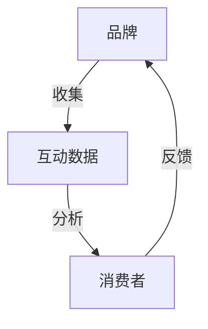
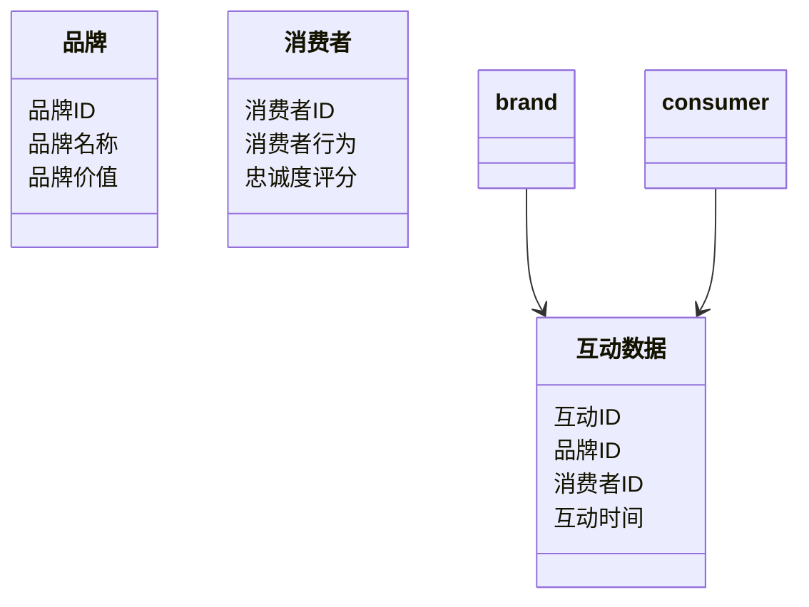
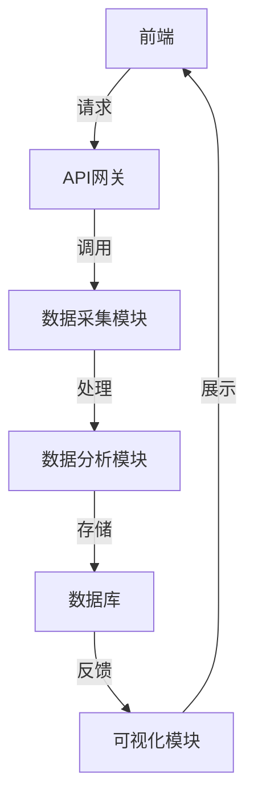
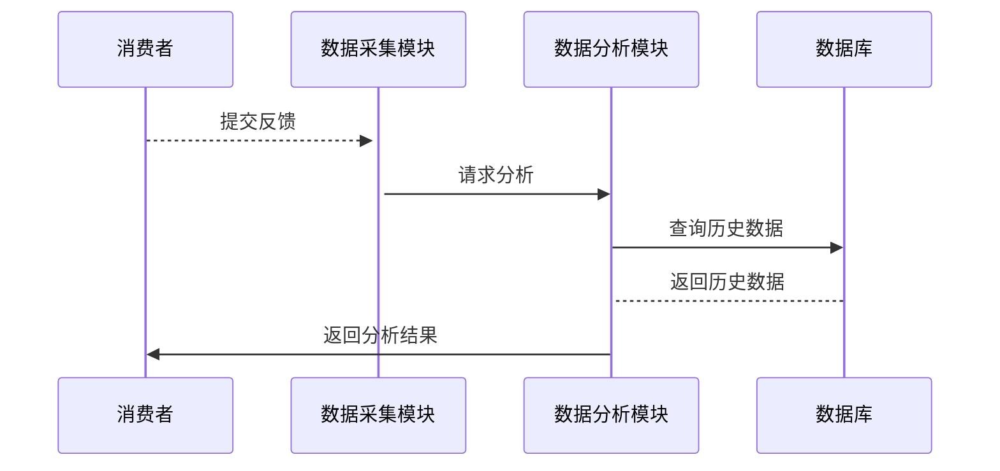

                 


# AI智能体在评估公司品牌价值和消费者忠诚度中的应用

## 关键词：AI智能体，品牌价值，消费者忠诚度，机器学习，自然语言处理

## 摘要：本文探讨AI智能体在评估公司品牌价值和消费者忠诚度中的应用，分析传统评估方法的局限性，并介绍AI智能体的优势。通过详细的技术分析和项目实战，展示如何利用机器学习和自然语言处理算法来实现精准评估，并提供系统架构设计和最佳实践建议。

---

## 第一部分：背景介绍

### 第1章：背景介绍

#### 1.1 AI智能体与品牌价值概述

- **1.1.1 AI智能体的基本概念**
  AI智能体是一种能够感知环境、自主决策并执行任务的智能系统，具备学习、推理和自适应能力。

- **1.1.2 品牌价值的核心要素**
  品牌价值包括品牌知名度、品牌认知度、品牌忠诚度和品牌联想等维度。

- **1.1.3 消费者忠诚度的定义与影响**
  消费者忠诚度是消费者对品牌长期支持和重复购买的意愿，影响企业的长期盈利能力。

#### 1.2 传统品牌价值评估的局限性

- **1.2.1 传统评估方法的不足**
  传统方法依赖人工分析，耗时且成本高，难以处理海量数据。

- **1.2.2 数据量与数据质量的挑战**
  传统方法依赖有限数据，无法全面捕捉市场动态和消费者反馈。

- **1.2.3 人工分析的效率与成本问题**
  人工分析效率低下，难以及时提供反馈，且成本高昂。

#### 1.3 AI智能体在品牌价值评估中的优势

- **1.3.1 数据处理能力的提升**
  AI智能体能够处理海量数据，提供实时分析和动态评估。

- **1.3.2 智能分析的精准性**
  利用机器学习和深度学习算法，AI智能体能够精准识别品牌价值的关键因素。

- **1.3.3 实时监控与反馈的优势**
  AI智能体实时监控市场变化和消费者行为，提供及时反馈和优化建议。

---

## 第二部分：核心概念与联系

### 第2章：核心概念与联系

#### 2.1 AI智能体的核心原理

- **2.1.1 智能体的基本结构**
  AI智能体由感知模块、推理模块和执行模块组成，能够与环境交互并完成任务。

- **2.1.2 机器学习与深度学习的作用**
  机器学习用于模式识别和预测，深度学习用于复杂特征提取和自然语言处理。

- **2.1.3 自然语言处理的关键技术**
  自然语言处理技术如情感分析和主题模型用于分析消费者反馈和社交媒体数据。

#### 2.2 品牌价值与消费者忠诚度的关系

- **2.2.1 品牌价值的多维度评估**
  品牌价值包括财务表现、市场地位和消费者认知等多个维度。

- **2.2.2 消费者忠诚度的层次模型**
  消费者忠诚度分为情感忠诚、行为忠诚和认知忠诚三个层次。

- **2.2.3 两者之间的相互影响**
  品牌价值的提升能够增强消费者忠诚度，而消费者忠诚度的提升又能巩固品牌价值。

#### 2.3 实体关系图与数据流分析

- **2.3.1 ER实体关系图**
```mermaid
erd
  entity 品牌 {
    key: 品牌ID
    品牌名称
    品牌价值
  }
  entity 消费者 {
    key: 消费者ID
    消费者行为
    忠诚度评分
  }
  entity 互动数据 {
    key: 互动ID
    品牌ID
    消费者ID
    互动时间
  }
```

- **2.3.2 数据流分析**


---

## 第三部分：算法原理

### 第3章：算法原理

#### 3.1 协同过滤算法

- **3.1.1 协同过滤的原理**
  协同过滤基于相似用户的购买行为或偏好，推荐相似产品或服务。

- **3.1.2 相似度计算公式**
  $$相似度 = \frac{\sum (x_i - \bar{x})(y_i - \bar{y})}{\sqrt{\sum (x_i - \bar{x})^2} \sqrt{\sum (y_i - \bar{y})^2}}$$

- **3.1.3 Python实现示例**
  ```python
  import numpy as np

  def cosine_similarity(x, y):
      numerator = np.sum(x * y)
      denominator = np.sqrt(np.sum(x**2)) * np.sqrt(np.sum(y**2))
      return numerator / denominator

  user_data = {
      'user1': [5, 3, 4],
      'user2': [2, 4, 5],
      'user3': [4, 2, 3]
  }

  user1 = user_data['user1']
  user2 = user_data['user2']

  print(cosine_similarity(user1, user2))  # 输出相似度
  ```

#### 3.2 情感分析算法

- **3.2.1 情感分析的流程**
  从文本数据中提取特征，训练分类模型，预测情感极性。

- **3.2.2 情感分类的数学模型**
  $$P(\text{正面}|x) = \frac{\exp(w \cdot x)}{1 + \exp(w \cdot x)}$$

- **3.2.3 Python实现示例**
  ```python
  from textblob import TextBlob

  def get_sentiment(text):
      blob = TextBlob(text)
      return blob.sentiment.polarity

  review = "The product is excellent!"
  print(get_sentiment(review))  # 输出情感极性
  ```

#### 3.3 主题模型

- **3.3.1 主题模型的构建**
  使用LDA等算法提取文本数据中的主题分布。

- **3.3.2 主题模型的数学公式**
  $$\theta_{d} \sim \text{Dir}(\alpha)$$
  $$\phi_{k} \sim \text{Dir}(\beta)$$
  $$w_{d,n} \sim \text{Multinomial}(\phi_{k})$$

- **3.3.3 Python实现示例**
  ```python
  from sklearn.decomposition import LatentDirichletAllocation

  # 假设 corpus 已经准备好
  lda = LatentDirichletAllocation(n_components=5, random_state=0)
  topic_matrix = lda.fit_transform(corpus)
  ```

---

## 第四部分：系统分析与架构设计

### 第4章：系统分析与架构设计

#### 4.1 问题场景介绍

- 系统需要实时分析消费者行为数据，评估品牌价值和忠诚度。

#### 4.2 系统功能设计

- **4.2.1 数据采集模块**
  采集社交媒体、销售数据和客户反馈等多源数据。

- **4.2.2 数据分析模块**
  应用机器学习算法进行品牌价值和忠诚度评估。

- **4.2.3 可视化模块**
  提供直观的仪表盘展示分析结果。

#### 4.3 系统架构设计

- **4.3.1 领域模型**


- **4.3.2 系统架构**


#### 4.4 系统接口设计

- 使用RESTful API设计数据采集和分析接口。

#### 4.5 系统交互流程

- **4.5.1 交互流程图**


---

## 第五部分：项目实战

### 第5章：项目实战

#### 5.1 环境安装

- 安装Python、机器学习库（如scikit-learn、TensorFlow）和自然语言处理库（如spaCy、NLTK）。

#### 5.2 核心代码实现

- **5.2.1 数据预处理**
  ```python
  import pandas as pd

  data = pd.read_csv('feedback.csv')
  data_clean = data.dropna()
  ```

- **5.2.2 品牌价值评估**
  ```python
  from sklearn.linear_model import LinearRegression

  model = LinearRegression()
  model.fit(X_train, y_train)
  ```

- **5.2.3 消费者忠诚度预测**
  ```python
  from sklearn.tree import DecisionTreeClassifier

  clf = DecisionTreeClassifier()
  clf.fit(X_train, y_train)
  ```

#### 5.3 代码应用解读与分析

- 详细解读代码功能，分析模型性能，讨论结果的可解释性。

#### 5.4 实际案例分析

- 使用实际数据集进行分析，展示如何通过AI智能体提升品牌价值和消费者忠诚度。

#### 5.5 项目小结

- 总结项目实现的关键步骤和经验教训，强调数据质量和模型调优的重要性。

---

## 第六部分：最佳实践

### 第6章：最佳实践

#### 6.1 小结

- 总结AI智能体在品牌价值和消费者忠诚度评估中的应用价值和未来发展方向。

#### 6.2 注意事项

- 强调数据隐私保护和模型可解释性的重要性。

#### 6.3 拓展阅读

- 推荐相关领域的书籍和论文，供读者深入学习。

---

## 作者：AI天才研究院/AI Genius Institute & 禅与计算机程序设计艺术 /Zen And The Art of Computer Programming

---

**这篇文章详细探讨了AI智能体在评估公司品牌价值和消费者忠诚度中的应用，通过理论分析和实践案例，展示了如何利用机器学习和自然语言处理技术实现精准评估。**

