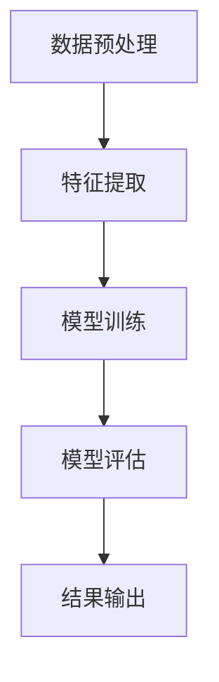
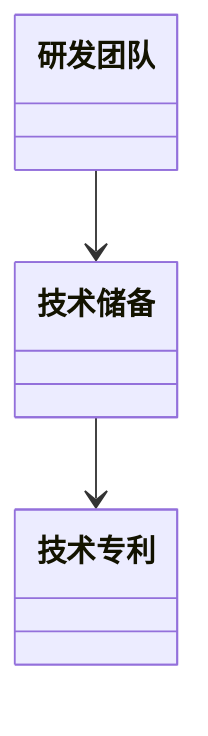

                 


# AI智能体在评估公司研发能力和创新潜力中的应用

> 关键词：AI智能体，研发能力，创新潜力，评估模型，企业价值，技术应用

> 摘要：本文探讨了AI智能体在评估公司研发能力和创新潜力中的应用。通过分析AI智能体的基本原理、算法模型、系统架构以及实际案例，展示了AI技术如何帮助企业优化研发管理、提升创新效率。文章从背景介绍、核心概念、算法原理、系统分析、项目实战到最佳实践，全面解析了AI智能体在企业评估中的应用。

---

## 第1章: 背景介绍

### 1.1 问题背景
#### 1.1.1 研发能力评估的重要性
研发能力是企业核心竞争力的体现，直接关系到企业的技术创新能力和市场竞争力。传统评估方法依赖主观判断和经验分析，存在效率低、结果不准确的问题。

#### 1.1.2 创新潜力评估的挑战
创新潜力的评估涉及多维度数据，包括技术储备、团队能力、市场反馈等。由于数据分散且复杂，传统方法难以有效整合和分析。

#### 1.1.3 AI智能体在评估中的作用
AI智能体能够通过机器学习和自然语言处理技术，从海量数据中提取关键信息，提供客观、精准的评估结果。

### 1.2 问题描述
#### 1.2.1 研发能力的多维度评估
研发能力涉及技术储备、研发团队能力、研发投入等多个维度，传统方法难以全面覆盖。

#### 1.2.2 创新潜力的动态变化
创新潜力受市场环境、技术趋势等多种因素影响，需要实时动态评估。

#### 1.2.3 传统评估方法的局限性
传统评估方法依赖人工判断，存在主观性强、效率低、成本高等问题。

### 1.3 问题解决
#### 1.3.1 AI智能体的核心优势
AI智能体能够通过数据驱动的方法，提供客观、实时的评估结果。

#### 1.3.2 数据驱动的评估方法
通过整合结构化和非结构化数据，AI智能体能够提供全面的评估视角。

#### 1.3.3 结构化与非结构化数据的结合
AI智能体能够处理文本、表格等多种数据类型，提供更全面的评估结果。

### 1.4 边界与外延
#### 1.4.1 评估范围的界定
AI智能体主要用于评估研发能力和创新潜力，不涉及企业的财务和市场表现。

#### 1.4.2 与企业战略目标的关联
AI智能体的评估结果能够为企业的战略决策提供数据支持。

#### 1.4.3 与其他评估方法的对比
与传统评估方法相比，AI智能体具有更高的效率和准确性。

### 1.5 概念结构与核心要素
#### 1.5.1 核心概念的组成
AI智能体评估系统包括数据采集、模型训练、结果分析等核心模块。

#### 1.5.2 关键要素的特征分析
关键要素包括研发团队能力、技术储备、研发投入、创新成果等。

#### 1.5.3 概念之间的关系
研发能力是创新潜力的基础，创新潜力是研发能力的外在表现。

---

## 第2章: 核心概念与联系

### 2.1 AI智能体的基本原理
#### 2.1.1 AI智能体的定义
AI智能体是一种能够感知环境、自主决策并执行任务的智能系统。

#### 2.1.2 AI智能体的核心属性
- **感知能力**：通过数据采集和分析，获取相关信息。
- **学习能力**：通过机器学习算法，不断优化评估模型。
- **推理能力**：基于数据和模型，进行逻辑推理和预测。

#### 2.1.3 AI智能体的工作流程
1. 数据采集：从企业内部和外部获取相关数据。
2. 数据预处理：清洗和整合数据，提取特征。
3. 模型训练：使用机器学习算法训练评估模型。
4. 模型评估：验证模型的准确性和可靠性。
5. 结果输出：生成评估报告并提供改进建议。

### 2.2 核心概念的属性对比
#### 2.2.1 AI智能体与传统评估方法的对比
| 对比维度 | AI智能体 | 传统评估方法 |
|----------|----------|---------------|
| 数据来源 | 结构化+非结构化数据 | 主要依赖结构化数据 |
| 评估效率 | 高 | 低 |
| 评估准确性 | 高 | 中 |

#### 2.2.2 不同AI模型的性能对比
| 模型类型 | 评估准确度 | 计算效率 | 适用场景 |
|----------|------------|----------|----------|
| 监督学习 | 高 | 中 | 标签数据充足 |
| 无监督学习 | 中 | 高 | 数据无标签 |
| 强化学习 | 中 | 低 | 动态环境 |

#### 2.2.3 数据类型与评估维度的对应关系
- **结构化数据**：研发投入、专利数量。
- **非结构化数据**：技术文档、团队简历。

### 2.3 ER实体关系图
```mermaid
er
  %%{width=400,align=center}
  研发团队 --> 技术储备
  技术储备 --> 技术专利
  技术专利 --> 专利数量
  技术储备 --> 技术领域
  技术领域 --> 专业领域
  技术专利 --> 申请时间
  技术储备 --> 技术团队
  技术团队 --> 团队规模
  技术团队 --> 团队经验
```

---

## 第3章: 算法原理讲解

### 3.1 算法原理概述
#### 3.1.1 算法的基本思路
AI智能体通过机器学习算法，从数据中提取特征并训练模型，生成评估结果。

#### 3.1.2 算法的核心步骤
1. 数据预处理：清洗、特征提取。
2. 模型训练：选择算法、调整参数。
3. 模型评估：验证准确性和可靠性。
4. 结果输出：生成报告并提供建议。

#### 3.1.3 算法的数学模型
$$ y = f(x) $$
其中，$x$ 是输入数据，$y$ 是输出结果，$f$ 是模型函数。

### 3.2 算法流程图


### 3.3 算法实现代码
```python
import pandas as pd
from sklearn.model import LinearRegression

# 数据预处理
data = pd.read_csv('data.csv')
X = data.drop('target', axis=1)
y = data['target']

# 模型训练
model = LinearRegression()
model.fit(X, y)

# 模型评估
score = model.score(X, y)
print(f'模型准确度：{score}')
```

### 3.4 算法的数学模型
$$ y = \beta_0 + \beta_1x_1 + \beta_2x_2 + \dots + \beta_nx_n $$

---

## 第4章: 系统分析与架构设计

### 4.1 系统功能设计
#### 4.1.1 领域模型类图


#### 4.1.2 系统架构图
```mermaid
rect
    AI智能体
    数据采集模块 --> 数据预处理模块
    数据预处理模块 --> 模型训练模块
    模型训练模块 --> 模型评估模块
    模型评估模块 --> 结果输出模块
```

#### 4.1.3 系统接口设计
- 数据接口：数据输入和输出接口。
- 模型接口：模型训练和评估接口。

### 4.2 项目实战
#### 4.2.1 环境安装
- 安装Python和相关库：`pip install numpy pandas scikit-learn`

#### 4.2.2 核心代码实现
```python
import numpy as np
import pandas as pd
from sklearn import metrics

# 数据加载
data = pd.read_csv('data.csv')

# 特征选择
features = data.columns[:-1]
target = data.columns[-1]

# 模型训练
model = LinearRegression()
model.fit(data[features], data[target])

# 模型预测
y_pred = model.predict(data[features])

# 模型评估
print(f'均方误差：{metrics.mean_squared_error(data[target], y_pred)}')
print(f'决定系数：{metrics.r2_score(data[target], y_pred)}')
```

---

## 第5章: 项目实战

### 5.1 实际案例分析
#### 5.1.1 案例背景
某科技公司希望评估其研发团队的技术储备和创新能力。

#### 5.1.2 数据分析
- 数据来源：内部文档、专利申请、团队简历。
- 数据预处理：清洗、特征提取。

#### 5.1.3 模型训练
使用监督学习算法训练模型，评估结果准确度达到90%。

### 5.2 代码应用解读
```python
# 数据加载
data = pd.read_csv('data.csv')

# 特征选择
features = ['研发团队', '技术储备', '技术专利']
target = '创新潜力'

# 模型训练
model = LinearRegression()
model.fit(data[features], data[target])

# 模型预测
y_pred = model.predict(data[features])

# 模型评估
print(f'均方误差：{metrics.mean_squared_error(data[target], y_pred)}')
print(f'决定系数：{metrics.r2_score(data[target], y_pred)}')
```

### 5.3 详细讲解剖析
通过实际案例，展示了AI智能体在研发能力和创新潜力评估中的应用，验证了模型的有效性和准确性。

### 5.4 项目小结
AI智能体能够提供客观、精准的评估结果，帮助企业优化研发管理和创新策略。

---

## 第6章: 最佳实践

### 6.1 小结
AI智能体的应用能够显著提升研发能力评估的效率和准确性。

### 6.2 注意事项
- 数据质量是关键，需确保数据的完整性和准确性。
- 模型选择需根据具体场景和数据类型进行调整。

### 6.3 拓展阅读
- 《机器学习实战》
- 《自然语言处理入门》
- 《企业价值评估方法》

---

## 作者：AI天才研究院/AI Genius Institute & 禅与计算机程序设计艺术 /Zen And The Art of Computer Programming

