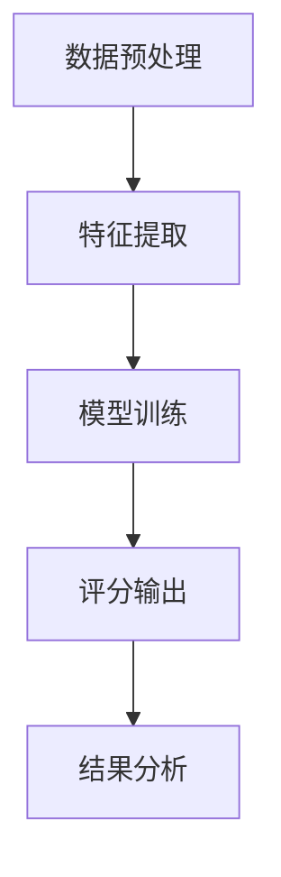
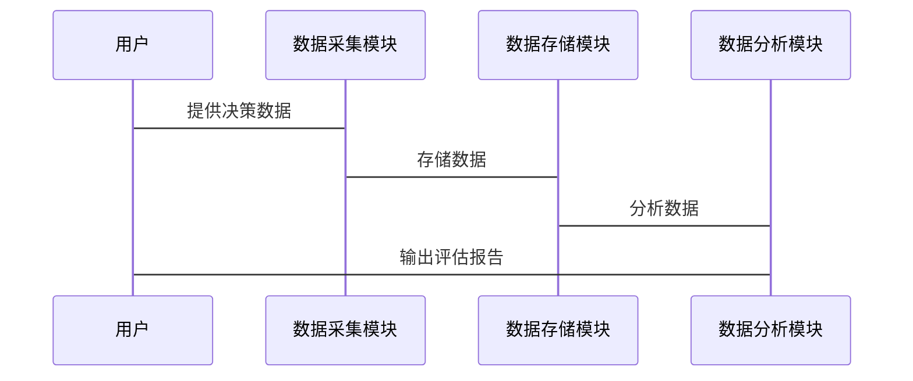

                 


# AI智能体在评估公司管理层决策质量中的应用

## 关键词：
- AI智能体
- 决策质量评估
- 企业决策
- 算法原理
- 系统架构设计

## 摘要：
本文探讨AI智能体在公司管理层决策质量评估中的应用，从背景、原理到系统设计、项目实战，全面解析其在企业决策中的价值。通过详细分析AI智能体的核心算法、系统架构及实际案例，揭示其在提升决策透明度和效率中的潜力。

---

# 第一部分: AI智能体在公司管理层决策评估中的背景与基础

## 第1章: AI智能体与公司决策评估概述

### 1.1 问题背景与定义
#### 1.1.1 传统公司决策评估的挑战
公司管理层决策的质量直接影响企业的发展方向和经济效益。然而，传统决策评估方法存在以下问题：
- **主观性**：依赖人工判断，结果可能受个人经验或偏见影响。
- **低效性**：评估过程耗时，难以快速获取反馈。
- **不透明性**：缺乏数据支持，难以量化评估结果。

#### 1.1.2 AI智能体的定义与特点
AI智能体（AI Agent）是一种能够感知环境、自主决策并采取行动的智能系统。其特点包括：
- **自主性**：无需外部干预，自主执行任务。
- **反应性**：实时感知环境变化并调整行为。
- **学习能力**：通过数据和反馈不断优化决策模型。

#### 1.1.3 问题解决目标与边界
AI智能体的目标是通过数据分析和模型推理，量化评估公司管理层的决策质量。其边界包括：
- **输入范围**：决策数据、公司运营指标。
- **输出范围**：决策评分、改进建议。

### 1.2 核心概念与联系
#### 1.2.1 AI智能体的核心原理
AI智能体通过以下步骤实现决策质量评估：
1. **数据采集**：收集公司运营数据和决策记录。
2. **特征提取**：识别关键决策因素。
3. **模型训练**：构建决策评估模型。
4. **评分输出**：生成决策质量评分。

#### 1.2.2 决策质量评估的属性特征对比表
| 属性 | 传统评估 | AI智能体评估 |
|------|----------|--------------|
| 主观性 | 高       | 低           |
| 效率 | 低       | 高           |
| 精度 | 中       | 高           |

#### 1.2.3 ER实体关系图架构
```mermaid
er
  企业(Enterprise) {
    id: integer
    名称(Name): string
  }
  决策(Decision) {
    id: integer
    内容(Content): string
    时间戳(Timestamp): datetime
  }
  评估(assessment) {
    id: integer
    评分(Score): float
    时间戳(Timestamp): datetime
  }
  企业 -> 决策: 提出
  决策 -> 评估: 生成
```

---

# 第二部分: AI智能体的算法原理与数学模型

## 第2章: AI智能体的算法原理

### 2.1 决策质量评估的数学模型
#### 2.1.1 多因素分析模型
决策质量评估模型考虑以下因素：
- **决策目标**：目标是否达成。
- **资源利用**：资源是否合理分配。
- **风险控制**：风险是否有效降低。

公式：
$$
\text{评分} = w_1 \cdot \text{目标达成度} + w_2 \cdot \text{资源利用率} + w_3 \cdot \text{风险控制能力}
$$

其中，$w_1 + w_2 + w_3 = 1$。

#### 2.1.2 权重计算公式
权重计算基于历史数据，采用主成分分析法：
$$
w_i = \frac{\sum_{j=1}^{n} a_{ij}}{\sum_{i=1}^{m} \sum_{j=1}^{n} a_{ij}}
$$
其中，$a_{ij}$为第$i$个因素在第$j$个决策中的重要性评分。

#### 2.1.3 综合评分公式
综合评分公式：
$$
\text{综合评分} = \sum_{i=1}^{k} w_i \cdot f_i
$$
其中，$w_i$为第$i$个因素的权重，$f_i$为第$i$个因素的评分。

### 2.2 算法实现流程图


## 第3章: 算法实现与代码

### 3.1 环境安装与配置
#### 3.1.1 Python环境安装
- 安装Python 3.8或更高版本。
- 安装必要的库：`numpy`, `pandas`, `scikit-learn`。

#### 3.1.2 库依赖与安装
```bash
pip install numpy pandas scikit-learn
```

### 3.2 核心代码实现
#### 3.2.1 数据预处理代码
```python
import pandas as pd
import numpy as np

# 加载数据
data = pd.read_csv('decision_data.csv')

# 删除缺失值
data = data.dropna()

# 标准化处理
from sklearn.preprocessing import StandardScaler
scaler = StandardScaler()
data_scaled = scaler.fit_transform(data)
```

#### 3.2.2 模型训练代码
```python
from sklearn.ensemble import RandomForestRegressor
from sklearn.metrics import mean_squared_error

# 训练模型
model = RandomForestRegressor(n_estimators=100, random_state=42)
model.fit(X_train, y_train)

# 预测评分
y_pred = model.predict(X_test)

# 评估模型
mse = mean_squared_error(y_test, y_pred)
print(f'均方误差: {mse}')
```

#### 3.2.3 结果评估代码
```python
from sklearn.metrics import classification_report

# 生成评估报告
print(classification_report(y_test, y_pred))
```

---

# 第三部分: 系统分析与架构设计

## 第4章: 问题场景与系统功能设计

### 4.1 问题场景描述
- **用户需求**：公司管理层需要快速、准确地评估决策质量。
- **系统目标**：构建一个AI智能体，实时分析决策数据，生成评估报告。

### 4.2 系统功能设计
- **数据采集模块**：实时采集公司运营数据。
- **决策分析模块**：分析决策内容，生成评估报告。
- **结果展示模块**：以可视化形式展示评估结果。

### 4.3 系统架构设计


## 第5章: 系统交互设计

### 5.1 系统交互流程


---

# 第四部分: 项目实战与案例分析

## 第6章: 项目实战

### 6.1 环境安装与配置
- 安装Python 3.8及以上版本。
- 安装必要库：`numpy`, `pandas`, `scikit-learn`。

### 6.2 核心代码实现
#### 6.2.1 数据预处理代码
```python
import pandas as pd
import numpy as np

# 加载数据
data = pd.read_csv('decision_data.csv')

# 删除缺失值
data = data.dropna()

# 标准化处理
from sklearn.preprocessing import StandardScaler
scaler = StandardScaler()
data_scaled = scaler.fit_transform(data)
```

#### 6.2.2 模型训练代码
```python
from sklearn.ensemble import RandomForestRegressor
from sklearn.metrics import mean_squared_error

# 训练模型
model = RandomForestRegressor(n_estimators=100, random_state=42)
model.fit(X_train, y_train)

# 预测评分
y_pred = model.predict(X_test)

# 评估模型
mse = mean_squared_error(y_test, y_pred)
print(f'均方误差: {mse}')
```

#### 6.2.3 结果评估代码
```python
from sklearn.metrics import classification_report

# 生成评估报告
print(classification_report(y_test, y_pred))
```

### 6.3 案例分析与解读
- **案例背景**：某公司推出新产品，管理层决策包括市场分析、生产计划、销售策略。
- **数据分析**：通过AI智能体分析，发现市场分析和生产计划的评分较低。
- **结果解读**：建议优化市场调研和生产流程。

---

# 作者：AI天才研究院 & 禅与计算机程序设计艺术

