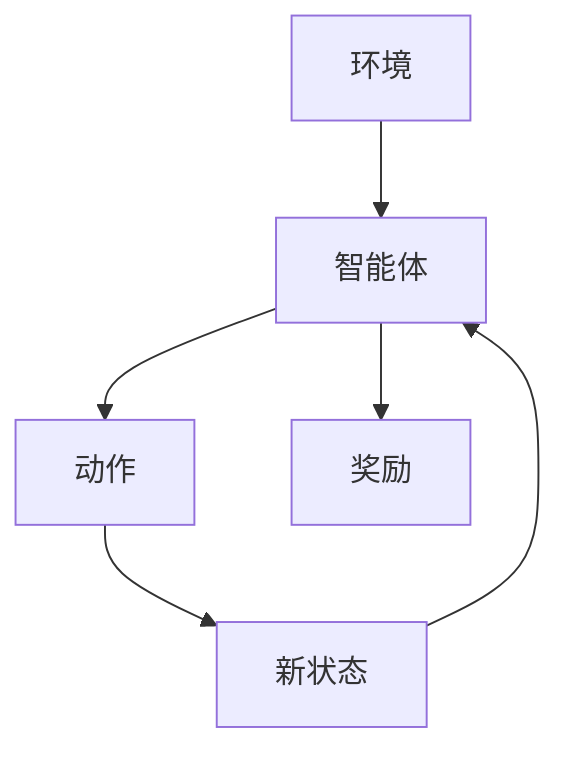
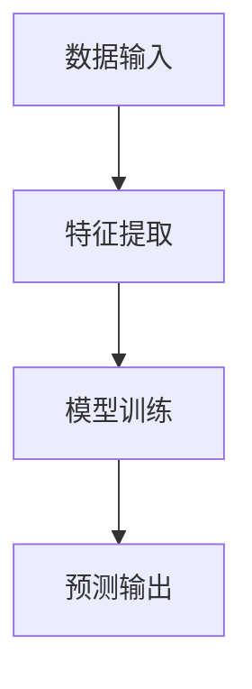

                 


# AI智能体在识别价值投资机会的最佳加仓时机中的作用

> 关键词：价值投资，AI智能体，最佳加仓时机，机器学习，投资策略

> 摘要：本文探讨了AI智能体在识别价值投资机会中的最佳加仓时机的应用，分析了AI智能体的核心算法、系统架构设计以及在实际投资中的应用案例，展示了如何通过AI技术优化投资决策过程。

---

# 引言

价值投资是一种以公司基本面分析为基础的投资策略，旨在寻找被市场低估的投资标的。传统的价值投资依赖于分析师的主观判断和经验，而随着人工智能技术的快速发展，AI智能体在投资领域的应用日益广泛。本文将探讨AI智能体如何帮助投资者识别最佳加仓时机，从而优化投资策略。

---

# 第一部分：价值投资与AI智能体的基本概念

## 第1章：价值投资的核心要素

### 1.1 价值投资的定义与特点
- **定义**：价值投资是一种长期投资策略，强调以低于内在价值的价格购买优质资产。
- **特点**：注重基本面分析、长期持有、逆向思维。

### 1.2 价值投资的核心要素
- **公司基本面**：市盈率、市净率、股息率、ROE等。
- **市场情绪**：市场波动、投资者情绪。
- **财务健康状况**：盈利能力、财务稳定性。

## 第2章：AI智能体的基本概念

### 2.1 AI智能体的定义
- **定义**：AI智能体是一种能够感知环境、自主决策并执行任务的智能系统。
- **核心特征**：数据驱动、自适应学习、实时分析。

### 2.2 AI智能体在投资中的应用
- **数据处理**：分析海量数据，提取关键特征。
- **预测模型**：基于历史数据预测未来走势。
- **决策优化**：模拟多种投资策略，选择最优方案。

---

# 第二部分：AI智能体在价值投资中的应用

## 第3章：AI智能体识别价值投资机会的原理

### 3.1 数据驱动的决策优势
- **数据量**：AI智能体可以处理海量数据，包括历史价格、财务报表、新闻标题等。
- **特征提取**：通过自然语言处理和统计分析，提取对公司价值的关键影响因素。
- **预测准确性**：利用机器学习算法，预测股票价格的波动趋势。

### 3.2 AI智能体的核心算法

#### 3.2.1 强化学习算法
- **定义**：强化学习是一种通过试错机制，学习最优策略的算法。
- **流程图**：


#### 3.2.2 时间序列分析
- **定义**：时间序列分析是一种通过历史数据预测未来趋势的方法。
- **流程图**：


### 3.3 数学模型与公式

#### 3.3.1 强化学习的数学模型
$$ V(s) = \max_{a} [ r(s,a) + \gamma V(s') ] $$

#### 3.3.2 时间序列分析的数学模型
$$ y_t = \alpha y_{t-1} + \beta x_t + \epsilon_t $$

## 第4章：AI智能体在最佳加仓时机中的应用

### 4.1 系统架构设计

#### 4.1.1 数据采集模块
- **功能**：从多种数据源（如股票数据库、新闻网站）获取实时数据。
- **工具**：使用API接口（如Yahoo Finance API）进行数据采集。

#### 4.1.2 特征提取模块
- **功能**：从原始数据中提取关键特征，如动量、相对强弱指数（RSI）、均值回归等。
- **技术**：使用PCA（主成分分析）进行特征降维。

#### 4.1.3 模型训练模块
- **功能**：基于特征数据，训练机器学习模型（如随机森林、神经网络）。
- **工具**：使用Python的Scikit-learn库进行模型训练。

#### 4.1.4 策略生成模块
- **功能**：根据模型预测结果，生成最佳加仓时机。
- **技术**：基于动态规划算法，优化投资组合。

#### 4.1.5 系统架构图


---

# 第三部分：项目实战

## 第5章：AI智能体在价值投资中的实战应用

### 5.1 环境安装
- **工具**：安装Python、Jupyter Notebook、Scikit-learn、TensorFlow。
- **数据源**：使用Yahoo Finance API获取历史数据。

### 5.2 核心代码实现

#### 5.2.1 数据采集代码
```python
import pandas as pd
import numpy as np

def get_stock_data(ticker, start_date, end_date):
    data = pd.DataFrame()
    # 数据获取逻辑
    return data
```

#### 5.2.2 特征提取代码
```python
from sklearn.decomposition import PCA

def extract_features(data):
    # 特征提取逻辑
    return pca.fit_transform(data)
```

#### 5.2.3 模型训练代码
```python
from sklearn.ensemble import RandomForestRegressor

def train_model(features, labels):
    model = RandomForestRegressor()
    model.fit(features, labels)
    return model
```

#### 5.2.4 策略生成代码
```python
def generate_strategy(model, data):
    # 策略生成逻辑
    return strategy
```

### 5.3 案例分析
- **案例背景**：分析某只股票的历史数据，预测最佳加仓时机。
- **数据分析**：使用PCA提取特征，训练随机森林模型，生成投资策略。

### 5.4 项目总结
- **总结**：AI智能体能够有效识别价值投资机会，优化加仓时机，但需结合市场实际情况进行调整。

---

# 第四部分：总结与展望

## 第6章：总结

### 6.1 本文的主要内容
- 探讨了AI智能体在价值投资中的应用。
- 分析了AI智能体的核心算法和系统架构。
- 展示了AI智能体在实际投资中的实战案例。

### 6.2 投资策略优化的关键点
- 数据质量与特征提取。
- 模型选择与优化。
- 系统架构设计。

## 第7章：展望

### 7.1 未来研究方向
- 更复杂的模型优化。
- 多因素模型的应用。
- 实时监控与动态调整。

---

# 结语

通过本文的分析，我们可以看到AI智能体在价值投资中的巨大潜力。AI智能体能够帮助投资者更精准地识别价值投资机会，优化加仓时机，从而提高投资收益。然而，AI智能体的应用也需要注意其局限性，结合实际市场情况进行综合判断。

---

作者：AI天才研究院 & 禅与计算机程序设计艺术

