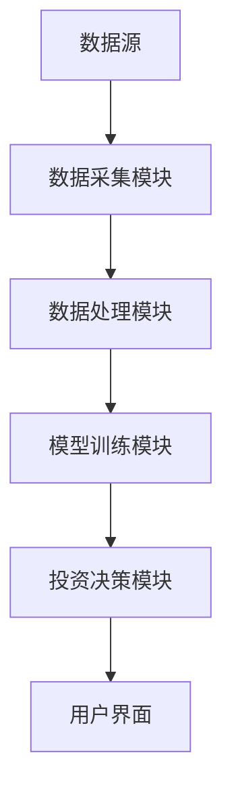

                 


---

# 第一部分: AI智能体与周期性行业的基本概念

## 第1章: AI智能体的定义与特点

### 1.1 AI智能体的核心概念

#### 1.1.1 AI智能体的定义

AI智能体（Artificial Intelligence Agent）指的是能够感知环境、自主决策并执行任务的智能系统。与传统AI不同，AI智能体具有更强的适应性和主动性，能够根据实时数据和环境变化动态调整行为。

#### 1.1.2 AI智能体的核心特点

- **自主性**：无需外部干预，能够自主决策。
- **反应性**：能够实时感知环境并做出反应。
- **学习能力**：通过数据和经验不断优化自身模型。
- **社交能力**：能够与其他智能体或人类进行交互。

#### 1.1.3 AI智能体与传统AI的区别

传统AI主要依赖于预定义的规则和数据进行任务处理，而AI智能体具备更强的自主性和学习能力，能够适应复杂多变的环境。

---

## 第2章：周期性行业的特点与投资机会

### 2.1 周期性行业的定义

周期性行业是指其需求与经济周期密切相关的行业，如能源、材料、工业制造等。这些行业的业绩表现通常随着经济波动而起伏。

### 2.2 周期性行业的波动规律

周期性行业的波动通常与宏观经济指标（如GDP增长率、通货膨胀率）密切相关。在经济繁荣时期，周期性行业表现良好；而在经济衰退时期，则可能面临较大的下行压力。

### 2.3 周期性行业的投资机会

尽管周期性行业波动较大，但通过精准的市场分析和投资策略，投资者可以在周期性行业的波动中发现潜在的投资机会，如低位买入、高位卖出等。

---

## 第3章：AI智能体的构建基础

### 3.1 数据采集与预处理

#### 3.1.1 数据来源

AI智能体需要采集大量数据，包括历史价格、宏观经济指标、行业新闻等。数据来源可以是公开的金融数据库、政府统计机构等。

#### 3.1.2 数据预处理

数据预处理包括数据清洗、标准化、特征提取等步骤。例如，去除缺失值、处理异常值、将数据标准化为统一的格式等。

### 3.2 特征提取与选择

#### 3.2.1 特征提取方法

常用的特征提取方法包括主成分分析（PCA）和线性判别分析（LDA）。这些方法可以帮助我们从大量数据中提取关键特征，降低维度。

#### 3.2.2 特征选择的重要性

选择合适的特征可以提高模型的准确性和效率。特征选择过程需要考虑特征的相关性、重要性和独立性。

---

## 第4章：AI智能体在投资机会识别中的应用

### 4.1 投资机会识别的定义

投资机会识别是指通过分析市场数据，发现潜在的投资机会并制定相应的投资策略。

### 4.2 AI智能体在周期性行业中的应用

AI智能体可以通过分析周期性行业的历史数据和市场趋势，预测未来的价格走势，帮助投资者做出投资决策。

### 4.3 投资机会识别的流程与方法

#### 4.3.1 数据分析与建模

使用机器学习算法（如随机森林、支持向量机）对数据进行建模，预测周期性行业的价格走势。

#### 4.3.2 风险评估与优化

通过评估投资组合的风险和收益，优化投资策略，降低投资风险。

---

# 第二部分: AI智能体的构建与应用

## 第5章: AI智能体的构建基础

### 5.1 数据采集与预处理

#### 5.1.1 数据来源

AI智能体需要采集大量数据，包括历史价格、宏观经济指标、行业新闻等。数据来源可以是公开的金融数据库、政府统计机构等。

#### 5.1.2 数据预处理

数据预处理包括数据清洗、标准化、特征提取等步骤。例如，去除缺失值、处理异常值、将数据标准化为统一的格式等。

### 5.2 特征提取与选择

#### 5.2.1 特征提取方法

常用的特征提取方法包括主成分分析（PCA）和线性判别分析（LDA）。这些方法可以帮助我们从大量数据中提取关键特征，降低维度。

#### 5.2.2 特征选择的重要性

选择合适的特征可以提高模型的准确性和效率。特征选择过程需要考虑特征的相关性、重要性和独立性。

---

## 第6章: AI智能体在投资机会识别中的应用

### 6.1 投资机会识别的定义

投资机会识别是指通过分析市场数据，发现潜在的投资机会并制定相应的投资策略。

### 6.2 AI智能体在周期性行业中的应用

AI智能体可以通过分析周期性行业的历史数据和市场趋势，预测未来的价格走势，帮助投资者做出投资决策。

### 6.3 投资机会识别的流程与方法

#### 6.3.1 数据分析与建模

使用机器学习算法（如随机森林、支持向量机）对数据进行建模，预测周期性行业的价格走势。

#### 6.3.2 风险评估与优化

通过评估投资组合的风险和收益，优化投资策略，降低投资风险。

---

# 第三部分: 算法原理与数学模型

## 第7章: 基于AI智能体的投资机会识别算法

### 7.1 算法原理

#### 7.1.1 算法流程

1. 数据采集与预处理
2. 特征提取与选择
3. 模型训练与优化
4. 投资机会识别与决策

#### 7.1.2 算法实现

使用Python语言实现基于随机森林的模型训练和预测。

#### 7.1.3 算法代码示例

```python
import pandas as pd
from sklearn.ensemble import RandomForestClassifier
from sklearn.metrics import accuracy_score

# 数据加载与预处理
data = pd.read_csv('data.csv')
X = data.drop('target', axis=1)
y = data['target']

# 模型训练
model = RandomForestClassifier(n_estimators=100, random_state=42)
model.fit(X, y)

# 预测与评估
y_pred = model.predict(X)
print("Accuracy:", accuracy_score(y, y_pred))
```

### 7.2 数学模型与公式

#### 7.2.1 随机森林算法

随机森林是一种基于树的集成算法，通过构建多个决策树并进行投票或平均来提高模型的准确性和稳定性。

#### 7.2.2 决策树模型

决策树是一种直观的分类和回归模型，通过特征选择和剪枝来优化模型的性能。

---

## 第8章: 数学模型与公式

### 8.1 投资机会识别的数学模型

#### 8.1.1 预测模型

使用线性回归模型预测周期性行业的价格走势：

$$
y = \beta_0 + \beta_1x_1 + \beta_2x_2 + \ldots + \beta_nx_n + \epsilon
$$

其中，$y$ 是目标变量，$x_i$ 是自变量，$\beta_i$ 是回归系数，$\epsilon$ 是误差项。

#### 8.1.2 风险评估模型

使用VaR（Value at Risk）模型评估投资组合的风险：

$$
VaR(\alpha) = \text{最小的损失值，使得在}\alpha\text{的置信水平下，损失不超过该值}
$$

---

# 第四部分: 系统架构与设计

## 第9章: 系统架构设计

### 9.1 系统功能设计

#### 9.1.1 数据采集模块

负责从多种数据源采集金融数据，包括历史价格、宏观经济指标等。

#### 9.1.2 数据处理模块

对采集到的数据进行清洗、标准化和特征提取。

#### 9.1.3 模型训练模块

基于处理后的数据，训练投资机会识别模型。

#### 9.1.4 投资决策模块

根据模型预测结果，生成投资建议和策略。

### 9.2 系统架构图

使用Mermaid绘制系统架构图：



### 9.3 接口设计与交互流程

#### 9.3.1 API接口设计

定义RESTful API接口，供其他系统调用。

#### 9.3.2 交互流程

1. 用户通过界面提交查询请求。
2. 系统调用数据采集模块获取数据。
3. 数据处理模块进行数据预处理。
4. 模型训练模块生成预测结果。
5. 投资决策模块提供投资建议。
6. 系统将结果返回给用户。

---

## 第10章: 系统实现与优化

### 10.1 环境安装与配置

#### 10.1.1 安装Python

安装Python 3.8及以上版本。

#### 10.1.2 安装依赖库

安装Pandas、Scikit-learn、Mermaid等库：

```bash
pip install pandas scikit-learn mermaid
```

### 10.2 系统核心实现

#### 10.2.1 数据采集模块

编写代码从Yahoo Finance获取股票数据：

```python
import yfinance as yf

data = yf.download('AAPL', start='2020-01-01', end='2023-12-31')
data.to_csv('aapl_data.csv')
```

#### 10.2.2 数据处理模块

对数据进行清洗和特征提取：

```python
import pandas as pd
import numpy as np

data = pd.read_csv('aapl_data.csv')
data['Returns'] = data['Adj Close'].pct_change()
data['Moving_Average'] = data['Adj Close'].rolling(10).mean()
data = data.dropna()
```

#### 10.2.3 模型训练模块

使用随机森林训练分类模型：

```python
from sklearn.ensemble import RandomForestClassifier

X = data.drop('Returns', axis=1)
y = data['Returns'].apply(lambda x: 1 if x > 0 else 0)

model = RandomForestClassifier(n_estimators=100)
model.fit(X, y)
```

#### 10.2.4 投资决策模块

基于模型预测生成投资建议：

```python
predicted = model.predict(X)
data['Predicted_Return'] = predicted
```

### 10.3 系统优化与调优

#### 10.3.1 参数调优

使用网格搜索优化模型参数：

```python
from sklearn.model_selection import GridSearchCV

param_grid = {'n_estimators': [100, 200], 'max_depth': [None, 10, 20]}
grid_search = GridSearchCV(RandomForestClassifier(), param_grid, cv=5)
grid_search.fit(X, y)
best_model = grid_search.best_estimator_
```

#### 10.3.2 性能优化

通过特征选择和数据降维优化模型性能：

```python
from sklearn.decomposition import PCA

pca = PCA(n_components=10)
X_pca = pca.fit_transform(X)
model_optimized = RandomForestClassifier(n_estimators=200)
model_optimized.fit(X_pca, y)
```

---

## 第11章: 项目实战与案例分析

### 11.1 项目背景

介绍项目的目标和意义，说明为什么选择周期性行业进行投资机会识别。

### 11.2 数据获取与处理

详细描述数据获取的来源、预处理的步骤以及特征工程的具体实现。

### 11.3 模型实现与优化

展示模型的实现过程，包括模型选择、参数调优和性能优化。

### 11.4 案例分析

通过具体的投资案例，分析AI智能体在周期性行业中的实际应用效果。

---

## 第12章: 总结与展望

### 12.1 全文总结

总结全文的主要内容，强调AI智能体在周期性行业投资机会识别中的优势和应用价值。

### 12.2 未来展望

展望AI智能体在金融投资中的未来发展，提出可能的研究方向和技术改进点。

### 12.3 注意事项

提醒读者在实际应用中需要注意的风险和挑战，如数据质量、模型过拟合等问题。

### 12.4 拓展阅读

推荐相关领域的书籍和资源，供读者进一步深入学习。

---

# 作者信息

作者：AI天才研究院 & 禅与计算机程序设计艺术

---

以上为《AI智能体在识别周期性行业投资机会中的应用》的完整目录和部分章节内容。如需进一步补充或修改，请随时告知。

