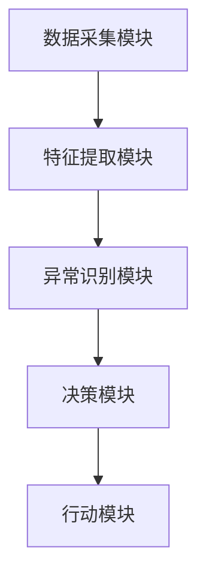
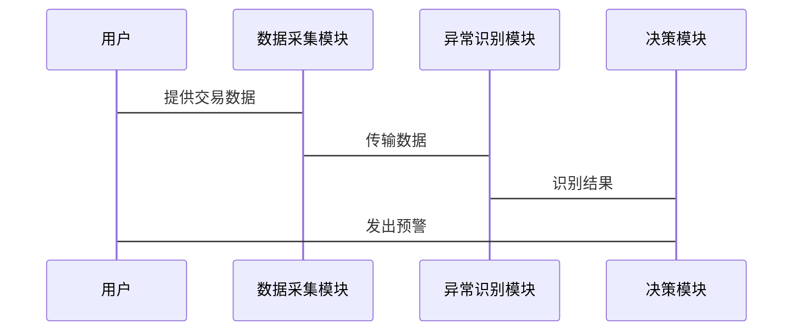

                 


# AI智能体在识别市场异常交易模式中的作用

> 关键词：AI智能体、异常交易模式、机器学习、金融安全、交易数据分析

> 摘要：本文探讨AI智能体在识别市场异常交易模式中的应用，分析其核心原理和优势，结合实际案例，详细阐述其在金融安全中的重要性。通过系统架构设计和算法实现，展示AI智能体如何有效检测和应对异常交易，提升交易系统的安全性和效率。

---

# 引言

在金融市场中，异常交易模式常常预示着潜在的风险或机会。然而，传统的人工识别方法效率低下且容易出错。AI智能体通过结合先进的机器学习算法和大数据处理能力，能够高效识别这些异常模式，为金融机构提供实时预警和决策支持。本文将从背景、原理、算法实现、系统架构等多方面详细探讨这一主题。

---

# 第一部分: AI智能体与异常交易模式概述

## 第1章: 异常交易模式的定义与特征

### 1.1 异常交易模式的定义
异常交易模式指的是偏离正常交易行为的市场行为，可能包括操纵市场、内幕交易、欺诈性交易等。这些行为通常具有突发性、隐蔽性和复杂性，对市场稳定构成威胁。

### 1.2 异常交易模式的分类
异常交易模式可以分为以下几类：
1. **市场操纵**：通过虚假交易拉高或压低股价。
2. **内幕交易**：利用未公开信息进行交易。
3. **高频交易异常**：短时间内大量交易导致市场波动。
4. **洗钱交易**：通过复杂交易掩盖资金来源。

### 1.3 异常交易模式的特征
- **时间集中性**：异常交易通常集中在短时间内。
- **交易量异常**：交易量突然激增或骤减。
- **价格波动**：异常交易可能导致价格剧烈波动。
- **非正常交易行为**：如异常订单量、非正常交易时段的交易等。

---

## 第2章: AI智能体的基本概念

### 2.1 AI智能体的定义
AI智能体是一种能够感知环境、做出决策并采取行动的智能系统。它具备学习、推理和自适应能力，能够在复杂环境中独立完成任务。

### 2.2 AI智能体的核心属性
- **感知能力**：通过数据采集和分析，识别环境中的关键特征。
- **决策能力**：基于感知信息，运用算法做出最优决策。
- **行动能力**：根据决策结果，执行相应的操作。

### 2.3 AI智能体与传统算法的区别
| 特性       | 传统算法              | AI智能体              |
|------------|-----------------------|-----------------------|
| 自适应性     | 低                   | 高                   |
| 学习能力     | 无                   | 有                   |
| 决策复杂性   | 简单                 | 复杂                 |

---

# 第二部分: AI智能体的核心概念与原理

## 第3章: AI智能体的感知机制

### 3.1 数据采集与特征提取
AI智能体通过收集交易数据（如订单量、价格、交易时间等）进行特征提取。常用方法包括统计分析、时间序列分析和自然语言处理。

### 3.2 异常交易模式的识别方法
- **基于规则的方法**：通过预定义的规则检测异常行为。
- **基于统计的方法**：使用统计模型识别异常值。
- **基于机器学习的方法**：利用分类和聚类算法识别异常模式。

### 3.3 数据预处理与清洗
- **数据清洗**：去除噪声数据，处理缺失值。
- **特征工程**：提取关键特征，降低维度。

---

## 第4章: AI智能体的决策机制

### 4.1 交易模式识别的算法选择
- **监督学习**：用于分类异常交易类型。
- **无监督学习**：用于发现未知异常模式。
- **强化学习**：用于动态调整交易策略。

### 4.2 异常交易模式的分类模型
常用的分类算法包括随机森林、支持向量机（SVM）和神经网络。例如，随机森林通过投票机制判断交易行为是否异常。

### 4.3 决策树与随机森林的应用
- **决策树**：直观易懂，但容易过拟合。
- **随机森林**：通过集成学习提升准确性和稳定性。

---

## 第5章: AI智能体的行动机制

### 5.1 异常交易模式的反馈机制
AI智能体会根据识别结果采取行动，如发出预警、暂停交易或调整策略。

### 5.2 智能体的自适应学习能力
通过在线学习和模型更新，AI智能体能够实时适应市场变化，提升识别精度。

### 5.3 异常交易模式的实时响应
AI智能体能够在检测到异常后立即采取措施，减少损失。

---

## 第6章: 异常交易模式识别的边界与外延

### 6.1 异常交易模式识别的边界
- **数据限制**：依赖高质量数据，数据不足可能影响识别效果。
- **模型限制**：算法的局限性可能导致漏检或误检。

### 6.2 异常交易模式的外延
- **跨市场分析**：识别跨市场的联动异常。
- **多维度分析**：结合市场、行业和个股的多维度数据进行分析。

---

# 第三部分: 系统分析与架构设计

## 第7章: 系统架构设计

### 7.1 项目介绍
本系统旨在通过AI智能体实时监控交易数据，识别并预警异常交易模式，帮助金融机构维护市场稳定。

### 7.2 系统功能设计
- **数据采集模块**：实时收集交易数据。
- **特征提取模块**：提取关键特征。
- **异常识别模块**：运用机器学习算法识别异常。
- **决策模块**：基于识别结果采取行动。

### 7.3 系统架构图



---

## 第8章: 系统接口设计

### 8.1 接口描述
- **输入接口**：接收实时交易数据。
- **输出接口**：发送预警信号和决策结果。

### 8.2 系统交互流程



---

# 第四部分: 项目实战与算法实现

## 第9章: 环境安装与数据准备

### 9.1 环境安装
- 安装Python、TensorFlow、Scikit-learn等库。
- 安装Jupyter Notebook用于数据可视化和算法实现。

### 9.2 数据准备
使用Kafka或Redis接收实时交易数据，存储于数据库中。

---

## 第10章: 核心代码实现

### 10.1 数据预处理代码
```python
import pandas as pd
import numpy as np

# 读取数据
data = pd.read_csv('transactions.csv')

# 数据清洗
data.dropna(inplace=True)
data = data[~data.duplicated()]
```

### 10.2 异常检测算法实现
```python
from sklearn.ensemble import IsolationForest

# 训练模型
model = IsolationForest(n_estimators=100, contamination=0.05)
model.fit(X)

# 预测异常
y_pred = model.predict(X)
# 输出异常索引
outliers = data[y_pred == -1]
```

### 10.3 决策树实现
```python
from sklearn.tree import DecisionTreeClassifier

# 训练决策树模型
clf = DecisionTreeClassifier()
clf.fit(X, y)

# 预测交易行为
y_pred = clf.predict(X_new)
```

---

## 第11章: 案例分析与结果解读

### 11.1 案例分析
假设某股票在短时间内出现大量买单，AI智能体识别出异常交易行为，发出预警并暂停交易。

### 11.2 结果解读
通过算法实现，识别出异常交易的类型和原因，帮助机构采取应对措施。

---

## 第12章: 系统优化与性能提升

### 12.1 系统优化
- **模型优化**：调整算法参数，提升识别精度。
- **数据优化**：引入更多维度的数据，提高模型鲁棒性。

### 12.2 性能提升
- **并行计算**：利用分布式计算加速数据处理。
- **实时反馈**：优化反馈机制，提升响应速度。

---

# 结论

AI智能体在识别市场异常交易模式中发挥着越来越重要的作用。通过先进的算法和系统架构设计，AI智能体能够高效识别异常交易，维护市场稳定。未来，随着技术的进步，AI智能体在金融领域的应用将更加广泛和深入。

---

# 作者

作者：AI天才研究院/AI Genius Institute & 禅与计算机程序设计艺术 /Zen And The Art of Computer Programming

