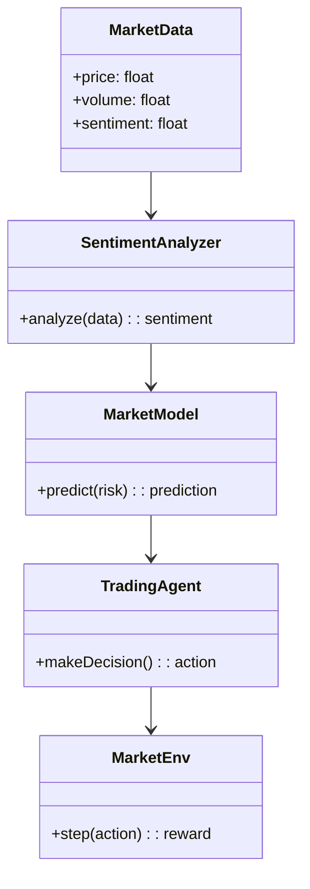
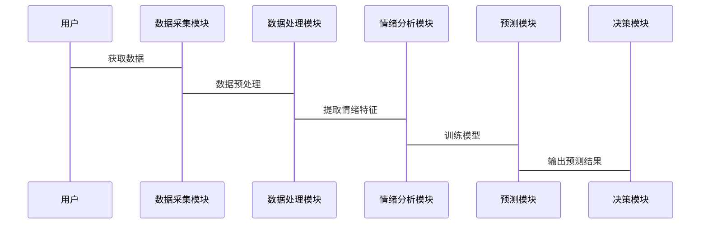

                 


# AI智能体在识别市场情绪拐点中的作用

> 关键词：AI智能体，市场情绪拐点，情绪分析，强化学习，时间序列分析，金融市场，深度学习

> 摘要：本文探讨了AI智能体在识别市场情绪拐点中的作用。首先，介绍了市场情绪的重要性及其在投资决策中的作用。接着，详细分析了AI智能体的基本概念及其在金融市场中的应用。然后，深入探讨了市场情绪拐点识别的技术背景、核心概念与联系，以及AI智能体在其中的算法原理。最后，通过实际项目案例展示了AI智能体在市场情绪拐点识别中的应用，并展望了未来的研究方向。

---

## 第1章: 市场情绪与AI智能体的背景介绍

### 1.1 市场情绪的重要性

#### 1.1.1 市场情绪的定义与构成
市场情绪是指金融市场参与者（如投资者、交易员等）在特定时间段内的情感状态和行为倾向，通常反映在价格波动、交易量变化等市场数据中。市场情绪可以分为乐观、悲观、中性等多种状态。

#### 1.1.2 市场情绪在投资决策中的作用
市场情绪是影响金融市场的重要因素。例如，过度乐观的情绪可能导致资产泡沫，而过度悲观的情绪可能导致市场恐慌和崩盘。通过分析市场情绪，投资者可以更好地做出投资决策，规避风险。

#### 1.1.3 市场情绪拐点的含义与特征
市场情绪拐点是指市场情绪从一个状态转向另一个状态的关键时刻。例如，从乐观转向悲观，或从悲观转向乐观。拐点的特征通常包括情绪强度的突然变化、情绪分布的空间变化以及时间序列上的突变点。

### 1.2 AI智能体的基本概念

#### 1.2.1 AI智能体的定义与分类
AI智能体（Artificial Intelligence Agent）是指能够感知环境并采取行动以实现目标的智能系统。根据智能体的复杂性和应用场景，可以将其分为简单智能体和复杂智能体。

#### 1.2.2 智能体在金融市场中的应用
在金融市场中，AI智能体可以用于自动交易、风险管理、市场预测等多种场景。例如，智能交易机器人可以根据市场情绪和数据做出实时交易决策。

#### 1.2.3 智能体与市场情绪分析的结合
通过结合市场情绪分析，AI智能体可以更加精准地理解市场动态，并据此做出决策。例如，智能体可以通过自然语言处理技术分析新闻、社交媒体等信息，提取市场情绪，并结合价格数据预测市场拐点。

### 1.3 市场情绪拐点识别的技术背景

#### 1.3.1 传统市场情绪分析的局限性
传统的市场情绪分析方法通常依赖于统计分析和规则引擎，具有以下局限性：
- 数据处理能力有限，难以应对海量数据。
- 情绪分类的准确性和精细度较低。
- 难以捕捉复杂的情绪变化和拐点。

#### 1.3.2 AI技术在情绪分析中的优势
AI技术，特别是深度学习，具有以下优势：
- 能够处理海量数据，提取复杂的特征。
- 情绪分类的准确性和精细度较高。
- 可以动态适应市场变化，实时识别拐点。

#### 1.3.3 当前市场情绪拐点识别的研究现状
目前，学术界和工业界在市场情绪拐点识别方面取得了显著进展。例如，基于LSTM的深度学习模型在时间序列数据上表现优异，能够有效捕捉情绪变化和拐点。

### 1.4 本书的核心目标与价值

#### 1.4.1 本书的研究目标
本书旨在探讨AI智能体在识别市场情绪拐点中的作用，重点分析其算法原理、系统架构和实际应用。

#### 1.4.2 本书的核心价值
通过理论分析和实际案例，本书为读者提供了一种新的视角，帮助其理解如何利用AI技术提高市场情绪分析的准确性和效率。

#### 1.4.3 本书的结构安排
本书共分为七章，涵盖市场情绪分析的基础知识、AI智能体的原理、市场情绪拐点识别的算法、系统架构设计、项目实战、挑战与未来趋势等内容。

### 1.5 本章小结
本章从市场情绪的重要性、AI智能体的基本概念以及市场情绪拐点识别的技术背景三个方面，为读者奠定了理论基础。后续章节将深入探讨这些内容的实现细节。

---

## 第2章: 市场情绪分析的核心概念与联系

### 2.1 市场情绪分析的核心原理

#### 2.1.1 情绪分类的基本原理
情绪分类是市场情绪分析的基础，通常包括以下步骤：
1. 数据预处理：清洗和标准化数据。
2. 特征提取：提取文本、价格等数据的特征。
3. 情绪分类：使用机器学习或深度学习模型对情绪进行分类。

#### 2.1.2 情感计算的数学模型
情感计算模型通常包括以下几个部分：
- 数据输入：如文本、价格数据。
- 特征提取：如词袋模型、词嵌入。
- 情感分类：如随机森林、LSTM等。

#### 2.1.3 情绪传播的网络效应
情绪传播可以通过社会网络分析模型（如GNN）来建模，分析情绪在网络中的传播路径和影响。

### 2.2 市场情绪拐点识别的关键特征

#### 2.2.1 情绪强度的动态变化
市场情绪拐点通常伴随着情绪强度的突变，可以通过时间序列分析检测这些突变点。

#### 2.2.2 情绪分布的空间特征
情绪分布的空间特征可以通过地理信息系统（GIS）或图论方法进行建模和分析。

#### 2.2.3 情绪拐点的时间序列特征
情绪拐点的时间序列特征可以通过统计方法（如均值、方差）或深度学习模型（如LSTM）进行识别。

### 2.3 AI智能体与市场情绪的关系

#### 2.3.1 智能体的感知能力
智能体可以通过多种传感器（如新闻API、社交媒体API）感知市场情绪。

#### 2.3.2 智能体的决策机制
智能体可以根据市场情绪和目标函数做出决策，例如买卖决策。

#### 2.3.3 智能体与市场情绪的双向互动
智能体的决策会影响市场情绪，而市场情绪又会影响智能体的决策，形成一个动态的反馈循环。

### 2.4 核心概念的对比分析

#### 2.4.1 情绪分析与传统统计分析的对比
| 对比维度 | 情绪分析 | 传统统计分析 |
|----------|-----------|----------------|
| 数据类型 | 文本、价格 | 数值型数据 |
| 方法 | 机器学习、深度学习 | 统计模型、回归分析 |
| 精度 | 较高 | 较低 |

#### 2.4.2 智能体与传统算法的对比
| 对比维度 | AI智能体 | 传统算法 |
|----------|-----------|-------------|
| 复杂性 | 高 | 低 |
| 灵活性 | 高 | 低 |
| 适应性 | 高 | 低 |

#### 2.4.3 市场情绪拐点识别的特征对比
| 对比维度 | 基于AI | 基于传统方法 |
|----------|---------|----------------|
| 精度 | 高 | 中等 |
| 速度 | 快 | 较慢 |
| 可解释性 | 低 | 高 |

### 2.5 本章小结
本章从市场情绪分析的核心原理、拐点识别的关键特征以及AI智能体与市场情绪的关系三个方面，详细阐述了市场情绪分析的核心概念与联系。这些内容为后续章节的算法设计和系统实现奠定了基础。

---

## 第3章: AI智能体在市场情绪拐点识别中的算法原理

### 3.1 基于深度学习的情绪分析算法

#### 3.1.1 RNN与LSTM网络的原理
RNN（循环神经网络）和LSTM（长短期记忆网络）是常用的深度学习模型，用于处理时间序列数据。

#### 3.1.2 Transformer架构的优势
Transformer架构通过自注意力机制，能够捕捉到数据中的长距离依赖关系。

#### 3.1.3 情绪分类的损失函数与优化方法
常用的损失函数包括交叉熵损失和均方误差损失，优化方法包括随机梯度下降（SGD）和Adam优化器。

#### 3.1.4 情绪分类的实现步骤
1. 数据预处理：清洗和分词。
2. 特征提取：生成词嵌入。
3. 模型训练：训练深度学习模型。
4. 模型评估：验证准确率和召回率。

#### 3.1.5 情绪分类的代码实现
```python
import torch
import torch.nn as nn

class LSTMClassifier(nn.Module):
    def __init__(self, input_size, hidden_size, output_size):
        super(LSTMClassifier, self).__init__()
        self.lstm = nn.LSTM(input_size, hidden_size, batch_first=True)
        self.fc = nn.Linear(hidden_size, output_size)
        self.softmax = nn.Softmax(dim=1)
    
    def forward(self, x):
        out, _ = self.lstm(x)
        out = self.fc(out[:, -1, :])
        out = self.softmax(out)
        return out
```

#### 3.1.6 情绪分类的数学模型
LSTM模型的数学公式可以表示为：
$$
f(x) = \text{LSTM}(x) \rightarrow \text{FC}(x) \rightarrow \text{Softmax}(x)
$$

### 3.2 情绪拐点识别的算法流程

#### 3.2.1 数据预处理与特征提取
数据预处理包括清洗、标准化和归一化。特征提取包括提取时间序列特征、统计特征等。

#### 3.2.2 基于聚类的情绪拐点检测
聚类算法（如K-means）可以用于检测情绪拐点。

#### 3.2.3 基于序列的拐点预测
序列模型（如LSTM、Transformer）可以用于预测情绪拐点。

#### 3.2.4 情绪拐点识别的代码实现
```python
import numpy as np
from sklearn.cluster import KMeans

def detect_rampoint(data, window_size=10):
    # 数据滑动窗口处理
    for i in range(len(data) - window_size):
        window = data[i:i+window_size]
        # 使用K-means聚类检测拐点
        kmeans = KMeans(n_clusters=2).fit(window)
        # 根据聚类结果判断拐点
        if kmeans.labels_.sum() < window_size/2:
            return i
    return -1
```

#### 3.2.5 基于强化学习的情绪拐点识别
强化学习（如DQN）可以用于动态的市场情绪拐点识别。

### 3.3 智能体的强化学习机制

#### 3.3.1 强化学习的基本原理
强化学习通过智能体与环境的交互，学习最优策略。

#### 3.3.2 情绪拐点识别的奖励函数设计
奖励函数可以根据智能体的预测准确率和收益来设计。

#### 3.3.3 强化学习的情绪拐点识别实现
```python
import gym
from gym import spaces

class MarketEnv(gym.Env):
    def __init__(self, data):
        self.data = data
        self.observation_space = spaces.Box(low=-1, high=1, shape=(1,))  # 示例观测空间
        self.action_space = spaces.Discrete(3)  # 0: 无操作，1: 买入，2: 卖出
        self.current_step = 0

    def reset(self):
        self.current_step = 0
        return self.observation_space.sample()

    def step(self, action):
        reward = 0
        next_step = self.current_step + 1
        if action == 1:  # 买入
            reward = (self.data[next_step] - self.data[self.current_step]) * 100
        elif action == 2:  # 卖出
            reward = -(self.data[next_step] - self.data[self.current_step]) * 100
        self.current_step = next_step
        return self.observation_space.sample(), reward, False, {}
```

### 3.4 本章小结
本章详细介绍了AI智能体在市场情绪拐点识别中的算法原理，包括深度学习、聚类分析和强化学习等方法。这些算法为后续章节的系统设计和项目实现提供了理论基础。

---

## 第4章: 市场情绪拐点识别的系统架构设计

### 4.1 问题场景介绍

#### 4.1.1 问题背景
市场情绪拐点识别系统需要实时处理大量数据，准确识别拐点。

#### 4.1.2 项目目标
开发一个高效、准确的市场情绪拐点识别系统。

### 4.2 系统功能设计

#### 4.2.1 领域模型设计
使用Mermaid图表示领域模型。



#### 4.2.2 系统架构设计
使用Mermaid图表示系统架构。


#### 4.2.3 系统接口设计
系统接口包括数据接口、算法接口和用户接口。

#### 4.2.4 系统交互设计
使用Mermaid图表示系统交互流程。



### 4.3 本章小结
本章从系统架构的角度，详细设计了市场情绪拐点识别系统的各个模块和接口。通过领域模型和系统架构图，展示了系统的整体结构和各部分之间的关系。

---

## 第5章: 项目实战——市场情绪拐点识别系统实现

### 5.1 项目环境安装

#### 5.1.1 安装依赖
需要安装的Python库包括：
- `numpy`
- `pandas`
- `torch`
- `transformers`
- `matplotlib`

#### 5.1.2 安装命令
```bash
pip install numpy pandas torch transformers matplotlib
```

### 5.2 系统核心实现

#### 5.2.1 数据采集模块
```python
import pandas as pd
from transformers import AutoTokenizer, AutoModelForTokenClassification
import torch

def get_market_data(ticker):
    # 示例数据获取函数
    data = pd.DataFrame({
        'price': [100, 105, 98, 102, 101],
        'volume': [1000, 800, 1200, 900, 1100]
    })
    return data

def get_sentiment(text):
    # 示例情感分析函数
    tokenizer = AutoTokenizer.from_pretrained('bert-base-uncased')
    model = AutoModelForTokenClassification.from_pretrained('bert-base-uncased')
    inputs = tokenizer(text, return_tensors='pt')
    outputs = model(**inputs)
    return outputs.logits.argmax().item()
```

#### 5.2.2 数据处理模块
```python
def preprocess_data(data):
    # 数据预处理函数
    data['log_return'] = np.log(data['price'].pct_change().add(1))
    return data
```

#### 5.2.3 情绪分析模块
```python
def analyze_sentiment(data):
    # 示例情绪分析函数
    sentiments = []
    for text in data['text']:
        sentiments.append(get_sentiment(text))
    data['sentiment'] = sentiments
    return data
```

#### 5.2.4 模型训练模块
```python
import torch
import torch.nn as nn

class SentimentRNN(nn.Module):
    def __init__(self, input_size, hidden_size, output_size):
        super(SentimentRNN, self).__init__()
        self.rnn = nn.RNN(input_size, hidden_size, batch_first=True)
        self.fc = nn.Linear(hidden_size, output_size)
        self.softmax = nn.Softmax(dim=1)
    
    def forward(self, x):
        out, _ = self.rnn(x)
        out = self.fc(out[:, -1, :])
        out = self.softmax(out)
        return out

model = SentimentRNN(input_size=1, hidden_size=10, output_size=3)
criterion = nn.CrossEntropyLoss()
optimizer = torch.optim.Adam(model.parameters(), lr=0.01)
```

#### 5.2.5 预测模块
```python
def predict_rampoint(data):
    # 示例拐点预测函数
    model.eval()
    with torch.no_grad():
        outputs = model(torch.FloatTensor(data))
        predicted = torch.argmax(outputs, 1)
        return predicted
```

#### 5.2.6 决策模块
```python
def make_decision(predicted):
    # 示例决策函数
    if predicted == 0:
        return 'hold'
    elif predicted == 1:
        return 'buy'
    else:
        return 'sell'
```

#### 5.2.7 可视化模块
```python
import matplotlib.pyplot as plt

def plot_results(data, predictions):
    plt.figure(figsize=(10, 5))
    plt.plot(data['price'], label='Price')
    for i in range(len(predictions)):
        if predictions[i] == 1:
            plt.scatter(i, data['price'][i], color='red', label='Buy')
        elif predictions[i] == 2:
            plt.scatter(i, data['price'][i], color='green', label='Sell')
    plt.legend()
    plt.show()
```

### 5.3 项目实现小结
通过以上代码实现，我们可以完成一个简单的市场情绪拐点识别系统。实际应用中需要进一步优化算法和系统架构，以提高准确性和效率。

### 5.4 本章小结
本章通过一个实际的项目案例，详细讲解了市场情绪拐点识别系统的实现过程，包括环境安装、数据采集、数据处理、情绪分析、模型训练、预测和决策等步骤。这些内容为读者提供了实践的指导。

---

## 第6章: 挑战与未来趋势

### 6.1 挑战与解决方案

#### 6.1.1 数据质量与多样性
- 解决方案：引入多源数据，增强数据清洗和预处理。

#### 6.1.2 算法的准确性和实时性
- 解决方案：优化算法结构，采用分布式计算和流数据处理技术。

#### 6.1.3 模型的可解释性
- 解决方案：引入可解释性模型（如SHAP值）和可视化工具。

#### 6.1.4 系统的鲁棒性与稳定性
- 解决方案：采用容错设计和冗余机制，确保系统的高可用性。

### 6.2 未来研究方向

#### 6.2.1 新型算法研究
- 研究基于图神经网络的情绪传播模型。
- 探索量子计算在情绪分析中的应用。

#### 6.2.2 多模态数据融合
- 结合文本、图像、语音等多种数据源，提升情绪分析的准确性和全面性。

#### 6.2.3 高效计算与实时处理
- 研究边缘计算和流数据处理技术，实现实时情绪拐点识别。

#### 6.2.4 可扩展性与可定制化
- 开发模块化和可定制的系统架构，适应不同市场和场景的需求。

### 6.3 本章小结
本章总结了当前市场情绪拐点识别系统面临的主要挑战，并展望了未来的研究方向。未来的研究需要结合新技术和新方法，进一步提升系统的性能和应用范围。

---

## 第7章: 总结与展望

### 7.1 核心内容总结
本文系统地探讨了AI智能体在识别市场情绪拐点中的作用，从市场情绪分析的核心概念、AI智能体的算法原理到系统的实现和应用，全面分析了其理论和实践价值。

### 7.2 研究成果与意义
通过本文的研究，我们展示了AI技术在金融市场中的巨大潜力，为投资者和研究者提供了新的思路和工具。

### 7.3 未来研究展望
未来的研究需要在算法优化、系统设计、数据融合等方面进行深入探索，推动市场情绪分析和AI智能体技术的进一步发展。

### 7.4 本章小结
本章总结了全文的核心内容，并展望了未来的研究方向，为读者提供了进一步学习和研究的指导。

---

## 附录

### 附录A: 数据集与工具包

#### 1. 数据集
- 示例数据集：股票价格、交易量、新闻文本等。
- 数据格式：CSV、JSON等。

#### 2. 工具包
- Python库：numpy、pandas、torch、transformers。
- 模型库：Hugging Face Transformers、Keras、PyTorch。

### 附录B: 参考文献

#### 1. 学术文献
- 深度学习在金融市场中的应用。
- 基于强化学习的智能体研究。

#### 2. 工具文档
- PyTorch官方文档。
- Hugging Face Transformers教程。

### 附录C: 术语表

#### 1. AI智能体
- AI Agent：能够感知环境并采取行动以实现目标的智能系统。

#### 2. 市场情绪拐点
- Market Sentiment Turning Point：市场情绪从一个状态转向另一个状态的关键时刻。

#### 3. 情感计算
- Sentiment Analysis：通过计算情感倾向来分析数据。

---

## 作者：AI天才研究院/AI Genius Institute & 禅与计算机程序设计艺术 /Zen And The Art of Computer Programming

