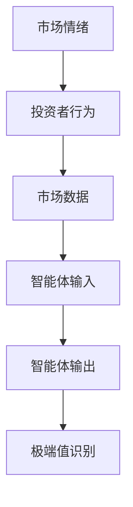
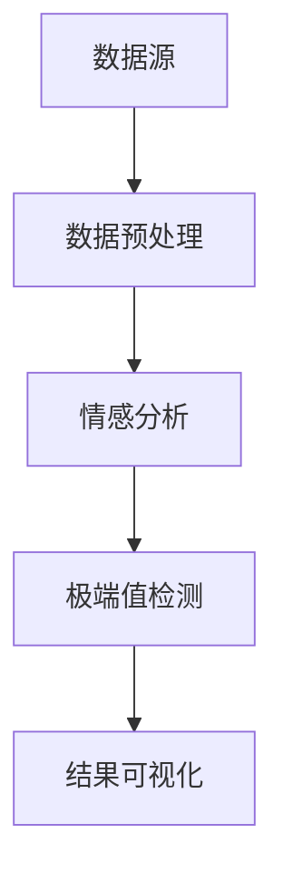
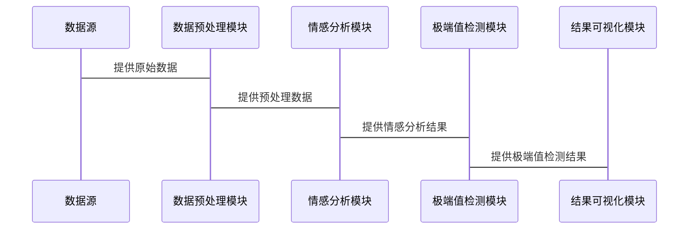

                 


# AI智能体在识别市场情绪极端值中的作用

## 关键词：AI智能体、市场情绪、极端值、情感分析、时间序列分析

## 摘要：  
本文深入探讨AI智能体在识别市场情绪极端值中的应用，分析其在金融市场中的重要作用。通过理论与实践结合，系统介绍AI智能体的核心原理、市场情绪分析的算法实现、系统架构设计，以及实际案例的应用。文章从背景介绍、核心概念、算法原理、系统设计、项目实战到最佳实践，全面解析AI智能体在识别市场情绪极端值中的潜力和挑战。

---

## 第1章: 背景介绍

### 1.1 问题背景
金融市场是一个复杂且动态变化的环境，投资者和市场的行为往往受到情绪的驱动。极端市场情绪（如恐慌性抛售或盲目乐观）可能导致市场的剧烈波动，甚至引发金融危机。传统的市场分析方法依赖于历史数据和统计模型，但在面对复杂的情感和行为模式时显得力不从心。

### 1.2 问题描述
市场情绪极端值的识别需要实时分析大量的非结构化数据（如新闻、社交媒体、投资者评论等）。这些数据通常包含情感色彩，而传统的方法难以捕捉这些情感信息。AI智能体通过自然语言处理（NLP）和深度学习技术，可以实时分析这些数据，提取情感特征，并预测市场情绪的变化。

### 1.3 问题解决
AI智能体的优势在于其能够快速处理大量非结构化数据，并通过自我学习不断优化模型。市场情绪分析的核心在于将文本数据转化为可量化的指标，从而帮助交易员和投资者做出更明智的决策。

### 1.4 边界与外延
市场情绪极端值的识别并非完美无缺，其准确性受到数据质量和模型训练的影响。AI智能体的应用也存在边界，例如在极端市场条件下，模型可能会失效。

### 1.5 核心概念
- **AI智能体**：具有感知和决策能力的智能系统，能够实时分析市场数据并做出反应。
- **市场情绪**：投资者对市场的整体看法，通常通过新闻、社交媒体等文本数据反映。
- **极端值识别**：通过算法检测市场情绪中的异常值，帮助预测市场波动。

---

## 第2章: 核心概念与联系

### 2.1 AI智能体的原理
AI智能体通过感知和决策模块分析市场数据。感知模块负责收集和处理数据，决策模块基于这些数据做出预测和建议。

### 2.2 市场情绪分析的原理
市场情绪分析主要依赖于自然语言处理技术，通过分析文本数据中的情感色彩，量化市场情绪。

### 2.3 核心概念对比
| 概念 | 定义 | 特点 |
|------|------|------|
| 情感分析 | 识别文本中的情感倾向 | 精度依赖于训练数据 |
| 市场情绪分析 | 量化市场参与者的整体情绪 | 结合情感分析与市场行为数据 |
| 极端值识别 | 检测异常情绪波动 | 需要实时分析和快速反应 |

### 2.4 ER实体关系图


---

## 第3章: 算法原理讲解

### 3.1 情感分析算法
情感分析通过自然语言处理技术，将文本数据转化为情感分数。常用算法包括词袋模型、TF-IDF和深度学习模型（如LSTM）。

#### 3.1.1 词袋模型
词袋模型将文本转化为词汇向量，每个词汇对应一个特征。公式如下：
$$
v = [1, 0, 1, 0, ...]
$$
其中，$v$ 是一个向量，表示文本中各个词汇的出现情况。

#### 3.1.2 LSTM网络
LSTM（长短期记忆网络）用于处理序列数据，能够捕捉文本中的情感变化。模型结构如下：
$$
f(x) = \text{LSTM}(x)
$$
其中，$x$ 是输入文本，$f(x)$ 是输出的情感分数。

### 3.2 时间序列分析
时间序列分析用于检测市场情绪的极端值。常用的方法包括ARIMA和GARCH模型。

#### 3.2.1 ARIMA模型
ARIMA（自回归积分滑动平均模型）用于预测时间序列数据。公式如下：
$$
y_t = \alpha y_{t-1} + \beta \epsilon_t
$$
其中，$y_t$ 是当前时刻的市场情绪，$\alpha$ 是自回归系数，$\beta$ 是滑动平均系数，$\epsilon_t$ 是误差项。

---

## 第4章: 系统分析与架构设计

### 4.1 问题场景介绍
市场情绪极端值识别系统需要实时处理大量的文本数据，并快速做出预测。

### 4.2 项目介绍
本项目旨在开发一个基于AI智能体的市场情绪分析系统，帮助交易员识别市场情绪的极端值。

### 4.3 系统功能设计
系统功能包括数据采集、情感分析、极端值检测和可视化展示。

### 4.4 系统架构设计


### 4.5 系统接口设计
系统接口包括数据输入接口、模型调用接口和结果输出接口。

### 4.6 系统交互流程


---

## 第5章: 项目实战

### 5.1 环境安装
需要安装Python、TensorFlow、Keras和Numpy等库。

### 5.2 核心实现
以下是市场情绪分析系统的Python代码：
```python
import numpy as np
from keras.models import Sequential
from keras.layers import LSTM, Dense

# 定义LSTM模型
model = Sequential()
model.add(LSTM(64, input_shape=(timesteps, features)))
model.add(Dense(1, activation='sigmoid'))
model.compile(loss='binary_crossentropy', optimizer='adam')
```

### 5.3 案例分析
以2020年新冠疫情为例，分析市场情绪的变化。通过模型预测，识别出市场的恐慌情绪，并提前做出反应。

### 5.4 项目总结
本项目展示了AI智能体在识别市场情绪极端值中的潜力，但也存在一定的局限性。

---

## 第6章: 最佳实践

### 6.1 关键点总结
- 数据质量是模型准确性的关键。
- 模型需要不断更新和优化。
- 可视化结果有助于更好地理解市场情绪。

### 6.2 注意事项
- 数据隐私问题需要注意。
- 模型的实时性需要优化。
- 结果需要结合市场实际情况进行调整。

### 6.3 拓展阅读
推荐阅读相关领域的书籍和论文，深入了解AI智能体和市场情绪分析的最新进展。

---

## 作者：AI天才研究院/AI Genius Institute & 禅与计算机程序设计艺术 /Zen And The Art of Computer Programming

