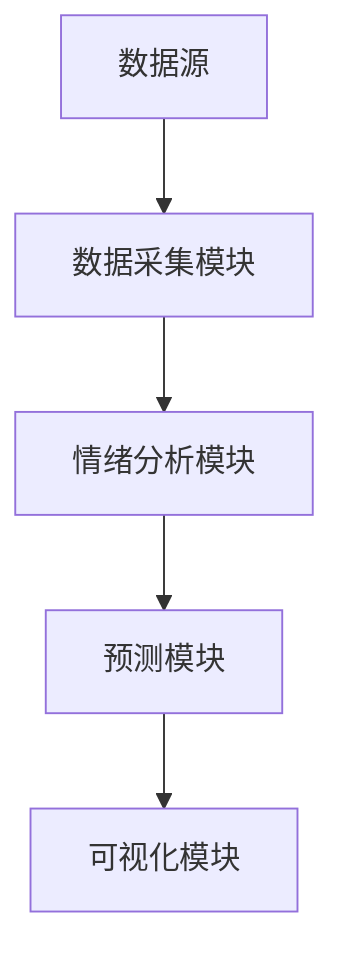

                 


# AI智能体在识别市场情绪转折点中的作用

> **关键词**：AI智能体、市场情绪、情绪转折点、自然语言处理、时间序列分析、机器学习  
> **摘要**：本文探讨了AI智能体在识别市场情绪转折点中的作用，分析了市场情绪的核心概念、分析方法、AI智能体的构建原理，以及其实现过程中的算法、数学模型、系统架构和项目实战。通过详细的技术分析和实际案例，本文揭示了AI智能体在金融市场的潜力和挑战，并为未来的研究方向提供了参考。

---

# 1. AI智能体与市场情绪概述

## 1.1 市场情绪与金融市场的关联

### 1.1.1 市场情绪的定义与重要性  
市场情绪指的是投资者在金融市场中的情感倾向，通常表现为乐观、悲观、恐慌或贪婪。市场情绪是金融市场波动的重要驱动因素，能够影响资产价格的变化。通过分析市场情绪，投资者可以更好地理解市场走势，做出更明智的决策。

### 1.1.2 市场情绪转折点的含义  
市场情绪转折点是指市场情绪从一个状态转向另一个状态的关键时刻。例如，从乐观转向悲观，或从恐慌转向贪婪。识别这些转折点可以帮助投资者提前布局，抓住市场机会或规避风险。

### 1.1.3 AI智能体在金融市场中的作用  
AI智能体是一种能够感知环境、做出决策并执行操作的智能系统。在金融市场中，AI智能体可以通过分析海量数据，实时捕捉市场情绪的变化，并预测市场趋势。其高效性、精准性和自动化能力使其成为金融市场中的重要工具。

## 1.2 AI智能体的基本概念

### 1.2.1 什么是AI智能体  
AI智能体（AI Agent）是一种能够感知环境、采取行动以实现目标的智能系统。它能够通过传感器获取数据，利用算法进行分析和决策，并通过执行器完成操作。

### 1.2.2 AI智能体的核心特征  
- **自主性**：能够在没有外部干预的情况下独立运行。  
- **反应性**：能够实时感知环境并做出响应。  
- **目标导向**：以特定目标为导向，优化行动策略。  
- **学习能力**：能够通过经验改进性能。  

### 1.2.3 AI智能体与传统算法的区别  
AI智能体不仅仅是一个算法，它是一个完整的系统，具备感知、决策和执行能力。与传统算法相比，AI智能体更加注重与环境的交互，能够动态适应复杂环境的变化。

## 1.3 市场情绪分析的背景与现状

### 1.3.1 市场情绪分析的历史发展  
市场情绪分析起源于金融学中的情绪指标研究，近年来随着大数据和AI技术的发展，逐渐引入了自然语言处理（NLP）和机器学习等技术。

### 1.3.2 当前市场情绪分析的主要方法  
- **基于文本的情绪分析**：通过分析新闻、社交媒体等文本数据，提取市场情绪。  
- **基于价格数据的情绪分析**：通过分析价格波动和交易量，推断市场情绪。  
- **基于社交媒体数据的情绪分析**：利用Twitter、Reddit等平台的数据，捕捉投资者情绪。  

### 1.3.3 AI技术在市场情绪分析中的应用现状  
AI技术的应用使得市场情绪分析更加精准和高效。例如，通过NLP技术分析社交媒体数据，AI智能体可以快速捕捉市场情绪的变化，并预测市场趋势。

---

# 2. 市场情绪分析的核心技术

## 2.1 市场情绪的特征与分析方法

### 2.1.1 市场情绪的特征分析  
- **时间序列特征**：市场情绪具有时间依赖性，可以通过时间序列分析方法进行建模。  
- **空间分布特征**：市场情绪在不同市场和资产类别中表现不同。  
- **波动性特征**：市场情绪波动剧烈，尤其是在市场危机期间。  

### 2.1.2 市场情绪分析的主要方法  
- **基于文本的情绪分析**：利用NLP技术对新闻、社交媒体等文本数据进行情绪分类。  
- **基于价格数据的情绪分析**：通过技术指标（如RSI、MACD）分析市场情绪。  
- **基于社交媒体数据的情绪分析**：通过情感分析模型分析社交媒体数据，提取市场情绪。  

### 2.1.3 市场情绪分析的挑战与解决方案  
- **数据噪声的挑战**：社交媒体数据中存在大量噪声，如表情符号、 slang 等。  
- **情绪预测的不确定性**：市场情绪受多种因素影响，预测具有高度不确定性。  
- **多模态数据融合的解决方案**：结合文本、价格和社交媒体等多种数据源，提高预测精度。  

---

# 3. 自然语言处理在市场情绪分析中的应用

## 3.1 自然语言处理技术概述

### 3.1.1 NLP技术的基本原理  
自然语言处理（NLP）是研究如何让计算机理解和生成人类语言的技术。常用的技术包括文本分词、情感分析、实体识别等。

### 3.1.2 NLP在市场情绪分析中的作用  
- **情感分析**：通过分析文本数据，判断市场情绪的倾向（正面、负面或中性）。  
- **主题建模**：识别文本中的主题，分析市场关注的焦点。  
- **情感强度分析**：量化文本中情绪的强度，帮助预测市场情绪的变化。  

## 3.2 基于NLP的市场情绪分析实现

### 3.2.1 数据预处理  
- **文本清洗**：去除停用词、标点符号等无用信息。  
- **分词**：将文本分割成词语或短语。  
- **向量表示**：将词语映射为向量，如词袋模型、TF-IDF、Word2Vec等。  

### 3.2.2 情感分类算法  
- **传统机器学习算法**：如SVM、随机森林。  
- **深度学习算法**：如LSTM、Transformer。  

### 3.2.3 实例分析  
以下是一个简单的基于LSTM的情感分类示例：

```python
import numpy as np
from tensorflow.keras import layers

# 示例数据
text_sequence = [[...], [...], ...]
labels = [0, 1, ...]

# 模型构建
model = layers.Sequential()
model.add(layers.Embedding(input_dim=..., output_dim=...))
model.add(layers.LSTM(units=64))
model.add(layers.Dense(1, activation='sigmoid'))

# 编译模型
model.compile(loss='binary_crossentropy', optimizer='adam', metrics=['accuracy'])

# 训练模型
model.fit(text_sequence, labels, epochs=10, batch_size=32)
```

## 3.3 基于NLP的情绪分析挑战与优化

### 3.3.1 情感分析的挑战  
- **数据不平衡**：负面评论较少，正面评论较多。  
- **语境理解**： sarcasm、irony 等复杂语境难以捕捉。  

### 3.3.2 模型优化策略  
- **数据增强**：通过数据增强技术平衡数据分布。  
- **模型调优**：使用预训练模型（如BERT）提升性能。  
- **领域适应**：针对金融领域进行模型微调，提升领域适应性。  

---

# 4. AI智能体在市场情绪分析中的算法实现

## 4.1 算法原理

### 4.1.1 时间序列分析  
时间序列分析是研究市场情绪变化的重要方法。常用的时间序列模型包括ARIMA、GARCH和LSTM。

### 4.1.2 基于LSTM的市场情绪预测  
LSTM（长短期记忆网络）是一种特殊的RNN，能够有效捕捉时间序列中的长距离依赖关系。以下是LSTM模型的数学表达式：

$$
f_t = \sigma(W_f \cdot [h_{t-1}, x_t] + b_f)
$$  
$$
i_t = \sigma(W_i \cdot [h_{t-1}, x_t] + b_i)
$$  
$$
o_t = \sigma(W_o \cdot [h_{t-1}, x_t] + b_o)
$$  
$$
c_t = f_t \cdot c_{t-1} + i_t \cdot tanh(W_c \cdot [h_{t-1}, x_t] + b_c)
$$  
$$
h_t = o_t \cdot tanh(c_t)
$$  

### 4.1.3 多模态数据融合  
为了提高预测精度，可以将文本、价格和社交媒体等多种数据源进行融合。例如，可以将文本情绪得分与价格数据结合，构建多特征输入模型。

## 4.2 算法实现

### 4.2.1 数据预处理  
- **文本数据**：进行清洗、分词和向量化。  
- **价格数据**：提取技术指标（如RSI、MACD）和市场情绪指标（如VIX）。  

### 4.2.2 模型训练  
- **特征工程**：将文本情绪得分与技术指标进行融合，构建特征向量。  
- **模型训练**：使用融合后的特征向量训练分类模型（如随机森林、XGBoost或神经网络）。  

### 4.2.3 模型评估  
- **评估指标**：准确率、召回率、F1分数等。  
- **回测分析**：在历史数据上进行回测，验证模型的预测能力。  

---

# 5. 系统架构与实现方案

## 5.1 系统架构设计

### 5.1.1 系统模块划分  
- **数据采集模块**：负责采集新闻、社交媒体等数据。  
- **情绪分析模块**：对数据进行情绪分类。  
- **预测模块**：基于情绪分析结果，预测市场趋势。  
- **可视化模块**：展示分析结果和预测结果。  

### 5.1.2 系统架构图  



## 5.2 系统实现细节

### 5.2.1 数据采集  
- **新闻数据**：从金融新闻网站（如Reuters、 Bloomberg）爬取数据。  
- **社交媒体数据**：从Twitter、Reddit等平台获取实时数据。  

### 5.2.2 情绪分析  
- **文本预处理**：清洗、分词、去停用词。  
- **情绪分类**：使用预训练的NLP模型（如BERT）进行情绪分类。  

### 5.2.3 预测模块  
- **特征提取**：将情绪分析结果与技术指标进行融合。  
- **模型预测**：基于融合特征，预测市场情绪转折点。  

### 5.2.4 可视化模块  
- **数据可视化**：将预测结果以图表形式展示。  
- **交互界面**：提供用户友好的交互界面，方便用户查看分析结果。  

---

# 6. 项目实战：AI智能体的实现与应用

## 6.1 项目背景  
本项目旨在开发一个能够识别市场情绪转折点的AI智能体，帮助投资者做出更明智的决策。

## 6.2 项目实现

### 6.2.1 环境安装  
```bash
pip install numpy pandas tensorflow keras sklearn
```

### 6.2.2 核心代码实现  

```python
import numpy as np
import pandas as pd
from tensorflow.keras import layers
from sklearn.ensemble import RandomForestClassifier

# 数据加载与预处理
data = pd.read_csv('market_data.csv')
text_data = data['text'].values
labels = data['sentiment'].values

# 文本预处理
from tensorflow.keras.preprocessing.text import Tokenizer
from tensorflow.keras.preprocessing.sequence import pad_sequences

tokenizer = Tokenizer()
tokenizer.fit_on_texts(text_data)
text_sequences = tokenizer.texts_to_sequences(text_data)
text_sequences = pad_sequences(text_sequences, maxlen=100)

# 模型构建
model = layers.Sequential()
model.add(layers.Embedding(input_dim=len(tokenizer.word_index)+1, output_dim=100))
model.add(layers.LSTM(units=64))
model.add(layers.Dense(1, activation='sigmoid'))

model.compile(loss='binary_crossentropy', optimizer='adam', metrics=['accuracy'])
model.fit(text_sequences, labels, epochs=10, batch_size=32)

# 使用随机森林进行融合预测
features = model.predict(text_sequences)
model_rf = RandomForestClassifier()
model_rf.fit(features, labels)

# 情绪转折点预测
# 假设 features 是一个包含多个样本的二维数组
# 每个样本的特征向量用于预测情绪转折点
```

## 6.3 实际案例分析  
以某次市场危机为例，分析AI智能体如何识别市场情绪转折点。通过回测分析，验证模型的预测能力。

---

# 7. 最佳实践与总结

## 7.1 最佳实践  
- **数据质量**：确保数据来源可靠，减少噪声。  
- **模型调优**：通过网格搜索等方法优化模型参数。  
- **系统监控**：实时监控系统性能，及时调整模型。  

## 7.2 小结  
本文详细探讨了AI智能体在识别市场情绪转折点中的作用，分析了市场情绪的核心概念、分析方法、算法实现和系统架构。通过项目实战，展示了AI智能体的实际应用价值。

## 7.3 注意事项  
- 市场情绪分析具有高度不确定性，需谨慎使用。  
- 系统部署需考虑数据隐私和安全性问题。  

## 7.4 拓展阅读  
- 《LSTM网络及其在时间序列分析中的应用》  
- 《深度学习在金融时间序列预测中的应用》  

---

# 作者：AI天才研究院 & 禅与计算机程序设计艺术

