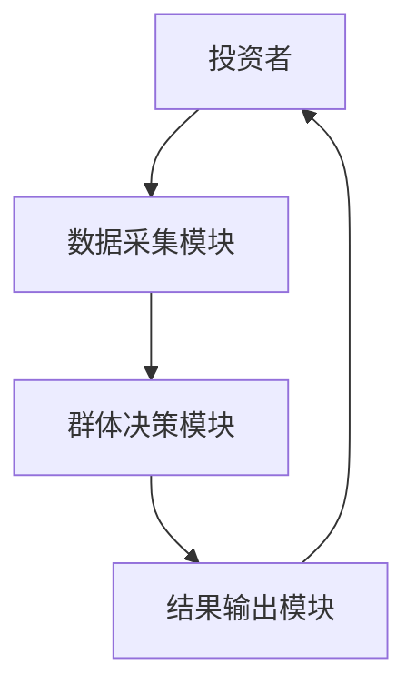

                 


# AI智能体群体决策：提高价值投资的准确性和稳定性

## 关键词：AI智能体、群体决策、价值投资、算法原理、系统架构

## 摘要：本文详细探讨了AI智能体在群体决策中的应用，特别是在提高价值投资的准确性和稳定性方面。通过分析传统投资决策的局限性，提出基于AI智能体的群体决策模型，结合数学模型和算法实现，展示了如何通过系统架构设计和项目实战提升投资决策的准确性。文章涵盖了理论、算法、系统设计和项目实现等多方面内容，为价值投资领域提供了新的思路和方法。

---

## 第一部分: AI智能体群体决策的背景与概念

### 第1章: AI智能体群体决策的背景与概念

#### 1.1 问题背景与问题描述

##### 1.1.1 传统投资决策的局限性
传统投资决策主要依赖于个体分析师的判断和历史数据分析。然而，个体决策容易受到主观因素、情绪波动和信息不完全的影响，导致决策的准确性和稳定性不足。例如，市场波动、宏观经济变化等因素往往难以被个体分析师全面考虑。

##### 1.1.2 群体决策的优势与潜力
群体决策通过集合多个个体的决策信息，能够更好地捕捉市场中的多维度信息，减少个体决策的偏差。群体决策的优势在于能够通过分布式的信息处理和协同决策，提高决策的准确性和鲁棒性。

##### 1.1.3 价值投资与群体决策的结合
价值投资强调以合理价格投资优质资产，而群体决策可以通过集合多个投资者的判断，帮助投资者更全面地评估资产的价值。通过AI智能体的群体决策，可以将个体的判断转化为集体的智慧，从而提高价值投资的准确性和稳定性。

#### 1.2 AI智能体的核心概念

##### 1.2.1 AI智能体的定义与特征
AI智能体是一种能够感知环境、自主决策并采取行动的智能系统。它具有以下特征：
- **自主性**：能够在没有外部干预的情况下自主运行。
- **反应性**：能够根据环境的变化调整自己的行为。
- **目标导向**：具有明确的目标，并通过决策和行动实现目标。
- **学习能力**：能够通过学习和经验改进自己的决策能力。

##### 1.2.2 群体智能的基本原理
群体智能是指通过多个智能体的协作，实现比个体智能更高的整体智能。群体智能的核心在于通过个体之间的信息交流和协同，实现全局优化的目标。在价值投资中，群体智能可以通过多个投资者的决策信息，帮助识别市场趋势和投资机会。

##### 1.2.3 价值投资中的群体决策模型
在价值投资中，群体决策模型通过集合多个投资者的判断，帮助投资者更全面地评估资产的价值。例如，可以通过对多个投资者的投资决策进行加权平均，得到一个更稳定的决策结果。

#### 1.3 问题解决与边界分析

##### 1.3.1 通过群体决策提高投资准确性
群体决策可以通过集合多个投资者的判断，减少个体决策的偏差，从而提高投资决策的准确性。例如，在股票投资中，可以通过对多个投资者的买入信号进行统计分析，判断市场的整体趋势。

##### 1.3.2 群体决策的边界与适用场景
群体决策的边界在于个体智能体的判断可能存在一致性偏差，导致群体决策的效果不佳。此外，群体决策的计算成本较高，可能不适合实时性要求较高的场景。

##### 1.3.3 投资决策中的群体智能与个体智能的平衡
在实际应用中，需要平衡群体智能和个体智能的关系。一方面，个体智能能够快速做出决策；另一方面，群体智能能够通过集合多个个体的判断，提高决策的准确性和稳定性。

#### 1.4 概念结构与核心要素

##### 1.4.1 AI智能体的组成要素
AI智能体的组成要素包括感知模块、决策模块、行动模块和学习模块。感知模块负责收集环境信息，决策模块负责制定决策，行动模块负责执行决策，学习模块负责优化智能体的行为。

##### 1.4.2 群体决策的系统架构
群体决策的系统架构包括数据采集模块、群体决策模块和结果输出模块。数据采集模块负责收集投资者的决策信息，群体决策模块负责对这些信息进行处理，得到群体决策结果，结果输出模块负责将决策结果输出给投资者。

##### 1.4.3 价值投资中的关键指标与模型
在价值投资中，关键指标包括市盈率、市净率、股息率等。群体决策模型可以通过对多个投资者的判断进行加权平均，得到一个更稳定的决策结果。

#### 1.5 本章小结
本章介绍了AI智能体群体决策的背景与概念，分析了传统投资决策的局限性，提出了群体决策的优势与潜力，并详细讲解了AI智能体的核心概念、群体智能的基本原理以及价值投资中的群体决策模型。通过本章的分析，读者可以理解AI智能体群体决策在价值投资中的重要性。

---

## 第二部分: AI智能体群体决策的核心原理

### 第2章: AI智能体与群体决策的原理

#### 2.1 AI智能体的核心原理

##### 2.1.1 智能体的行为决策机制
智能体的行为决策机制包括感知、推理和行动三个步骤。感知模块负责收集环境信息，推理模块负责分析信息并制定决策，行动模块负责执行决策。

##### 2.1.2 多智能体之间的协作与竞争
在群体智能中，多个智能体之间可以通过协作与竞争实现全局优化的目标。协作是指智能体之间共享信息，共同完成任务；竞争是指智能体之间通过竞争机制，优化个体的决策。

##### 2.1.3 基于强化学习的决策优化
强化学习是一种通过奖励机制优化智能体决策的方法。智能体通过与环境的交互，不断调整自己的行为，以最大化奖励。

#### 2.2 群体决策的数学模型

##### 2.2.1 群体决策的基本假设
群体决策的基本假设包括：每个个体的决策是独立的，个体的决策信息是完整的，以及群体决策的目标是实现全局优化。

##### 2.2.2 群体决策的数学表达
群体决策的数学模型可以通过投票模型、加权投票模型或概率模型来表示。例如，投票模型可以通过以下公式表示：

$$
D = \sum_{i=1}^{n} w_i x_i
$$

其中，\( D \) 表示群体决策结果，\( w_i \) 表示第 \( i \) 个个体的权重，\( x_i \) 表示第 \( i \) 个个体的决策。

##### 2.2.3 群体决策的收敛性分析
群体决策的收敛性分析需要考虑群体规模、个体决策的准确性以及决策模型的复杂性。通过分析，可以确定群体决策在不同场景下的收敛性。

#### 2.3 价值投资中的群体决策模型

##### 2.3.1 投资者行为模型
投资者行为模型可以通过个体的决策行为和市场环境的相互作用来描述。例如，可以通过对个体的买卖行为进行建模，分析市场的整体趋势。

##### 2.3.2 群体决策在资产定价中的应用
群体决策可以通过对多个投资者的定价进行平均，得到一个更准确的资产定价。例如，可以通过以下公式表示：

$$
P = \frac{1}{n} \sum_{i=1}^{n} p_i
$$

其中，\( P \) 表示群体定价，\( p_i \) 表示第 \( i \) 个投资者的定价。

##### 2.3.3 群体情绪对投资决策的影响
群体情绪可以通过分析投资者的决策行为来捕捉。例如，可以通过对投资者的买卖信号进行统计分析，判断市场的整体情绪。

#### 2.4 核心概念对比分析

##### 2.4.1 AI智能体与传统决策模型的对比
AI智能体通过学习和优化能够提高决策的准确性，而传统决策模型依赖于固定的规则和历史数据分析。AI智能体的优势在于能够适应环境的变化，而传统决策模型的局限性在于缺乏灵活性。

##### 2.4.2 群体决策与个体决策的对比
群体决策通过集合多个个体的判断，能够提高决策的准确性和稳定性，而个体决策容易受到主观因素和情绪波动的影响。

##### 2.4.3 价值投资中的群体决策与其他投资策略的对比
与其他投资策略相比，群体决策在价值投资中的优势在于能够通过集合多个投资者的判断，减少个体决策的偏差，提高决策的准确性。

#### 2.5 本章小结
本章详细讲解了AI智能体的核心原理和群体决策的数学模型，分析了群体决策在价值投资中的应用。通过对比分析，读者可以更好地理解AI智能体群体决策的核心优势和局限性。

---

## 第三部分: 群体决策算法与数学模型

### 第3章: 群体决策算法的原理与实现

#### 3.1 群体决策算法的核心原理

##### 3.1.1 基于投票的群体决策算法
基于投票的群体决策算法通过统计个体的决策，得到群体决策结果。例如，可以通过多数投票法来确定最终决策。

##### 3.1.2 基于共识的群体决策算法
基于共识的群体决策算法通过个体之间的协商，达成一致的决策。例如，可以通过一致性算法来实现。

##### 3.1.3 基于加权的群体决策算法
基于加权的群体决策算法通过赋予不同个体不同的权重，提高群体决策的准确性。例如，可以通过加权投票法来实现。

#### 3.2 群体决策算法的数学模型

##### 3.2.1 投票模型的数学表达
投票模型可以通过以下公式表示：

$$
D = \arg\max_{c} \sum_{i=1}^{n} w_i x_i
$$

其中，\( D \) 表示群体决策结果，\( w_i \) 表示第 \( i \) 个个体的权重，\( x_i \) 表示第 \( i \) 个个体的决策。

##### 3.2.2 加权投票模型的数学表达
加权投票模型可以通过以下公式表示：

$$
D = \sum_{i=1}^{n} w_i x_i
$$

其中，\( D \) 表示群体决策结果，\( w_i \) 表示第 \( i \) 个个体的权重，\( x_i \) 表示第 \( i \) 个个体的决策。

##### 3.2.3 基于概率的群体决策模型
基于概率的群体决策模型可以通过贝叶斯定理来实现。例如，可以通过对个体的决策概率进行加权平均，得到群体决策的概率。

#### 3.3 群体决策算法的实现步骤

##### 3.3.1 数据预处理与特征提取
在实现群体决策算法之前，需要对数据进行预处理和特征提取。例如，可以通过归一化处理消除数据的量纲影响。

##### 3.3.2 群体决策模型的训练与优化
群体决策模型可以通过机器学习算法进行训练和优化。例如，可以通过随机森林算法来实现群体决策。

##### 3.3.3 群体决策结果的评估与验证
群体决策结果可以通过准确率、召回率等指标进行评估和验证。例如，可以通过交叉验证法来评估群体决策模型的性能。

#### 3.4 算法实现的Python代码示例

##### 3.4.1 群体决策算法的实现
以下是一个基于投票的群体决策算法的Python代码示例：

```python
def group_decision(votes, weights):
    weighted_votes = [vote * weight for vote, weight in zip(votes, weights)]
    total = sum(weighted_votes)
    return total

# 示例数据
votes = [1, 1, 0, 0, 1]
weights = [2, 1, 3, 1, 2]
result = group_decision(votes, weights)
print("群体决策结果:", result)
```

##### 3.4.2 算法性能的评估与优化
可以通过准确率、召回率等指标来评估群体决策算法的性能。例如，可以通过调整权重参数来优化群体决策结果。

##### 3.4.3 算法在价值投资中的应用示例
以下是一个群体决策算法在股票投资中的应用示例：

```python
import pandas as pd
import numpy as np

# 示例数据
data = pd.DataFrame({
    'price': [100, 90, 80, 70, 60],
    'volume': [1000, 2000, 1500, 800, 1200]
})

# 群体决策算法
def group_decision(data, weights):
    weighted_prices = data['price'] * weights
    total = sum(weighted_prices)
    return total / len(data)

weights = [1, 1, 1, 1, 1]
result = group_decision(data, weights)
print("群体定价:", result)
```

#### 3.5 本章小结
本章详细讲解了群体决策算法的核心原理和数学模型，提供了Python代码实现和应用示例。通过本章的学习，读者可以掌握群体决策算法的基本实现方法，并能够在实际应用中进行优化和调整。

---

## 第四部分: 系统分析与架构设计

### 第4章: 群体决策系统的系统分析与架构设计

#### 4.1 系统分析

##### 4.1.1 问题场景介绍
在价值投资中，群体决策系统可以通过集合多个投资者的判断，帮助投资者做出更准确的投资决策。例如，可以通过对多个投资者的买卖信号进行统计分析，判断市场的整体趋势。

##### 4.1.2 系统目标与需求分析
系统目标是通过群体决策算法，提高投资决策的准确性和稳定性。系统需求包括数据采集、群体决策算法实现、结果输出和系统优化等功能。

##### 4.1.3 系统功能设计
系统功能包括数据采集模块、群体决策模块和结果输出模块。数据采集模块负责收集投资者的决策信息，群体决策模块负责对这些信息进行处理，结果输出模块负责将决策结果输出给投资者。

#### 4.2 系统架构设计

##### 4.2.1 系统架构的模块划分
群体决策系统的架构包括数据层、算法层和应用层。数据层负责存储和管理数据，算法层负责实现群体决策算法，应用层负责与用户交互并输出结果。

##### 4.2.2 系统架构的层次结构
系统架构的层次结构包括数据采集层、数据处理层、决策层和结果输出层。每一层都有其特定的功能和接口。

##### 4.2.3 系统架构的实现方式
系统架构可以通过模块化设计实现，每个模块负责特定的功能。例如，数据采集模块可以通过API接口与外部数据源进行交互。

#### 4.3 系统接口设计

##### 4.3.1 系统接口的定义与规范
系统接口包括数据输入接口和结果输出接口。数据输入接口负责接收投资者的决策信息，结果输出接口负责将群体决策结果返回给投资者。

##### 4.3.2 系统接口的实现方式
系统接口可以通过RESTful API或消息队列等方式实现。例如，可以通过HTTP协议与外部系统进行交互。

##### 4.3.3 系统接口的测试与验证
系统接口可以通过单元测试和集成测试进行验证。例如，可以通过编写测试用例来验证接口的正确性。

#### 4.4 系统交互设计

##### 4.4.1 系统交互的流程图
以下是系统交互的Mermaid流程图：



##### 4.4.2 系统交互的实现步骤
系统交互的实现步骤包括数据采集、群体决策、结果输出和反馈优化。例如，可以通过对投资者的决策信息进行统计分析，得到群体决策结果，并将结果返回给投资者。

#### 4.5 本章小结
本章详细讲解了群体决策系统的系统分析与架构设计，包括模块划分、系统架构、接口设计和交互流程图。通过本章的学习，读者可以理解群体决策系统的整体结构和实现方法。

---

## 第五部分: 项目实战

### 第5章: 群体决策算法的项目实现

#### 5.1 项目介绍

##### 5.1.1 项目目标
项目目标是通过群体决策算法，提高股票投资的准确性和稳定性。例如，可以通过对多个投资者的买卖信号进行统计分析，判断市场的整体趋势。

##### 5.1.2 项目背景
在股票市场中，个体投资者的决策容易受到情绪波动和信息不完全的影响，导致投资决策的不准确。通过群体决策算法，可以集合多个投资者的判断，减少个体决策的偏差。

#### 5.2 项目核心实现

##### 5.2.1 环境安装
项目实现需要安装以下环境：
- Python 3.8 或更高版本
- pandas、numpy 等数据分析库
- matplotlib 或 seaborn 等可视化库

##### 5.2.2 系统核心实现源代码
以下是群体决策算法的Python代码实现：

```python
import pandas as pd
import numpy as np

def group_decision(data, weights):
    weighted_data = data * weights
    total = sum(weighted_data)
    return total / len(data)

# 示例数据
data = pd.Series([1, 2, 3, 4, 5])
weights = pd.Series([2, 1, 3, 1, 2])

result = group_decision(data, weights)
print("群体决策结果:", result)
```

##### 5.2.3 代码应用解读与分析
上述代码实现了基于加权的群体决策算法。通过将数据与权重相乘，得到加权后的数据，然后求和并除以数据长度，得到群体决策结果。

##### 5.2.4 群体决策算法的性能评估
通过准确率、召回率等指标，可以评估群体决策算法的性能。例如，可以通过对测试数据进行预测，并与实际结果进行对比，评估算法的准确性和稳定性。

#### 5.3 项目实战案例分析

##### 5.3.1 案例背景与数据准备
以股票市场为例，假设我们有5个投资者的决策信息，包括买入信号、卖出信号和持仓情况。数据可以通过数据采集模块进行收集。

##### 5.3.2 群体决策算法的实现与优化
通过实现群体决策算法，可以对多个投资者的决策进行加权平均，得到群体决策结果。例如，可以通过对买入信号进行加权平均，判断市场的整体趋势。

##### 5.3.3 群体决策结果的分析与解读
群体决策结果可以通过可视化工具进行分析和解读。例如，可以通过绘制图表，分析群体决策结果与实际市场趋势的吻合程度。

#### 5.4 本章小结
本章通过一个具体的项目实战案例，详细讲解了群体决策算法的实现与优化。通过本章的学习，读者可以掌握群体决策算法的实际应用方法，并能够在实际项目中进行优化和调整。

---

## 第六部分: 总结与展望

### 第6章: 总结与展望

#### 6.1 本章总结

##### 6.1.1 核心内容回顾
本文详细讲解了AI智能体群体决策的核心概念、算法原理和系统架构设计，并通过项目实战展示了群体决策算法的实际应用。通过本文的学习，读者可以理解AI智能体群体决策在价值投资中的重要性。

##### 6.1.2 群体决策的优势与不足
群体决策的优势在于能够通过集合多个个体的判断，提高决策的准确性和稳定性。然而，群体决策的局限性在于个体决策可能存在一致性偏差，导致群体决策的效果不佳。

##### 6.1.3 本文的核心结论
本文的核心结论是，通过AI智能体的群体决策，可以有效提高价值投资的准确性和稳定性。群体决策的优势在于能够通过集合多个投资者的判断，减少个体决策的偏差，提高决策的准确性和稳定性。

#### 6.2 未来研究方向

##### 6.2.1 群体决策算法的优化与改进
未来可以通过优化群体决策算法，进一步提高决策的准确性和稳定性。例如，可以通过引入机器学习算法，对个体决策进行优化。

##### 6.2.2 群体决策系统的扩展与应用
未来可以通过扩展群体决策系统的功能，进一步提高系统的实用性和适用性。例如，可以通过引入自然语言处理技术，对投资者的文本信息进行分析，提高群体决策的准确性。

##### 6.2.3 群体决策在其他领域的应用
群体决策在价值投资中的成功应用，可以为其他领域提供新的思路和方法。例如，群体决策可以应用于社交网络分析、分布式计算等领域。

#### 6.3 本章小结
本章总结了本文的核心内容和研究成果，并展望了未来的研究方向。通过本章的学习，读者可以更好地理解AI智能体群体决策的核心价值，并为未来的研究和应用提供新的思路和方向。

---

## 作者：AI天才研究院/AI Genius Institute & 禅与计算机程序设计艺术 /Zen And The Art of Computer Programming

