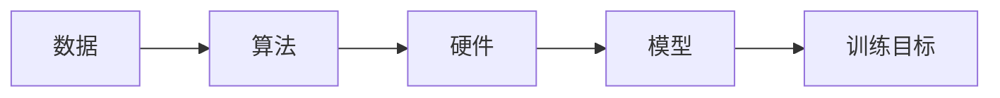
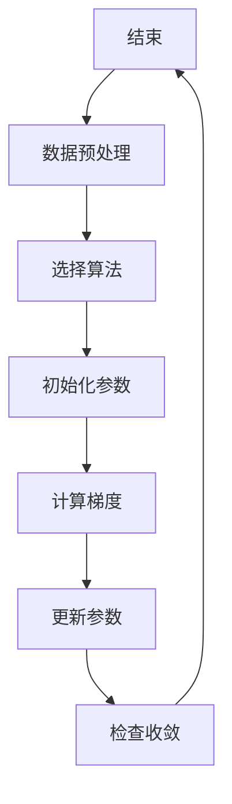
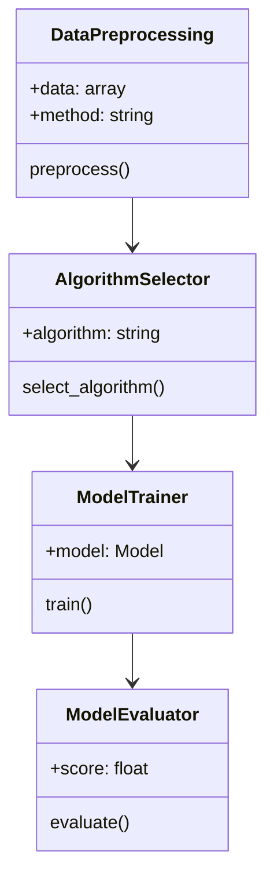

                 


# 《AI模型训练的步骤与最佳实践》

---

## 关键词：AI模型训练、机器学习、深度学习、算法优化、硬件加速

---

## 摘要：  
本文系统地介绍了AI模型训练的核心步骤与最佳实践，从背景分析、核心概念到算法实现、系统设计，再到项目实战和优化技巧，为读者提供全面的指导。通过详细阐述每一步骤的关键点，帮助读者从理论到实践，掌握AI模型训练的精髓。

---

# 第一部分: AI模型训练的背景与核心概念

---

## 第1章: AI模型训练的背景与问题背景

### 1.1 问题背景

#### 1.1.1 人工智能的发展现状  
人工智能（AI）技术近年来取得了飞速发展，广泛应用于各个领域。AI模型训练作为AI技术的核心环节，其效率和质量直接影响最终的应用效果。然而，随着模型复杂度的增加，训练过程面临数据量大、计算资源消耗高等挑战。

#### 1.1.2 AI模型训练的重要性  
AI模型训练是将算法转化为实际应用的关键步骤。通过训练，模型能够从数据中学习规律，从而实现分类、预测等任务。训练质量直接决定模型的性能和泛化能力。

#### 1.1.3 当前AI模型训练的主要挑战  
- 数据质量与数量的平衡问题  
- 算法选择与优化的复杂性  
- 计算资源的限制与高效利用  

### 1.2 问题描述

#### 1.2.1 AI模型训练的核心问题  
如何在有限的资源条件下，训练出性能最优且泛化能力强的模型？

#### 1.2.2 数据、算法与计算资源的平衡  
- 数据量不足可能导致模型过拟合  
- 算法选择不当可能影响训练效率  
- 计算资源不足可能限制模型复杂度  

#### 1.2.3 模型泛化能力与训练效率的矛盾  
- 过度优化可能导致模型过拟合训练数据  
- 训练时间过长可能降低实际应用的效率  

### 1.3 问题解决

#### 1.3.1 确定训练目标  
明确模型需要解决的问题，例如分类、回归或聚类任务。

#### 1.3.2 制定训练策略  
- 数据预处理策略  
- 算法选择策略  
- 超参数调优策略  

#### 1.3.3 选择合适的训练方法  
- 增强学习、监督学习等方法的选择  

### 1.4 边界与外延

#### 1.4.1 AI模型训练的边界条件  
- 数据范围、模型复杂度、计算资源限制  

#### 1.4.2 相关领域的区别与联系  
- AI模型训练与数据挖掘、机器学习的联系与区别  

#### 1.4.3 模型训练的未来发展趋势  
- 模型小型化与轻量化  
- 自动化训练与超参数优化  

### 1.5 概念结构与核心要素

#### 1.5.1 核心概念组成  
- 数据集  
- 算法模型  
- 训练目标  

#### 1.5.2 各要素之间的关系  
- 数据驱动算法，算法优化目标，目标指导数据收集  

#### 1.5.3 模型训练的整体架构  
数据 → 数据预处理 → 算法选择 → 模型训练 → 模型评估 → 模型部署  

### 1.6 本章小结  
本章从问题背景出发，分析了AI模型训练的核心问题与挑战，并明确了训练目标与策略。为后续章节的深入讲解奠定了基础。

---

## 第2章: AI模型训练的核心概念与联系

### 2.1 核心概念原理

#### 2.1.1 数据的作用与类型  
- 数据是模型训练的基础，分为训练数据、验证数据和测试数据。  
- 数据类型包括结构化数据、非结构化数据等。  

#### 2.1.2 算法的分类与选择  
- 监督学习、无监督学习、强化学习等算法的分类。  
- 根据任务需求选择合适的算法。  

#### 2.1.3 硬件加速的原理  
- GPU/CPU异构计算的优势。  
- 并行计算加速训练过程。  

### 2.2 核心概念属性特征对比

#### 2.2.1 数据特征对比表格  
| 特征 | 训练数据 | 验证数据 | 测试数据 |  
|------|----------|----------|----------|  
| 用途 | 训练模型 | 调整超参数 | 评估模型 |  

#### 2.2.2 算法特征对比表格  
| 算法类型 | 监督学习 | 无监督学习 | 强化学习 |  
|----------|----------|----------|----------|  
| 输入类型 | 标签数据 | 无标签数据 | 环境反馈 |  

#### 2.2.3 硬件特征对比表格  
| 特征 | CPU | GPU | TPU |  
|------|----|----|----|  
| 适用场景 | 通用计算 | 图形处理 | 深度学习 |  

### 2.3 ER实体关系图  


### 2.4 本章小结  
本章通过对比分析，明确了数据、算法和硬件在AI模型训练中的作用与关系，为后续章节的深入讲解提供了基础。

---

## 第3章: AI模型训练的算法原理

### 3.1 算法原理讲解

#### 3.1.1 常见训练算法概述  
- 随机梯度下降（SGD）  
- 最小二乘法  
- 贝叶斯优化  

#### 3.1.2 随机梯度下降算法  
随机梯度下降是一种常用优化算法，适用于大规模数据集的训练。其核心思想是通过随机选取样本，计算梯度并更新参数。

#### 3.1.3 动量优化算法  
动量优化算法通过引入动量项，加速训练过程并减少振荡。常用算法包括Adam和RMSprop。

### 3.2 算法流程图  


### 3.3 算法实现代码  
```python
import numpy as np

def SGD(X, y, model, learning_rate=0.01, epochs=100):
    for epoch in range(epochs):
        np.random.shuffle(X)
        for i in range(len(X)):
            x = X[i]
            y_true = y[i]
            y_pred = model.predict(x)
            loss = model.loss(y_true, y_pred)
            gradients = model.gradients(x, y_true, y_pred)
            model.update_weights(gradients, learning_rate)
    return model

# 示例模型结构
class LinearModel:
    def __init__(self, input_dim):
        self.W = np.zeros(input_dim)
        self.b = 0
    
    def predict(self, x):
        return np.dot(x, self.W) + self.b
    
    def loss(self, y_true, y_pred):
        return np.mean((y_true - y_pred)**2)
    
    def gradients(self, x, y_true, y_pred):
        dW = 2 * np.mean((y_pred - y_true) * x, axis=0)
        db = 2 * np.mean(y_pred - y_true)
        return dW, db
    
    def update_weights(self, gradients, learning_rate):
        self.W -= learning_rate * gradients[0]
        self.b -= learning_rate * gradients[1]
```

### 3.4 数学公式  
- 损失函数：$$ L = \frac{1}{2n}\sum_{i=1}^{n}(y_i - \hat{y_i})^2 $$
- 优化器：$$ W_{new} = W - \eta \cdot \nabla_W L $$
- 动量项：$$ V_t = \beta V_{t-1} + (1-\beta)\nabla_W L $$

### 3.5 本章小结  
本章通过详细讲解随机梯度下降算法，结合代码和公式，帮助读者理解算法原理及其在实际中的应用。

---

## 第4章: AI模型训练的系统分析与架构设计

### 4.1 问题场景介绍  
AI模型训练系统需要支持大规模数据处理和高效计算，通常涉及数据预处理、模型训练、结果评估等多个环节。

### 4.2 项目介绍  
本章将设计一个AI模型训练系统，涵盖数据输入、算法选择、模型训练、结果输出等功能。

### 4.3 系统功能设计

#### 4.3.1 领域模型类图  


#### 4.3.2 系统架构图  
```mermaid
graph LR
    Client --> API Gateway
    API Gateway --> TrainingService
    TrainingService --> DataPreprocessing
    TrainingService --> AlgorithmSelector
    TrainingService --> ModelTrainer
    ModelTrainer --> ModelEvaluator
    ModelEvaluator --> Storage
```

### 4.4 系统接口设计

#### 4.4.1 数据预处理接口  
```python
def preprocess_data(data, method):
    # 数据预处理逻辑
    return processed_data
```

#### 4.4.2 算法选择接口  
```python
def select_algorithm(data, task):
    # 根据任务选择算法
    return algorithm
```

### 4.5 本章小结  
本章通过系统设计，明确了AI模型训练系统的架构与接口，为后续的项目实现奠定了基础。

---

## 第5章: AI模型训练的项目实战

### 5.1 环境安装与配置

#### 5.1.1 安装必要的库  
- 安装TensorFlow、Keras等深度学习框架。  
- 安装numpy、pandas等数据处理库。  

#### 5.1.2 配置GPU支持  
- 安装NVIDIA显卡驱动和CUDA toolkit。  
- 配置TensorFlow的GPU版本。  

### 5.2 系统核心实现

#### 5.2.1 数据预处理  
```python
import pandas as pd

def preprocess_data(data_frame):
    # 数据清洗和特征工程
    data_frame = data_frame.dropna()
    data_frame['label'] = pd.get_dummies(data_frame['label']).values
    return data_frame
```

#### 5.2.2 模型训练实现  
```python
from tensorflow.keras import layers

model = keras.Sequential([
    layers.Dense(64, activation='relu'),
    layers.Dense(10, activation='softmax')
])
model.compile(optimizer='adam', loss='sparse_categorical_crossentropy', metrics=['accuracy'])
model.fit(X_train, y_train, epochs=10, batch_size=32)
```

### 5.3 代码实现与功能解读

#### 5.3.1 数据预处理代码  
```python
import numpy as np

def process_image_data(images, labels):
    # 标准化处理
    images = images / 255.0
    # 转换为one-hot编码
    labels = np.eye(10)[labels]
    return images, labels
```

#### 5.3.2 模型训练代码  
```python
import tensorflow as tf

model = tf.keras.models.Sequential([
    tf.keras.layers.Conv2D(32, (3,3), activation='relu', input_shape=(28,28,1)),
    tf.keras.layers.MaxPooling2D((2,2)),
    tf.keras.layers.Flatten(),
    tf.keras.layers.Dense(128, activation='relu'),
    tf.keras.layers.Dense(10, activation='softmax')
])

model.compile(optimizer='adam', loss='sparse_categorical_crossentropy', metrics=['accuracy'])
model.fit(X_train, y_train, epochs=10, batch_size=64)
```

### 5.4 实际案例分析

#### 5.4.1 数据集选择  
使用MNIST手写数字识别数据集进行训练。

#### 5.4.2 模型训练与评估  
```python
# 训练过程
history = model.fit(X_train, y_train, epochs=10, validation_data=(X_test, y_test))
# 模型评估
test_loss, test_acc = model.evaluate(X_test, y_test)
print(f"测试准确率: {test_acc}")
```

### 5.5 本章小结  
本章通过实际案例，详细讲解了AI模型训练的环境配置、代码实现和模型评估过程，帮助读者掌握实战技能。

---

## 第6章: AI模型训练的最佳实践与小结

### 6.1 最佳实践

#### 6.1.1 数据处理技巧  
- 数据清洗：处理缺失值、异常值。  
- 特征工程：提取有用的特征，降低维度。  

#### 6.1.2 算法优化技巧  
- 调整学习率：使用学习率衰减策略。  
- 调参技巧：使用网格搜索或随机搜索优化超参数。  

#### 6.1.3 硬件加速技巧  
- 使用GPU加速训练。  
- 优化数据加载和预处理，减少I/O瓶颈。  

### 6.2 小结与注意事项

#### 6.2.1 小结  
AI模型训练是一个系统工程，需要结合数据、算法和硬件多方面进行优化。  

#### 6.2.2 注意事项  
- 保持数据的均衡性，避免过拟合或欠拟合。  
- 定期监控训练过程，及时调整策略。  

#### 6.2.3 拓展阅读  
- 《Hands-On Machine Learning with Scikit-Learn, Keras, and TensorFlow》  
- 《深度学习》（Deep Learning, Ian Goodfellow等著）  

### 6.3 本章小结  
本章总结了AI模型训练的最佳实践，为读者提供了实际操作中的注意事项和扩展阅读的方向。

---

## 作者：AI天才研究院/AI Genius Institute & 禅与计算机程序设计艺术 /Zen And The Art of Computer Programming

---

以上是《AI模型训练的步骤与最佳实践》的完整目录大纲和部分章节内容，涵盖了从理论到实践的各个方面，帮助读者系统地理解和掌握AI模型训练的关键步骤与最佳实践。

