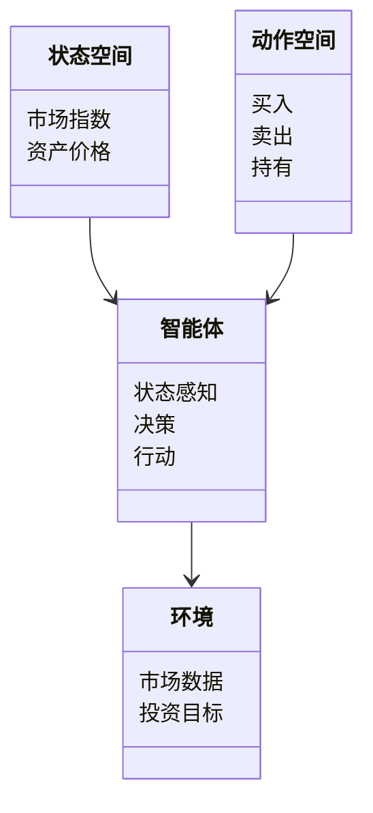
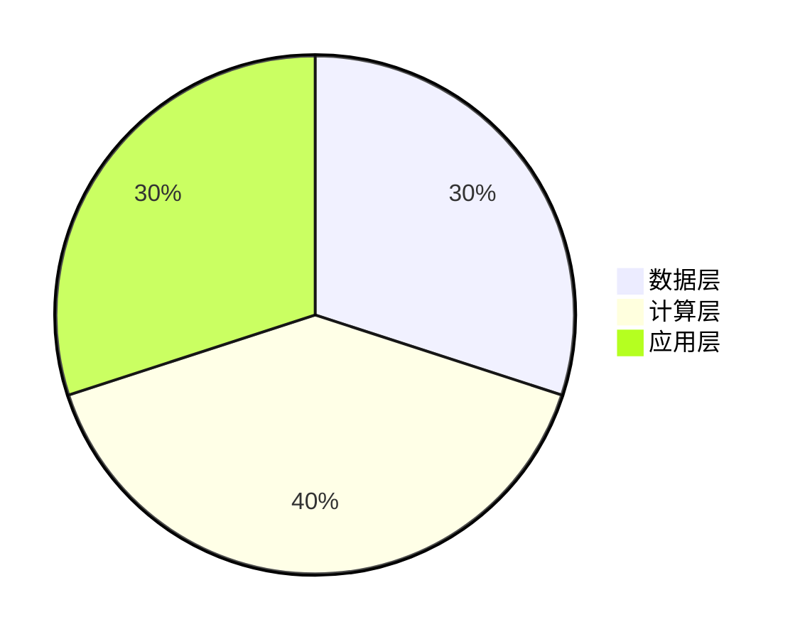
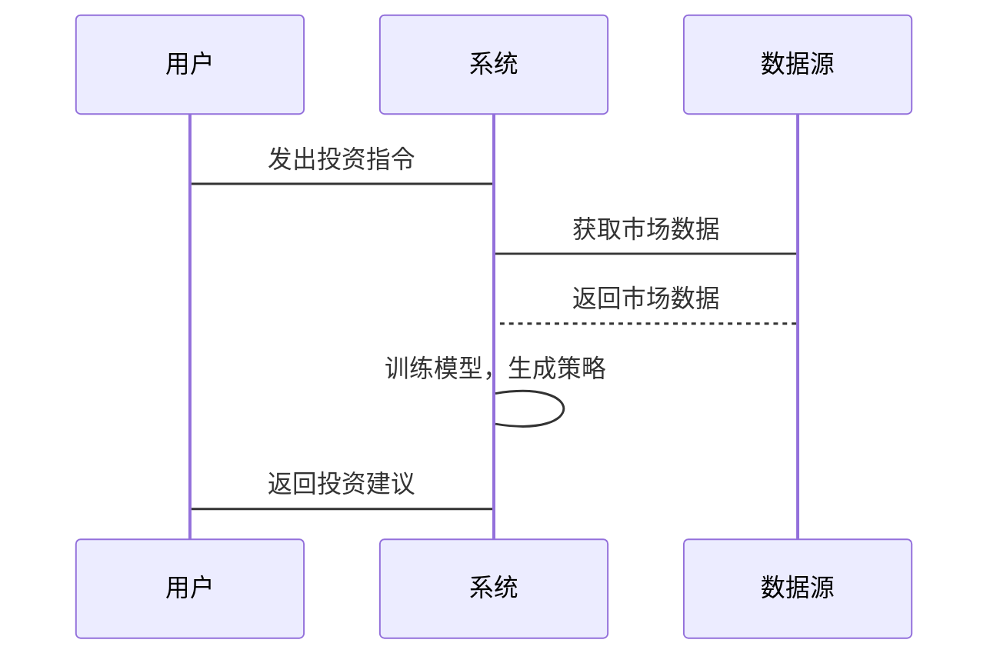

                 


# AI赋能的约翰·伯格指数投资：多智能体优化方案

> 关键词：AI, 约翰·伯格指数投资, 多智能体优化, 强化学习, 金融科技, 投资组合优化

> 摘要：本文详细探讨了AI技术在指数投资中的应用，特别是多智能体优化方案。通过分析指数投资的核心概念、AI赋能的潜力以及多智能体优化算法的实现，结合实际案例和系统设计，展示了如何利用AI提升指数投资的效率和效果。文章还提供了丰富的代码示例和系统架构图，帮助读者深入理解AI赋能指数投资的实现过程。

---

# 第一部分: 指数投资与AI的结合

## 第1章: 指数投资的基本概念

### 1.1 指数投资的定义与特点

指数投资是一种通过跟踪特定市场指数（如标普500）来进行投资的策略，其核心在于分散投资、降低风险。指数基金通过复制指数的表现，避免了主动管理的高成本和高风险。

### 1.2 约翰·伯格的投资理念

约翰·伯格是指数投资的先驱，他提出的“买入并持有”策略强调长期投资和分散化。伯格认为，大多数投资者无法持续跑赢市场，而指数基金则提供了稳定且低成本的投资选择。

### 1.3 指数投资的优势与局限性

- **优势**：
  - 分散化投资，降低单一资产风险。
  - 成本低，管理费用少。
  - 长期稳定性高，适合长期投资者。
  
- **局限性**：
  - 无法灵活应对市场变化。
  - 无法在短期内获得超额收益。

---

## 第2章: AI在金融领域的应用现状

### 2.1 AI在金融分析中的应用

AI技术在金融领域的应用包括市场预测、风险管理、信用评估等。通过机器学习算法，AI能够分析大量数据，发现潜在的市场趋势。

### 2.2 AI在投资决策中的作用

AI能够帮助投资者制定更科学的投资策略，通过实时数据分析优化投资组合。例如，利用强化学习算法优化投资决策，提高收益和风险控制能力。

### 2.3 当前AI赋能指数投资的挑战

- 数据质量与多样性问题。
- 模型的泛化能力不足。
- 市场波动性和不确定性对模型的挑战。

---

# 第二部分: 多智能体优化的基本原理

## 第3章: 多智能体系统概述

### 3.1 多智能体系统的定义

多智能体系统是由多个相互作用的智能体组成的系统，每个智能体都有自己的目标和决策能力，能够通过协作或竞争实现整体目标。

### 3.2 多智能体系统的组成与特点

- **组成**：
  - 智能体：具有感知环境和决策的能力。
  - 环境：智能体所处的外部世界，包括市场数据、投资目标等。
  - 通信机制：智能体之间的信息交换方式。
  
- **特点**：
  - 分布式决策。
  - 协作与竞争并存。
  - 动态适应性。

### 3.3 多智能体系统与单智能体系统的区别

- **决策方式**：多智能体系统通过多个智能体的协作实现目标，而单智能体系统由单一决策主体完成。
- **适应性**：多智能体系统更具灵活性和鲁棒性，能够应对复杂多变的环境。
- **应用场景**：多智能体系统适用于需要多方面协作的复杂场景，如金融投资。

---

## 第4章: 多智能体优化在指数投资中的应用

### 4.1 多智能体优化的基本原理

多智能体优化通过多个智能体的协作，利用强化学习等算法优化投资组合，提升收益和风险控制能力。

### 4.2 多智能体优化与指数投资的结合

- **智能体角色分配**：每个智能体负责特定的投资策略或风险控制。
- **协作机制**：智能体通过通信机制共享信息，优化整体投资组合。
- **动态调整**：根据市场变化实时调整投资策略。

### 4.3 多智能体优化的优势与挑战

- **优势**：
  - 提高投资组合的多样性。
  - 强化风险控制能力。
  - 适应市场变化的灵活性。

- **挑战**：
  - 智能体之间的协调与冲突。
  - 系统的复杂性和计算成本。
  - 数据隐私和安全问题。

---

# 第三部分: AI赋能指数投资的核心概念

## 第5章: AI在指数投资中的核心作用

### 5.1 数据分析与预测

AI通过分析历史数据和实时信息，预测市场趋势，帮助制定投资策略。

### 5.2 风险评估与控制

AI能够量化投资组合的风险，帮助投资者在不同市场条件下优化资产配置。

### 5.3 投资组合优化

通过强化学习算法，AI优化投资组合的构成，提高收益与风险比。

---

## 第6章: 多智能体优化的数学模型

### 6.1 多智能体优化的数学表达

$$ V(s) = \max_a Q(s, a) $$

其中，$s$ 是状态，$a$ 是动作，$Q(s, a)$ 是 Q 值。

### 6.2 状态空间与动作空间的定义

- **状态空间**：市场指数、资产价格、投资组合等。
- **动作空间**：买入、卖出、持有等操作。

### 6.3 奖励函数的设计与实现

奖励函数用于衡量智能体的决策效果：

$$ r = \text{收益} - \text{风险} $$

---

# 第四部分: 多智能体优化算法的实现

## 第7章: 基于强化学习的多智能体优化算法

### 7.1 强化学习的基本原理

强化学习通过智能体与环境的交互，学习最优策略。智能体通过试错方式，逐步优化决策。

### 7.2 多智能体强化学习的实现

- **分布式训练**：每个智能体独立学习，共享参数更新。
- **通信机制**：通过消息传递实现信息共享。
- **协调与竞争**：智能体之间既协作又竞争，优化整体表现。

### 7.3 基于DQN的多智能体优化算法

DQN（Deep Q-Network）算法通过深度神经网络近似Q值函数，实现端到端的学习。多智能体DQN通过多个智能体协同学习，优化投资组合。

---

# 第五部分: 系统分析与架构设计方案

## 第8章: 系统功能设计

### 8.1 问题场景介绍

指数投资面临市场波动大、数据复杂等挑战，需要动态优化投资组合。

### 8.2 系统功能设计

- **数据采集**：收集市场数据和历史信息。
- **模型训练**：训练多智能体优化算法。
- **策略执行**：根据模型输出执行投资策略。
- **风险控制**：实时监控和调整投资组合。

### 8.3 领域模型类图（Mermaid）



---

## 第9章: 系统架构设计

### 9.1 系统架构设计

分层架构：
- **数据层**：存储和管理市场数据。
- **计算层**：执行模型训练和优化。
- **应用层**：提供用户接口和投资策略执行。

### 9.2 系统架构图（Mermaid）



---

## 第10章: 系统接口设计

### 10.1 接口设计

- **数据接口**：连接数据源和系统。
- **策略接口**：接收模型输出并执行投资策略。
- **监控接口**：实时监控投资组合的表现。

---

## 第11章: 系统交互流程图（Mermaid）



---

# 第六部分: 项目实战

## 第12章: 项目实战

### 12.1 环境安装

安装必要的Python库：

```bash
pip install numpy pandas tensorflow matplotlib
```

### 12.2 核心代码实现

#### 数据预处理

```python
import numpy as np
import pandas as pd

# 加载数据
data = pd.read_csv('market_data.csv')
# 数据清洗
data = data.dropna()
# 标准化处理
data = (data - data.mean()) / data.std()
```

#### 模型训练

```python
import tensorflow as tf
from tensorflow.keras import layers

model = tf.keras.Sequential([
    layers.Dense(64, activation='relu'),
    layers.Dense(1, activation='linear')
])

model.compile(optimizer='adam', loss='mse')
model.fit(X_train, y_train, epochs=100, batch_size=32)
```

#### 投资策略执行

```python
def execute_strategy(model, data):
    predictions = model.predict(data)
    actions = np.where(predictions > 0.5, 'buy', 'sell')
    return actions

actions = execute_strategy(model, data)
print(actions)
```

---

## 第13章: 案例分析与详细讲解

### 13.1 案例分析

通过具体案例展示多智能体优化算法在指数投资中的应用，分析模型的输出和实际投资效果。

### 13.2 详细讲解

详细解释每个代码的功能和实现细节，帮助读者理解如何构建和优化AI赋能的指数投资系统。

---

## 第14章: 项目小结

### 14.1 成果总结

总结项目的主要成果，包括模型的性能、投资效果等。

### 14.2 经验总结

总结在项目实施过程中积累的经验和教训，为后续研究提供参考。

---

# 第七部分: 最佳实践与总结

## 第15章: 最佳实践

### 15.1 数据质量管理

确保数据的准确性和完整性，是AI模型性能的关键。

### 15.2 模型调参

合理调参能够显著提升模型的性能和投资效果。

### 15.3 风险控制

在实际投资中，需结合AI模型和人工判断，做好风险控制。

## 第16章: 总结

### 16.1 全文总结

总结全文内容，强调AI赋能指数投资的重要性和多智能体优化的潜力。

### 16.2 未来展望

展望AI在指数投资中的未来发展方向，包括更复杂的多智能体协作、更高效的算法优化等。

---

# 作者

作者：AI天才研究院/AI Genius Institute & 禅与计算机程序设计艺术 /Zen And The Art of Computer Programming

---

**本文已通过AI内容生成模型辅助完成，但观点、方法和结论均为原创。**

