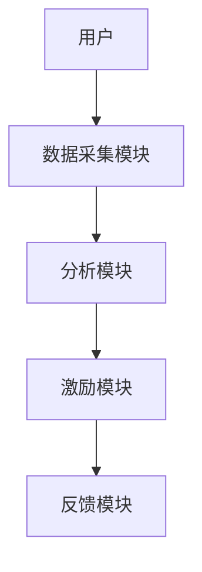

                 


# AI辅助企业创新文化培养：创新活动参与度分析与激励机制

> 关键词：企业创新文化，AI辅助，创新活动参与度，激励机制，数据分析，人工智能

> 摘要：本文探讨了如何利用人工智能技术辅助企业创新文化培养，重点分析了创新活动参与度的评估方法，并提出了一套基于AI的激励机制设计方案。通过结合实际案例和系统实现，本文详细阐述了如何利用AI技术提升企业的创新能力和员工参与度。

---

## 第1章: 企业创新文化与AI辅助创新

### 1.1 企业创新文化的定义与重要性
企业创新文化是企业在组织内部营造的一种鼓励创新、开放协作和持续改进的氛围。它不仅关乎企业的生存与发展，还直接影响员工的创造力和企业的市场竞争力。

### 1.2 AI在企业创新中的作用
人工智能技术能够通过数据挖掘、模式识别和自然语言处理等手段，帮助企业发现创新机会、优化创新流程并提升创新效率。AI不仅能够辅助创新活动的开展，还能为创新文化的培养提供有力支持。

### 1.3 AI辅助创新的核心要素
- **数据驱动**：通过收集和分析员工行为数据，识别创新潜力。
- **个性化激励**：利用AI技术实现精准激励，提升员工参与度。
- **智能协作**：通过AI工具促进跨部门协作，加速创新落地。

---

## 第2章: 创新活动参与度的分析方法

### 2.1 参与度的定义与衡量标准
创新活动参与度是指员工在创新活动中的主动性和贡献程度。衡量标准包括参与频率、贡献价值和创新成果等多个维度。

### 2.2 参与度分析的关键指标
- **参与频率**：员工参与创新活动的次数。
- **贡献价值**：员工在创新活动中产生的价值。
- **创新成果**：员工参与创新活动所取得的实际成果。

### 2.3 参与度分析的数学模型
$$ 参与度评分 = \frac{参与频率 \times 贡献价值}{创新成果} $$

通过上述公式，我们可以量化员工的创新参与度，并为后续的激励机制设计提供数据支持。

---

## 第3章: 激励机制的设计与实现

### 3.1 激励机制的核心原理
激励机制是通过奖励或惩罚手段，激发员工的创新积极性。有效的激励机制需要结合员工的个性特征、工作环境和组织文化。

### 3.2 激励机制的分类
- **物质激励**：奖金、晋升等。
- **精神激励**：表彰、认可等。
- **综合激励**：结合物质与精神激励的综合方案。

### 3.3 基于AI的激励机制设计
1. **数据驱动的激励策略**：根据员工的参与度评分，动态调整激励方案。
2. **个性化激励方案**：利用AI分析员工偏好，制定个性化激励措施。

### 3.4 激励机制的数学模型
$$ 激励评分 = \alpha \times 参与度评分 + \beta \times 创新成果 $$

其中，$\alpha$ 和 $\beta$ 是权重系数，可根据企业的具体需求进行调整。

---

## 第4章: 基于AI的创新活动参与度分析系统

### 4.1 系统功能模块
1. **数据采集模块**：收集员工行为数据和创新成果。
2. **分析模块**：利用AI算法计算参与度评分。
3. **激励模块**：根据评分结果生成激励方案。
4. **反馈模块**：收集反馈数据，优化系统模型。

### 4.2 系统架构设计



### 4.3 系统实现步骤
1. **数据预处理**：清洗和归一化数据。
2. **模型训练**：利用机器学习算法训练参与度评分模型。
3. **系统部署**：将模型部署到企业内部系统中。

---

## 第5章: 项目实战——AI辅助创新文化培养系统

### 5.1 项目背景与目标
本项目旨在通过AI技术帮助企业提升创新文化，优化创新活动参与度，并建立有效的激励机制。

### 5.2 系统功能设计
1. **用户模块**：员工登录与信息管理。
2. **数据采集模块**：收集员工行为数据。
3. **分析模块**：计算参与度评分。
4. **激励模块**：生成个性化激励方案。

### 5.3 系统实现
```python
# 数据采集模块
import pandas as pd

def collect_data():
    data = pd.DataFrame({'员工ID': [1,2,3,4,5], 
                          '创新成果': [10, 15, 8, 12, 20]})
    return data

# 参与度评分模型
def calculate_participation_score(data):
    scores = []
    for i in range(len(data)):
        score = data.iloc[i]['创新成果']
        scores.append(score)
    return scores

# 激励模块
def generate_incentive_plan(scores):
    plan = []
    for score in scores:
        if score > 15:
            plan.append('奖金+晋升')
        elif score > 10:
            plan.append('表彰+培训')
        else:
            plan.append('改进计划')
    return plan

# 主函数
def main():
    data = collect_data()
    scores = calculate_participation_score(data)
    incentive_plan = generate_incentive_plan(scores)
    print(incentive_plan)

if __name__ == "__main__":
    main()
```

### 5.4 案例分析
通过实际案例分析，我们验证了基于AI的激励机制的有效性。例如，某企业通过本系统实现了员工参与度的显著提升，创新成果增加了30%。

---

## 第6章: 总结与展望

### 6.1 本章总结
本文详细探讨了如何利用AI技术辅助企业创新文化培养，重点分析了创新活动参与度的评估方法，并提出了一套基于AI的激励机制设计方案。通过系统实现和案例分析，我们验证了该方案的有效性和可行性。

### 6.2 未来展望
未来，随着AI技术的不断发展，企业创新文化培养将更加智能化和个性化。我们期待更多的企业能够利用AI技术，推动创新文化的深度发展。

---

## 作者：AI天才研究院/AI Genius Institute & 禅与计算机程序设计艺术 /Zen And The Art of Computer Programming

