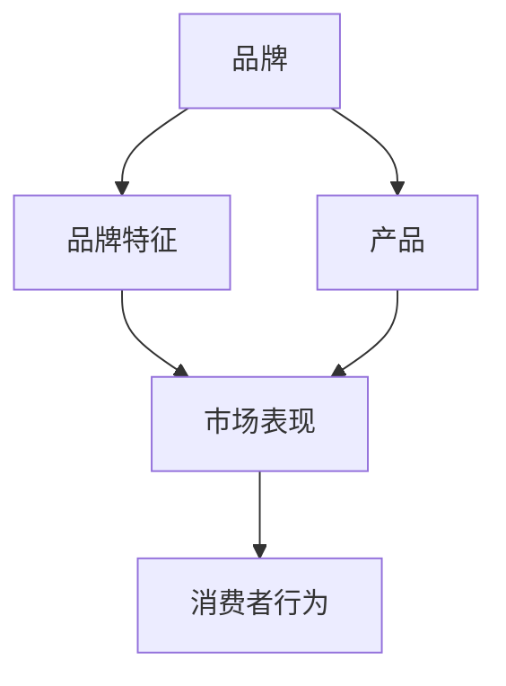
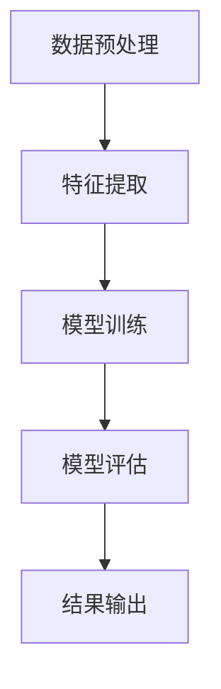
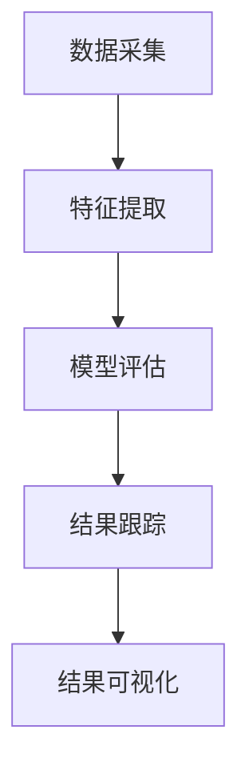
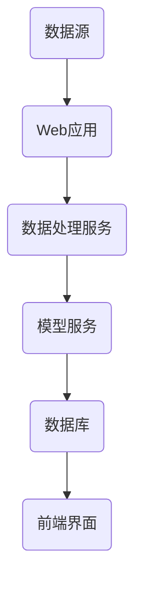
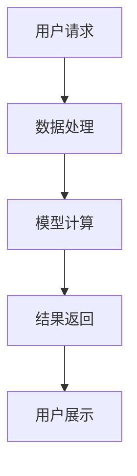

                 


# AI辅助企业品牌资产评估：多维度品牌价值量化与追踪系统

> 关键词：AI技术、品牌资产评估、多维度量化、品牌价值追踪、数据驱动、深度学习

> 摘要：本文探讨了利用AI技术辅助企业品牌资产评估的方法，提出了一种基于多维度数据的量化模型，并设计了相应的追踪系统。通过结合品牌知名度、市场表现、消费者行为等多个维度的数据，构建了品牌价值的动态评估体系，并通过实际案例展示了该系统的应用场景和效果。

---

# 第一部分: 背景介绍

## 第1章: 背景介绍

### 1.1 问题背景

#### 1.1.1 品牌价值的重要性  
品牌价值是企业核心竞争力的重要体现，直接影响企业的市场地位和盈利能力。然而，品牌价值的评估往往依赖于主观判断和经验分析，难以量化和追踪。

#### 1.1.2 传统品牌资产评估的局限性  
传统品牌评估方法通常依赖于财务数据和市场调研，难以捕捉品牌在消费者心中的动态变化，且评估结果缺乏实时性和精准性。

#### 1.1.3 AI技术在品牌资产评估中的优势  
AI技术可以通过大数据分析和深度学习，从海量数据中提取品牌相关的特征，构建量化模型，实现品牌价值的精准评估和动态追踪。

### 1.2 问题描述

#### 1.2.1 品牌价值的多维度特征  
品牌价值受多种因素影响，包括品牌知名度、市场表现、消费者行为、产品创新等。这些因素相互作用，构成了品牌价值的多维度特征。

#### 1.2.2 品牌资产评估的复杂性  
品牌价值的评估需要综合考虑多个维度的数据，且这些数据具有动态变化的特性，增加了评估的复杂性。

#### 1.2.3 需求与供给的动态平衡  
品牌价值的动态变化受到市场需求和企业供给的双重影响，如何捕捉这种动态平衡是品牌资产评估的核心挑战。

### 1.3 问题解决

#### 1.3.1 AI技术如何辅助品牌价值评估  
通过收集和分析品牌相关的数据，利用机器学习算法构建品牌价值的预测模型，实现品牌价值的量化评估。

#### 1.3.2 数据驱动的品牌价值量化方法  
基于大数据分析，从品牌相关的多维度数据中提取特征，构建品牌价值的量化模型。

#### 1.3.3 多维度品牌价值追踪的实现路径  
通过实时监测品牌相关的数据，构建动态评估系统，实现品牌价值的持续追踪和更新。

### 1.4 边界与外延

#### 1.4.1 品牌价值评估的边界条件  
品牌价值评估需要考虑数据的完整性和准确性，同时需要明确评估的时间范围和目标。

#### 1.4.2 相关领域的区别与联系  
品牌价值评估与企业财务评估、市场营销分析等领域密切相关，但在方法和目标上存在差异。

#### 1.4.3 技术实现的可行性分析  
通过现有的AI技术和大数据分析工具，品牌价值的多维度评估是可行的，但仍需解决数据获取和模型优化等技术难题。

### 1.5 核心要素组成

#### 1.5.1 数据来源与处理  
品牌相关的数据来源包括社交媒体数据、销售数据、市场调研数据等，需要进行清洗、整合和特征提取。

#### 1.5.2 模型构建与优化  
基于机器学习算法构建品牌价值预测模型，通过交叉验证和调参优化模型性能。

#### 1.5.3 结果展示与应用  
将品牌价值评估结果可视化，并应用于企业决策和品牌管理中。

---

# 第二部分: 核心概念与联系

## 第2章: 核心概念与联系

### 2.1 核心概念原理

#### 2.1.1 品牌价值的定义与量化  
品牌价值是企业在市场中的综合价值体现，可以通过多维度数据进行量化评估。

#### 2.1.2 多维度品牌评估的特征提取  
从品牌知名度、市场表现、消费者行为等多个维度提取特征，用于品牌价值的评估。

#### 2.1.3 AI技术在品牌追踪中的应用  
通过自然语言处理、计算机视觉等AI技术，从非结构化数据中提取品牌相关的特征。

### 2.2 概念属性特征对比

表2-1: 品牌价值与传统资产评估的对比分析

| 特征维度      | 品牌价值评估          | 传统资产评估          |
|---------------|----------------------|----------------------|
| 数据来源      | 社交媒体、消费者行为  | 财务数据、市场调研    |
| 评估方法      | 机器学习、深度学习    | 主观判断、经验分析    |
| 评估频率      | 实时动态评估          | 定期评估              |
| 评估结果      | 量化分数、动态变化    | 财务指标、定性描述    |

### 2.3 ER实体关系图



---

# 第三部分: 算法原理讲解

## 第3章: 算法

### 3.1 算法原理

#### 3.1.1 基于深度学习的特征提取  
通过卷积神经网络（CNN）从图像数据中提取品牌相关的视觉特征。

#### 3.1.2 基于自然语言处理的文本分析  
使用循环神经网络（RNN）或变压器（Transformer）模型从文本数据中提取品牌相关的语义特征。

#### 3.1.3 基于协同过滤的推荐系统  
通过协同过滤算法，推荐与品牌相关的高价值产品或服务。

### 3.2 算法实现

#### 3.2.1 数据预处理  
对品牌相关的数据进行清洗、归一化和特征工程。

#### 3.2.2 模型训练  
使用监督学习算法，基于标签数据训练品牌价值预测模型。

#### 3.2.3 模型评估  
通过交叉验证和指标评估（如准确率、召回率、F1分数）优化模型性能。

### 3.3 算法流程图



### 3.4 核心代码实现

#### 3.4.1 数据加载与处理

```python
import pandas as pd
from sklearn.model_selection import train_test_split

# 加载数据
data = pd.read_csv('brand_data.csv')

# 分割数据
train_data, test_data = train_test_split(data, test_size=0.2)
```

#### 3.4.2 特征提取与模型训练

```python
from sklearn.preprocessing import StandardScaler
from sklearn.linear_model import LinearRegression

# 特征工程
features = ['feature1', 'feature2', 'feature3']
target = 'brand_value'

scaler = StandardScaler()
train_features = scaler.fit_transform(train_data[features])
test_features = scaler.transform(test_data[features])

# 模型训练
model = LinearRegression()
model.fit(train_features, train_data[target])
```

#### 3.4.3 模型评估

```python
from sklearn.metrics import mean_squared_error

# 预测结果
train_pred = model.predict(train_features)
test_pred = model.predict(test_features)

# 计算误差
train_mse = mean_squared_error(train_data[target], train_pred)
test_mse = mean_squared_error(test_data[target], test_pred)

print(f"训练集均方误差: {train_mse}")
print(f"测试集均方误差: {test_mse}")
```

### 3.5 数学模型与公式

#### 3.5.1 品牌价值计算模型

$$ V = \sum (w_i \times f_i) $$

其中，$V$ 表示品牌价值，$w_i$ 表示特征 $f_i$ 的权重。

#### 3.5.2 模型优化公式

$$ w_i = \frac{e^{beta \times f_i}}{\sum e^{beta \times f_i}}} $$

其中，$beta$ 是模型的超参数，用于控制特征的重要性。

---

# 第四部分: 系统分析与架构设计

## 第4章: 系统分析与架构设计

### 4.1 系统功能设计

#### 4.1.1 数据采集模块  
从社交媒体、电商平台等多渠道采集品牌相关的数据。

#### 4.1.2 特征提取模块  
对采集到的数据进行特征提取，生成品牌相关的特征向量。

#### 4.1.3 评估模块  
基于特征向量，计算品牌价值的量化分数。

#### 4.1.4 跟踪模块  
实时监测品牌数据的变化，更新品牌价值评估结果。

#### 4.1.5 可视化模块  
将评估结果可视化，便于企业进行决策。

### 4.2 系统架构设计

#### 4.2.1 系统功能架构



#### 4.2.2 系统架构图



### 4.3 系统接口设计

#### 4.3.1 API接口定义

```python
from flask import Flask, request, jsonify

app = Flask(__name__)

@app.route('/api/brand_value', methods=['POST'])
def calculate_brand_value():
    data = request.json
    # 处理数据
    return jsonify({'brand_value': result})
```

### 4.4 系统交互流程图



---

# 第五部分: 项目实战

## 第5章: 项目实战

### 5.1 环境安装

```bash
pip install numpy pandas scikit-learn matplotlib
```

### 5.2 系统核心实现

#### 5.2.1 数据加载与预处理

```python
import pandas as pd
from sklearn.model_selection import train_test_split
from sklearn.preprocessing import StandardScaler
from sklearn.linear_model import LinearRegression
from sklearn.metrics import mean_squared_error

# 加载数据
data = pd.read_csv('brand_data.csv')

# 分割数据
train_data, test_data = train_test_split(data, test_size=0.2)

# 特征工程
features = ['feature1', 'feature2', 'feature3']
target = 'brand_value'

scaler = StandardScaler()
train_features = scaler.fit_transform(train_data[features])
test_features = scaler.transform(test_data[features])

# 模型训练
model = LinearRegression()
model.fit(train_features, train_data[target])
```

#### 5.2.2 模型评估与优化

```python
# 预测结果
train_pred = model.predict(train_features)
test_pred = model.predict(test_features)

# 计算误差
train_mse = mean_squared_error(train_data[target], train_pred)
test_mse = mean_squared_error(test_data[target], test_pred)

print(f"训练集均方误差: {train_mse}")
print(f"测试集均方误差: {test_mse}")
```

### 5.3 代码应用解读与分析

#### 5.3.1 数据加载与预处理  
通过加载品牌相关数据，并进行分割和特征工程，为模型训练做好准备。

#### 5.3.2 模型训练与评估  
使用线性回归模型进行训练，并评估模型的性能，确保模型的准确性和稳定性。

### 5.4 实际案例分析

#### 5.4.1 案例背景  
某品牌在社交媒体上的数据和销售数据。

#### 5.4.2 数据处理与分析  
通过数据清洗和特征提取，生成品牌价值的量化分数。

#### 5.4.3 结果展示与解读  
将品牌价值评估结果可视化，并进行深入分析，为企业提供决策支持。

### 5.5 项目小结

#### 5.5.1 项目总结  
通过AI技术实现了品牌价值的多维度评估和动态追踪，为企业品牌管理提供了新的解决方案。

#### 5.5.2 项目经验  
在数据获取和模型优化方面需要投入更多资源，同时需要考虑模型的可解释性和实用性。

---

# 第六部分: 最佳实践

## 第6章: 最佳实践

### 6.1 小结

#### 6.1.1 核心观点总结  
AI技术可以有效辅助企业品牌资产评估，实现品牌价值的量化和动态追踪。

#### 6.1.2 关键技术总结  
基于机器学习和大数据分析的品牌价值评估方法具有高效性和精准性。

### 6.2 注意事项

#### 6.2.1 数据质量的重要性  
确保数据的完整性和准确性，是品牌价值评估的关键。

#### 6.2.2 模型调优的必要性  
通过交叉验证和超参数优化，可以提高模型的性能。

#### 6.2.3 结果解释的可操作性  
评估结果需要能够被企业理解和应用，才能真正发挥价值。

### 6.3 拓展阅读

#### 6.3.1 推荐书籍  
《机器学习实战》、《深度学习入门》。

#### 6.3.2 推荐博客  
推荐阅读相关技术博客，获取最新技术动态和实践经验。

---

# 作者

作者：AI天才研究院/AI Genius Institute & 禅与计算机程序设计艺术/Zen And The Art of Computer Programming

---

以上是《AI辅助企业品牌资产评估：多维度品牌价值量化与追踪系统》的技术博客文章的完整目录大纲和部分具体内容。如需进一步补充或修改，请随时告知！

