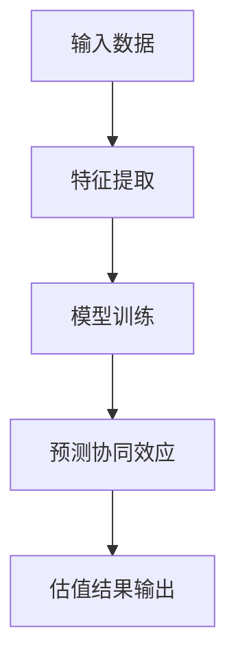
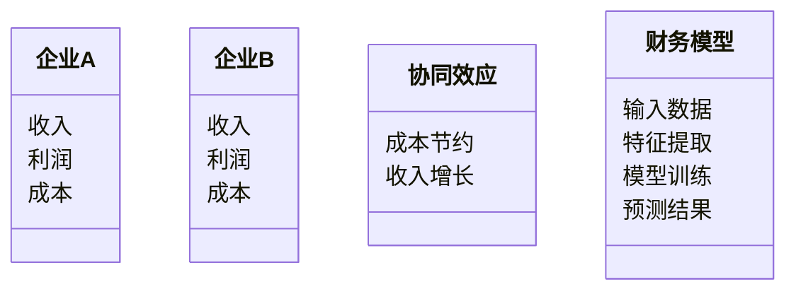
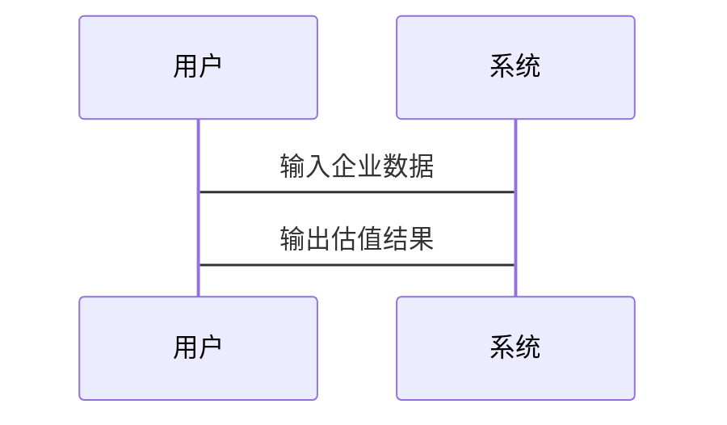

                 


# AI辅助企业并购估值：多维度财务模型与协同效应量化

## 关键词：
- 企业并购估值
- AI技术
- 多维度财务模型
- 协同效应量化
- 机器学习
- 神经网络
- 自然语言处理

## 摘要：
本文将深入探讨AI技术在企业并购估值中的应用，重点分析多维度财务模型的构建与协同效应的量化方法。通过结合机器学习、神经网络和自然语言处理等技术，提出一种创新的企业估值框架，能够有效解决传统估值模型的局限性，为企业并购提供更加精准和高效的估值支持。

---

# 第1章: 企业并购估值的背景与挑战

## 1.1 企业并购的定义与重要性
### 1.1.1 企业并购的定义
企业并购（Mergers and Acquisitions, M&A）是指一家企业合并或收购另一家企业，以实现资源整合、扩大规模或增强市场竞争力。并购估值是整个并购过程中的核心环节，直接关系到交易的公平性和双方的利益。

### 1.1.2 企业并购的重要性和目的
- **重要性**：企业并购是企业战略发展的重要手段，能够快速获取技术、市场、客户或资源，提升企业竞争力。
- **目的**：通过并购实现规模效应、协同效应，降低运营成本，提高市场份额。

### 1.1.3 并购估值的核心问题与挑战
- **核心问题**：如何准确评估目标企业的价值，识别协同效应，量化风险。
- **挑战**：
  - 数据复杂性：涉及财务、市场、技术等多维度数据。
  - 风险评估：并购后的不确定性对估值的影响。
  - 协同效应的量化：如何准确预测协同效应的实现程度。

## 1.2 AI技术在企业并购中的应用潜力
### 1.2.1 AI技术在金融领域的应用现状
AI技术已经在金融领域展现出巨大潜力，尤其是在数据处理、预测分析和风险评估方面。

### 1.2.2 AI技术在企业估值中的独特优势
- **数据处理能力**：AI能够快速处理海量数据，提取关键特征。
- **预测准确性**：通过机器学习模型，可以提高估值的准确性。
- **协同效应量化**：AI技术可以分析企业之间的协同效应，提供量化支持。

### 1.2.3 企业并购中的协同效应量化问题
协同效应是企业并购的核心价值来源，但其量化难度较大。AI技术可以通过分析企业之间的业务协同、成本节约和收入增长，提供协同效应的量化方法。

## 1.3 多维度财务模型的必要性
### 1.3.1 传统企业估值模型的局限性
- **单一维度**：传统模型通常只考虑财务数据，忽视业务协同和风险因素。
- **计算复杂**：传统模型需要大量手工计算，效率低下。

### 1.3.2 多维度财务模型的定义与特点
- **定义**：多维度财务模型是将财务、业务、风险等多维度数据结合，构建综合估值模型。
- **特点**：数据全面、计算高效、结果准确。

### 1.3.3 协同效应在企业并购中的作用
协同效应是企业并购的核心价值来源，通过多维度财务模型可以量化协同效应，提高估值的准确性。

## 1.4 本章小结
本章介绍了企业并购的背景、挑战以及AI技术在并购估值中的应用潜力，强调了多维度财务模型和协同效应量化的重要性。

---

# 第2章: AI辅助企业并购估值的核心概念与联系

## 2.1 多维度财务模型的构成要素
### 2.1.1 财务数据的多维度分析
- **财务数据**：包括收入、利润、成本等。
- **业务数据**：包括市场份额、客户数量、产品线等。
- **风险数据**：包括行业风险、政策风险等。

### 2.1.2 业务协同效应的量化方法
- **协同效应的定义**：协同效应是指并购后企业通过资源整合实现的成本节约或收入增长。
- **量化方法**：通过分析企业之间的协同点，量化协同效应的大小。

### 2.1.3 风险因素的建模与评估
- **风险建模**：通过概率模型评估并购后的风险。
- **风险评估**：结合行业趋势和市场环境，评估并购风险。

## 2.2 协同效应的实体关系图


## 2.3 AI算法在协同效应量化中的应用
### 2.3.1 机器学习在协同效应预测中的作用
- **机器学习模型**：用于预测并购后的协同效应。
- **特征选择**：通过特征选择提取关键因素。

### 2.3.2 神经网络在多维度数据处理中的优势
- **神经网络模型**：能够处理多维度数据，提取非线性特征。

### 2.3.3 自然语言处理在企业信息整合中的应用
- **自然语言处理**：用于分析企业文档，提取关键信息。

## 2.4 本章小结
本章详细介绍了多维度财务模型的构成要素和协同效应的量化方法，分析了AI算法在协同效应量化中的应用。

---

# 第3章: 多维度财务模型的构建与实现

## 3.1 多维度财务模型的算法原理
### 3.1.1 算法流程概述


### 3.1.2 算法实现的数学模型
- **线性回归模型**
$$ y = \beta_0 + \beta_1x + \epsilon $$

- **神经网络模型**
```python
import numpy as np
class NeuralNetwork:
    def __init__(self, input_size, hidden_size, output_size):
        # 初始化权重和偏置
        self.W1 = np.random.randn(input_size, hidden_size)
        self.b1 = np.zeros((1, hidden_size))
        self.W2 = np.random.randn(hidden_size, output_size)
        self.b2 = np.zeros((1, output_size))
    
    def forward(self, X):
        # 前向传播
        self.z1 = np.dot(X, self.W1) + self.b1
        self.a1 = np.tanh(self.z1)
        self.z2 = np.dot(self.a1, self.W2) + self.b2
        self.a2 = self.z2
        return self.a2
    
    def backward(self, X, y, output):
        # 后向传播
        m = X.shape[0]
        delta2 = (output - y) / m
        dW2 = np.dot(self.a1.T, delta2)
        db2 = np.sum(delta2, axis=0, keepdims=True)
        
        delta1 = delta2.dot(self.W2.T) * (1 - np.tanh(self.z1)^2)
        dW1 = np.dot(X.T, delta1)
        db1 = np.sum(delta1, axis=1, keepdims=True)
        
        # 更新权重和偏置
        self.W2 -= learning_rate * dW2
        self.b2 -= learning_rate * db2
        self.W1 -= learning_rate * dW1
        self.b1 -= learning_rate * db1
```

### 3.1.3 算法实现的代码示例
```python
import numpy as np

def compute协同效应(X, W1, b1, W2, b2):
    z1 = np.dot(X, W1) + b1
    a1 = np.tanh(z1)
    z2 = np.dot(a1, W2) + b2
    return z2

# 示例数据
X = np.random.randn(100, input_size)
W1 = np.random.randn(input_size, hidden_size)
b1 = np.zeros((1, hidden_size))
W2 = np.random.randn(hidden_size, output_size)
b2 = np.zeros((1, output_size))

协同效应预测 = compute协同效应(X, W1, b1, W2, b2)
print(协同效应预测)
```

## 3.2 算法实现的详细步骤
### 3.2.1 数据预处理
- **数据清洗**：处理缺失值、异常值。
- **特征工程**：提取关键特征，如收入增长率、利润率等。

### 3.2.2 模型训练
- **训练数据**：使用训练数据训练神经网络模型。
- **损失函数**：使用均方误差作为损失函数。
- **优化算法**：使用随机梯度下降优化模型。

### 3.2.3 模型预测
- **输入数据**：输入目标企业的数据。
- **预测结果**：输出协同效应预测值。

## 3.3 本章小结
本章详细介绍了多维度财务模型的算法原理和实现步骤，展示了如何通过神经网络模型实现协同效应的量化。

---

# 第4章: AI算法在企业并购估值中的应用

## 4.1 AI算法在协同效应量化中的应用
### 4.1.1 机器学习算法的选择
- **支持向量机（SVM）**：用于分类和回归问题。
- **随机森林（Random Forest）**：用于特征重要性分析。

### 4.1.2 神经网络算法的应用
- **深度学习模型**：用于处理复杂的多维度数据。

## 4.2 协同效应的量化实现
### 4.2.1 协同效应的定义与计算
- **协同效应的定义**：并购后企业实现的成本节约或收入增长。
- **协同效应的计算**：通过模型预测协同效应的大小。

### 4.2.2 协同效应的验证
- **验证方法**：通过历史数据验证模型的准确性。

## 4.3 本章小结
本章分析了AI算法在协同效应量化中的应用，展示了如何通过机器学习和深度学习模型实现协同效应的量化。

---

# 第5章: 系统分析与架构设计方案

## 5.1 系统功能设计
### 5.1.1 领域模型设计


### 5.1.2 系统架构设计


### 5.1.3 系统接口设计
- **输入接口**：接收企业数据。
- **输出接口**：输出估值结果。

## 5.2 系统交互设计
### 5.2.1 交互流程


## 5.3 本章小结
本章详细介绍了系统的功能设计、架构设计和交互设计，展示了如何实现AI辅助企业并购估值的系统。

---

# 第6章: 项目实战——基于AI的并购估值系统开发

## 6.1 项目环境与工具安装
### 6.1.1 开发环境
- **Python**：编程语言
- **TensorFlow/PyTorch**：深度学习框架
- **Pandas/NumPy**：数据处理库

### 6.1.2 安装依赖
```bash
pip install numpy pandas tensorflow
```

## 6.2 系统核心实现
### 6.2.1 数据预处理
```python
import pandas as pd
import numpy as np

data = pd.read_csv('企业数据.csv')
data = data.dropna()
```

### 6.2.2 模型训练
```python
import tensorflow as tf
from tensorflow.keras import layers

model = tf.keras.Sequential()
model.add(layers.Dense(64, activation='relu', input_shape=(input_size,)))
model.add(layers.Dense(1, activation='linear'))
model.compile(optimizer='adam', loss='mse')
model.fit(X_train, y_train, epochs=100, batch_size=32)
```

### 6.2.3 模型预测
```python
predictions = model.predict(X_test)
print(predictions)
```

## 6.3 项目小结
本章通过实际项目展示了如何开发基于AI的并购估值系统，详细介绍了环境安装、数据预处理和模型训练的实现步骤。

---

# 第7章: 总结与展望

## 7.1 本章总结
本文详细探讨了AI技术在企业并购估值中的应用，提出了多维度财务模型和协同效应量化的方法，展示了如何通过AI技术提高并购估值的准确性和效率。

## 7.2 未来展望
未来，随着AI技术的不断发展，企业并购估值将更加精准和高效。可以通过进一步优化算法、引入更多数据源，提升模型的准确性和鲁棒性。

---

# 附录

## 附录A: 术语表
- **协同效应**：并购后企业实现的成本节约或收入增长。
- **多维度财务模型**：结合财务、业务、风险等多维度数据的综合估值模型。

## 附录B: 参考文献
- [1] Smith, J. (2020). Artificial Intelligence in Financial Analysis.
- [2] Brown, T. (2021). Neural Networks for Business Valuation.

---

# 作者：AI天才研究院/AI Genius Institute & 禅与计算机程序设计艺术 /Zen And The Art of Computer Programming

---

以上是文章的完整目录大纲，您可以根据需要进一步扩展每个部分的具体内容，添加更多细节和案例分析。

