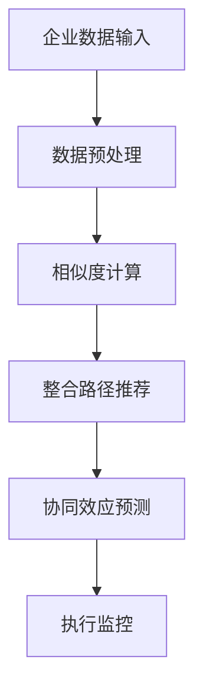
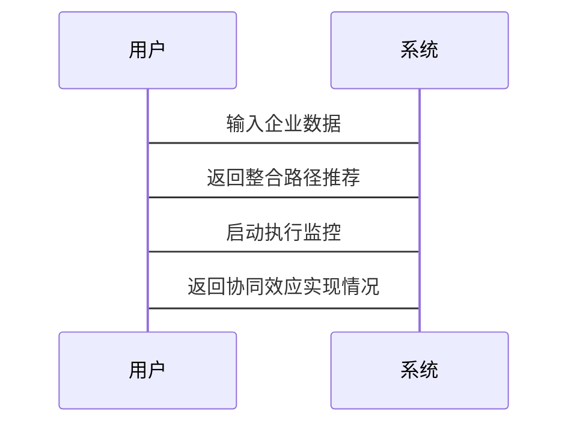

                 


# AI辅助企业并购协同效应实现：整合路径规划与执行监控

> 关键词：企业并购、协同效应、AI辅助、整合路径、执行监控、协同过滤、聚类分析

> 摘要：本文详细探讨了人工智能在企业并购中的应用，特别是如何通过整合路径规划和执行监控实现协同效应。文章首先介绍了企业并购的基本概念和AI技术在其中的作用，然后深入分析了协同效应预测模型和整合路径规划的算法原理，包括协同过滤和聚类分析。接着，文章详细讲解了系统架构设计，包括功能模块、架构图和交互流程。最后，通过具体案例展示了项目的实战过程，并总结了最佳实践和注意事项。

---

## 第一部分: AI辅助企业并购协同效应实现概述

### 第1章: 企业并购与协同效应概述

#### 1.1 企业并购的基本概念

企业并购（Mergers and Acquisitions, M&A）是指两个或多个企业之间通过合并或收购而形成新的企业结构的过程。并购可以是敌意的或善意的，也可以是杠杆式的或非杠杆式的。协同效应是企业并购的主要驱动力之一，它指的是通过并购整合资源、优化流程、共享成本等方式，实现比单独运营更高的价值。

协同效应的类型包括：
- **成本协同效应**：通过整合供应链、共享资源降低成本。
- **运营协同效应**：优化业务流程，提高效率。
- **市场协同效应**：扩大市场覆盖，提升品牌影响力。
- **技术协同效应**：整合技术资源，提升创新能力。

#### 1.2 AI技术在企业并购中的应用背景

传统的企业并购过程中，协同效应的实现往往依赖于经验和人工判断，存在效率低、误差大、难以量化等问题。AI技术的引入为企业并购提供了新的解决方案，尤其是在整合路径规划和执行监控方面。

AI技术的应用背景包括：
- **数据驱动的决策**：利用大数据分析企业之间的匹配度，优化整合路径。
- **实时监控与反馈**：通过机器学习模型实时跟踪并购后的协同效应实现情况，及时调整策略。
- **风险预测与管理**：通过AI技术预测整合过程中可能遇到的风险，并提供应对策略。

### 第2章: AI辅助企业并购的核心概念

#### 2.1 整合路径规划

整合路径规划是企业在并购后如何优化资源配置、实现协同效应的关键步骤。AI技术可以通过分析企业之间的互补性、协同潜力和整合风险，提供最优的整合路径。

**整合路径规划的关键因素**包括：
- **战略匹配度**：企业战略目标是否一致。
- **资源互补性**：双方在技术、市场、供应链等方面的优势是否互补。
- **整合风险**：文化差异、组织结构冲突等可能导致的风险。

#### 2.2 执行监控与优化

执行监控是整合路径规划的延伸，旨在通过实时数据采集和分析，确保整合过程按计划进行，并及时调整优化策略。AI技术可以通过预测模型和反馈机制，动态调整整合策略，确保协同效应的实现。

**执行监控的核心要素**包括：
- **关键绩效指标（KPIs）**：如成本节约率、收入增长率、利润率提升等。
- **实时数据处理**：通过数据流分析，及时发现整合过程中的问题。
- **反馈机制**：根据监控结果，优化整合策略。

### 第3章: 协同效应实现的关键要素

#### 3.1 协同效应的实现路径

协同效应的实现路径包括：
1. **资源整合**：整合双方的技术、市场、供应链等资源，实现资源共享。
2. **业务流程优化**：通过流程再造，提高效率，降低成本。
3. **组织文化融合**：通过文化整合，减少冲突，促进团队协作。

#### 3.2 协同效应的评估指标

协同效应的评估指标可以分为财务指标、运营指标和无形资产指标三类：
- **财务指标**：如协同效应带来的成本节约、收入增长等。
- **运营指标**：如流程效率提升、供应链优化等。
- **无形资产指标**：如品牌价值提升、创新能力强弱等。

---

## 第二部分: AI辅助企业并购的核心算法与模型

### 第4章: 协同效应预测模型

#### 4.1 协同效应预测的数学模型

协同效应预测模型可以通过多种算法实现，其中协同过滤和神经网络是常用的两种方法。

##### 协同过滤算法

协同过滤是一种基于用户行为或物品特征的推荐算法，可以用于预测企业并购后的协同效应。

**协同过滤算法步骤**：
1. 数据预处理：收集企业之间的匹配数据，构建用户-物品矩阵。
2. 计算相似度：使用余弦相似度或欧式距离计算企业之间的相似度。
3. 生成推荐：基于相似企业的协同效应，预测目标企业的协同效应。

##### 神经网络模型

神经网络模型可以通过深度学习技术，自动提取企业之间的特征，预测协同效应。

**神经网络模型步骤**：
1. 数据预处理：将企业数据转换为向量表示。
2. 模型训练：使用神经网络模型（如LSTM或CNN）进行训练。
3. 预测协同效应：基于训练好的模型，预测目标企业的协同效应。

##### 示例代码

```python
from sklearn.metrics.pairwise import cosine_similarity

# 示例企业数据
companies = {
    'Company A': {'Technology': 0.8, 'Market': 0.6},
    'Company B': {'Technology': 0.7, 'Market': 0.5},
    'Company C': {'Technology': 0.6, 'Market': 0.7}
}

# 计算相似度矩阵
similarity_matrix = cosine_similarity([v.values for v in companies.values()])
```

#### 4.2 基于协同过滤的整合路径规划

##### 协同过滤算法实现

协同过滤算法可以通过以下步骤实现整合路径规划：
1. **数据预处理**：收集企业的历史并购数据，构建企业特征矩阵。
2. **计算相似度**：使用余弦相似度计算企业之间的相似度。
3. **生成推荐**：基于相似企业的整合路径，推荐最优的整合路径。

##### 实例分析

假设我们有三家企业A、B、C，其中A和B的协同效应较高，A和C的协同效应较低。通过协同过滤算法，可以推荐A与B进行整合，实现较高的协同效应。

---

### 第5章: 基于聚类分析的协同效应实现

#### 5.1 聚类分析算法原理

聚类分析是一种无监督学习算法，可以通过将相似的企业分组，发现潜在的协同效应。

##### 聚类分析步骤

1. **数据预处理**：将企业数据转换为向量表示。
2. **选择聚类算法**：常用K-means、层次聚类等算法。
3. **聚类结果分析**：根据聚类结果，发现具有协同潜力的企业组合。

#### 5.2 协同效应实现的聚类应用

##### 数据预处理

```python
from sklearn.preprocessing import StandardScaler

# 示例企业数据
data = [[0.8, 0.6], [0.7, 0.5], [0.6, 0.7]]

# 标准化数据
scaler = StandardScaler()
data_scaled = scaler.fit_transform(data)
```

##### 聚类结果分析

假设我们通过聚类分析发现企业A和B属于同一簇，具有较高的协同效应潜力，可以推荐它们进行整合。

---

## 第三部分: 系统架构与实现

### 第6章: 系统架构设计

#### 6.1 系统功能设计

##### 整合路径规划模块

整合路径规划模块的功能包括：
- 输入企业数据，生成企业特征矩阵。
- 计算企业之间的相似度，推荐整合路径。

##### 协同效应预测模块

协同效应预测模块的功能包括：
- 基于历史数据，预测整合后的协同效应。
- 提供协同效应的可视化报告。

##### 执行监控模块

执行监控模块的功能包括：
- 实时采集整合过程中的数据，监控协同效应的实现情况。
- 提供反馈机制，优化整合策略。

#### 6.2 系统架构图



#### 6.3 系统接口设计

系统接口设计包括：
- 数据输入接口：接收企业数据。
- 数据处理接口：处理企业数据，生成特征矩阵。
- 接口输出：返回整合路径推荐和协同效应预测结果。

#### 6.4 系统交互流程



---

## 第四部分: 项目实战

### 第7章: 项目实战

#### 7.1 环境安装

项目实战需要以下环境：
- Python 3.6+
- Scikit-learn、Numpy、Pandas等库。

#### 7.2 核心实现

##### 整合路径规划代码

```python
from sklearn.metrics.pairwise import cosine_similarity

# 示例企业数据
companies = {
    'Company A': {'Technology': 0.8, 'Market': 0.6},
    'Company B': {'Technology': 0.7, 'Market': 0.5},
    'Company C': {'Technology': 0.6, 'Market': 0.7}
}

# 计算相似度矩阵
similarity_matrix = cosine_similarity([v.values for v in companies.values()])
print(similarity_matrix)
```

##### 执行监控代码

```python
import pandas as pd
import time

# 示例监控数据
data = {'时间': [], '协同效应': []}

while True:
    # 模拟协同效应数据
    effect = 0.8 * (1 + 0.1 * len(data['时间']))
    data['时间'].append(time.time())
    data['协同效应'].append(effect)
    time.sleep(1)

    # 可视化
    df = pd.DataFrame(data)
    print(df.tail())
```

#### 7.3 实例分析

通过上述代码，我们可以实现整合路径规划和执行监控。例如，通过协同过滤算法推荐企业A与企业B进行整合，实现较高的协同效应。

#### 7.4 项目小结

本项目通过AI技术实现了企业并购中的整合路径规划和执行监控，展示了AI在企业并购中的巨大潜力。

---

## 第五部分: 最佳实践与小结

### 第8章: 最佳实践

#### 8.1 小结

本文详细探讨了AI在企业并购中的应用，特别是整合路径规划和执行监控的实现。通过协同过滤和聚类分析等算法，我们可以实现高效的企业并购和协同效应的最大化。

#### 8.2 注意事项

- 数据质量是关键，确保数据的准确性和完整性。
- 算法选择要根据具体场景，合理选择协同过滤、聚类分析等算法。
- 系统架构设计要合理，确保系统的可扩展性和可维护性。

#### 8.3 拓展阅读

- 《集体智能》（Collective Intelligence）
- 《数据驱动的决策》（Data-Driven Decision Making）

---

作者：AI天才研究院/AI Genius Institute & 禅与计算机程序设计艺术 /Zen And The Art of Computer Programming

