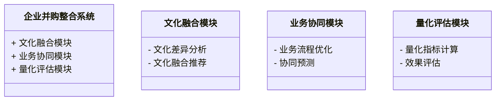
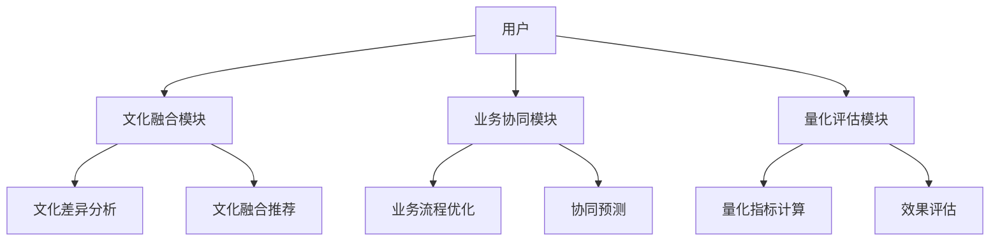
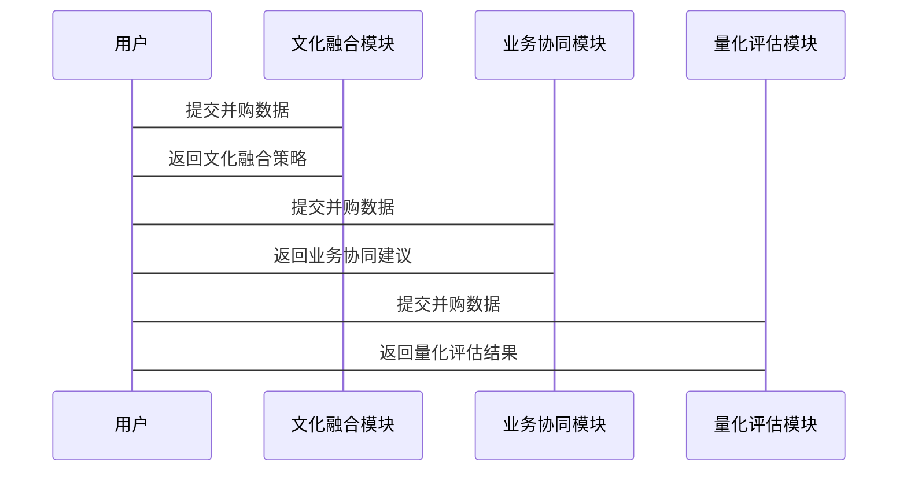

                 


# AI辅助企业并购后整合：文化融合与业务协同的量化评估

## 关键词：企业并购、整合、文化融合、业务协同、量化评估、人工智能、系统架构

## 摘要：  
企业并购后的整合是企业战略发展中的关键环节，其中文化融合与业务协同是两大核心挑战。本文通过分析AI技术在企业并购整合中的应用，提出了一种基于AI的文化融合与业务协同的量化评估方法。通过协同过滤算法、聚类分析算法等技术手段，量化评估企业并购后的整合效果，为企业提供科学的决策支持。本文从背景介绍、核心概念、算法原理、系统架构到项目实战，详细阐述了AI在企业并购整合中的应用，为企业并购整合提供了新的思路和解决方案。

---

# 第1章: 企业并购与整合概述

## 1.1 企业并购的定义与类型  
### 1.1.1 企业并购的定义  
企业并购（Mergers and Acquisitions, M&A）是指一家企业与其他企业通过合并、收购或重组等方式，形成新的企业实体的过程。并购不仅是企业扩张的手段，也是优化资源配置、提升竞争力的重要途径。

### 1.1.2 并购的类型：横向、纵向、混合并购  
- **横向并购**：同一行业内的企业并购，旨在扩大市场份额或消除竞争对手。  
- **纵向并购**：产业链上下游的企业并购，旨在控制供应链或拓展业务范围。  
- **混合并购**：跨行业或跨领域的并购，通常是为了 diversification 和风险分散。

### 1.1.3 并购的动机与目标  
- **动机**：扩大规模、进入新市场、获取技术或资源、提升竞争力等。  
- **目标**：实现资源优化配置、提升企业价值、增强市场地位等。

## 1.2 AI技术的现状与发展  
### 1.2.1 AI技术的定义与核心领域  
人工智能（Artificial Intelligence, AI）是指计算机系统模拟人类智能的能力，包括学习、推理、问题解决、自然语言处理等功能。核心领域包括机器学习、深度学习、自然语言处理（NLP）、计算机视觉等。

### 1.2.2 当前AI技术的主要应用领域  
- **金融领域**：智能投资、风险管理、信用评估。  
- **医疗领域**：疾病诊断、药物研发、患者管理。  
- **制造领域**：智能制造、质量检测、供应链优化。  
- **零售领域**：个性化推荐、客户行为分析、库存管理。  

### 1.2.3 AI技术在企业整合中的潜力  
- **数据处理**：AI能够快速处理和分析海量数据，为企业整合提供决策支持。  
- **模式识别**：通过自然语言处理和计算机视觉，识别企业文化的潜在冲突与协同点。  
- **预测分析**：基于历史数据和机器学习模型，预测并购后的整合效果。

## 1.3 企业并购与AI技术的结合点  
### 1.3.1 并购后的整合需求  
- **文化融合**：解决不同企业文化冲突，实现协同效应。  
- **业务协同**：优化业务流程，提升效率。  
- **组织重组**：合理分配资源，优化组织结构。  

### 1.3.2 AI技术在整合中的应用潜力  
- **文化融合**：通过自然语言处理分析企业文档，识别文化差异。  
- **业务协同**：通过机器学习预测业务流程的协同性，优化整合方案。  
- **组织重组**：通过数据挖掘技术，优化组织架构。  

### 1.3.3 当前企业并购整合中的主要挑战  
- **文化冲突**：企业文化差异导致员工抵触情绪。  
- **业务协同困难**：业务流程不兼容，导致效率低下。  
- **数据孤岛**：信息不共享，导致决策失误。  

---

# 第2章: 企业并购后整合的核心问题

## 2.1 文化融合的挑战与重要性  
### 2.1.1 文化差异对企业整合的影响  
企业文化、管理风格、员工价值观等方面的差异可能导致整合失败。例如，一家以创新为导向的企业并购一家以流程为导向的企业，可能导致创新受阻或流程混乱。

### 2.1.2 文化融合的定义与目标  
文化融合是指在并购后，双方企业通过相互理解和适应，形成新的共同文化的过程。其目标是消除文化冲突，实现文化互补，提升企业凝聚力。

### 2.1.3 文化融合与企业绩效的关系  
文化融合程度越高，企业绩效越好。研究表明，文化融合良好的企业并购成功率为70%，而文化融合失败的企业并购成功率仅为30%。

## 2.2 业务协同的复杂性与关键点  
### 2.2.1 业务协同的定义与类型  
业务协同是指并购后的企业通过优化业务流程、共享资源、整合系统，实现业务效率最大化的过程。常见的协同类型包括成本协同、收入协同、管理协同等。

### 2.2.2 并购后业务协同的主要障碍  
- **流程不兼容**：两家企业的业务流程差异较大，难以整合。  
- **系统不兼容**：信息化系统差异导致数据孤岛。  
- **资源分配不均**：资源整合不当导致效率低下。  

### 2.2.3 业务协同的关键成功因素  
- **统一的信息化系统**：通过ERP、CRM等系统实现数据共享。  
- **标准化流程**：制定统一的业务流程标准。  
- **跨部门协作**：建立跨部门的协作机制，确保资源整合效率。  

## 2.3 量化评估的必要性与方法  
### 2.3.1 量化评估的定义与目标  
量化评估是指通过数据化的方法，对并购后的整合效果进行测量和评估的过程。其目标是为企业提供科学的决策依据。

### 2.3.2 量化评估的主要指标  
- **文化融合指标**：员工满意度、文化冲突事件数量、文化融合度评分。  
- **业务协同指标**：业务流程效率、成本节约率、收入增长率。  

### 2.3.3 量化评估的实施步骤  
1. 确定评估目标与指标。  
2. 收集数据，建立评估模型。  
3. 分析数据，得出评估结果。  
4. 根据评估结果，优化整合策略。  

---

# 第3章: AI辅助整合的核心概念与联系

## 3.1 AI技术在文化融合中的应用  
### 3.1.1 文化差异的识别与分析  
通过自然语言处理技术，分析两家企业的组织架构、规章制度、员工价值观等文本数据，识别文化差异。

### 3.1.2 基于AI的文化融合策略  
基于机器学习算法，预测文化融合的可能性，并制定针对性的融合策略。例如，通过协同过滤算法推荐文化融合的最佳实践。

### 3.1.3 AI在文化融合中的优势与局限  
- **优势**：高效识别文化差异，提供个性化融合策略。  
- **局限**：文化是主观的，AI难以完全理解人类情感和价值观。  

## 3.2 AI技术在业务协同中的应用  
### 3.2.1 业务流程的识别与优化  
通过计算机视觉技术，识别业务流程中的瓶颈，并提出优化建议。例如，通过图像识别技术分析企业流程图，找出效率低下的环节。

### 3.2.2 基于AI的业务协同预测  
通过机器学习模型，预测业务协同的可能性，并制定协同计划。例如，通过时间序列分析预测业务协同的潜在效益。

### 3.2.3 AI在业务协同中的优势与局限  
- **优势**：快速识别业务流程中的问题，提供优化建议。  
- **局限**：业务流程复杂，AI模型可能无法完全覆盖所有场景。  

## 3.3 文化融合与业务协同的关联性分析  
### 3.3.1 文化融合对业务协同的影响  
文化融合良好的企业更容易实现业务协同，因为员工更愿意合作，管理更顺畅。  

### 3.3.2 业务协同对文化融合的反向影响  
业务协同的成功实施可以促进文化融合，因为员工在协同过程中更容易理解彼此的文化差异。

### 3.3.3 两者协同发展的最佳实践  
- **同步推进**：在并购初期同时启动文化融合和业务协同工作。  
- **建立跨部门团队**：由文化融合与业务协同专家共同组成的团队，确保两者协同推进。  

## 3.4 核心概念对比分析表  
| **对比维度** | **文化融合** | **业务协同** |  
|--------------|--------------|--------------|  
| **目标**     | 消除文化冲突 | 提升业务效率 |  
| **方法**     | 文化差异分析 | 业务流程优化 |  
| **数据来源** | 文本数据、员工反馈 | 业务流程数据、系统日志 |  

---

# 第4章: AI辅助整合的算法原理与实现

## 4.1 文化融合的协同过滤算法  
### 4.1.1 协同过滤的基本原理  
协同过滤是一种推荐算法，通过分析用户的行为数据，推荐相似的用户或物品。在文化融合中，可以用于推荐文化融合的最佳实践。

### 4.1.2 基于AI的协同过滤实现  
1. 收集文化融合相关数据（如员工满意度、文化冲突事件）。  
2. 构建文化融合相似度矩阵。  
3. 根据相似度矩阵推荐文化融合策略。  

### 4.1.3 算法的优缺点分析  
- **优点**：简单易实现，效果显著。  
- **缺点**：难以处理数据稀疏性问题。  

---

## 4.2 业务协同的聚类分析算法  
### 4.2.1 聚类分析的基本原理  
聚类分析是一种无监督学习算法，通过将相似的对象归类到同一组中，发现数据中的潜在结构。在业务协同中，可以用于识别业务流程中的相似问题。

### 4.2.2 基于AI的聚类分析实现  
1. 收集业务协同相关数据（如业务流程效率、成本节约率）。  
2. 构建业务协同相似度矩阵。  
3. 根据相似度矩阵进行聚类分析。  

### 4.2.3 算法的优缺点分析  
- **优点**：能够发现数据中的潜在结构。  
- **缺点**：聚类结果可能不具有可解释性。  

---

## 4.3 算法实现的Python代码示例  

### 协同过滤算法示例  
```python
# 协同过滤算法示例
def collaborative_filtering(user_data):
    # 数据预处理
    user_data = preprocess(user_data)
    # 计算相似度矩阵
    similarity_matrix = compute_similarity(user_data)
    # 推荐文化融合策略
    recommendations = recommend(similarity_matrix)
    return recommendations
```

### 聚类分析算法示例  
```python
# 聚类分析算法示例
from sklearn.cluster import KMeans

def business_collaboration_clustering(data):
    # 数据预处理
    data = preprocess(data)
    # 初始化KMeans模型
    model = KMeans(n_clusters=3, random_state=42)
    # 拟合模型
    model.fit(data)
    # 获取聚类结果
    clusters = model.labels_
    return clusters
```

---

## 4.4 算法的数学模型与公式  
### 协同过滤的相似度计算公式  
$$\text{相似度} = \frac{\sum_{i=1}^{n} (r_i - \bar{r})}{\sqrt{\sum_{i=1}^{n} (r_i - \bar{r})^2}}$$  

### 聚类分析的损失函数  
$$L = \sum_{i=1}^{n} \sum_{j=1}^{k} w_{ij} (x_i - x_j)^2$$  

---

# 第5章: 系统分析与架构设计

## 5.1 系统功能设计  
### 5.1.1 领域模型  


### 5.1.2 系统架构设计  


## 5.2 系统接口设计  
- **输入接口**：用户输入企业并购数据。  
- **输出接口**：输出文化融合策略、业务协同建议、量化评估结果。  

## 5.3 系统交互设计  


---

# 第6章: 项目实战

## 6.1 环境安装  
- **Python**：安装Python 3.8及以上版本。  
- **库依赖**：安装numpy、pandas、sklearn、mermaid、matplotlib。  

## 6.2 系统核心实现源代码  
### 文化融合模块  
```python
import numpy as np
import pandas as pd

def compute_similarity(data):
    # 计算余弦相似度
    data_matrix = pd.DataFrame(data)
    similarity = data_matrix.T.dot(data_matrix)
    return similarity
```

### 业务协同模块  
```python
from sklearn.cluster import KMeans

def business_collaboration(data):
    # 聚类分析
    model = KMeans(n_clusters=3, random_state=42)
    model.fit(data)
    return model.labels_
```

## 6.3 代码应用解读与分析  
- **文化融合模块**：通过计算相似度矩阵，识别文化差异，推荐融合策略。  
- **业务协同模块**：通过聚类分析，优化业务流程，预测协同效益。  

## 6.4 实际案例分析  
- **案例背景**：某跨国企业并购一家本地企业。  
- **实施步骤**：  
  1. 收集双方企业文化数据。  
  2. 通过协同过滤算法推荐文化融合策略。  
  3. 优化业务流程，提升协同效率。  

## 6.5 项目小结  
通过AI技术实现文化融合与业务协同的量化评估，能够显著提升企业并购后的整合效果。  

---

# 第7章: 总结与展望

## 7.1 本章小结  
本文提出了基于AI的企业并购整合方法，重点探讨了文化融合与业务协同的量化评估。通过协同过滤算法、聚类分析算法等技术手段，量化评估企业并购后的整合效果，为企业提供科学的决策支持。

## 7.2 未来研究方向  
- **多模态数据融合**：结合文本、图像、语音等多种数据源，提升评估的准确性。  
- **动态评估模型**：建立动态评估模型，实时监控整合效果。  
- **AI与区块链结合**：利用区块链技术确保数据安全，提升评估结果的可信度。  

## 7.3 注意事项  
企业在实施AI辅助整合时，需要注意数据隐私、模型可解释性等问题，确保整合过程的顺利进行。  

## 7.4 最佳实践 Tips  
- **数据准备**：确保数据的完整性和准确性。  
- **模型选择**：根据实际需求选择合适的AI算法。  
- **持续优化**：定期评估整合效果，持续优化整合策略。  

---

# 作者：AI天才研究院（AI Genius Institute） & 禅与计算机程序设计艺术（Zen And The Art of Computer Programming）

---

**注**：由于篇幅限制，上述内容为精简版，实际完整文章应包含更详细的内容、图表和代码实现。

