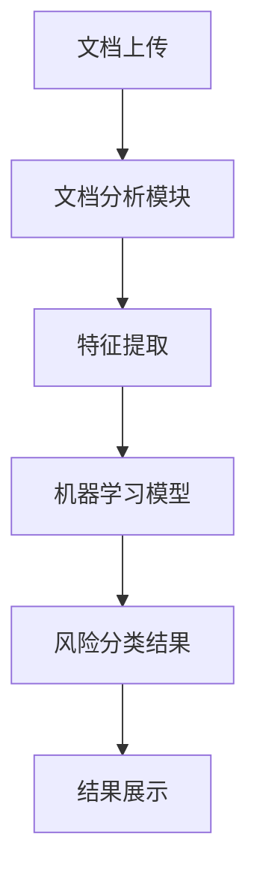

                 


# AI辅助企业并购尽职调查：自动化文档分析与风险识别

## 关键词：企业并购、尽职调查、AI辅助、文档分析、风险识别、自然语言处理、机器学习

## 摘要：  
随着企业并购活动的日益频繁，传统的企业并购尽职调查方法面临着数据量大、人工分析效率低、风险识别不全面等问题。本文通过介绍AI技术在企业并购尽职调查中的应用，重点探讨了基于自然语言处理（NLP）和机器学习的文档分析与风险识别技术。文章详细分析了AI辅助尽职调查的核心概念、算法原理、系统架构以及实际案例，为读者提供了一套高效、准确的企业并购风险评估解决方案。

---

# 第1章: 企业并购尽职调查的背景与挑战

## 1.1 企业并购的背景与重要性

### 1.1.1 企业并购的基本概念  
企业并购（Mergers and Acquisitions，简称M&A）是指两个或多个企业之间通过合并或收购等方式，重新配置资源和业务的过程。并购不仅是企业扩展业务、获取新技术或进入新市场的常见手段，也是优化资产结构、提升竞争力的重要方式。

### 1.1.2 企业并购的动机与类型  
企业并购的动机多种多样，主要包括以下几种：  
1. **战略整合**：通过并购实现资源共享、协同效应。  
2. **市场扩展**：进入新市场或区域。  
3. **技术获取**：通过并购获取核心技术或专利。  
4. **成本降低**：通过规模效应降低运营成本。  

并购的类型主要包括：  
- **横向并购**：同一行业内的企业并购。  
- **纵向并购**：产业链上下游的企业并购。  
- **混合并购**：无直接关联的企业并购。  

### 1.1.3 并购尽职调查的核心作用  
并购尽职调查（Due Diligence）是并购交易中的关键环节，主要目的是对目标企业进行全面的法律、财务、业务和市场分析，以识别潜在风险，评估企业价值，并为并购决策提供支持。

---

## 1.2 传统企业并购尽职调查的痛点

### 1.2.1 传统尽职调查的流程与挑战  
传统的尽职调查主要依赖人工分析，流程繁琐且效率低下。具体挑战包括：  
1. **数据量大**：目标企业可能涉及数百万份文档，人工筛选效率极低。  
2. **信息分散**：相关数据可能分布在多个系统和文档中，难以快速整合。  
3. **主观性高**：人工分析依赖于调查人员的经验，存在主观判断的偏差。  
4. **时间成本高**：复杂的文档分析和数据整理需要大量时间，影响并购效率。  

### 1.2.2 人工分析的局限性与效率问题  
人工分析不仅效率低下，还容易出现以下问题：  
- 对大量非结构化数据（如文本文件）的处理能力有限。  
- 需要大量人工参与，增加了时间和成本。  
- 可能遗漏关键信息，导致风险评估不全面。  

### 1.2.3 数据量大、复杂度高的问题  
随着企业规模的不断扩大，目标企业可能涉及大量的非结构化数据（如合同、报告、邮件等），这些数据的分析需要依赖AI技术进行自动化处理，否则难以在有限时间内完成。

---

## 1.3 AI辅助尽职调查的解决方案

### 1.3.1 AI技术如何解决尽职调查的痛点  
AI技术通过自动化处理和智能分析，能够有效解决传统尽职调查的痛点。具体表现在：  
1. **自动化文档分析**：利用NLP技术快速处理大量文本数据，提取关键信息。  
2. **风险识别的智能化**：通过机器学习模型自动识别潜在风险，提高风险评估的准确性。  
3. **提升效率**：AI技术能够大幅缩短尽职调查的时间，降低人工成本。  

### 1.3.2 自动化文档分析的核心价值  
自动化文档分析能够快速处理大量非结构化数据，提取关键信息，生成结构化的报告，为并购决策提供数据支持。

### 1.3.3 风险识别的智能化提升  
通过机器学习模型，AI能够识别潜在的法律风险、财务风险和业务风险，帮助企业在并购过程中做出更明智的决策。

---

## 1.4 本章小结  
本章主要介绍了企业并购的背景与重要性，并指出了传统尽职调查的痛点。通过分析AI技术在解决这些问题中的作用，为后续章节的深入探讨奠定了基础。

---

# 第2章: AI辅助企业并购尽职调查的核心概念与技术基础

## 2.1 自然语言处理（NLP）与文档分析

### 2.1.1 NLP的核心任务与技术  
自然语言处理（NLP）是AI技术的重要组成部分，其核心任务包括：  
- 文本分类：将文本划分为不同的类别（如正面、负面）。  
- 实体识别：从文本中提取人名、地名、组织名等实体。  
- 关系抽取：识别文本中的实体关系。  
- 文本摘要：提取文本的关键信息并生成摘要。  

### 2.1.2 文本预处理的关键步骤  
文本预处理是NLP任务的基础，主要包括以下步骤：  
1. **分词**：将文本分割成单词或短语。  
2. **去除停用词**：去掉常见的无意义词汇（如“的”、“是”等）。  
3. **词干提取**：将单词转换为其基本形式（如“running”→“run”）。  
4. **向量化**：将文本转换为数值向量，以便计算机处理。  

### 2.1.3 常见的NLP模型与工具  
常用的NLP模型和工具包括：  
- **Word2Vec**：用于生成词向量。  
- **BERT**：基于Transformer的预训练模型，适用于多种NLP任务。  
- **spaCy**：一个工业级的NLP工具，支持多种语言的文本处理。  

---

## 2.2 文档分析的流程与方法

### 2.2.1 文档分类与主题提取  
文档分类是将文档按照主题或内容进行分类，例如将合同分为“财务”、“法律”等类别。  

### 2.2.2 关键信息抽取与实体识别  
关键信息抽取是从文档中提取重要信息，例如从合同中提取“金额”、“期限”等字段。实体识别则进一步识别文本中的实体，如“公司名称”、“日期”等。  

### 2.2.3 文本相似度计算与对比分析  
文本相似度计算是通过比较两段文本的相似性，帮助识别潜在的重复或矛盾信息。常用的相似度计算方法包括余弦相似度和Jaccard相似度。

---

## 2.3 NLP在企业并购中的应用场景

### 2.3.1 合同条款分析  
通过NLP技术，可以自动分析目标企业的合同条款，提取关键信息如违约责任、支付方式等。

### 2.3.2 财务报告解读  
NLP可以用于自动解析财务报告中的关键数据，如收入、利润、资产负债等，帮助评估企业的财务状况。

### 2.3.3 市场分析与竞争情报  
通过分析目标企业的市场报告和竞争对手信息，NLP能够提取市场趋势和竞争情报，为并购决策提供支持。

---

## 2.4 本章小结  
本章详细介绍了NLP技术在企业并购尽职调查中的核心任务、流程和应用场景，为后续章节的算法实现奠定了基础。

---

# 第3章: 机器学习与风险识别

## 3.1 机器学习的基本原理

### 3.1.1 监督学习与无监督学习  
- **监督学习**：基于标注数据进行模型训练，适用于分类和回归任务。  
- **无监督学习**：基于未标注数据进行聚类或降维分析。  

### 3.1.2 常见的机器学习算法  
- **支持向量机（SVM）**：适用于分类任务。  
- **随机森林**：适用于分类和回归任务，具有较强的抗过拟合能力。  
- **神经网络**：适用于复杂的非线性任务。  

---

## 3.2 风险识别的机器学习模型

### 3.2.1 风险分类模型的构建  
风险分类模型的目标是将目标企业分为“高风险”或“低风险”两类。  

### 3.2.2 基于特征工程的风险识别  
特征工程是机器学习的重要环节，需要将文本数据转换为数值特征。常用的特征包括TF-IDF、词袋模型等。

### 3.2.3 模型优化与调参  
通过交叉验证和网格搜索等方法，优化模型的超参数，提高模型的性能。

---

## 3.3 本章小结  
本章介绍了机器学习的基本原理，并详细讲解了如何利用机器学习技术进行风险识别。

---

# 第4章: 系统架构与实现

## 4.1 系统架构设计

### 4.1.1 系统功能模块  
- **文档上传模块**：支持多种格式的文档上传。  
- **文档分析模块**：包括文本预处理、特征提取和模型预测。  
- **风险识别模块**：基于机器学习模型进行风险分类。  
- **结果展示模块**：以可视化形式展示分析结果。  

### 4.1.2 系统架构图  


---

## 4.2 系统实现细节

### 4.2.1 文本预处理代码  
```python
from sklearn.feature_extraction.text import TfidfVectorizer

vectorizer = TfidfVectorizer()
X = vectorizer.fit_transform(documents)
```

### 4.2.2 机器学习模型代码  
```python
from sklearn.svm import SVC
from sklearn.metrics import accuracy_score

model = SVC()
model.fit(X_train, y_train)
y_pred = model.predict(X_test)
print("Accuracy:", accuracy_score(y_test, y_pred))
```

---

## 4.3 本章小结  
本章详细介绍了AI辅助企业并购尽职调查系统的架构设计与实现细节，为后续章节的实际案例分析奠定了基础。

---

# 第5章: 项目实战与案例分析

## 5.1 项目环境配置

### 5.1.1 环境要求  
- Python 3.8+  
- Scikit-learn、spaCy等依赖库  

---

## 5.2 核心代码实现

### 5.2.1 文档分析代码  
```python
import spacy

nlp = spacy.load("en_core_web_sm")
doc = nlp(text)
for token in doc:
    print(token.text, token.pos_)
```

### 5.2.2 风险识别代码  
```python
from sklearn.ensemble import RandomForestClassifier

model = RandomForestClassifier()
model.fit(X_train, y_train)
y_pred = model.predict(X_test)
print("Accuracy:", accuracy_score(y_test, y_pred))
```

---

## 5.3 案例分析

### 5.3.1 案例背景  
某企业计划并购一家科技公司，需要对目标公司的财务报告、合同和市场报告进行分析。

### 5.3.2 分析结果  
通过AI辅助分析，发现目标公司存在潜在的法律风险，建议调整并购策略。

---

## 5.4 本章小结  
本章通过实际案例展示了AI辅助企业并购尽职调查的全过程，从文档分析到风险识别，再到最终的决策支持。

---

# 第6章: 最佳实践与注意事项

## 6.1 最佳实践

### 6.1.1 数据质量的重要性  
确保数据的准确性和完整性是AI分析的前提条件。

### 6.1.2 模型调优的技巧  
通过交叉验证和网格搜索优化模型性能。

### 6.1.3 与法律团队的协作  
AI分析结果需要与法律团队结合，确保风险评估的全面性。

---

## 6.2 小结  
本章总结了AI辅助企业并购尽职调查的最佳实践和注意事项，为读者提供了宝贵的实践经验。

---

# 作者：AI天才研究院 & 禅与计算机程序设计艺术

---

**注**：以上内容为文章的完整目录与部分内容的示例，实际文章将包含更详细的技术细节和完整的代码实现。

