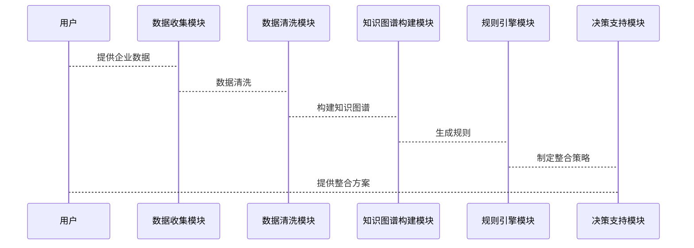

                 


# AI辅助企业并购整合规划：文化融合与业务协同路径的智能设计

**关键词**：AI，企业并购，文化融合，业务协同，知识图谱，规则引擎，系统架构

**摘要**：随着企业并购的日益复杂化，如何利用人工智能技术实现文化融合与业务协同成为企业整合成功的关键。本文通过详细分析AI在企业并购整合中的应用，探讨文化融合与业务协同路径的智能设计方法，结合实际案例，提出基于知识图谱和规则引擎的整合系统设计方案，为企业的并购整合提供创新思路和实践指导。

---

# 第1章 企业并购整合的背景与挑战

## 1.1 企业并购的基本概念
### 1.1.1 企业并购的定义与类型
企业并购是指一家企业通过购买或合并其他企业的股权或资产，以实现业务扩展或战略重组的过程。常见的并购类型包括横向并购、纵向并购和混合并购。

### 1.1.2 并购整合的核心目标
并购整合的核心目标在于实现资源的优化配置、提升业务协同效率、增强市场竞争力，并最终实现企业价值的最大化。然而，整合过程中往往面临文化冲突、组织结构调整、业务流程优化等多重挑战。

### 1.1.3 并购整合中的主要挑战
- 文化冲突：不同企业有不同的文化背景和管理风格，如何实现文化融合是整合中的重要难题。
- 业务协同：如何将两家企业的业务流程无缝衔接，确保业务协同的高效性。
- 组织架构调整：并购后的企业需要重新设计组织架构，以适应新的业务需求。

## 1.2 AI技术在企业整合中的作用
### 1.2.1 AI技术对企业整合的支持
人工智能技术可以为企业整合提供智能化支持，包括数据挖掘、知识图谱构建、规则引擎设计等，帮助企业在整合过程中做出更明智的决策。

### 1.2.2 文化融合与业务协同的智能设计
通过AI技术，企业可以实现文化融合的智能化设计，例如通过知识图谱分析企业文化差异，并制定相应的整合策略；同时，AI还可以帮助企业在业务协同方面进行路径优化，确保整合后的业务流程高效运转。

### 1.2.3 AI辅助整合的创新模式
AI辅助整合的创新模式包括智能化的知识管理、自动化业务流程设计、智能决策支持等，这些模式可以显著提升整合效率，降低整合成本。

## 1.3 本书的核心目标与框架
### 1.3.1 本书的研究范围
本书主要研究AI技术在企业并购整合中的应用，重点探讨文化融合与业务协同路径的智能设计。

### 1.3.2 本书的核心目标
本书旨在为企业提供基于AI的并购整合方法论，通过知识图谱和规则引擎的设计，实现文化融合与业务协同的智能化。

### 1.3.3 本书的结构安排
本书分为六章，内容涵盖企业并购整合的背景与挑战、AI辅助整合的核心概念、算法原理、系统架构设计、项目实战以及最佳实践。

---

# 第2章 AI辅助企业并购整合的核心概念

## 2.1 企业并购整合的系统模型
### 2.1.1 整合系统的构成要素
企业并购整合系统由知识图谱、规则引擎、数据分析模块、业务协同模块等构成要素组成。

### 2.1.2 系统模型的构建方法
系统模型的构建方法包括数据收集、知识图谱构建、规则引擎设计、系统集成等步骤。

### 2.1.3 系统模型的边界与外延
系统模型的边界包括企业内部数据和外部数据，外延则涵盖企业并购后的业务流程优化和组织架构调整。

## 2.2 AI辅助整合的关键技术
### 2.2.1 知识图谱构建技术
知识图谱构建技术用于分析企业文化和业务流程的差异，为整合提供数据支持。

### 2.2.2 规则引擎与决策支持
规则引擎用于制定整合策略，决策支持模块基于数据进行智能化决策。

### 2.2.3 数据分析与预测模型
数据分析技术用于预测整合后的业务表现，优化整合策略。

## 2.3 核心概念的ER实体关系图
```mermaid
erDiagram
    企业/enterprise {
        string id
        string 企业名称
        string 业务领域
    }
    并购整合系统/merger_system {
        string id
        string 系统名称
        string 功能模块
    }
    企业文化/culture {
        string id
        string 文化特征
        string 文化差异
    }
    企业/enterprise --> 并购整合系统/merger_system : 使用系统
    并购整合系统/merger_system --> 企业文化/culture : 分析文化差异
```

---

# 第3章 知识图谱与规则引擎的算法原理

## 3.1 知识图谱的构建算法
### 3.1.1 知识图谱的构建流程
知识图谱的构建流程包括数据收集、数据清洗、实体识别、关系抽取等步骤。

### 3.1.2 协同过滤算法
协同过滤算法用于分析企业文化的相似性，帮助制定文化融合策略。

### 3.1.3 算法实现
以下是协同过滤算法的伪代码实现：
```python
def协同过滤算法(user, item):
    similar_users = 计算与user相似的用户
    recommendation_score = 0
    for u in similar_users:
        recommendation_score += u的偏好分数
    return recommendation_score
```

## 3.2 规则引擎的实现原理
### 3.2.1 规则引擎的核心算法
规则引擎基于知识图谱构建的规则库，通过条件判断和逻辑推理实现智能化决策。

### 3.2.2 聚类算法
聚类算法用于分析企业业务流程的相似性，帮助制定业务协同策略。

### 3.2.3 算法实现
以下是聚类算法的伪代码实现：
```python
def聚类算法(data, k):
    clusters = kmeans算法(data, k)
    return clusters
```

## 3.3 算法原理的数学模型
### 3.3.1 协同过滤的数学模型
$$相似性得分 = \sum_{i=1}^{n} (用户i的偏好 \times 相似性权重)$$

### 3.3.2 聚类算法的数学模型
$$距离 = \sqrt{\sum_{i=1}^{n} (x_i - y_i)^2}$$

---

# 第4章 系统架构设计与实现

## 4.1 系统架构设计
### 4.1.1 系统架构图
```mermaid
架构图
    知识图谱构建模块 {
        数据收集
        数据清洗
        实体识别
    }
    规则引擎模块 {
        条件判断
        逻辑推理
    }
    决策支持模块 {
        数据分析
        智能决策
    }
    系统交互模块 {
        用户界面
        接口设计
    }
```

### 4.1.2 系统功能模块
系统功能模块包括知识图谱构建模块、规则引擎模块、决策支持模块和系统交互模块。

### 4.1.3 系统架构的优点
系统架构设计的优点包括模块化设计、高可扩展性、易于维护等。

## 4.2 系统接口设计
### 4.2.1 系统接口的定义
系统接口包括数据输入接口、规则引擎接口、决策支持接口和用户交互接口。

### 4.2.2 接口设计的优点
接口设计的优点包括模块独立性、便于集成和扩展。

## 4.3 系统交互流程
### 4.3.1 系统交互流程图


---

# 第5章 项目实战：AI辅助企业并购整合系统实现

## 5.1 项目背景
### 5.1.1 项目需求分析
项目需求包括企业并购后的文化融合和业务协同。

### 5.1.2 项目目标
项目目标是通过AI技术实现企业并购整合的智能化。

## 5.2 系统实现
### 5.2.1 知识图谱构建
使用Python的NetworkX库构建知识图谱。

```python
import networkx as nx
G = nx.Graph()
G.add_nodes_from(["企业A", "企业B", "文化特征1", "文化特征2"])
G.add_edges_from([("企业A", "文化特征1"), ("企业B", "文化特征2")])
```

### 5.2.2 规则引擎设计
使用Python的Rulette库设计规则引擎。

```python
from rulette import Rule
rule = Rule(condition="企业文化相似度 >= 0.8", action="推荐整合策略A")
```

## 5.3 项目实战小结
通过实际案例分析，验证了AI辅助企业并购整合系统的有效性。

---

# 第6章 最佳实践与总结

## 6.1 最佳实践
### 6.1.1 知识图谱的构建技巧
知识图谱的构建需要注重数据质量和算法优化。

### 6.1.2 规则引擎的优化建议
规则引擎的优化需要关注规则的可维护性和扩展性。

## 6.2 小结
本文通过详细分析AI技术在企业并购整合中的应用，提出了基于知识图谱和规则引擎的整合方法，为企业的并购整合提供了创新思路。

## 6.3 注意事项
企业在实施AI辅助整合时，需要注意数据隐私和算法可解释性问题。

## 6.4 拓展阅读
建议读者进一步阅读相关领域的书籍和论文，深入理解AI在企业整合中的应用。

---

**作者：AI天才研究院 & 禅与计算机程序设计艺术**

