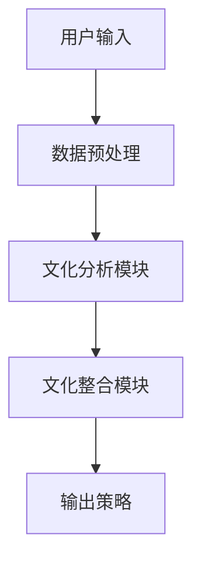

                 


# AI辅助企业并购文化整合：减少冲突

## 关键词：AI技术，企业并购，文化整合，文化冲突，算法优化

## 摘要：  
企业并购中的文化整合是一个复杂而关键的过程，常常面临文化冲突、员工抗拒等问题，严重影响并购后的业务整合与协同。本文通过介绍AI技术在企业并购文化整合中的应用，分析文化整合的关键因素，探讨AI辅助文化整合的算法原理和系统架构设计。通过实际案例分析，展示如何利用AI技术减少文化冲突，提升企业并购的成功率。

---

# 第一部分: AI辅助企业并购文化整合概述

## 第1章: 企业并购与文化整合的背景

### 1.1 企业并购的基本概念

#### 1.1.1 企业并购的定义与类型
企业并购（Mergers and Acquisitions, M&A）是指一家企业通过购买或其他方式获得另一家企业的一部分或全部资产、股权或控制权。常见的并购类型包括：  
- **横向并购**：同一行业内的企业并购，旨在扩大市场份额。  
- **纵向并购**：产业链上下游企业的并购，以增强供应链控制能力。  
- **混合并购**：跨行业或跨领域的并购，寻求多元化发展。  

#### 1.1.2 企业并购的动机与目标
企业并购的主要动机包括：  
- 获取新技术或专利。  
- 扩大市场占有率。  
- 优化成本结构。  
- 战略性布局新市场。  

并购的目标通常包括：  
- 实现业务协同效应。  
- 提高整体盈利能力。  
- 强化企业核心竞争力。  

#### 1.1.3 并购中的文化整合问题
并购后的企业文化整合是确保并购成功的关键因素。如果文化整合不力，可能导致员工抗拒、管理混乱、业务协同困难等问题，最终影响并购的预期收益。

---

### 1.2 企业并购中的文化冲突

#### 1.2.1 文化冲突的定义
文化冲突是指并购双方在企业价值观、管理风格、工作习惯、沟通方式等方面的差异导致的矛盾和不协调。

#### 1.2.2 文化冲突的主要表现
- **管理风格差异**：例如，一家企业强调层级化管理，另一家企业则采用扁平化管理。  
- **价值观差异**：例如，一家企业重视创新，另一家企业则更注重效率和成本控制。  
- **沟通方式差异**：例如，一家企业倾向于直接沟通，另一家企业则喜欢间接沟通。  

#### 1.2.3 文化冲突对并购的影响
- 影响员工士气，导致生产力下降。  
- 妨碍部门间的协作，影响业务整合。  
- 可能导致关键员工流失，增加企业成本。  

---

### 1.3 AI在企业并购中的应用潜力

#### 1.3.1 AI技术的基本概念
人工智能（Artificial Intelligence, AI）是指模拟人类智能的计算机系统，能够执行学习、推理、感知和决策等任务。

#### 1.3.2 AI在企业并购中的应用场景
- **文化匹配度分析**：通过自然语言处理（NLP）技术分析企业文化的相似性。  
- **文化冲突预测**：利用机器学习模型预测并购后可能的文化冲突。  
- **文化整合优化**：通过算法优化文化整合策略，提升并购效果。  

#### 1.3.3 AI辅助文化整合的优势
- 提高文化整合的效率和准确性。  
- 降低文化冲突的可能性。  
- 提供数据驱动的决策支持。  

---

## 第2章: 企业文化整合的关键因素

### 2.1 企业文化的核心要素

#### 2.1.1 企业愿景与使命
企业的愿景和使命是其文化的核心，反映了企业的长期目标和存在的意义。

#### 2.1.2 企业价值观
企业价值观是企业在经营活动中所遵循的基本原则，例如“客户至上”、“创新”、“团队合作”等。

#### 2.1.3 企业行为规范
行为规范是指企业在日常运营中所遵循的具体规则和标准，例如沟通方式、决策流程、绩效评估等。

---

### 2.2 企业文化整合的挑战

#### 2.2.1 文化差异的复杂性
不同行业、不同地区的文化差异可能导致并购后的文化整合难度增加。

#### 2.2.2 企业内部的抗拒心理
员工可能因为文化差异而产生抗拒心理，影响文化整合的效果。

#### 2.2.3 并购后的整合难度
文化整合需要长期的努力和资源投入，且效果难以量化。

---

### 2.3 AI辅助企业文化整合的可行性

#### 2.3.1 数据驱动的文化分析
通过收集和分析企业文化和行为数据，AI技术可以帮助识别文化差异和潜在冲突点。

#### 2.3.2 AI在文化匹配度评估中的作用
利用机器学习算法，AI可以量化企业文化的匹配度，为并购决策提供支持。

#### 2.3.3 AI在文化整合策略中的应用
AI可以生成文化整合的优化方案，帮助企业在并购后快速实现文化协同。

---

## 第3章: AI辅助文化整合的理论基础

### 3.1 文化整合的理论模型

#### 3.1.1 文化整合的定义
文化整合是指将并购双方的企业文化进行融合，形成新的企业文化的全过程。

#### 3.1.2 文化整合的主要理论
- **文化适应理论**：强调企业文化的适应和融合。  
- **文化融合理论**：强调企业文化的互补和协同。  

#### 3.1.3 文化整合的阶段模型
文化整合通常分为以下阶段：  
1. **识别与评估**：分析并购双方的文化差异。  
2. **制定整合策略**：根据文化差异制定整合方案。  
3. **实施与监控**：推动文化整合的实施，并进行效果评估。  

---

### 3.2 AI技术在文化整合中的应用原理

#### 3.2.1 自然语言处理在文化分析中的应用
NLP技术可以用于分析企业文档、员工反馈等文本数据，提取企业文化特征。

#### 3.2.2 机器学习在文化匹配度中的应用
通过训练机器学习模型，AI可以预测并购后的企业文化匹配度。

#### 3.2.3 数据挖掘在文化整合中的应用
数据挖掘技术可以帮助识别文化整合的关键影响因素。

---

### 3.3 AI辅助文化整合的核心算法

#### 3.3.1 文化匹配度计算算法
$$文化匹配度 = \frac{\text{相似性得分}}{\text{最大可能得分}}$$

#### 3.3.2 文化冲突预测算法
通过逻辑回归模型预测文化冲突的可能性。

#### 3.3.3 文化整合优化算法
利用遗传算法优化文化整合策略。

---

## 第4章: AI辅助文化整合的算法实现

### 4.1 算法原理

#### 4.1.1 文化匹配度计算的数学模型
$$\text{文化匹配度} = \sum_{i=1}^{n} w_i \cdot x_i$$  
其中，\(w_i\) 是第\(i\)个文化特征的权重，\(x_i\) 是第\(i\)个文化特征的匹配程度。

#### 4.1.2 文化冲突预测的逻辑框架
1. 收集并购双方的文化特征数据。  
2. 训练机器学习模型，预测文化冲突的可能性。  

#### 4.1.3 文化整合优化的算法流程
1. 分析并购双方的文化差异。  
2. 生成文化整合策略。  
3. 优化策略以降低文化冲突风险。  

---

### 4.2 算法实现

#### 4.2.1 算法实现的步骤
1. 数据预处理：清洗和标准化数据。  
2. 模型训练：使用机器学习算法训练文化匹配度模型。  
3. 模型评估：验证模型的准确性和稳定性。  

#### 4.2.2 算法实现的代码示例
```python
# 示例代码：文化匹配度计算
import numpy as np
from sklearn.metrics.pairwise import cosine_similarity

# 定义文化特征向量
culture1 = [0.8, 0.6, 0.7]
culture2 = [0.5, 0.7, 0.9]

# 计算文化匹配度
similarity = cosine_similarity([culture1, culture2])
print("文化匹配度：", similarity[0][1])
```

#### 4.2.3 算法实现的优化建议
- 使用更复杂的模型（如深度学习模型）提高预测精度。  
- 结合领域知识优化模型参数。  

---

## 第5章: 系统架构与设计

### 5.1 系统架构设计

#### 5.1.1 问题场景介绍
假设我们正在开发一个AI辅助企业并购文化整合的系统，旨在帮助企业识别文化差异，预测文化冲突，并制定文化整合策略。

#### 5.1.2 系统功能设计
- 数据输入模块：接收并购双方的企业文化数据。  
- 文化分析模块：利用NLP和机器学习技术分析文化特征。  
- 文化整合模块：生成文化整合策略。  

#### 5.1.3 系统架构图


#### 5.1.4 系统接口设计
- 输入接口：接收企业文化的文本数据和结构化数据。  
- 输出接口：输出文化匹配度、文化冲突预测结果和文化整合策略。  

---

## 第6章: 项目实战

### 6.1 环境安装

#### 6.1.1 安装Python环境
```bash
python --version
pip install numpy scikit-learn
```

#### 6.1.2 安装NLP工具
```bash
pip install spacy
python -m spacy download en_core_web_sm
```

---

### 6.2 系统核心实现源代码

#### 6.2.1 文化匹配度计算代码
```python
from sklearn.metrics.pairwise import cosine_similarity

def calculate_cultural_similarity(culture1, culture2):
    return cosine_similarity([culture1, culture2])[0][1]

# 示例
culture1 = [0.8, 0.6, 0.7]
culture2 = [0.5, 0.7, 0.9]
similarity = calculate_cultural_similarity(culture1, culture2)
print("文化匹配度：", similarity)
```

#### 6.2.2 文化冲突预测代码
```python
from sklearn.linear_model import LogisticRegression
from sklearn.model_selection import train_test_split

# 示例数据
X = [[0.8, 0.6, 0.7], [0.5, 0.7, 0.9]]
y = [0, 1]

# 划分训练集和测试集
X_train, X_test, y_train, y_test = train_test_split(X, y, test_size=0.2)

# 训练模型
model = LogisticRegression().fit(X_train, y_train)

# 预测结果
print("文化冲突预测结果：", model.predict(X_test))
print("准确率：", model.score(X_test, y_test))
```

---

## 第7章: 总结与展望

### 7.1 研究总结
本文通过分析企业并购中的文化整合问题，探讨了AI技术在文化整合中的应用潜力。通过算法实现和系统设计，展示了如何利用AI技术减少文化冲突，提升企业并购的成功率。

### 7.2 未来展望
未来，随着AI技术的不断发展，文化整合的算法将更加精确和高效。同时，结合区块链等新兴技术，可以进一步提升文化整合的透明度和可信度。

### 7.3 注意事项
企业在应用AI技术进行文化整合时，应充分考虑数据隐私和员工隐私保护问题。

### 7.4 参考文献
- 刘海燕. 《企业并购与文化整合》. 北京: 中国经济出版社, 2020.  
- 张伟. 《人工智能与企业并购》. 上海: 科技出版社, 2021.

---

# 作者：AI天才研究院/AI Genius Institute & 禅与计算机程序设计艺术 /Zen And The Art of Computer Programming

