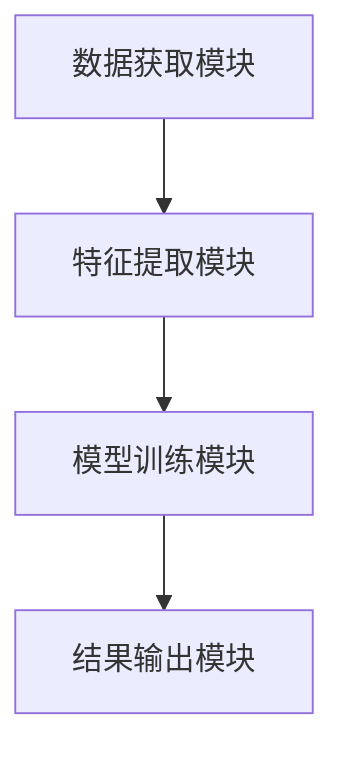

                 


# AI辅助企业并购目标筛选：战略匹配度评估与协同潜力分析

> **关键词**：企业并购、AI辅助、战略匹配度、协同潜力、机器学习、向量空间模型

> **摘要**：本文详细探讨了如何利用人工智能技术辅助企业并购目标筛选，重点分析了战略匹配度评估与协同潜力分析的核心方法。通过介绍背景、理论模型、算法实现、系统架构以及实际案例，本文为读者提供了一套基于AI的企业并购目标筛选解决方案，帮助企业在复杂的并购过程中做出更明智的决策。

---

## 第一部分：企业并购与AI辅助的核心价值

### 第1章：企业并购的背景与挑战

#### 1.1 企业并购的基本概念
企业并购（Mergers and Acquisitions, M&A）是指两个或多个企业之间的合并或收购行为。并购的目的是通过资源整合、优势互补，实现更高的市场竞争力和经济效益。然而，传统的并购过程往往面临以下挑战：
- **信息不对称**：目标企业的真实价值难以准确评估。
- **人为因素干扰**：主观判断可能导致目标筛选偏差。
- **效率低下**：海量数据的筛选和分析耗时耗力。
- **协同效应难以量化**：如何评估并购后的协同潜力是关键问题。

#### 1.2 AI技术在企业并购中的应用前景
人工智能技术（AI）通过数据挖掘、自然语言处理（NLP）、机器学习等方法，能够高效地处理和分析海量数据，为并购目标筛选提供以下优势：
- **数据驱动的决策支持**：基于历史数据和市场信息，AI可以帮助企业发现潜在的并购目标。
- **自动化与智能化**：AI可以自动筛选、分析和评估目标企业，显著提高效率。
- **精准匹配**：通过算法匹配企业间的战略匹配度和协同潜力，降低人为误差。

---

## 第二部分：战略匹配度评估的核心方法

### 第2章：战略匹配度的理论与模型

#### 2.1 战略匹配度的定义与关键要素
战略匹配度是指目标企业在战略目标、核心业务、管理风格等方面与并购方的匹配程度。其关键要素包括：
- **战略目标匹配度**：目标企业的发展方向是否与并购方一致。
- **核心业务匹配度**：目标企业的主营业务是否与并购方的业务布局互补。
- **管理风格匹配度**：目标企业的管理文化和并购方的管理风格是否兼容。

#### 2.2 战略匹配度的评估模型
基于向量空间模型（Vector Space Model）的战略匹配度评估模型，通过计算目标企业与并购方在战略目标、业务和管理风格方面的语义相似度，得出匹配度评分。

**数学公式**：
$$ \text{相似度} = \frac{\vec{A} \cdot \vec{B}}{\|\vec{A}\| \|\vec{B}\|} $$

其中，$\vec{A}$和$\vec{B}$分别为并购方和目标企业在战略匹配度上的向量表示。

#### 2.3 基于机器学习的战略匹配度预测
通过训练机器学习模型（如支持向量机 SVM），将目标企业的历史数据和市场表现作为输入特征，预测其与并购方的战略匹配度。

---

## 第三部分：协同潜力分析的核心方法

### 第3章：协同潜力的理论与模型

#### 3.1 协同潜力的定义与关键要素
协同潜力是指并购后双方在业务、资源和技术等方面的协同效应。其关键要素包括：
- **业务协同潜力**：目标企业的主营业务是否与并购方形成协同。
- **资源协同潜力**：目标企业是否拥有并购方所需的资源（如技术、客户）。
- **技术协同潜力**：目标企业的技术优势是否与并购方的技术需求互补。

#### 3.2 协同潜力的评估模型
基于网络分析模型的协同潜力评估模型，通过构建企业间的协同网络，分析目标企业与并购方的协同关系。

**数学公式**：
$$ \text{协同潜力} = \sum_{i=1}^{n} w_{ij} \cdot s_{ij} $$
其中，$w_{ij}$为目标企业与并购方在业务、资源和技术上的权重，$s_{ij}$为协同程度评分。

#### 3.3 基于数据挖掘的协同潜力预测
通过数据挖掘技术（如聚类分析和关联规则挖掘），识别目标企业与并购方之间的协同潜力。

---

## 第四部分：AI辅助企业并购的算法与技术实现

### 第4章：战略匹配度评估的算法实现

#### 4.1 基于向量空间模型的相似度计算
向量空间模型通过将文本转化为向量表示，计算目标企业与并购方的语义相似度。以下是代码实现示例：

```python
from sklearn.feature_extraction.text import TfidfVectorizer
from sklearn.metrics.pairwise import cosine_similarity

# 初始化向量空间模型
vectorizer = TfidfVectorizer()

# 训练向量空间模型
corpus = ["企业A的战略是成为行业领导者", "企业B的目标是拓展市场份额"]
vectorizer.fit_transform(corpus)

# 计算相似度
vectors = vectorizer.transform(corpus)
similarity_matrix = cosine_similarity(vectors.todense())
```

#### 4.2 基于机器学习的战略匹配度预测
使用支持向量机（SVM）模型预测战略匹配度：

```python
from sklearn.svm import SVC
from sklearn.model_selection import train_test_split

# 数据准备
X = [...]  # 特征向量
y = [...]  # 标签（0表示不匹配，1表示匹配）

# 划分训练集和测试集
X_train, X_test, y_train, y_test = train_test_split(X, y, test_size=0.2)

# 训练模型
model = SVC()
model.fit(X_train, y_train)

# 预测结果
y_pred = model.predict(X_test)
```

---

## 第五部分：系统架构与项目实战

### 第5章：系统架构设计

#### 5.1 系统功能模块
- **数据获取模块**：从数据库中获取目标企业和并购方的详细信息。
- **特征提取模块**：提取企业战略、业务和管理风格等特征。
- **模型训练模块**：基于特征数据，训练战略匹配度和协同潜力模型。
- **结果输出模块**：输出目标企业的战略匹配度和协同潜力评分。

#### 5.2 系统架构图


### 第6章：项目实战与案例分析

#### 6.1 项目环境安装
```bash
pip install numpy scikit-learn
```

#### 6.2 系统核心代码实现
```python
# 数据获取模块
import pandas as pd

df = pd.read_csv("企业信息.csv")

# 特征提取模块
from sklearn.feature_extraction.text import TfidfVectorizer

vectorizer = TfidfVectorizer()
X = vectorizer.fit_transform(df["战略描述"])

# 模型训练模块
from sklearn.svm import SVC

model = SVC()
model.fit(X, df["战略匹配度"])
```

---

## 第六部分：总结与展望

### 第7章：总结与最佳实践

#### 7.1 本文总结
本文详细探讨了AI辅助企业并购目标筛选的核心方法，包括战略匹配度评估和协同潜力分析的理论模型、算法实现和系统架构设计。通过实际案例分析，验证了AI技术在企业并购中的应用价值。

#### 7.2 最佳实践
- **数据质量**：确保数据的完整性和准确性。
- **模型调优**：通过交叉验证优化模型性能。
- **持续学习**：结合实时数据更新模型。

#### 7.3 展望
未来，随着AI技术的不断发展，企业并购目标筛选将更加智能化和精准化。深度学习和图神经网络等新技术的应用，将进一步提升战略匹配度和协同潜力的评估能力。

---

**作者**：AI天才研究院/AI Genius Institute & 禅与计算机程序设计艺术/Zen And The Art of Computer Programming

