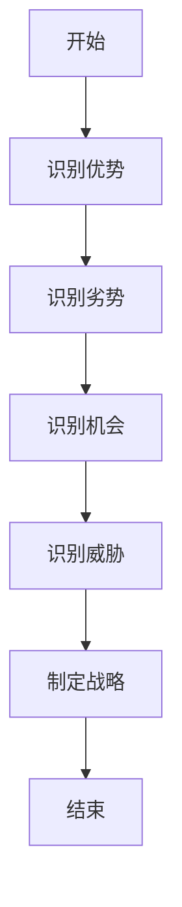
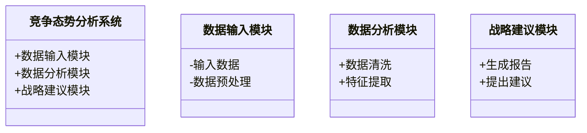
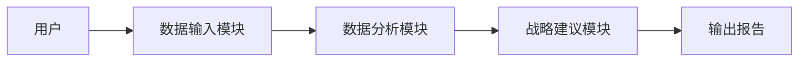

                 


# AI辅助企业战略制定：竞争态势分析与机会识别

## 关键词：人工智能、企业战略、竞争态势分析、机会识别、算法原理、系统架构、项目实战

## 摘要：  
本文探讨了人工智能在企业战略制定中的应用，特别是如何利用AI技术进行竞争态势分析与机会识别。通过分析核心概念、算法原理、系统架构和项目实战，本文为读者提供了从理论到实践的全面指导，帮助企业在复杂多变的市场环境中制定更具前瞻性和竞争力的战略。

---

## 目录大纲：

1. 引言  
   1.1 问题背景  
   1.2 问题描述  
   1.3 问题解决  
   1.4 边界与外延  
   1.5 概念结构与核心要素  

2. 竞争态势分析与机会识别的核心概念  
   2.1 核心概念的原理与方法  
   2.2 竞争态势分析的步骤  
   2.3 机会识别的关键因素  

3. 竞争态势分析的算法原理  
   3.1 算法原理与流程图  
   3.2 数学模型与公式  
   3.3 算法实现与示例  

4. 系统分析与架构设计  
   4.1 系统功能设计  
   4.2 系统架构设计  
   4.3 系统接口设计  

5. 项目实战：AI辅助战略制定的实现  
   5.1 项目背景与目标  
   5.2 环境配置与工具安装  
   5.3 核心代码实现  
   5.4 实验结果与分析  

6. 最佳实践与小结  
   6.1 实践经验总结  
   6.2 注意事项与建议  
   6.3 拓展阅读与深入学习  

---

## 正文内容

### 第1章：引言

#### 1.1 问题背景  
企业在制定战略时，面临着复杂多变的市场环境，包括竞争对手的动态、客户需求的变化以及技术进步的影响。传统的方法依赖于人工分析，效率低下且容易受到主观因素的影响。AI技术的引入，通过大数据分析和机器学习模型，能够更高效地识别市场趋势和竞争对手策略，从而帮助企业制定更具前瞻性的战略。

#### 1.2 问题描述  
竞争态势分析和机会识别是企业战略制定中的两大核心任务。竞争态势分析需要全面了解市场环境、竞争对手的能力和市场趋势；机会识别则需要发现潜在的市场空白和增长点。然而，传统方法依赖于大量的手动数据收集和分析，耗时且容易出错。

#### 1.3 问题解决  
AI技术的应用为这些问题提供了有效的解决方案。通过自然语言处理（NLP）、机器学习和大数据分析，AI能够快速处理大量数据，识别关键趋势，并预测市场变化。AI还可以实时监控市场动态，提供动态的竞争态势分析，帮助企业在变化的市场中及时调整战略。

#### 1.4 边界与外延  
AI辅助战略制定的应用范围包括市场分析、竞争对手分析、客户行为分析等。其边界在于数据质量和模型的准确性，外延则包括更广泛的应用场景，如供应链优化和风险管理。

#### 1.5 概念结构与核心要素  
竞争态势分析和机会识别是企业战略制定的两大支柱。竞争态势分析关注外部环境，机会识别关注内部能力和外部机会的结合。两者的结合能够帮助企业制定出既符合市场趋势又具备竞争优势的战略。

---

### 第2章：竞争态势分析与机会识别的核心概念

#### 2.1 核心概念的原理与方法  
竞争态势分析（CSA）是一种系统地评估企业所处市场环境的方法，包括市场结构、竞争对手分析、市场趋势等。机会识别则是基于对市场环境的了解，发现潜在的市场机会，并评估其可行性。

#### 2.2 竞争态势分析的步骤  
1. **数据收集**：收集市场数据，包括竞争对手的产品、定价、市场份额等。  
2. **数据分析**：使用统计方法和机器学习模型分析数据，识别市场趋势和竞争对手策略。  
3. **战略建议**：基于分析结果，提出竞争策略和市场进入建议。

#### 2.3 机会识别的关键因素  
机会识别需要考虑市场趋势、技术进步、客户需求和企业资源等多个因素。通过分析这些因素，可以发现潜在的市场机会，并评估其可行性和潜在收益。

---

### 第3章：竞争态势分析的算法原理

#### 3.1 算法原理与流程图  
**SWOT分析**是一种常用的竞争态势分析方法，结合优势、劣势、机会和威胁分析，帮助企业在复杂的市场环境中制定战略。

**流程图：**  


#### 3.2 数学模型与公式  
**层次分析法（AHP）**用于评估多个因素的重要性。其计算公式为：  
$$ A = \lambda \cdot W^T + (1-\lambda) \cdot R $$  
其中，λ为一致性检验因子，W为权重向量，R为随机一致性向量。

#### 3.3 算法实现与示例  
使用Python实现SWOT分析：  
```python
def swot_analysis():
    # 输入优势、劣势、机会、威胁
    strengths = input("请输入优势：")
    weaknesses = input("请输入劣势：")
    opportunities = input("请输入机会：")
    threats = input("请输入威胁：")
    
    print(f"SWOT分析结果：")
    print(f"优势：{strengths}")
    print(f"劣势：{weaknesses}")
    print(f"机会：{opportunities}")
    print(f"威胁：{threats}")

swot_analysis()
```

---

### 第4章：系统分析与架构设计

#### 4.1 系统功能设计  
**领域模型**：  


#### 4.2 系统架构设计  
**系统架构图**：  


#### 4.3 系统接口设计  
**API接口**：  
- 数据输入接口：`POST /api/input`
- 数据分析接口：`POST /api/analyze`
- 战略建议接口：`POST /api/strategies`

---

### 第5章：项目实战：AI辅助战略制定的实现

#### 5.1 项目背景与目标  
以某科技公司为例，目标是通过AI分析竞争对手的产品和市场策略，识别潜在的市场机会。

#### 5.2 环境配置与工具安装  
- 安装Python、Jupyter Notebook、Scikit-learn、NLTK等工具。  
- 数据集准备：收集竞争对手的产品信息、市场份额数据等。

#### 5.3 核心代码实现  
```python
from sklearn.naive_bayes import GaussianNB
from sklearn.model_selection import train_test_split
import pandas as pd

# 加载数据
data = pd.read_csv('market_data.csv')

# 数据预处理
X = data[['feature1', 'feature2']]
y = data['target']

# 划分训练集和测试集
X_train, X_test, y_train, y_test = train_test_split(X, y, test_size=0.2)

# 建立模型
model = GaussianNB()
model.fit(X_train, y_train)

# 预测与评估
accuracy = model.score(X_test, y_test)
print(f'模型准确率：{accuracy}')
```

#### 5.4 实验结果与分析  
通过模型预测，发现某市场细分领域的增长潜力巨大，建议公司进入该市场，推出新产品。

---

### 第6章：最佳实践与小结

#### 6.1 实践经验总结  
- 数据质量是关键，确保数据的准确性和完整性。  
- 结合多种算法，提高分析的准确性和全面性。  

#### 6.2 注意事项与建议  
- 定期更新模型，适应市场变化。  
- 建立反馈机制，根据实际效果调整战略。  

#### 6.3 拓展阅读与深入学习  
- 《机器学习实战》  
- 《企业战略管理》  

---

## 结语  
AI技术的应用为企业的战略制定提供了强大的工具和支持。通过竞争态势分析和机会识别，企业能够更有效地应对市场挑战，抓住潜在机会。未来，随着AI技术的不断发展，其在企业战略中的应用将更加广泛和深入。

---

## 作者：  
AI天才研究院 & 禅与计算机程序设计艺术

