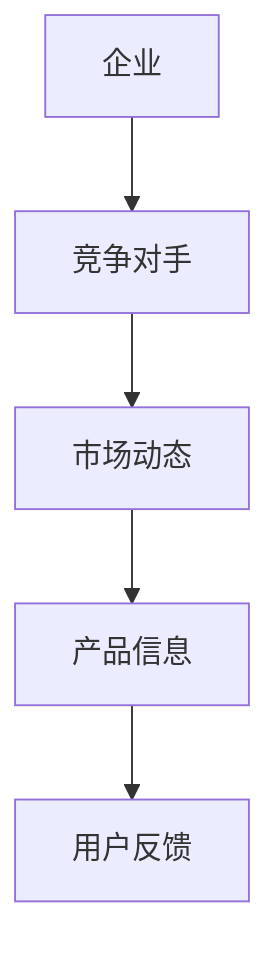

                 

# AI辅助企业竞争情报分析：自动化数据采集与洞察生成

**关键词**：AI，竞争情报分析，数据采集，自动化，洞察生成

**摘要**：随着市场竞争的加剧，企业需要快速获取和分析竞争情报以保持优势。本文探讨如何利用AI技术实现竞争情报分析的自动化数据采集与洞察生成，通过详细的技术分析和项目实战，展示如何构建高效的竞争情报分析系统。

---

## 第一部分: 竞争情报分析的背景与意义

### 第1章: 竞争情报分析的背景与意义

#### 1.1 问题背景

- **1.1.1 企业竞争情报的重要性**
  - 在现代商业环境中，竞争情报是企业在市场中生存和发展的关键。
  - 竞争情报包括市场趋势、竞争对手策略、产品信息、用户反馈等，帮助企业制定有效的市场策略。

- **1.1.2 传统竞争情报分析的局限性**
  - 传统方法依赖人工数据采集，耗时且容易出错。
  - 数据量大、来源多样，人工分析效率低下。
  - 竞争情报的实时性和准确性对企业决策至关重要，传统方法难以满足。

- **1.1.3 AI技术在竞争情报中的应用潜力**
  - AI技术能够自动化采集和处理大量数据，提高效率和准确性。
  - 利用机器学习和自然语言处理技术，AI可以从非结构化数据中提取有价值的信息。
  - AI可以帮助企业实时监控市场动态，快速生成竞争情报。

#### 1.2 问题描述

- **1.2.1 竞争情报分析的核心目标**
  - 获取竞争对手的产品信息、市场策略、用户反馈等数据。
  - 分析市场趋势，识别机会和威胁，支持企业决策。

- **1.2.2 数据采集与处理的主要挑战**
  - 数据来源多样，包括社交媒体、新闻网站、行业报告等，数据格式和结构复杂。
  - 数据量大，人工采集和处理效率低下。
  - 数据清洗和预处理过程复杂，需要专业技能。

- **1.2.3 洞察生成的关键问题**
  - 如何从大量数据中提取有价值的信息。
  - 如何快速生成洞察，支持实时决策。

#### 1.3 问题解决

- **1.3.1 AI辅助的解决方案概述**
  - 利用AI技术实现自动化数据采集和处理。
  - 通过机器学习和自然语言处理生成竞争情报的洞察。

- **1.3.2 自动化数据采集的优势**
  - 提高数据采集效率，降低成本。
  - 能够处理大量数据，发现隐藏的模式和趋势。

- **1.3.3 智能化洞察生成的实现路径**
  - 利用机器学习模型分析数据，生成预测和建议。
  - 通过自然语言处理技术，从文本中提取关键信息。

#### 1.4 边界与外延

- **1.4.1 竞争情报分析的边界**
  - 竞争情报分析不包括企业的内部数据，如财务数据和战略规划。
  - 数据采集和分析的范围通常限于公开可用的信息。

- **1.4.2 AI技术的适用范围**
  - 适用于结构化和非结构化数据的处理和分析。
  - 适用于需要实时监控和快速响应的场景。

- **1.4.3 技术与业务的结合点**
  - 技术方面：数据采集、处理、分析和可视化。
  - 业务方面：市场策略制定、竞争对手分析、用户行为研究。

#### 1.5 核心概念结构

- **1.5.1 核心要素组成**
  - 数据源：社交媒体、行业报告、新闻网站等。
  - 数据采集：爬虫技术、API调用等。
  - 数据处理：清洗、转换、整合。
  - 数据分析：文本挖掘、机器学习模型。
  - 洞察生成：关键词提取、情感分析、主题建模。

- **1.5.2 概念之间的关系**
  - 数据源是数据采集的基础，数据采集是数据处理的前提。
  - 数据处理是数据分析的前提，数据分析是洞察生成的基础。

- **1.5.3 系统的整体架构**
  - 系统包括数据采集模块、数据处理模块、数据分析模块和洞察生成模块。
  - 每个模块之间通过数据流进行交互，最终生成竞争情报报告。

## 第二部分: AI辅助竞争情报分析的核心概念

### 第2章: AI辅助竞争情报分析的核心概念

#### 2.1 竞争情报分析的基本概念

- **2.1.1 竞争情报的定义**
  - 竞争情报是指用于了解竞争对手、市场趋势和用户需求的信息。
  - 竞争情报分析是通过收集和分析这些信息，为企业制定市场策略提供支持。

- **2.1.2 竞争情报的分类**
  - 竞争对手信息：包括竞争对手的产品、市场策略、定价等。
  - 市场趋势：包括行业动态、技术发展、用户需求变化等。
  - 用户反馈：包括用户评价、投诉、偏好等。

- **2.1.3 竞争情报的采集方法**
  - 传统方法：人工收集和分析。
  - 现代方法：利用爬虫、API等技术自动化采集。

#### 2.2 AI技术在竞争情报中的应用

- **2.2.1 机器学习在数据处理中的作用**
  - 机器学习可以用于数据清洗、特征提取和数据增强。
  - 例如，使用聚类算法对数据进行分组，使用分类算法对数据进行分类。

- **2.2.2 自然语言处理在文本分析中的应用**
  - 自然语言处理技术可以用于文本挖掘、关键词提取和情感分析。
  - 例如，使用TF-IDF提取关键词，使用Word2Vec进行语义分析。

- **2.2.3 深度学习在模式识别中的优势**
  - 深度学习可以用于图像识别、语音识别和文本生成。
  - 例如，使用卷积神经网络（CNN）进行图像识别，使用循环神经网络（RNN）进行文本生成。

#### 2.3 核心概念的属性对比

- **2.3.1 竞争情报与市场分析的对比**
  | 属性          | 竞争情报         | 市场分析         |
  |---------------|------------------|------------------|
  | 数据来源      | 竞争对手、用户   | 行业趋势、市场数据 |
  | 分析目标      | 竞争对手策略     | 市场规模、趋势   |
  | 分析方法      | 文本挖掘、情感分析| 数据分析、统计分析 |

- **2.3.2 AI技术与传统数据分析的区别**
  | 属性          | AI技术           | 传统数据分析     |
  |---------------|------------------|------------------|
  | 数据处理      | 自动化、智能化     | 手动、规则化     |
  | 模型复杂度     | 高               | 低               |
  | 应用场景       | 复杂问题、实时分析| 简单问题、批量分析 |

- **2.3.3 自动化与半自动化数据采集的优劣**
  - 自动化数据采集：速度快、效率高，但可能面临数据质量的问题。
  - 半自动化数据采集：结合人工和自动化，数据质量较高，但效率较低。

#### 2.4 ER实体关系图

---

### 总结

本文详细介绍了AI辅助企业竞争情报分析的背景、核心概念和应用。通过分析数据采集和洞察生成的自动化过程，展示了AI技术如何帮助企业快速获取和分析竞争情报，从而制定有效的市场策略。后续章节将深入探讨算法原理、系统架构设计和项目实战，帮助读者全面掌握AI辅助竞争情报分析的技术和方法。

