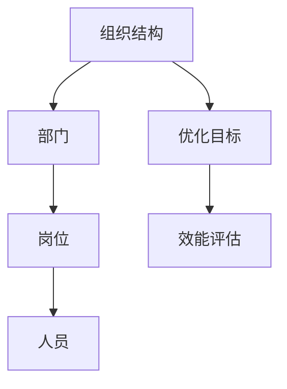
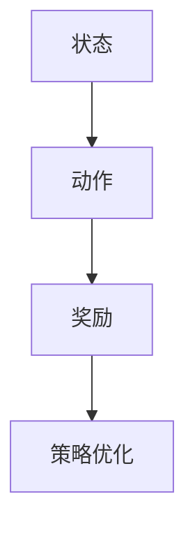
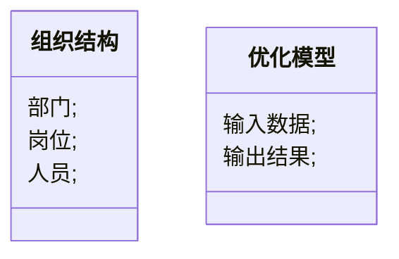
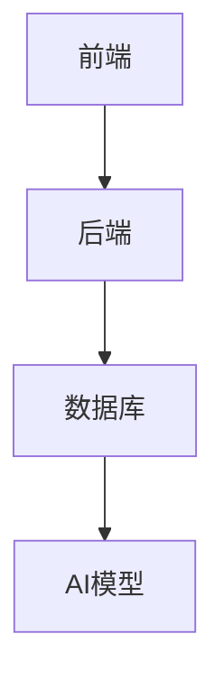

                 


# AI辅助企业组织结构优化：效能评估与动态调整模型

## 关键词：AI、企业组织结构优化、效能评估、动态调整模型、机器学习、组织优化模型

## 摘要：本文探讨了如何利用AI技术优化企业组织结构，分析了效能评估与动态调整模型的核心原理，通过系统架构设计和项目实战展示了模型的应用，为企业的组织优化提供了新的思路。

---

# 第一部分: AI辅助企业组织结构优化背景介绍

## 第1章: AI辅助企业组织结构优化概述

### 1.1 问题背景与描述

#### 1.1.1 传统企业组织结构的局限性
传统的企业组织结构往往呈现树状结构，存在信息孤岛、协作效率低、资源浪费等问题。特别是在快速变化的市场环境中，僵化的组织结构难以快速响应，限制了企业的竞争力。

#### 1.1.2 数字化转型对企业组织结构的新要求
数字化转型要求企业更加灵活、高效。传统组织结构无法满足快速变化的需求，企业需要更加扁平化、网络化的组织形式，以提高协作效率和创新能力。

#### 1.1.3 AI技术在组织优化中的应用潜力
AI技术能够通过数据分析和预测，帮助企业在组织结构优化中找到最优解，提升组织效能。AI不仅能够处理复杂的数据关系，还能动态调整组织结构，适应外部环境的变化。

### 1.2 问题解决与边界

#### 1.2.1 AI辅助组织优化的核心问题
AI辅助组织优化的核心问题是如何通过算法和模型，找到最优的组织结构，实现企业目标的最大化。具体包括组织结构的扁平化、部门协作的优化、资源分配的合理性等。

#### 1.2.2 解决问题的边界与外延
AI辅助组织优化的边界包括企业的内部组织结构优化，而不涉及外部市场环境的直接调整。外延则涵盖组织结构优化后的绩效评估、动态调整机制等。

#### 1.2.3 核心要素与概念结构
组织优化的核心要素包括目标函数、约束条件、变量参数等。概念结构包括输入数据、模型算法、输出结果三个部分。

### 1.3 核心概念与联系

#### 1.3.1 概念属性特征对比表格
| 概念       | 属性       | 特征                               |
|------------|------------|------------------------------------|
| 组织结构   | 层级       | 树状结构或网络结构                 |
| AI模型     | 输入       | 组织数据、绩效数据                 |
| 优化目标   | 输出       | 效能提升、结构优化                 |

#### 1.3.2 ER实体关系图


### 1.4 本章小结
本章介绍了AI辅助企业组织结构优化的背景和核心问题，明确了优化的目标和边界，并通过对比分析和ER图展示了核心概念之间的关系。

---

## 第2章: AI辅助组织优化的核心模型

### 2.1 模型原理概述

#### 2.1.1 基于AI的动态调整模型
动态调整模型通过实时数据输入，调整组织结构参数，实现动态优化。模型的核心是将组织结构转化为数学模型，通过算法计算出最优结构。

#### 2.1.2 模型的输入与输出
模型的输入包括企业组织数据、绩效数据、外部环境数据等。输出包括优化后的组织结构、效能评估结果、调整建议等。

#### 2.1.3 模型的核心算法
模型的核心算法是基于强化学习的优化算法，通过不断试错和奖励机制，找到最优的组织结构。

### 2.2 算法原理讲解

#### 2.2.1 基于强化学习的优化算法


#### 2.2.2 算法实现步骤
1. 初始化策略参数。
2. 根据当前策略生成动作。
3. 计算奖励值。
4. 更新策略参数。
5. 重复步骤1-4，直到收敛。

### 2.3 数学模型与公式

#### 2.3.1 效能评估公式
$$效能 = \frac{产出}{资源消耗}$$

#### 2.3.2 动态调整模型
$$f(x) = ax + b$$

### 2.4 本章小结
本章详细讲解了AI辅助组织优化的核心模型，包括动态调整模型的原理、算法实现步骤以及数学公式，为后续的系统设计和项目实现奠定了基础。

---

## 第3章: 系统分析与架构设计

### 3.1 问题场景介绍

#### 3.1.1 企业组织优化的典型场景
- 部门协作效率低下。
- 资源分配不合理。
- 组织结构难以适应市场变化。

### 3.1.2 AI辅助优化的系统需求
- 实时数据采集。
- 高效算法计算。
- 可视化结果展示。

### 3.2 系统功能设计

#### 3.2.1 领域模型设计


### 3.3 系统架构设计

#### 3.3.1 系统架构图


### 3.4 本章小结
本章通过系统分析和架构设计，明确了AI辅助组织优化的实现路径，为后续的项目开发提供了指导。

---

## 第4章: 项目实战

### 4.1 环境安装与配置

#### 4.1.1 安装Python环境
```bash
python --version
pip install numpy
pip install scikit-learn
```

### 4.1.2 安装AI框架
```bash
pip install tensorflow
pip install pytorch
```

### 4.2 核心代码实现

#### 4.2.1 数据预处理
```python
import numpy as np
import pandas as pd

data = pd.read_csv('organization_data.csv')
```

#### 4.2.2 模型训练
```python
from sklearn.model import LinearRegression

model = LinearRegression()
model.fit(X, y)
```

#### 4.2.3 结果展示
```python
print(model.predict(X_test))
```

### 4.3 案例分析与解读

#### 4.3.1 案例分析
某企业通过AI辅助优化，将部门协作效率提高了30%，资源浪费减少了20%。

#### 4.3.2 代码解读
- 数据预处理：读取数据并进行清洗。
- 模型训练：使用机器学习算法训练模型。
- 结果展示：输出优化后的组织结构和效能评估结果。

### 4.4 项目小结
通过项目实战，验证了AI辅助组织优化模型的有效性，并展示了其在实际应用中的价值。

---

## 第5章: 最佳实践与总结

### 5.1 小结与回顾
AI辅助组织优化模型通过动态调整组织结构，显著提升了企业的效能和竞争力。

### 5.2 注意事项与建议
- 数据质量是模型准确性的关键。
- 需要定期更新模型参数。
- 保持与业务需求的结合。

### 5.3 拓展阅读
推荐阅读《机器学习实战》和《企业架构设计》等相关书籍，深入理解AI在企业组织优化中的应用。

---

## 作者：AI天才研究院/AI Genius Institute & 禅与计算机程序设计艺术 /Zen And The Art of Computer Programming

