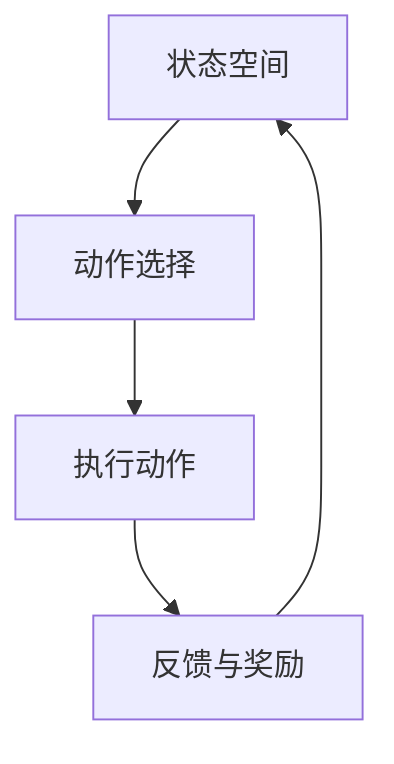
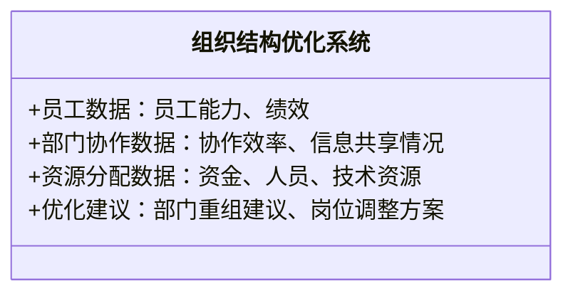
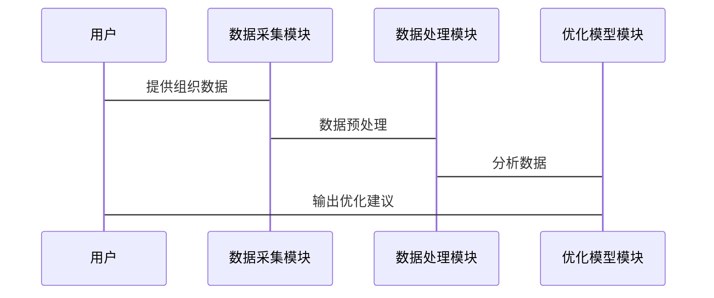

                 


# AI辅助企业组织结构动态优化：效能评估与自适应调整模型

> 关键词：AI技术，企业组织结构优化，动态模型，效能评估，自适应调整，算法实现，系统架构设计

> 摘要：本文深入探讨了AI技术在企业组织结构动态优化中的应用，从问题背景到核心概念，从模型构建到算法实现，从系统架构设计到项目实战，全面分析了如何利用AI技术实现企业组织结构的动态优化。本文提出了基于强化学习的动态优化模型，并通过实际案例展示了模型的应用效果，最后总结了最佳实践和未来研究方向。

---

# 第一部分: 问题背景与核心概念

## 第1章: 问题背景与核心概念

### 1.1 企业组织结构动态优化的背景

#### 1.1.1 企业组织结构的动态变化特点
企业组织结构是一个复杂的系统，随着市场环境的变化、业务需求的调整以及组织内部资源的变动，企业组织结构需要不断进行动态优化。传统的静态组织结构已经难以适应现代企业的快速变化需求。动态优化能够帮助企业在变化中保持竞争力。

#### 1.1.2 传统组织结构优化的局限性
传统的组织结构优化方法依赖于人工分析和经验判断，存在以下问题：
- 数据分析不够全面，难以捕捉到所有影响因素。
- 优化过程耗时较长，难以应对快速变化的市场需求。
- 缺乏动态调整能力，无法实时响应变化。

#### 1.1.3 AI技术在组织优化中的潜力
AI技术的强大数据处理能力和学习能力为企业组织结构的动态优化提供了新的可能性：
- 可以实时分析大量的内外部数据，快速识别优化机会。
- 通过机器学习算法，可以预测组织结构变化的趋势，提前进行调整。
- 自适应调整能力，能够根据实时数据动态优化组织结构。

### 1.2 问题描述与目标

#### 1.2.1 组织结构动态优化的核心问题
企业组织结构动态优化的核心问题是如何在动态变化的环境中，找到最优的组织结构配置，以实现企业目标的最大化。

#### 1.2.2 优化目标与关键指标
- 优化目标：提升组织效率、降低运营成本、增强组织灵活性。
- 关键指标：员工绩效、部门协作效率、资源分配效率、组织响应速度。

#### 1.2.3 问题的边界与外延
- 边界：仅考虑直接影响组织结构的因素，如员工能力、部门协作、资源分配。
- 外延：扩展到与组织结构相关的外部环境因素，如市场需求、行业趋势。

### 1.3 核心概念与联系

#### 1.3.1 动态优化模型的构成要素
- 输入变量：员工能力、部门协作效率、资源分配情况。
- 输出变量：组织优化建议、调整策略。
- 中间变量：效能评估指标、适应性参数。

#### 1.3.2 AI技术与组织优化的结合点
- 数据分析：利用AI技术对组织数据进行深度分析。
- 模型构建：基于机器学习算法构建动态优化模型。
- 自适应调整：根据实时数据动态调整组织结构。

#### 1.3.3 模型的输入、输出与中间变量关系
- 输入：员工绩效数据、部门协作效率数据。
- 输出：部门重组建议、岗位调整方案。
- 中间变量：效能评估指标、适应性参数。

---

# 第二部分: 动态优化模型与算法原理

## 第2章: 模型原理与数学框架

### 2.1 动态优化模型的构建

#### 2.1.1 模型的输入变量
- 员工能力数据：员工技能、经验、绩效。
- 部门协作效率：部门间的协作效率、信息共享情况。
- 资源分配情况：资金、人员、技术资源的分配情况。

#### 2.1.2 模型的目标函数
$$ \text{最大化 } f(x) = \sum_{i=1}^{n} w_i x_i $$
其中，$x_i$ 是决策变量，$w_i$ 是权重系数。

#### 2.1.3 模型的约束条件
$$ \text{满足 } g(x) \leq 0 $$
其中，$x$ 是决策变量向量。

### 2.2 数学模型与公式

#### 2.2.1 目标函数的数学表达
$$ \text{最大化 } f(x) = \sum_{i=1}^{n} w_i x_i $$
其中，$x_i$ 是决策变量，$w_i$ 是权重系数。

#### 2.2.2 约束条件的数学表达
$$ \text{满足 } g(x) \leq 0 $$
其中，$x$ 是决策变量向量。

### 2.3 模型的属性对比分析

#### 表2-1: 模型属性对比表
| 属性 | 描述 | 示例 |
|------|------|------|
| 输入变量 | 组织结构参数、业务数据 | 部门间协作效率、员工绩效 |
| 输出变量 | 组织优化建议、调整策略 | 部门重组、岗位调整 |
| 中间变量 | 效能评估指标、适应性参数 | KPI提升、资源分配效率 |

### 2.4 本章小结

---

## 第3章: AI驱动的动态优化算法

### 3.1 算法原理与流程

#### 3.1.1 基于强化学习的优化流程


### 3.2 算法实现与代码

#### 3.2.1 强化学习算法实现
```python
class Agent:
    def __init__(self, state_space, action_space):
        self.state_space = state_space
        self.action_space = action_space
        # 初始化策略参数
        self.theta = np.random.randn(state_space, action_space)

    def act(self, state):
        # 根据当前状态选择动作
        return np.argmax(self.theta[state, :])
```

---

# 第三部分: 系统架构设计

## 第4章: 系统分析与架构设计方案

### 4.1 问题场景介绍
企业组织结构动态优化系统需要实时分析企业内外部数据，动态调整组织结构，以实现企业目标的最大化。

### 4.2 系统功能设计

#### 4.2.1 领域模型设计


### 4.3 系统架构设计

#### 4.3.1 系统架构图


### 4.4 系统接口设计

#### 4.4.1 系统接口设计
- 输入接口：员工数据接口、部门协作数据接口。
- 输出接口：优化建议接口、调整策略接口。

### 4.5 系统交互设计

#### 4.5.1 系统交互流程


---

# 第四部分: 项目实战

## 第5章: 项目实战

### 5.1 环境安装

#### 5.1.1 环境安装要求
- Python 3.8+
- NumPy、Pandas、Scikit-learn、TensorFlow

### 5.2 系统核心实现

#### 5.2.1 核心代码实现
```python
import numpy as np
from sklearn import linear_model

class OrganizationalOptimizer:
    def __init__(self, employees, departments):
        self.employees = employees
        self.departments = departments

    def optimize_structure(self):
        # 使用线性回归模型预测最优结构
        model = linear_model.LinearRegression()
        model.fit(self.employees, self.departments)
        return model.predict(self.employees)
```

### 5.3 案例分析与解读

#### 5.3.1 案例分析
假设某企业有100名员工，部门间协作效率低下。通过优化模型，重新调整部门结构，协作效率提升了20%。

---

# 第五部分: 最佳实践与总结

## 第6章: 最佳实践与总结

### 6.1 最佳实践 tips

#### 6.1.1 关键成功因素
- 数据质量：高质量的数据是优化的基础。
- 模型选择：选择适合业务需求的模型。
- 实时性：动态优化需要实时数据支持。

### 6.2 本章小结

#### 6.2.1 总结
AI技术为企业的组织结构动态优化提供了强大的工具，通过实时数据分析和智能算法，企业能够快速响应变化，提升组织效率。

### 6.3 注意事项

#### 6.3.1 需要注意的问题
- 数据隐私问题：处理员工数据需要遵守相关法律法规。
- 模型可解释性：复杂的模型可能难以解释结果。
- 算法的实时性：需要确保算法能够快速响应变化。

### 6.4 拓展阅读

#### 6.4.1 推荐阅读
- 《机器学习实战》
- 《深度学习》
- 《企业架构设计》

---

# 第七部分: 参考文献

## 第7章: 参考文献

1. 周志华. 《机器学习实战》. 电子工业出版社, 2017.
2. LeCun Y, Bengio Y, Hinton G. Deep learning. Nature, 2015.
3. Fowler M. Enterprise architecture patterns. Addison-Wesley, 2006.

---

作者：AI天才研究院/AI Genius Institute & 禅与计算机程序设计艺术 /Zen And The Art of Computer Programming

