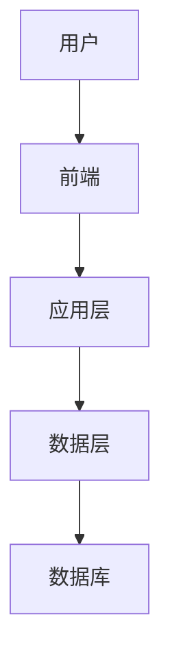
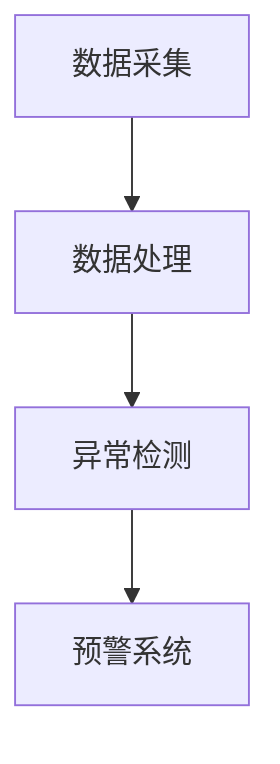

                 


# AI辅助企业财务异常检测：实时监控与智能预警系统

> 关键词：AI技术，财务异常检测，实时监控，智能预警，企业风险管理

> 摘要：本文详细探讨了如何利用人工智能技术辅助企业进行财务异常检测，实现实时监控与智能预警。通过分析财务数据，结合AI算法，构建高效的预警系统，帮助企业及时发现和处理财务问题，降低风险。本文从背景、概念、算法原理到系统设计、项目实战，全面解析了AI在财务异常检测中的应用。

---

# 第一部分：AI辅助企业财务异常检测的背景与概念

## 第1章：财务异常检测的背景与问题

### 1.1 企业财务异常检测的重要性

#### 1.1.1 财务异常检测的定义与目的
财务异常检测是指通过分析企业的财务数据，识别出与正常情况不符的异常交易或数据偏差。其目的是为了及时发现和预警潜在的财务风险，避免企业因财务问题导致的重大损失。

#### 1.1.2 财务异常对企业的影响
- 财务异常可能导致企业面临法律风险、信用损失或经营危机。
- 早期发现异常，可以及时采取措施，避免问题扩大化。

#### 1.1.3 传统财务异常检测的局限性
- 传统方法依赖人工审查，效率低且容易遗漏。
- 数据量大、复杂度高，人工难以全面分析。

---

### 1.2 AI技术在财务异常检测中的作用

#### 1.2.1 AI技术如何提升财务异常检测的效率
- AI能够快速处理大量数据，发现潜在规律。
- 通过机器学习算法，AI能够自动识别异常模式。

#### 1.2.2 基于AI的财务异常检测的优势
- 高效性：AI能够在短时间内处理海量数据。
- 准确性：通过训练模型，AI能够识别复杂的异常模式。
- 实时性：AI系统可以实现实时监控和预警。

#### 1.2.3 AI在实时监控与智能预警中的应用潜力
- 实时分析财务数据，及时发现异常。
- 提供智能预警，帮助企业快速响应。

---

## 第2章：AI辅助财务异常检测的核心概念

### 2.1 财务异常检测的关键要素

#### 2.1.1 数据来源与特征
- 数据来源：企业的财务报表、交易记录、现金流等。
- 数据特征：金额、时间、交易频率等。

#### 2.1.2 异常检测的分类与方法
- 分类：基于时间序列、基于交易金额、基于交易频率等。
- 方法：统计分析、机器学习、深度学习等。

#### 2.1.3 预警机制的设计原则
- 及时性：异常发现后立即预警。
- 准确性：减少误报和漏报。
- 可操作性：预警信息应清晰明了，便于处理。

---

### 2.2 AI算法在财务异常检测中的应用

#### 2.2.1 常见的AI算法及其适用场景
- 聚类算法：适用于无监督学习，发现异常簇。
- 强化学习：适用于动态环境下的异常检测。

#### 2.2.2 无监督学习与监督学习的对比
| 对比维度 | 无监督学习 | 监督学习 |
|----------|------------|----------|
| 数据需求 | 无需标签 | 需要标签 |
| 适用场景 | 发现未知异常 | 针对特定异常 |

#### 2.2.3 深度学习在财务异常检测中的应用
- 深度学习能够捕捉数据中的复杂特征，适用于高维数据的分析。

---

## 第3章：AI辅助财务异常检测的系统架构

### 3.1 系统功能模块划分

#### 3.1.1 数据采集模块
- 从企业ERP系统或其他数据源获取财务数据。

#### 3.1.2 数据处理模块
- 数据清洗、转换，确保数据质量。

#### 3.1.3 异常检测模块
- 应用AI算法，识别异常数据。

#### 3.1.4 预警与反馈模块
- 发出预警信息，并提供处理建议。

---

### 3.2 系统架构设计

#### 3.2.1 分层架构设计


#### 3.2.2 微服务架构的优势
- 模块化设计，便于扩展和维护。

#### 3.2.3 数据流与模块交互关系


---

# 第二部分：AI算法原理与实现

## 第4章：AI算法原理与实现

### 4.1 异常检测算法的选择与优化

#### 4.1.1 常见异常检测算法对比
| 算法名称 | 优点 | 缺点 |
|----------|------|------|
| K-Means | 简单 | 不适用于高维数据 |
| Isolation Forest | 高效 | 对异常点敏感 |

#### 4.1.2 基于聚类的异常检测
- 使用K-Means算法，将数据分成簇，检测孤立点。

#### 4.1.3 基于深度学习的异常检测
- 使用Autoencoder模型，重建数据，检测重建误差。

---

### 4.2 基于深度学习的异常检测模型

#### 4.2.1 模型输入与输出设计
- 输入：财务数据特征。
- 输出：异常概率。

#### 4.2.2 模型训练流程
1. 数据预处理。
2. 模型训练。
3. 模型评估。

#### 4.2.3 模型调优与评估指标
- 调整超参数，优化准确率、召回率等指标。

---

## 第5章：系统实现与项目实战

### 5.1 项目环境搭建

#### 5.1.1 开发工具与依赖库安装
- 开发工具：Python、Jupyter Notebook。
- 依赖库：Pandas、Scikit-learn、Keras。

#### 5.1.2 数据集准备与预处理
- 数据清洗：处理缺失值、异常值。
- 数据标准化：归一化处理。

---

### 5.2 系统核心代码实现

#### 5.2.1 数据采集模块代码
```python
import pandas as pd

def fetch_data():
    data = pd.read_csv('financial_data.csv')
    return data
```

#### 5.2.2 异常检测算法实现
```python
from sklearn.cluster import KMeans

def detect_anomalies(data):
    kmeans = KMeans(n_clusters=2)
    kmeans.fit(data)
    # 预测簇标签
    labels = kmeans.predict(data)
    # 异常点为孤立点
    anomalies = data[labels == 0]
    return anomalies
```

#### 5.2.3 预警系统代码
```python
def send_alert(anomalies):
    print(f"Detect {len(anomalies)} anomalies")
```

---

### 5.3 项目测试与优化

#### 5.3.1 系统功能测试
- 测试数据采集、处理、检测和预警功能。

#### 5.3.2 性能优化与调优
- 使用分布式计算优化性能。

#### 5.3.3 测试结果分析
- 分析误报率、漏报率，优化模型参数。

---

## 第6章：系统优化与扩展

### 6.1 系统性能优化

#### 6.1.1 数据处理效率提升
- 使用并行计算加速数据处理。

#### 6.1.2 算法优化与加速
- 使用分布式训练加速模型训练。

#### 6.1.3 系统可扩展性设计
- 设计模块化架构，便于扩展。

---

### 6.2 数据隐私与安全保护

#### 6.2.1 数据加密
- 对敏感数据进行加密处理。

#### 6.2.2 访问控制
- 限制非授权访问，确保数据安全。

---

## 第7章：最佳实践与小结

### 7.1 小结
- 总结AI在财务异常检测中的应用效果。

### 7.2 注意事项
- 数据隐私保护的重要性。
- 模型的持续优化与更新。

### 7.3 拓展阅读
- 推荐相关书籍和论文，供进一步学习。

---

# 作者：AI天才研究院 & 禅与计算机程序设计艺术

---

这篇文章详细介绍了AI在企业财务异常检测中的应用，从背景、概念、算法到系统设计和项目实战，全面解析了如何利用AI技术构建高效的实时监控与智能预警系统。

