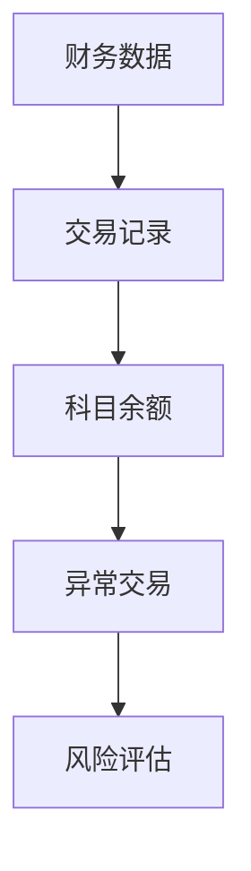
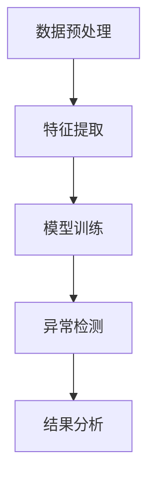
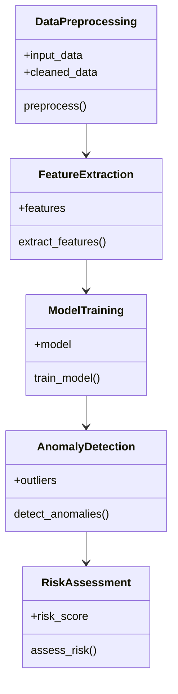

                 


# AI辅助企业财务舞弊检测：异常模式识别与风险评估

> **关键词：** AI, 财务舞弊检测, 异常模式识别, 风险评估, 机器学习

> **摘要：**  
本文探讨了如何利用人工智能技术辅助企业财务舞弊检测，重点分析了异常模式识别与风险评估的核心概念、算法原理及系统架构。通过结合实际案例，详细讲解了AI在财务舞弊检测中的应用场景、技术实现和最佳实践。

---

# 第一部分: AI辅助企业财务舞弊检测概述

## 第1章: 企业财务舞弊检测的背景与挑战

### 1.1 财务舞弊的定义与特征

#### 1.1.1 财务舞弊的定义  
财务舞弊是指企业通过虚构交易、篡改数据、隐瞒收入或虚增支出等手段，故意粉饰财务报表，误导利益相关者的行为。

#### 1.1.2 财务舞弊的主要特征  
- 数据异常：如销售额与成本不匹配，收入与支出不符。
- 交易模式不一致：如某段时间内交易频率突然增加，或交易金额异常。
- 关联方交易频繁：与关联企业进行大额交易，转移利润。

#### 1.1.3 财务舞弊对企业的影响  
- 企业损失：通过虚假交易或虚增负债，导致企业资产流失。
- 信任下降：财务舞弊会损害企业声誉，影响投资者信心。
- 法律风险：舞弊行为可能导致企业面临法律诉讼和罚款。

---

### 1.2 传统财务舞弊检测方法的局限性

#### 1.2.1 基于规则的检测方法  
- 通过预设的规则（如科目余额表、交易金额阈值）进行检测。
- 优点：简单易行，适用于简单场景。
- 缺点：规则难以覆盖所有可能的舞弊行为，且容易被绕过。

#### 1.2.2 基于审计的检测方法  
- 通过审计师的经验和专业判断，发现财务报表中的异常。
- 优点：依赖专业人员的判断，能够发现复杂的舞弊行为。
- 缺点：耗时长，成本高，且容易受到主观因素影响。

#### 1.2.3 传统方法的局限性与不足  
- 数据量小：传统方法难以处理海量数据。
- 覆盖范围有限：难以发现隐藏在复杂交易中的舞弊行为。
- 效率低下：人工审计效率低，难以满足企业实时监控需求。

---

### 1.3 AI技术在财务舞弊检测中的优势

#### 1.3.1 数据驱动的分析优势  
AI技术能够从海量数据中提取特征，发现传统方法难以察觉的异常模式。

#### 1.3.2 异常模式识别的能力  
通过机器学习算法，AI能够自动识别数据中的异常模式，帮助发现潜在的舞弊行为。

#### 1.3.3 高效性与准确性提升  
AI技术能够快速处理大量数据，显著提高检测效率和准确性。

---

## 第2章: 异常模式识别与风险评估的核心概念

### 2.1 异常模式识别的定义与原理

#### 2.1.1 异常模式识别的定义  
异常模式识别是指通过分析数据，识别出与正常模式不符的异常数据点或模式。

#### 2.1.2 异常模式识别的基本原理  
- 基于统计方法：如均值、标准差等，识别偏离正常范围的数据。
- 基于机器学习：如聚类、分类、深度学习等，识别异常模式。

#### 2.1.3 异常模式识别的核心要素  
- 数据预处理：清洗、归一化、特征提取。
- 模型选择：选择适合的算法，如Isolation Forest、One-Class SVM。
- 结果解释：对异常结果进行分析，确定是否为舞弊行为。

---

### 2.2 风险评估的定义与方法

#### 2.2.1 风险评估的定义  
风险评估是指对潜在的财务风险进行量化和分析，确定其对企业财务健康的影响程度。

#### 2.2.2 风险评估的主要方法  
- VaR（Value at Risk）：衡量在一定置信水平下的潜在损失。
- 信用评分模型：根据历史数据，评估交易的风险等级。
- 情景分析：模拟不同场景下的风险敞口。

#### 2.2.3 风险评估的指标体系  
- 风险值（Risk Score）：综合评估交易的风险程度。
- 异常得分（Anomaly Score）：反映数据点的异常程度。
- 综合风险指数（Composite Risk Index）：结合多个指标，评估整体风险。

---

### 2.3 异常模式识别与风险评估的联系

#### 2.3.1 异常模式识别在风险评估中的作用  
- 异常模式识别为风险评估提供数据支持。
- 通过识别异常交易，帮助确定潜在的财务风险。

#### 2.3.2 风险评估对异常模式识别的指导意义  
- 风险评估可以帮助优化异常识别的阈值和模型。
- 通过风险评估结果，反向调整异常识别的策略。

#### 2.3.3 两者结合的综合应用  
- 异常识别用于初步筛选，风险评估用于深度分析。
- 结合两者的分析结果，最终确定是否存在财务舞弊行为。

---

## 第3章: 异常模式识别与风险评估的核心概念联系

### 3.1 核心概念原理

#### 3.1.1 异常模式识别的数学模型  
- 聚类分析：将数据点分为正常和异常两类。
- One-Class SVM：用于检测异常点。
- Isolation Forest：基于树结构的异常检测方法。

#### 3.1.2 风险评估的数学模型  
- 线性回归：预测风险值。
- 逻辑回归：分类风险等级。
- 支持向量机（SVM）：用于风险分类。

#### 3.1.3 两者结合的综合模型  
- 综合模型：将异常识别和风险评估的结果进行融合，提升检测精度。

---

### 3.2 核心概念属性特征对比

| **特征**         | **异常模式识别**                     | **风险评估**                       |
|------------------|-------------------------------------|------------------------------------|
| 数据来源         | 交易数据、科目余额表               | 财务数据、市场数据                 |
| 目标             | 发现异常交易或数据点               | 评估交易或资产的风险等级           |
| 方法             | 聚类、分类、深度学习               | VaR、信用评分模型、情景分析         |
| 输出             | 异常得分、异常标签                 | 风险值、风险等级                   |

---

### 3.3 ER实体关系图架构



---

## 第4章: 异常模式识别的算法原理

### 4.1 算法原理概述

#### 4.1.1 异常模式识别的主要算法  
- 基于统计的方法：Z-Score、3σ法。
- 基于机器学习的算法：Isolation Forest、One-Class SVM、Autoencoders。

#### 4.1.2 算法选择的依据  
- 数据类型：结构化数据、非结构化数据。
- 数据规模：小数据、大数据。
- 计算效率：实时性要求。

#### 4.1.3 算法的优缺点分析  
- 统计方法：简单易行，但对复杂场景效果有限。
- 机器学习算法：效果好，但实现复杂，计算资源需求高。

---

### 4.2 算法流程图



---

### 4.3 算法实现代码

#### 4.3.1 数据预处理

```python
import pandas as pd
data = pd.read_csv('financial_data.csv')
data_cleaned = data.dropna()
```

#### 4.3.2 特征提取

```python
from sklearn.preprocessing import StandardScaler
scaler = StandardScaler()
features = scaler.fit_transform(data_cleaned[['amount', 'time', 'category']])
```

#### 4.3.3 模型训练

```python
from sklearn.ensemble import IsolationForest
model = IsolationForest(n_estimators=100, contamination=0.05)
model.fit(features)
```

#### 4.3.4 异常检测

```python
import numpy as np
outliers = model.predict(features)
outliers[outliers == -1] = 1
outliers[outliers == 1] = 0
```

---

## 第5章: 系统分析与架构设计

### 5.1 问题场景介绍

#### 5.1.1 企业财务舞弊检测的场景  
- 在线交易监控：实时检测异常交易。
- 财务报表分析：定期分析财务数据，发现舞弊行为。
- 关联方交易监控：识别与关联企业的异常交易。

---

#### 5.1.2 系统功能设计



---

#### 5.1.3 系统架构设计


---

#### 5.1.4 接口设计

| **接口名称**       | **输入**          | **输出**          |
|--------------------|-------------------|-------------------|
| 数据预处理接口     | 原始数据文件      | 处理后的数据文件  |
| 特征提取接口       | 处理后的数据      | 特征向量          |
| 模型训练接口       | 特征向量          | 训练好的模型      |
| 异常检测接口       | 待检测数据        | 异常标签          |
| 风险评估接口       | 异常标签          | 风险评估结果      |

---

## 第6章: 项目实战

### 6.1 环境安装

#### 6.1.1 安装Python环境  
```bash
python --version
pip install --upgrade pip
```

#### 6.1.2 安装依赖库  
```bash
pip install pandas scikit-learn matplotlib
```

---

### 6.2 系统核心实现

#### 6.2.1 数据预处理

```python
import pandas as pd
data = pd.read_csv('financial_data.csv')
data_cleaned = data.dropna()
```

#### 6.2.2 特征提取

```python
from sklearn.preprocessing import StandardScaler
scaler = StandardScaler()
features = scaler.fit_transform(data_cleaned[['amount', 'time', 'category']])
```

#### 6.2.3 模型训练

```python
from sklearn.ensemble import IsolationForest
model = IsolationForest(n_estimators=100, contamination=0.05)
model.fit(features)
```

#### 6.2.4 异常检测

```python
outliers = model.predict(features)
outliers[outliers == -1] = 1
outliers[outliers == 1] = 0
```

---

### 6.3 代码应用解读

#### 6.3.1 数据预处理  
- 使用Pandas读取数据，并去除缺失值。

#### 6.3.2 特征提取  
- 使用标准化方法，提取交易金额、时间、类别等特征。

#### 6.3.3 模型训练  
- 使用Isolation Forest算法训练模型，检测异常点。

#### 6.3.4 异常检测  
- 对数据进行预测，标记异常点。

---

### 6.4 实际案例分析

#### 6.4.1 案例背景  
某企业财务数据中发现异常交易，金额远高于正常水平。

#### 6.4.2 数据分析  
- 通过Isolation Forest算法，识别出异常交易。
- 结合风险评估模型，评估该交易的风险等级。

---

### 6.5 项目小结

- 通过AI技术，企业可以高效识别异常交易，降低财务舞弊风险。
- 异常模式识别与风险评估的结合，显著提高了检测的准确性和效率。

---

## 第7章: 最佳实践与小结

### 7.1 最佳实践

#### 7.1.1 数据隐私保护  
- 确保数据处理过程中的隐私保护，遵守相关法律法规。

#### 7.1.2 模型更新与优化  
- 定期更新模型，确保检测效果。
- 使用最新数据重新训练模型，提升检测能力。

#### 7.1.3 人机结合  
- 结合人工审核，避免误报和漏报。

---

### 7.2 小结

- AI技术在财务舞弊检测中的应用前景广阔。
- 异常模式识别与风险评估的结合，为企业提供了强有力的风险管理工具。
- 随着技术的不断进步，AI在财务领域的应用将更加深入。

---

### 7.3 注意事项

- 数据质量：确保数据准确性和完整性。
- 模型解释性：选择可解释性好的算法，便于分析和优化。
- 实时性：根据业务需求，选择适合的计算资源和算法。

---

### 7.4 拓展阅读

- 《Hands-On Machine Learning with Scikit-Learn, Keras, and TensorFlow》
- 《Data Science for Business: What You Need to Know About Data Mining and Data Analytics》
- 《Fraud Detection and Prevention: A Guide for Business Professionals》

---

## 作者信息

作者：AI天才研究院 & 禅与计算机程序设计艺术

---

通过以上步骤，我们可以看到，AI技术在企业财务舞弊检测中的应用不仅提高了检测效率，还显著提升了准确性。结合异常模式识别与风险评估，企业能够更好地识别和防范财务风险，保障财务健康和合规性。

