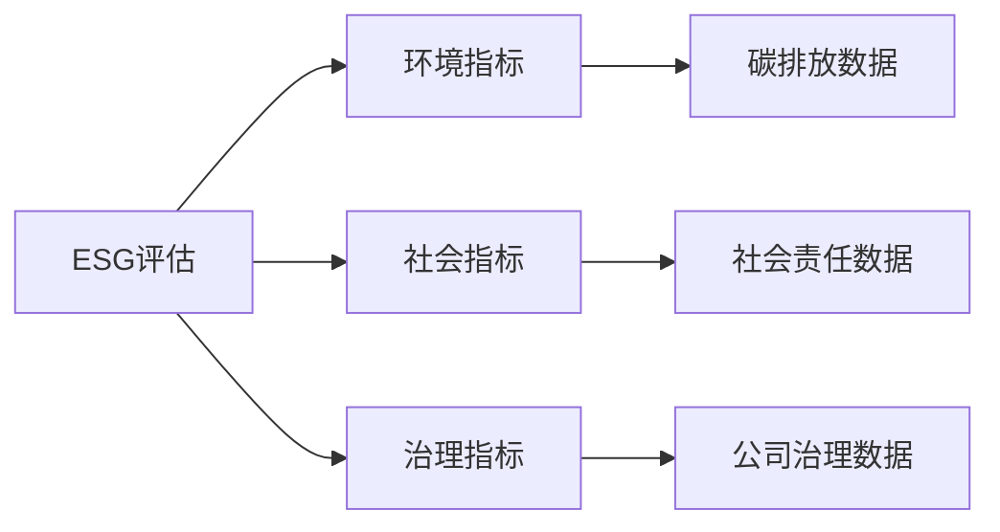
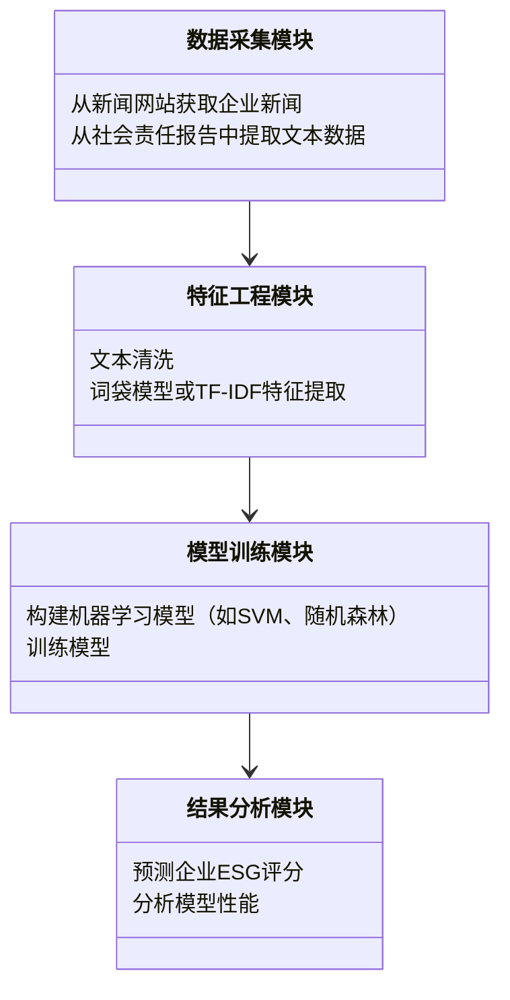
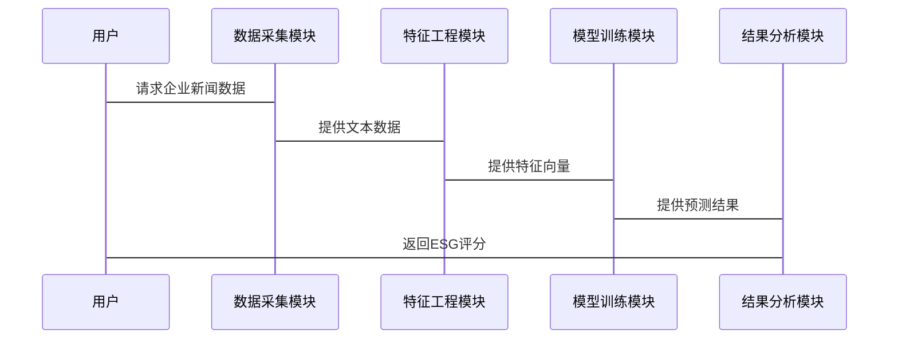

                 


# AI辅助的ESG投资影响评估

> 关键词：AI, ESG, 投资评估, 机器学习, 自然语言处理

> 摘要：本文探讨了人工智能在环境、社会和治理（ESG）投资影响评估中的应用。通过分析ESG评估的核心概念与AI技术的结合，详细讲解了AI辅助ESG评估的算法原理、系统架构设计以及实际项目实现。文章结合理论与实践，为投资专业人士和技术开发者提供了深入的技术博客内容。

---

## 第一部分: AI辅助的ESG投资影响评估概述

### 第1章: ESG投资与AI辅助评估的背景

#### 1.1 ESG投资的基本概念

ESG（Environmental, Social, Governance）评估是近年来兴起的一种投资策略，旨在通过分析企业在环境、社会和治理方面的表现，来评估其长期投资价值。ESG投资不仅关注企业的财务表现，还关注其对社会和环境的影响。

- **环境（Environmental）**：包括碳排放、能源消耗、资源利用效率等指标。
- **社会（Social）**：包括员工权益、社会责任、劳动条件等指标。
- **治理（Governance）**：包括公司治理结构、董事会多样性、高管薪酬等指标。

#### 1.2 AI在投资评估中的应用现状

随着人工智能技术的快速发展，AI在金融领域的应用越来越广泛。通过自然语言处理（NLP）和机器学习技术，AI可以帮助投资者快速分析大量非结构化数据，从而提高投资决策的效率和准确性。

- **AI在金融领域的应用**：包括股票预测、风险评估、市场情绪分析等。
- **ESG投资的兴起**：ESG投资逐渐成为全球投资的重要方向，尤其是在应对气候变化和可持续发展的背景下。
- **AI辅助ESG评估的优势**：AI可以通过分析新闻、财报等非结构化数据，提取与ESG相关的特征，帮助投资者更好地评估企业的ESG表现。

#### 1.3 AI辅助ESG投资影响评估的核心问题

- **问题背景与问题描述**：随着ESG投资的兴起，如何高效、准确地评估企业的ESG表现成为一个重要问题。传统的ESG评估方法依赖于人工分析，效率低下且容易受到主观因素的影响。
- **问题解决的必要性**：通过AI技术，可以自动化地分析大量数据，提取与ESG相关的特征，并构建预测模型，帮助投资者更好地评估企业的ESG表现。
- **边界与外延**：本文主要关注AI在ESG投资评估中的应用，不涉及企业的财务表现和传统投资分析。
- **核心概念与组成要素**：ESG评估的核心概念包括环境、社会和治理三个维度，AI技术的核心原理包括机器学习和自然语言处理。

---

## 第2章: ESG评估的核心概念与联系

### 2.1 ESG评估的核心指标

- **环境指标**：碳排放、能源消耗、资源利用效率等。
- **社会指标**：员工权益、社会责任、劳动条件等。
- **治理指标**：公司治理结构、董事会多样性、高管薪酬等。

### 2.2 AI技术的核心原理

- **机器学习简介**：机器学习是一种人工智能技术，通过训练数据来预测新的数据。常用的机器学习算法包括线性回归、支持向量机（SVM）、随机森林和深度学习模型。
- **自然语言处理（NLP）**：NLP是一种人工智能技术，用于处理和分析文本数据。常用的NLP技术包括文本分类、实体识别、情感分析等。
- **深度学习模型**：深度学习是一种机器学习技术，通过多层神经网络来学习数据的特征。常用的深度学习模型包括卷积神经网络（CNN）和循环神经网络（RNN）。

### 2.3 ESG评估与AI技术的联系

- **数据来源与特征提取**：AI可以通过分析企业的财报、新闻、社会责任报告等数据，提取与ESG相关的特征。
- **AI模型在ESG评分中的应用**：通过训练机器学习模型，可以预测企业的ESG评分，并帮助投资者进行投资决策。
- **案例分析：AI辅助ESG评级**：通过实际案例分析，展示了AI在ESG评级中的应用。

### 2.4 核心概念对比表

| 指标维度 | 环境 | 社会 | 治理 |
|----------|------|------|------|
| 示例指标 | 碳排放、能源消耗 | 员工权益、社会责任 | 公司治理结构、董事会多样性 |
| 数据来源 | 环境报告、能源消耗数据 | 社会责任报告、员工数据 | 公司治理数据、董事会成员信息 |

### 2.5 ER实体关系图



### 2.6 本章小结

本章详细介绍了ESG评估的核心指标和AI技术的核心原理，并探讨了两者的联系。通过对比表和ER实体关系图，展示了ESG评估与AI技术的结合点。

---

## 第3章: AI辅助ESG评估的算法原理

### 3.1 算法概述

- **问题场景介绍**：本文将通过一个实际案例，展示如何利用机器学习和自然语言处理技术，构建一个ESG评分预测模型。
- **项目介绍**：本项目旨在通过分析企业的新闻报道、社会责任报告等文本数据，提取与ESG相关的特征，并利用机器学习算法预测企业的ESG评分。

### 3.2 系统功能设计

- **领域模型设计**：通过Mermaid类图展示了系统的功能模块，包括数据采集、特征工程、模型训练和结果分析。



### 3.3 算法实现

- **机器学习算法选择**：本文选择了支持向量机（SVM）和随机森林两种算法进行对比实验。
- **特征提取方法**：使用TF-IDF方法提取文本数据的特征。
- **模型训练与评估**：通过交叉验证评估模型的性能。

### 3.4 本章小结

本章详细介绍了AI辅助ESG评估的算法原理，包括系统功能设计、算法选择和实现步骤。

---

## 第4章: 系统分析与架构设计方案

### 4.1 问题场景介绍

- **项目介绍**：本项目旨在构建一个AI辅助的ESG投资影响评估系统。
- **系统功能设计**：包括数据采集、特征工程、模型训练和结果分析四个模块。

### 4.2 系统架构设计

- **系统架构设计图**：通过Mermaid图展示了系统的整体架构。


### 4.3 系统接口设计

- **数据接口**：系统通过API接口从新闻网站和企业社会责任报告中获取数据。
- **模型接口**：模型通过API接口接收特征数据，并返回预测结果。

### 4.4 系统交互设计

- **系统交互序列图**：展示了用户与系统之间的交互过程。



### 4.5 本章小结

本章详细介绍了系统的架构设计和交互设计，展示了AI辅助ESG评估系统的整体结构。

---

## 第5章: 项目实战

### 5.1 环境安装

- **Python安装**：需要安装Python 3.8或更高版本。
- **依赖库安装**：包括numpy、pandas、scikit-learn、nltk、transformers。

```bash
pip install numpy pandas scikit-learn nltk transformers
```

### 5.2 核心代码实现

- **数据采集模块**：从新闻网站获取企业新闻。
- **特征工程模块**：文本清洗和特征提取。
- **模型训练模块**：构建机器学习模型并进行训练。
- **结果分析模块**：预测ESG评分并分析模型性能。

### 5.3 代码实现

```python
import numpy as np
import pandas as pd
from sklearn.feature_extraction.text import TfidfVectorizer
from sklearn.svm import SVC
from sklearn.ensemble import RandomForestClassifier
from sklearn.metrics import accuracy_score

# 数据加载
data = pd.read_csv('esg_data.csv')

# 特征提取
vectorizer = TfidfVectorizer()
X = vectorizer.fit_transform(data['text'])
y = data['label']

# 模型训练
model_svm = SVC()
model_svm.fit(X, y)

model_rf = RandomForestClassifier()
model_rf.fit(X, y)

# 模型预测
y_svm_pred = model_svm.predict(X)
y_rf_pred = model_rf.predict(X)

# 模型评估
print(f"SVM准确率：{accuracy_score(y, y_svm_pred)}")
print(f"随机森林准确率：{accuracy_score(y, y_rf_pred)}")
```

### 5.4 实际案例分析

- **案例分析**：以某企业为例，展示如何通过AI技术进行ESG评估。
- **详细解读**：从数据采集到模型训练，再到结果分析，详细解读每个步骤的具体操作和实现。

### 5.5 本章小结

本章通过实际项目展示了AI辅助ESG评估的实现过程，包括环境安装、核心代码实现和案例分析。

---

## 第6章: 最佳实践与小结

### 6.1 最佳实践

- **数据质量的重要性**：确保数据的准确性和完整性。
- **模型解释性**：在实际应用中，模型的解释性非常重要，可以通过特征重要性分析来解释模型的预测结果。
- **未来研究方向**：探索更先进的机器学习算法，如深度学习模型，进一步提高ESG评估的准确性。

### 6.2 小结

本文详细探讨了AI辅助ESG投资影响评估的核心概念、算法原理和系统架构设计，并通过实际项目展示了AI技术在ESG评估中的应用。通过本文的学习，读者可以掌握AI辅助ESG评估的基本原理和实现方法。

---

## 作者：AI天才研究院/AI Genius Institute & 禅与计算机程序设计艺术 /Zen And The Art of Computer Programming

