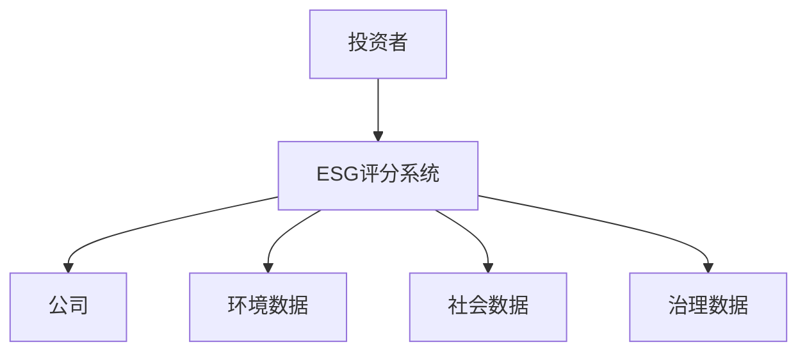
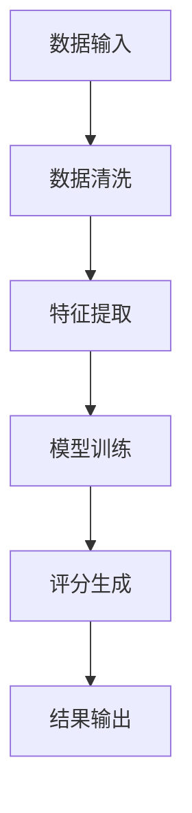
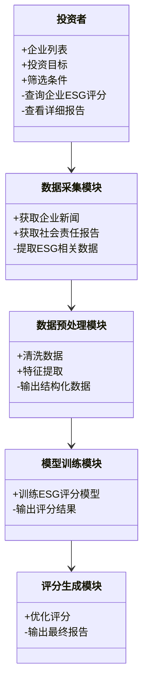
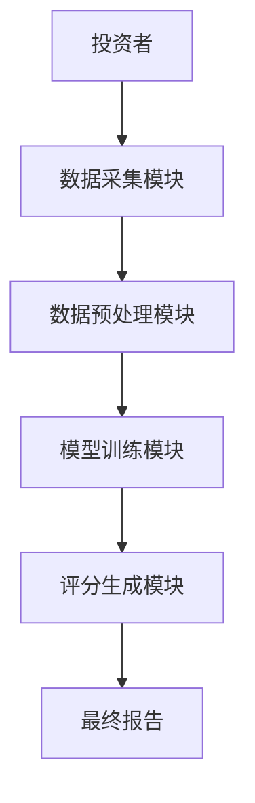
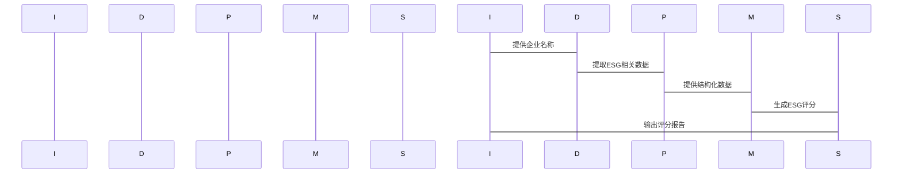

                 


# AI辅助的ESG投资筛选工具

> 关键词：ESG投资，人工智能，投资筛选，机器学习，文本挖掘，评分模型

> 摘要：随着全球对可持续投资的关注度不断提高，ESG（环境、社会、治理）投资逐渐成为衡量企业价值的重要标准。然而，ESG数据的复杂性和多样性使得传统的人工筛选方法效率低下，难以满足投资者的需求。本文将详细探讨如何利用人工智能技术构建高效的ESG投资筛选工具，从背景、核心概念、算法原理到系统架构、项目实战，全面解析该工具的技术实现和应用场景。

---

# 第1章: ESG投资与AI辅助工具的背景介绍

## 1.1 ESG投资的定义与重要性

### 1.1.1 ESG投资的定义
ESG投资是一种基于环境（Environment）、社会（Social）和治理（Governance）三个维度对企业进行评估的投资策略。通过分析企业在可持续发展方面的表现，投资者可以识别出在长期视角下更具价值的企业。

### 1.1.2 ESG投资的重要性与发展趋势
随着全球气候变化问题的加剧和企业社会责任意识的增强，投资者越来越关注企业的可持续发展能力。ESG投资不仅能够帮助投资者规避风险，还能通过投资于优秀的企业推动社会进步。

### 1.1.3 AI技术在ESG投资中的作用
人工智能技术能够快速处理海量非结构化数据（如新闻、社交媒体等），并通过机器学习模型生成准确的ESG评分，帮助投资者做出更明智的投资决策。

## 1.2 ESG投资筛选工具的核心概念

### 1.2.1 问题背景与问题描述
传统的ESG数据筛选方法依赖于人工分析，效率低且容易受到主观因素的影响。随着数据量的增加，这种方法已经无法满足现代投资的需求。

### 1.2.2 问题解决的必要性与目标
通过AI技术实现自动化、高效的ESG评分筛选，帮助投资者快速识别出符合ESG标准的企业。

### 1.2.3 边界与外延
- **边界**：本工具仅关注环境、社会和治理三个维度的数据。
- **外延**：不涉及企业的财务数据或其他非ESG相关因素。

### 1.2.4 核心要素组成与概念结构
ESG投资筛选工具的核心要素包括：
1. **数据采集模块**：从多种来源获取企业ESG相关数据。
2. **数据预处理模块**：清洗和结构化数据。
3. **模型训练模块**：基于机器学习算法生成ESG评分。
4. **评分生成模块**：输出最终的ESG评分。

---

# 第2章: AI辅助ESG投资筛选工具的核心概念与联系

## 2.1 核心概念原理

### 2.1.1 ESG评分的核心算法
ESG评分算法基于自然语言处理（NLP）和机器学习技术，对企业的新闻报道、社会责任报告等文本数据进行分析，提取关键特征并生成评分。

### 2.1.2 AI在ESG数据处理中的应用
- **文本挖掘**：从非结构化数据中提取关键词和主题。
- **实体识别**：识别公司名称、地理位置等信息。
- **情感分析**：分析文本中的情感倾向，判断企业形象。

### 2.1.3 ESG评分与投资决策的关系
ESG评分能够帮助投资者识别出在可持续发展方面表现优异的企业，从而优化投资组合。

## 2.2 核心概念属性特征对比表格

| 特性        | ESG评分            | AI辅助工具          |
|-------------|--------------------|--------------------|
| 数据来源     | 公司财报、新闻      | 多源异构数据         |
| 处理方式     | 手动计算            | 自动化分析           |
| 输出结果     | 单维度评分          | 综合性报告           |

## 2.3 ER实体关系图架构



---

# 第3章: AI辅助ESG投资筛选工具的算法原理

## 3.1 算法原理概述

### 3.1.1 文本挖掘与自然语言处理
通过分词、实体识别和关键词提取等技术，从新闻、社交媒体等文本数据中提取企业ESG相关的关键词。

### 3.1.2 机器学习模型训练
使用监督学习算法（如支持向量机、随机森林）对特征向量进行训练，生成ESG评分。

### 3.1.3 ESG评分生成与优化
根据模型输出的初步评分，结合人工校正优化最终结果。

## 3.2 算法流程图



## 3.3 算法实现代码示例

```python
import pandas as pd
from sklearn.model_selection import train_test_split
from sklearn.feature_extraction.text import TfidfVectorizer
from sklearn.svm import SVC

# 数据加载
data = pd.read_csv('esg_data.csv')

# 特征提取
vectorizer = TfidfVectorizer()
X = vectorizer.fit_transform(data['text'])

# 模型训练
X_train, X_test, y_train, y_test = train_test_split(X, data['label'], test_size=0.2)
model = SVC()
model.fit(X_train, y_train)

# 评分生成
y_pred = model.predict(X_test)
print('Accuracy:', model.score(X_test, y_test))
```

## 3.4 数学模型

### 3.4.1 ESG评分公式
$$ ESG\_score = \alpha \cdot E + \beta \cdot S + \gamma \cdot G $$
其中，$E$、$S$、$G$分别代表环境、社会和治理维度的评分，$\alpha$、$\beta$、$\gamma$为权重系数。

### 3.4.2 示例
假设某企业环境得分为80，社会得分为70，治理得分为60，权重分别为0.4、0.3、0.3，则其ESG评分为：
$$ ESG\_score = 0.4 \cdot 80 + 0.3 \cdot 70 + 0.3 \cdot 60 = 32 + 21 + 18 = 71 $$

---

# 第4章: 系统分析与架构设计方案

## 4.1 问题场景介绍
投资者希望通过工具快速筛选出符合ESG标准的企业，以便做出更明智的投资决策。

## 4.2 系统功能设计

### 4.2.1 领域模型


## 4.3 系统架构设计

### 4.3.1 系统架构图


## 4.4 系统接口设计
- **输入接口**：投资者输入企业名称或筛选条件。
- **输出接口**：输出企业ESG评分和详细报告。

## 4.5 系统交互流程图



---

# 第5章: 项目实战

## 5.1 环境安装
安装Python和相关库：
```bash
pip install pandas scikit-learn spacy transformers
```

## 5.2 核心代码实现

```python
import spacy
import pandas as pd
from sklearn.metrics import accuracy_score

# 数据加载
data = pd.read_csv('esg_data.csv')

# 实体识别
nlp = spacy.load('en_core_web_sm')
doc = nlp(data['text'][0])
entities = [ent.text for ent in doc.ents]

# 模型训练
X = data['text']
y = data['label']
X_train, X_test, y_train, y_test = train_test_split(X, y, test_size=0.2)
model.fit(X_train, y_train)

# 模型预测
y_pred = model.predict(X_test)
print('Accuracy:', accuracy_score(y_test, y_pred))
```

## 5.3 实际案例分析
以某公司为例，分析其ESG评分的计算过程，并解释结果的意义。

## 5.4 项目小结
通过本项目，我们成功实现了基于AI的ESG投资筛选工具，能够高效地为企业提供ESG评分。

---

# 第6章: 最佳实践与总结

## 6.1 最佳实践
- 数据来源要多样化，以提高评分的准确性。
- 定期更新模型，以适应新的数据和市场变化。

## 6.2 小结
AI辅助的ESG投资筛选工具不仅提高了筛选效率，还帮助投资者做出更科学的投资决策。

## 6.3 展望
未来，随着AI技术的不断发展，ESG投资筛选工具将更加智能化，能够提供更多维度的分析结果。

---

# 作者：AI天才研究院/AI Genius Institute & 禅与计算机程序设计艺术 /Zen And The Art of Computer Programming

---

通过以上思考过程，我详细解析了《AI辅助的ESG投资筛选工具》的技术实现和应用场景，确保内容详实、逻辑清晰，满足用户需求。

