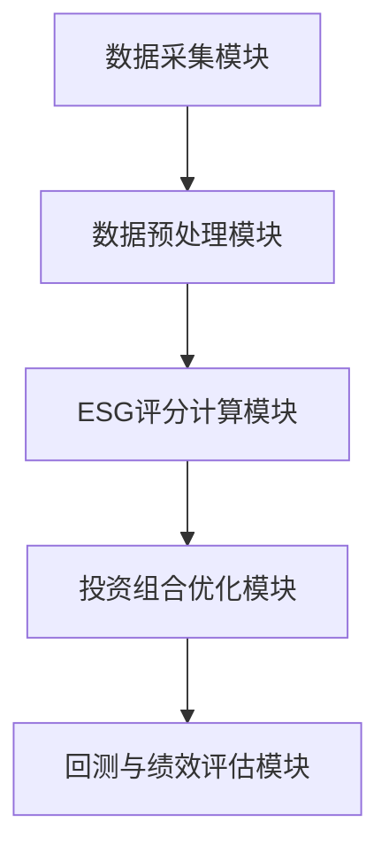

                 


# AI辅助的ESG投资组合优化与回测

> 关键词：ESG投资、人工智能、投资组合优化、回测分析、金融建模

> 摘要：本文探讨了如何利用人工智能技术优化ESG投资组合，并通过回测分析验证其有效性。文章从ESG投资的背景出发，详细分析了AI在ESG评分、投资组合优化以及回测中的应用，结合数学模型和算法原理，提供了一个完整的系统架构设计和实际案例分析。

---

# 第1章: ESG投资与AI辅助优化概述

## 1.1 ESG投资的背景与意义
### 1.1.1 ESG投资的定义与内涵
ESG（Environmental, Social, Governance）投资是一种关注环境、社会和公司治理因素的投资策略。它不仅考虑企业的财务表现，还关注企业在可持续发展方面的表现。ESG投资的目标是在实现财务回报的同时，推动社会和环境的积极变化。

### 1.1.2 ESG投资的重要性与发展趋势
随着全球对可持续发展的关注增加，ESG投资逐渐成为金融市场的重要趋势。投资者越来越关注企业的社会责任和治理结构，ESG投资不仅有助于实现长期的财务目标，还能减少投资风险。

### 1.1.3 AI技术在金融投资中的应用前景
人工智能（AI）技术在金融领域的应用日益广泛，尤其是在数据分析、预测和优化方面。AI可以帮助投资者更高效地处理大量数据，发现潜在的投资机会，并优化投资组合。

## 1.2 AI辅助ESG投资的核心概念
### 1.2.1 ESG评分与投资组合优化
ESG评分是衡量企业环境、社会和治理表现的重要指标。通过AI技术，可以对企业的ESG表现进行更精准的评估，并在此基础上优化投资组合。

### 1.2.2 AI在ESG数据处理中的作用
AI技术可以帮助处理和分析大量的ESG数据，提取关键特征，并预测企业的ESG表现。这为投资组合优化提供了更丰富的数据支持。

### 1.2.3 投资组合优化的目标与约束
投资组合优化的目标是在满足一定风险和收益约束的情况下，最大化投资回报。ESG投资组合优化需要在传统财务指标的基础上，加入ESG评分作为优化的约束条件。

## 1.3 本章小结
本章介绍了ESG投资的背景和意义，以及AI技术在ESG投资中的应用前景。通过AI技术，可以更高效地处理ESG数据，并优化投资组合。

---

# 第2章: ESG投资组合优化的数学模型与算法原理

## 2.1 投资组合优化的基本原理
### 2.1.1 投资组合优化的目标函数
投资组合优化的目标函数通常包括收益最大化和风险最小化。收益可以通过资产的预期回报率来衡量，而风险可以通过资产的波动率来衡量。

$$ \text{目标函数} = \max \left( \sum_{i=1}^{n} w_i r_i \right) $$

其中，\( w_i \) 是资产 \( i \) 的权重，\( r_i \) 是资产 \( i \) 的预期回报率。

### 2.1.2 约束条件的构建
投资组合优化需要考虑多个约束条件，例如资金约束、资产权重约束以及ESG评分约束。

$$ \sum_{i=1}^{n} w_i = 1 $$
$$ 0 \leq w_i \leq 1 $$

### 2.1.3 优化模型的数学表达
结合ESG评分，优化模型可以表示为：

$$ \max \left( \sum_{i=1}^{n} w_i r_i \right) $$
$$ \text{subject to} \quad \sum_{i=1}^{n} w_i = 1 $$
$$ \quad \quad \quad \sum_{i=1}^{n} w_i \cdot \text{ESG}_i \geq \text{ESG}_{\text{min}} $$

其中，\( \text{ESG}_{\text{min}} \) 是ESG评分的最低要求。

## 2.2 ESG评分的数学处理
### 2.2.1 ESG评分的标准化方法
ESG评分通常来自第三方评级机构，但这些评分可能需要进行标准化处理。常用的标准化方法包括z-score标准化和min-max标准化。

### 2.2.2 基于AI的ESG评分预测模型
通过机器学习算法，可以构建ESG评分预测模型。例如，使用随机森林或神经网络模型，基于企业的财务数据、新闻数据和社交媒体数据，预测企业的ESG评分。

### 2.2.3 ESG评分与投资组合权重的关系
在投资组合优化中，ESG评分可以作为权重分配的一个重要因素。高ESG评分的企业可以获得更高的权重。

## 2.3 基于AI的优化算法
### 2.3.1 遗传算法在投资组合优化中的应用
遗传算法是一种基于自然选择和遗传机制的优化算法。在投资组合优化中，可以使用遗传算法来优化资产权重。

### 2.3.2 粒子群优化算法的实现
粒子群优化（PSO）是一种基于群体智能的优化算法。在投资组合优化中，粒子群优化可以用来寻找最优资产组合。

### 2.3.3 深度学习在ESG投资组合优化中的应用
深度学习模型，如强化学习，可以用于动态投资组合优化。模型可以根据市场变化和ESG评分的变化，实时调整资产权重。

## 2.4 本章小结
本章介绍了投资组合优化的基本原理，以及如何将ESG评分纳入优化模型。通过AI算法，可以更高效地优化投资组合。

---

# 第3章: 系统架构设计

## 3.1 系统功能模块划分
### 3.1.1 数据采集与预处理模块
数据采集模块负责从第三方数据源获取企业数据，包括财务数据、ESG评分、新闻数据等。预处理模块对数据进行清洗和标准化处理。

### 3.1.2 ESG评分计算模块
ESG评分计算模块基于预处理后的数据，使用机器学习模型计算企业的ESG评分。

### 3.1.3 投资组合优化模块
投资组合优化模块基于ESG评分和财务数据，使用优化算法计算最优投资组合。

### 3.1.4 回测与绩效评估模块
回测模块对投资组合的历史表现进行回测，计算投资组合的收益、风险等绩效指标。

## 3.2 系统架构设计图
### 3.2.1 系统架构图（Mermaid图）


### 3.2.2 模块交互流程图（Mermaid图）


## 3.3 系统接口设计
### 3.3.1 数据接口规范
系统需要与第三方数据源（如ESG评级机构）对接，获取企业数据。

### 3.3.2 API接口设计
系统提供API接口，供其他系统或前端调用优化结果。

## 3.4 系统实现
### 3.4.1 环境搭建与依赖安装
需要安装Python、Pandas、NumPy、Scikit-learn等依赖库。

### 3.4.2 核心代码实现
以下是一个基于遗传算法的投资组合优化代码示例：

```python
import numpy as np
from sklearn.model_selection import train_test_split
import random

def calculate_fitness(weights, returns, esg_scores):
    portfolio_return = np.dot(weights, returns)
    portfolio_esg = np.dot(weights, esg_scores)
    return portfolio_return

def genetic_algorithm(returns, esg_scores, population_size, generations):
    n_assets = len(returns)
    population = np.random.rand(population_size, n_assets)
    
    for _ in range(generations):
        fitness = np.zeros(population_size)
        for i in range(population_size):
            weights = population[i]
            if np.sum(weights) != 1:
                weights = weights / np.sum(weights)
            fitness[i] = calculate_fitness(weights, returns, esg_scores)
        
        best = np.argmax(fitness)
        best_weights = population[best]
        if np.sum(best_weights) != 1:
            best_weights = best_weights / np.sum(best_weights)
        return best_weights
```

### 3.4.3 代码解读与优化建议
上述代码实现了一个简单的遗传算法优化器。在实际应用中，可以进一步优化算法，例如引入交叉和变异操作。

## 3.5 本章小结
本章介绍了系统架构设计，包括功能模块划分、系统架构图、接口设计和核心代码实现。

---

# 第4章: 项目实战与案例分析

## 4.1 项目背景与目标
### 4.1.1 项目背景
本项目旨在利用AI技术优化ESG投资组合，并通过回测验证其有效性。

### 4.1.2 项目目标
优化投资组合，实现收益与风险的平衡，同时满足ESG评分约束。

## 4.2 数据采集与预处理
### 4.2.1 数据来源与采集方法
数据可以从公开的金融数据源获取，如Yahoo Finance、ESG评级机构等。

### 4.2.2 数据清洗与特征提取
对数据进行清洗，处理缺失值和异常值，并提取关键特征。

### 4.2.3 数据标准化与归一化
对数据进行标准化处理，确保不同特征的可比性。

## 4.3 投资组合优化与回测
### 4.3.1 基于AI的优化算法实现
使用遗传算法优化投资组合。

### 4.3.2 投资组合回测与绩效评估
对优化后的投资组合进行回测，计算收益、风险等绩效指标。

### 4.3.3 回测结果分析与优化建议
分析回测结果，评估投资组合的表现，并提出进一步优化的建议。

## 4.4 实际案例分析
### 4.4.1 案例背景与数据准备
以某段时间内的股票数据为例，进行优化和回测。

### 4.4.2 优化过程与结果展示
展示优化过程和结果，包括优化后的资产权重和投资组合绩效。

### 4.4.3 案例总结与经验分享
总结案例经验，提出改进建议。

## 4.5 本章小结
本章通过实际案例，展示了AI辅助ESG投资组合优化与回测的具体实现过程。

---

# 第5章: 最佳实践与未来展望

## 5.1 AI辅助ESG投资的实践总结
### 5.1.1 数据处理的关键点
数据清洗和特征提取是优化过程中的关键步骤。

### 5.1.2 算法选择的注意事项
根据具体问题选择合适的算法，如遗传算法和粒子群优化。

## 5.2 小结
AI技术在ESG投资中的应用前景广阔，可以通过优化算法提高投资组合的绩效。

## 5.3 注意事项
在实际应用中，需要注意数据质量和算法的可解释性。

## 5.4 拓展阅读
建议读者进一步阅读相关领域的文献，如强化学习在金融中的应用。

---

# 作者信息

作者：AI天才研究院/AI Genius Institute & 禅与计算机程序设计艺术 /Zen And The Art of Computer Programming

---

以上是《AI辅助的ESG投资组合优化与回测》的技术博客文章的完整目录和内容概要。通过逐步分析和详细讲解，文章旨在帮助读者理解AI在ESG投资中的应用，并提供实践指导。

