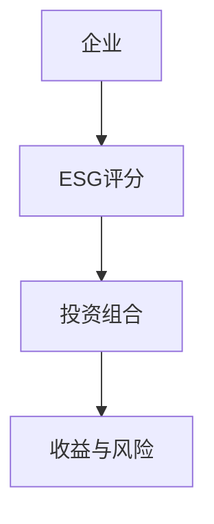
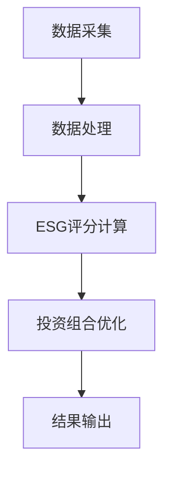
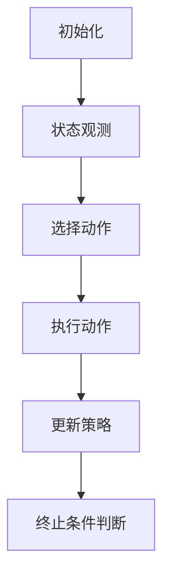
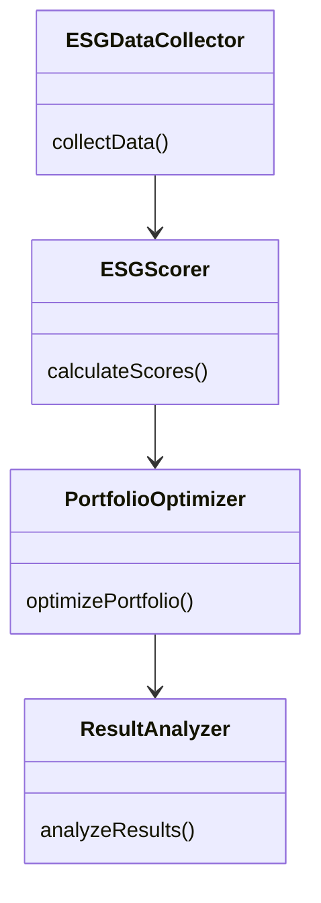
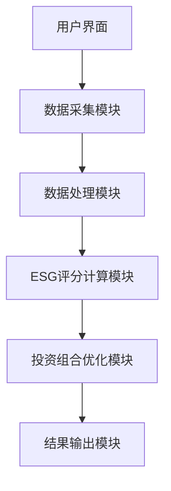
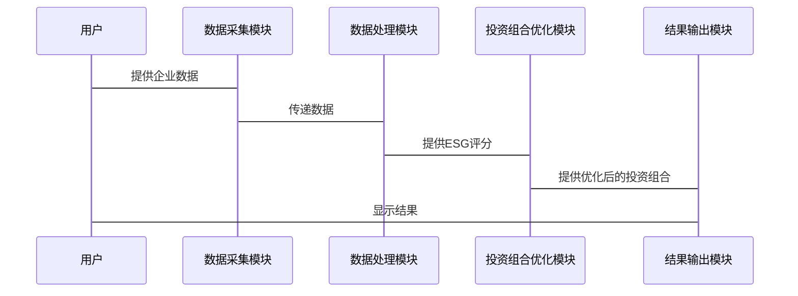

                 


# AI辅助的ESG投资组合构建工具

## 关键词：AI辅助、ESG投资、投资组合、强化学习、系统架构、项目实战

## 摘要：
本文将详细探讨如何利用人工智能技术构建高效的ESG投资组合。从背景介绍、核心概念、算法原理到系统架构和项目实战，我们将一步步分析AI辅助的ESG投资组合构建工具的关键技术，并通过实际案例展示其应用价值。本文旨在为读者提供一个全面的技术视角，帮助他们在复杂的金融环境中优化投资决策。

---

# 第一部分: AI辅助的ESG投资组合构建工具背景介绍

## 第1章: ESG投资组合构建工具概述

### 1.1 ESG投资的基本概念

#### 1.1.1 环境、社会和治理（ESG）的定义
- **环境（E）**：关注企业对环境的影响，包括碳排放、能源消耗、资源利用等。
- **社会（S）**：关注企业对社会的贡献，包括员工权益、社会责任、社区参与等。
- **治理（G）**：关注企业的治理结构，包括董事会构成、高管薪酬、公司透明度等。

#### 1.1.2 ESG投资的重要性
- ESG投资已成为全球关注的热点，投资者越来越关注企业的可持续发展能力。
- ESG因素可以显著影响企业的长期价值和风险敞口。

#### 1.1.3 ESG投资的传统方法与挑战
- 传统方法依赖人工筛选和评分，效率低且主观性强。
- 数据量大、维度复杂，传统方法难以高效处理。

### 1.2 AI在金融投资中的应用

#### 1.2.1 AI在金融领域的应用现状
- AI技术广泛应用于股票预测、风险评估、交易策略等领域。
- 机器学习和深度学习模型在金融数据分析中表现出色。

#### 1.2.2 AI在投资组合管理中的优势
- 提高数据处理效率，优化投资组合配置。
- 通过算法实时监控市场变化，降低投资风险。

#### 1.2.3 ESG投资与AI技术的结合
- 利用AI技术自动提取ESG相关数据，构建评分模型。
- 通过强化学习优化投资组合，实现可持续投资目标。

### 1.3 本章小结
本章介绍了ESG投资的基本概念和其在金融投资中的重要性，分析了传统方法的局限性，并探讨了AI技术在ESG投资中的应用优势。

---

# 第二部分: AI辅助的ESG投资组合构建工具核心概念与联系

## 第2章: 核心概念与模块分析

### 2.1 数据采集与处理模块

#### 2.1.1 数据来源与特征
- **数据来源**：包括企业财报、新闻报道、社会责任报告等。
- **数据特征**：文本数据（ESG报告）、结构化数据（财务数据）、非结构化数据（社交媒体评论）。

#### 2.1.2 数据清洗与预处理
- 数据清洗：去除缺失值、异常值和重复数据。
- 数据标准化：统一数据格式，确保数据一致性。

#### 2.1.3 数据特征提取
- **文本特征提取**：使用NLP技术提取关键词和情感分析结果。
- **结构化特征提取**：从财务数据中提取关键指标，如ROE、负债率等。

### 2.2 ESG评分计算模块

#### 2.2.1 ESG评分模型
- **模型选择**：使用回归模型或分类模型对ESG表现进行评分。
- **评分标准**：根据行业基准和企业表现，动态调整评分权重。

#### 2.2.2 评分计算公式
$$
\text{ESG评分} = \alpha \cdot E + \beta \cdot S + \gamma \cdot G
$$
其中，$\alpha$、$\beta$、$\gamma$为权重系数，$E$、$S$、$G$分别为环境、社会和治理评分。

#### 2.2.3 评分结果分析
- 分析评分分布，识别高评分和低评分企业。
- 对比不同行业的评分差异，发现行业间的ESG表现差异。

### 2.3 投资组合优化模块

#### 2.3.1 投资组合优化目标
- 最大化投资收益。
- 最小化投资风险。
- 满足ESG评分要求。

#### 2.3.2 优化算法选择
- **遗传算法**：适用于多目标优化问题。
- **强化学习**：适用于动态市场环境下的投资决策。

#### 2.3.3 优化结果评估
- 使用夏普比率评估投资组合的风险调整后收益。
- 对比不同优化策略下的投资组合表现。

### 2.4 核心概念对比分析

#### 2.4.1 模块属性特征对比表

| 模块       | 输入数据类型 | 输出数据类型 | 主要功能               |
|------------|--------------|--------------|------------------------|
| 数据采集   | 文本、结构化 | 结构化数据    | 提供标准化数据         |
| ESG评分    | 结构化数据    | 评分         | 计算企业ESG表现         |
| 投资组合优化 | 评分、财务数据 | 投资组合     | 优化投资组合配置       |

#### 2.4.2 ER实体关系图架构



#### 2.4.3 mermaid流程图展示



---

# 第三部分: AI辅助的ESG投资组合构建工具算法原理讲解

## 第3章: 算法原理与实现

### 3.1 强化学习算法在投资组合优化中的应用

#### 3.1.1 强化学习基本原理
- **定义**：通过智能体与环境的交互，学习最优策略。
- **核心组件**：状态、动作、奖励、策略。

#### 3.1.2 投资组合优化的强化学习模型
- **状态空间**：当前市场环境和投资组合表现。
- **动作空间**：买入、卖出、持有。
- **奖励函数**：投资组合收益与风险的综合评价。

#### 3.1.3 算法实现步骤



#### 3.1.4 算法实现代码示例

```python
import numpy as np
from tensorflow.keras import models, layers

# 定义强化学习模型
def build_model(input_dim):
    model = models.Sequential()
    model.add(layers.Dense(64, activation='relu', input_dim=input_dim))
    model.add(layers.Dense(32, activation='relu'))
    model.add(layers.Dense(1, activation='linear'))
    model.compile(optimizer='adam', loss='mse')
    return model
```

#### 3.1.5 数学模型和公式
$$
\text{收益} = \sum_{i=1}^{n} w_i \cdot r_i
$$
其中，$w_i$为投资权重，$r_i$为资产收益。

---

## 第3.2 遗传算法在投资组合优化中的应用

#### 3.2.1 遗传算法基本原理
- **种群初始化**：随机生成初始种群。
- **适应度评估**：计算每个个体的适应度。
- **选择操作**：选择高适应度的个体进行交配。
- **交叉与变异**：生成新个体并引入变异。
- **迭代优化**：重复上述步骤，直到达到终止条件。

#### 3.2.2 投资组合优化的遗传算法模型
- **编码方式**：二进制编码或实数编码。
- **适应度函数**：最大化收益，同时最小化风险。

#### 3.2.3 算法实现代码示例

```python
import numpy as np
from sklearn.model_selection import train_test_split

# 遗传算法实现
def genetic_algorithm(X, y, population_size=100, generations=50):
    # 初始化种群
    population = np.random.rand(population_size, X.shape[1])
    
    # 适应度评估
    for _ in range(generations):
        # 计算适应度
        fitness = np.array([np.mean(y - model.predict(X)) for model in population])
        
        # 选择操作
        selected = fitness.argsort()[:int(population_size/2)]
        
        # 交叉操作
        crossover_points = np.random.randint(0, X.shape[1], population_size//2)
        for i in range(len(selected)):
            j = (i + 1) % len(selected)
            crossover_point = crossover_points[i]
            population[selected[i], :crossover_point] = population[selected[j], :crossover_point]
        
        # 变异操作
        mutation_rate = 0.1
        for i in range(population_size):
            if np.random.random() < mutation_rate:
                mutation_point = np.random.randint(X.shape[1])
                population[i, mutation_point] += 0.1
                
    return population[fitness.argmax()]
```

---

## 第3.3 数学模型和公式

#### 3.3.1 投资组合优化的数学模型

$$
\text{目标函数：} \quad \max \sum_{i=1}^{n} w_i \cdot r_i
$$
$$
\text{约束条件：} \quad \sum_{i=1}^{n} w_i = 1, \quad w_i \geq 0
$$

其中，$w_i$为投资权重，$r_i$为资产收益。

#### 3.3.2 强化学习模型的数学表达

$$
\text{状态} = (p_1, p_2, \ldots, p_m)
$$
$$
\text{动作} = a \in \{1, 2, \ldots, m\}
$$
$$
\text{奖励} = r = \text{收益变化}
$$

---

# 第四部分: AI辅助的ESG投资组合构建工具系统架构设计

## 第4章: 系统分析与架构设计方案

### 4.1 问题场景介绍
- **问题描述**：如何利用AI技术构建高效、可持续的ESG投资组合。
- **目标**：实现一个基于AI的ESG投资组合构建工具，帮助投资者优化投资决策。

### 4.2 项目介绍
- **项目名称**：AI辅助的ESG投资组合构建工具。
- **项目目标**：提供一个自动化、智能化的ESG投资组合构建解决方案。

### 4.3 系统功能设计

#### 4.3.1 领域模型（mermaid类图）



#### 4.3.2 系统架构设计（mermaid架构图）



### 4.4 系统接口设计
- **输入接口**：接收企业数据和市场数据。
- **输出接口**：提供投资组合建议和分析结果。

### 4.5 系统交互流程（mermaid序列图）



---

# 第五部分: AI辅助的ESG投资组合构建工具项目实战

## 第5章: 项目实战

### 5.1 环境安装与配置

#### 5.1.1 安装Python环境
- 使用Anaconda或虚拟环境安装Python 3.8及以上版本。

#### 5.1.2 安装依赖库
```bash
pip install numpy pandas scikit-learn tensorflow
```

### 5.2 系统核心实现源代码

#### 5.2.1 数据采集模块

```python
import pandas as pd

def collect_data(tickers):
    data = {}
    for ticker in tickers:
        df = pd.read_csv(f'data/{ticker}.csv')
        data[ticker] = df
    return data
```

#### 5.2.2 ESG评分计算模块

```python
def calculate_esg_scores(data):
    # 示例：计算简单的ESG评分
    scores = {}
    for ticker, df in data.items():
        e = df['EnvironmentalScore'].mean()
        s = df['SocialScore'].mean()
        g = df['GovernanceScore'].mean()
        scores[ticker] = e + s + g
    return scores
```

#### 5.2.3 投资组合优化模块

```python
def optimize_portfolio(scores, returns):
    # 示例：简单优化策略
    n_assets = len(scores)
    weights = np.random.rand(n_assets)
    weights = weights / np.sum(weights)
    return weights * returns.mean()
```

### 5.3 实际案例分析与详细解读

#### 5.3.1 案例数据准备
- 数据来源：假设我们有10家企业的ESG评分和财务数据。

#### 5.3.2 模型训练与优化
- 使用遗传算法优化投资组合权重。

#### 5.3.3 结果分析
- 计算优化后的投资组合的夏普比率和最大回撤。

### 5.4 项目小结
通过实际案例分析，我们验证了AI辅助的ESG投资组合构建工具的有效性和实用性。

---

# 第六部分: 总结与展望

## 第6章: 总结与展望

### 6.1 本章总结
- 本文详细探讨了AI辅助的ESG投资组合构建工具的关键技术，包括数据采集、ESG评分计算、投资组合优化等模块。

### 6.2 未来展望
- 结合更多AI技术，如深度学习和强化学习，进一步优化投资组合。
- 探索多目标优化方法，平衡收益与风险。

---

## 第七部分: 最佳实践与小结

## 第7章: 最佳实践 tips

### 7.1 最佳实践
- 数据预处理是关键，确保数据质量和一致性。
- 选择合适的算法模型，根据实际问题调整参数。
- 定期更新模型，适应市场变化。

### 7.2 小结
通过本文的学习，读者可以掌握AI辅助的ESG投资组合构建工具的核心技术和实现方法，为实际投资决策提供有力支持。

---

## 作者：AI天才研究院/AI Genius Institute & 禅与计算机程序设计艺术 /Zen And The Art of Computer Programming

---

希望这篇文章能够为读者提供清晰的思路和实用的技术指导！

