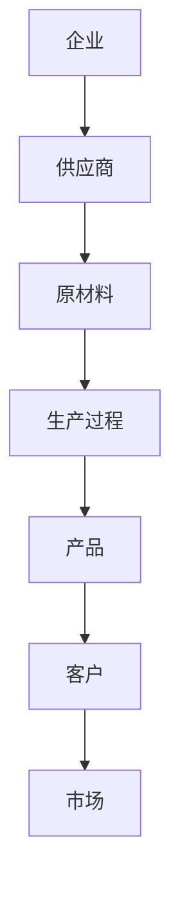
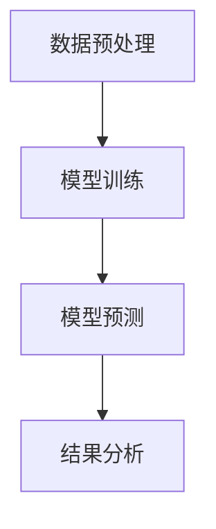
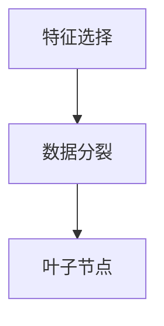
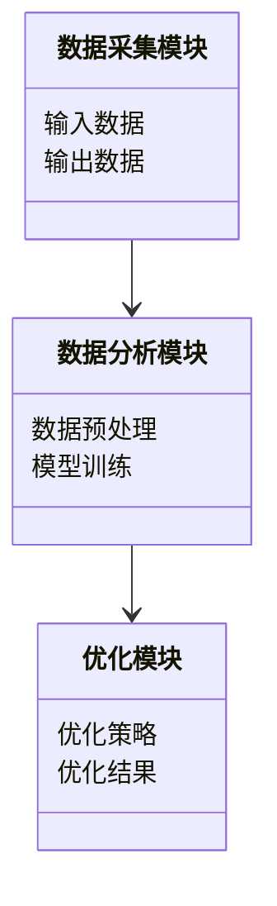
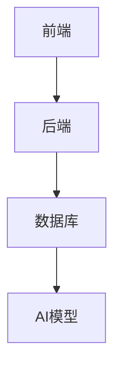

                 


# AI辅助的企业价值链分析

> 关键词：企业价值链分析，人工智能，数据分析，优化模型，商业决策

> 摘要：本文将探讨AI技术如何辅助企业优化其价值链，通过分析企业价值链的核心环节，介绍AI在数据采集、特征工程、模型训练等方面的应用，并结合实际案例，展示AI如何帮助企业提升效率、降低成本、增强竞争力。

---

## 第一章：AI辅助的企业价值链分析基础

### 1.1 企业价值链的基本概念

#### 1.1.1 企业价值链的定义
企业价值链是指企业从原材料采购、生产加工、物流配送到最终产品销售的全过程。这一链条涵盖了企业的所有业务活动，是企业实现价值创造的核心路径。

#### 1.1.2 企业价值链的核心要素
企业价值链的核心要素包括：
- **输入**：原材料、劳动力、技术和信息。
- **过程**：生产、加工、物流、销售。
- **输出**：产品或服务，以及企业利润。

#### 1.1.3 企业价值链的结构与功能
企业价值链的结构通常分为前端（如研发、采购）和后端（如生产、销售）。其功能在于通过优化各环节的效率，提升企业的整体竞争力。

---

### 1.2 AI在企业价值链分析中的作用

#### 1.2.1 AI技术对企业价值链的影响
AI技术可以通过数据分析、模式识别和自动化决策，帮助企业发现价值链中的瓶颈，优化资源配置，提升效率。

#### 1.2.2 AI在企业价值链优化中的应用场景
- **采购优化**：通过AI分析历史采购数据，预测需求，优化供应商选择。
- **生产优化**：利用机器学习预测设备故障，优化生产排程。
- **销售预测**：通过自然语言处理分析市场反馈，优化销售策略。

#### 1.2.3 AI辅助企业价值链分析的优势与挑战
优势包括提高效率、降低成本、增强决策的准确性。挑战则包括数据质量、模型选择和实施成本。

---

## 第二章：AI辅助的企业价值链分析背景

### 2.1 企业价值链分析的背景与问题背景

#### 2.1.1 企业价值链分析的背景
随着市场竞争的加剧，企业需要通过优化价值链来提高效率和降低成本。传统的价值链分析依赖人工经验，效率较低。

#### 2.1.2 传统企业价值链分析的局限性
- 数据量大，分析复杂。
- 人工经验有限，难以发现潜在优化点。
- 实时性差，难以快速响应市场变化。

#### 2.1.3 AI技术如何解决企业价值链分析的问题
AI技术可以通过大数据分析和机器学习算法，快速识别优化点，提供实时决策支持。

---

### 2.2 问题描述与解决思路

#### 2.2.1 企业价值链分析的主要问题
- 数据分散，难以整合。
- 分析模型复杂，难以快速应用。
- 优化方案缺乏动态性。

#### 2.2.2 AI辅助企业价值链分析的解决方案
- 数据采集与整合。
- 模型训练与优化。
- 实时监控与反馈。

#### 2.2.3 企业价值链分析的边界与外延
企业价值链分析的边界包括企业的内部流程，外延则涉及外部市场、供应商和客户。

---

## 第三章：AI辅助企业价值链分析的核心概念与联系

### 3.1 核心概念原理

#### 3.1.1 数据流与信息流的分析
数据流是企业价值链的核心，AI通过分析数据流，提取有价值的信息，优化各环节的效率。

#### 3.1.2 企业价值链的关键环节
- **采购**：优化供应商选择，降低采购成本。
- **生产**：预测设备故障，优化生产排程。
- **销售**：预测市场需求，优化库存管理。

#### 3.1.3 AI算法在价值链分析中的应用
- 数据挖掘：发现数据中的潜在规律。
- 机器学习：预测需求、优化排程。
- 自然语言处理：分析市场反馈。

---

### 3.2 核心概念属性特征对比表格

| 核心环节 | 传统方法 | AI辅助方法 |
|----------|----------|------------|
| 采购     | 依赖经验  | 数据驱动   |
| 生产     | 人工排程  | 自动优化    |
| 销售     | 市场调研  | 实时预测    |

---

### 3.3 实体关系图架构（Mermaid流程图）



---

## 第四章：AI辅助企业价值链分析的算法原理

### 4.1 线性回归算法

#### 4.1.1 算法原理
线性回归是一种简单而有效的回归算法，适用于预测连续型变量。其数学模型如下：

$$y = wx + b$$

其中，$y$ 是预测值，$w$ 是权重，$x$ 是输入，$b$ 是偏置。

#### 4.1.2 算法流程图



#### 4.1.3 线性回归代码示例

```python
import numpy as np
from sklearn.linear_model import LinearRegression

# 数据准备
X = np.array([[1], [2], [3], [4], [5]])
y = np.array([2, 4, 5, 4, 6])

# 模型训练
model = LinearRegression()
model.fit(X, y)

# 预测
print(model.predict([[6]]))
```

---

### 4.2 决策树算法

#### 4.2.1 算法原理
决策树是一种基于树结构的分类算法，适用于处理复杂的数据关系。其核心思想是通过特征分裂，逐步缩小数据范围。

#### 4.2.2 决策树流程图



#### 4.2.3 决策树代码示例

```python
from sklearn.tree import DecisionTreeClassifier

# 数据准备
X = np.array([[1, 0], [0, 1], [1, 1], [0, 0]])
y = np.array([0, 1, 1, 0])

# 模型训练
model = DecisionTreeClassifier()
model.fit(X, y)

# 预测
print(model.predict([[1, 1]]))
```

---

## 第五章：AI辅助企业价值链分析的系统架构设计

### 5.1 项目背景与目标

#### 5.1.1 项目背景
本项目旨在通过AI技术优化企业价值链，提升企业效率和竞争力。

#### 5.1.2 项目目标
- 数据采集与整合。
- 模型训练与优化。
- 系统开发与部署。

---

### 5.2 系统功能设计

#### 5.2.1 领域模型（Mermaid类图）



---

### 5.3 系统架构设计（Mermaid架构图）



---

## 第六章：AI辅助企业价值链分析的项目实战

### 6.1 环境搭建与数据预处理

#### 6.1.1 环境搭建
安装Python和相关库（如NumPy、Scikit-learn）。

#### 6.1.2 数据预处理
清洗数据，处理缺失值和异常值。

---

### 6.2 模型训练与优化

#### 6.2.1 模型训练
使用训练数据训练AI模型。

#### 6.2.2 模型优化
通过调整参数和评估指标，优化模型性能。

---

### 6.3 系统实现与案例分析

#### 6.3.1 系统实现
编写代码实现AI辅助的企业价值链分析系统。

#### 6.3.2 案例分析
通过实际案例，展示AI如何优化企业的价值链。

---

## 第七章：总结与展望

### 7.1 最佳实践 tips

- 数据质量是AI分析的基础，需重视数据清洗和预处理。
- 模型调优是关键，需结合业务需求选择合适的算法。
- 未来发展方向包括AI与物联网的结合，以及更复杂的优化模型。

### 7.2 小结
本文详细介绍了AI技术在企业价值链分析中的应用，从理论到实践，展示了如何通过AI优化企业的各个环节。

### 7.3 注意事项
- 数据隐私和安全需高度重视。
- 模型解释性需加强，便于业务人员理解。
- 需结合企业实际情况，灵活调整AI方案。

### 7.4 拓展阅读
推荐阅读《机器学习实战》和《深度学习》等书籍，进一步提升AI技术应用能力。

---

## 作者：AI天才研究院/AI Genius Institute & 禅与计算机程序设计艺术 /Zen And The Art of Computer Programming

---

本文通过系统的分析和实践，展示了AI技术在企业价值链分析中的巨大潜力和实际应用价值。希望读者能够通过本文，深入了解AI如何助力企业优化价值链，提升竞争力。

