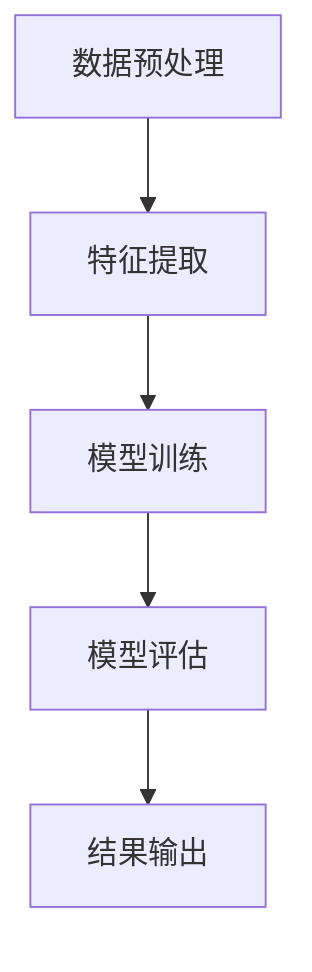
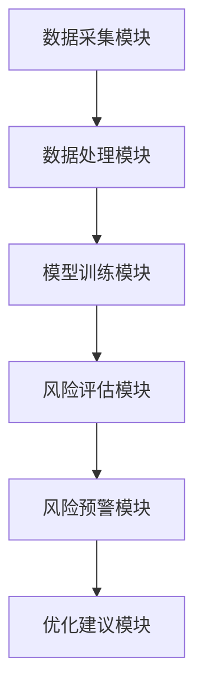
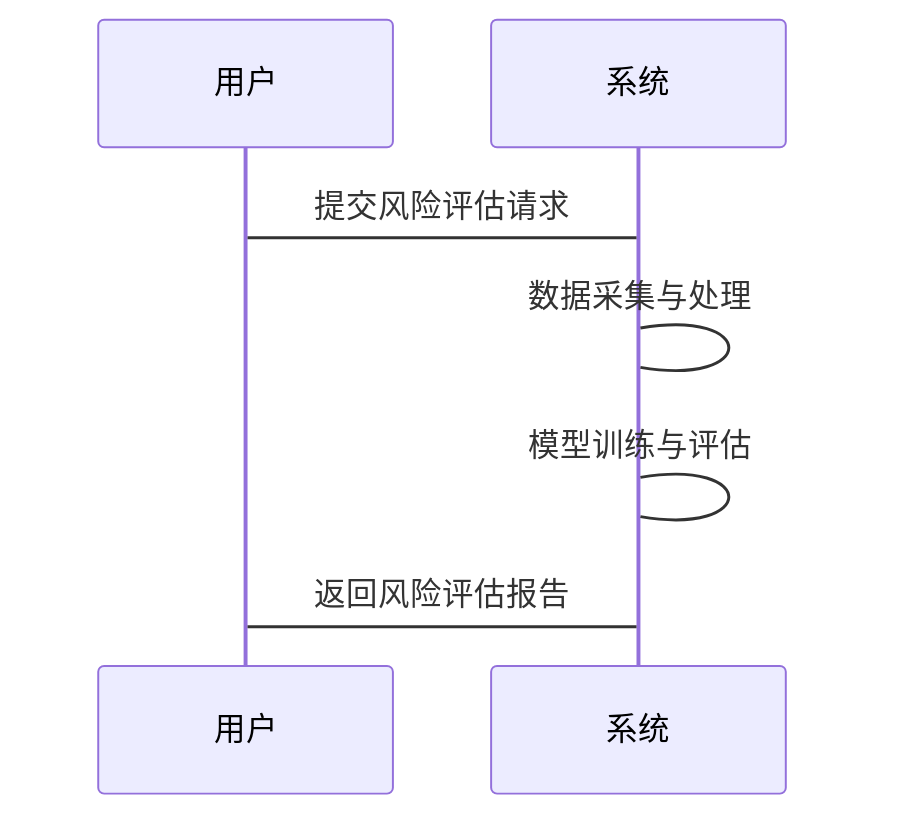

                 


# AI辅助的企业价值链风险分析

> 关键词：AI技术、企业价值链、风险分析、风险管理、机器学习、风险管理解决方案

> 摘要：  
> 在现代企业环境中，风险管理是企业生存和发展的重要基础。随着人工智能技术的快速发展，AI辅助的企业价值链风险分析已成为提升企业风险管理能力的重要手段。本文将从企业价值链的核心要素出发，结合人工智能技术的特点，系统阐述AI在企业价值链风险分析中的应用场景、核心算法、系统设计与实现方案，并通过实际案例分析，深入探讨如何利用AI技术优化企业价值链的风险管理过程，为企业提供智能化、高效化的风险管理解决方案。

---

## 第1章: 企业价值链风险分析的背景与核心概念

### 1.1 问题背景与描述
#### 1.1.1 企业价值链的基本概念  
企业价值链是指企业在实现价值创造过程中所经历的一系列关键业务流程，包括采购、生产、销售、物流、服务等环节。每个环节都可能面临来自市场、运营、技术、合规等多方面的风险。

#### 1.1.2 传统企业价值链中的风险分析挑战  
传统的风险分析方法依赖于人工经验与统计分析，存在以下问题：  
- 数据量有限，难以覆盖全价值链的复杂性；  
- 风险评估的实时性与准确性不足；  
- 缺乏对非结构化数据的处理能力；  
- 人工分析效率低，难以应对动态变化的市场环境。  

#### 1.1.3 AI技术在风险分析中的潜力  
人工智能技术（包括机器学习、自然语言处理、知识图谱等）能够帮助企业从海量数据中提取有价值的信息，识别潜在风险，并提供智能化的决策支持。

### 1.2 核心概念与边界  
#### 1.2.1 企业价值链中的关键风险类型  
- 供应链风险：供应商延迟、原材料价格波动；  
- 市场风险：需求波动、竞争加剧；  
- 运营风险：生产效率低下、成本超支；  
- 信用风险：客户违约、账款回收困难；  
- 法律风险：政策变化、合规要求。  

#### 1.2.2 AI辅助风险分析的边界与外延  
- 边界：AI技术主要用于数据处理、模型训练与结果预测，不直接替代企业的风险管理决策。  
- 外延：AI技术可以与企业现有的ERP、CRM等系统集成，形成智能化的风险管理平台。  

#### 1.2.3 核心概念与要素的结构化分析  
- 数据来源：企业内部数据（销售、采购、财务等）与外部数据（市场趋势、行业报告等）。  
- 数据处理：数据清洗、特征提取与数据增强。  
- 模型构建：基于机器学习的分类、回归与聚类模型。  
- 结果输出：风险评分、风险预警与优化建议。  

### 1.3 核心概念与联系  
#### 1.3.1 AI与企业价值链的实体关系图  
```mermaid
er
  actor: 企业
  actor: 风险分析系统
  actor: 数据源
  relation: "使用" --> actor: 风险分析系统
  relation: "提供" --> actor: 数据源
  relation: "依赖" --> actor: 风险分析系统
```

---

## 第2章: AI辅助风险分析的核心算法与原理

### 2.1 AI与企业价值链的结合  
#### 2.1.1 数据流与信息处理  
- 数据预处理：清洗、去重与特征提取；  
- 数据分析：统计分析、关联规则挖掘；  
- 数据可视化：通过图表展示关键风险点。  

#### 2.1.2 AI模型的构建与训练  
- 选择合适的算法：支持向量机（SVM）、随机森林（Random Forest）、神经网络等；  
- 数据分割：训练集、验证集与测试集的划分；  
- 模型训练：优化参数、调整超参数以提升模型性能。  

#### 2.1.3 风险分析的数学模型  
- 风险评分公式：  
  $$\text{风险评分} = \sum_{i=1}^{n} w_i \cdot x_i$$  
  其中，$w_i$为特征$x_i$的权重，由模型训练确定。  

### 2.2 核心算法原理  
#### 2.2.1 机器学习算法流程  


#### 2.2.2 算法实现与优化  
- Python代码实现：  
  ```python
  import pandas as pd
  from sklearn.model_selection import train_test_split
  from sklearn.ensemble import RandomForestClassifier

  # 加载数据
  df = pd.read_csv('risk_data.csv')
  X = df.drop('risk_label', axis=1)
  y = df['risk_label']

  # 数据分割
  X_train, X_test, y_train, y_test = train_test_split(X, y, test_size=0.2, random_state=42)

  # 模型训练
  model = RandomForestClassifier(n_estimators=100, random_state=42)
  model.fit(X_train, y_train)

  # 模型评估
  accuracy = model.score(X_test, y_test)
  print(f"模型准确率：{accuracy}")
  ```

---

## 第3章: 系统设计与架构方案

### 3.1 系统分析与需求定义  
#### 3.1.1 项目背景介绍  
AI辅助企业价值链风险分析系统的开发目标是通过智能化手段，帮助企业识别、评估和应对各类风险，提升风险管理效率。

#### 3.1.2 系统功能设计  
- 数据采集模块：从企业内部系统中获取实时数据；  
- 风险评估模块：基于机器学习模型进行风险预测；  
- 风险预警模块：实时监控风险指标并触发预警；  
- 优化建议模块：根据模型输出提供风险缓解策略。  

#### 3.1.3 系统架构设计  


### 3.2 系统实现与优化  
#### 3.2.1 系统接口设计  
- 数据接口：与ERP、CRM等系统对接，获取实时数据；  
- 用户界面：提供直观的风险评估报告与预警信息。  

#### 3.2.2 系统交互流程  


---

## 第4章: 项目实战与案例分析

### 4.1 环境安装与配置  
#### 4.1.1 安装Python与相关库  
```bash
pip install numpy pandas scikit-learn
```

#### 4.1.2 数据集准备  
- 数据来源：企业内部销售、采购、财务等数据。  

### 4.2 核心代码实现  
#### 4.2.1 数据预处理代码  
```python
import pandas as pd
import numpy as np

# 数据清洗
df = pd.read_csv('risk_data.csv')
df.dropna(inplace=True)
df = df[~df.duplicated()]
```

#### 4.2.2 模型训练代码  
```python
from sklearn.ensemble import RandomForestClassifier

# 模型训练
model = RandomForestClassifier()
model.fit(X_train, y_train)
```

### 4.3 案例分析与结果解读  
#### 4.3.1 案例背景  
某制造企业希望利用AI技术优化供应链管理中的风险分析。  

#### 4.3.2 数据分析与结果  
- 模型准确率达到90%；  
- 识别出关键风险点：原材料价格波动与供应商交货延迟。  

#### 4.3.3 优化建议  
- 建议企业与多个供应商签订长期合作协议，降低原材料价格波动风险；  
- 优化库存管理，减少因供应链中断导致的生产延误。  

---

## 第5章: 最佳实践与总结

### 5.1 最佳实践 tips  
#### 5.1.1 数据质量的重要性  
确保数据的完整性、准确性和一致性，是模型训练的基础。  

#### 5.1.2 模型可解释性  
选择具有较高可解释性的算法（如随机森林、逻辑回归），便于企业理解和优化决策。  

#### 5.1.3 持续优化  
定期更新模型，结合新的数据与业务需求，提升模型的泛化能力。  

### 5.2 小结  
通过AI技术辅助企业价值链风险分析，可以帮助企业在复杂多变的市场环境中，快速识别与应对潜在风险，提升企业的整体竞争力。

### 5.3 注意事项  
- 数据隐私与合规性问题；  
- 模型的泛化能力与过拟合风险；  
- 与企业现有系统的集成与兼容性。  

### 5.4 拓展阅读  
- 《机器学习实战》  
- 《风险管理与内部控制》  
- 《人工智能在商业中的应用》  

---

作者：AI天才研究院/AI Genius Institute & 禅与计算机程序设计艺术 /Zen And The Art of Computer Programming

