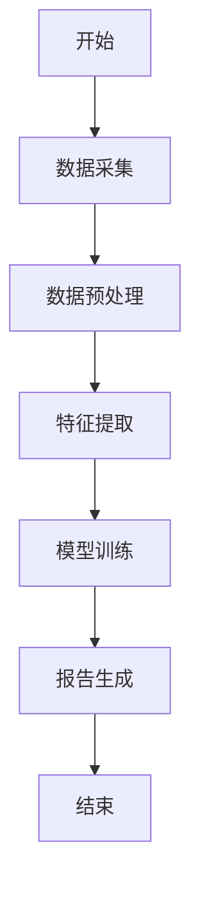
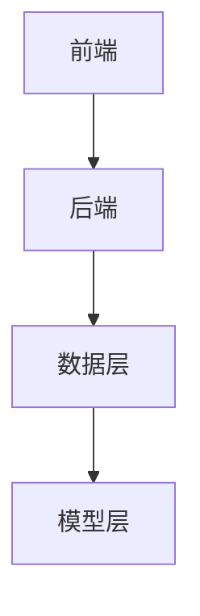
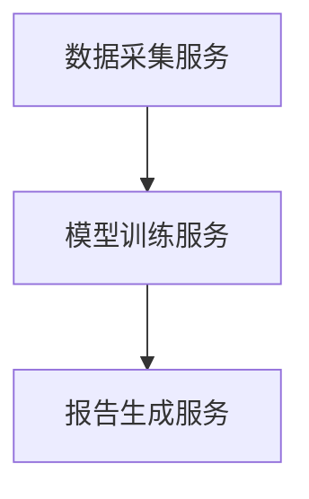
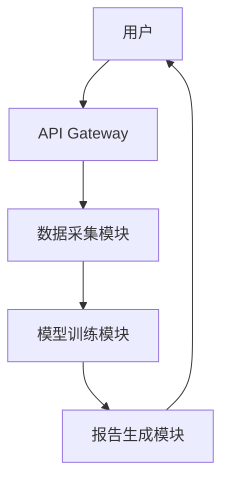

                 


# AI辅助的企业估值报告自动生成系统

> 关键词：AI辅助、企业估值、自动报告生成、机器学习、自然语言处理、系统架构设计

> 摘要：本文深入探讨了如何利用AI技术构建一个自动生成企业估值报告的系统，结合NLP和机器学习算法，详细分析了系统的背景、核心算法原理、系统架构设计以及实际项目实现。通过案例分析和代码实现，展示了AI在企业估值中的巨大潜力，为读者提供了一套完整的解决方案。

---

## 第一部分: AI辅助的企业估值报告自动生成系统概述

### 第1章: 企业估值与AI辅助的背景介绍

#### 1.1 问题背景与描述

企业在不同的生命周期阶段需要进行估值，以支持融资、并购、上市等重要决策。传统的估值方法依赖于人工分析，耗时且成本高昂。此外，企业报告中的文本信息（如财务数据、市场趋势、行业分析）通常需要手动提取和处理，容易出错且效率低下。因此，开发一个能够自动提取、分析和生成企业估值报告的系统，具有重要的现实意义。

#### 1.2 问题解决与边界

##### 1.2.1 AI辅助企业估值的核心问题

- **数据提取与处理**：如何从企业报告中提取关键数据，如财务指标、市场数据等。
- **模型训练与预测**：如何利用机器学习模型对企业价值进行预测。
- **报告生成**：如何将预测结果转化为结构化的估值报告。

##### 1.2.2 系统的边界与外延

- **边界**：系统仅处理企业估值相关的数据，不涉及企业的实际财务操作。
- **外延**：系统的输出仅为估值报告，不涉及具体的投资决策。

##### 1.2.3 核心概念与组成要素

- **数据源**：企业财务报表、行业数据、市场趋势。
- **模型算法**：自然语言处理（NLP）、机器学习模型。
- **系统模块**：数据采集模块、模型训练模块、报告生成模块。

---

### 第2章: AI辅助企业估值的核心算法原理

#### 2.1 算法原理概述

##### 2.1.1 基于NLP的企业估值模型

- **文本预处理**：分词、去停用词、实体识别。
- **特征提取**：利用TF-IDF提取关键词。
- **模型训练**：使用BERT进行文本编码，提取企业报告中的语义信息。

##### 2.1.2 基于机器学习的估值预测

- **特征工程**：将文本特征和财务指标结合，构建特征向量。
- **模型选择**：使用随机森林、XGBoost进行回归预测。
- **优化与调参**：通过网格搜索优化模型参数。

##### 2.1.3 深度学习模型的优化

- **模型结构**：使用LSTM或Transformer进行序列建模。
- **损失函数**：均方误差（MSE）。
- **优化器**：Adam优化器。

#### 2.2 算法流程图



#### 2.3 数学模型与公式

##### 2.3.1 损失函数公式

$$
L = \frac{1}{n}\sum_{i=1}^{n}(y_i - \hat{y_i})^2
$$

##### 2.3.2 优化器公式

$$
\theta_{new} = \theta - \eta \cdot \nabla L
$$

---

### 第3章: 系统分析与架构设计

#### 3.1 系统功能模块

##### 3.1.1 数据采集模块

- **功能**：从企业报告中提取文本数据。
- **输入**：企业报告文档。
- **输出**：结构化数据。

##### 3.1.2 模型训练模块

- **功能**：训练NLP和机器学习模型。
- **输入**：特征向量、标签。
- **输出**：训练好的模型。

##### 3.1.3 报告生成模块

- **功能**：将模型预测结果转化为估值报告。
- **输入**：模型预测值。
- **输出**：结构化报告。

##### 3.1.4 用户交互模块

- **功能**：用户输入查询，系统生成报告。
- **输入**：用户请求。
- **输出**：估值报告。

#### 3.2 系统架构设计

##### 3.2.1 分层架构图



##### 3.2.2 微服务架构图



##### 3.2.3 组件交互图



---

### 第4章: 项目实战与代码实现

#### 4.1 环境安装与配置

##### 4.1.1 Python环境搭建

```bash
python --version
```

##### 4.1.2 依赖库安装

```bash
pip install numpy pandas scikit-learn transformers
```

##### 4.1.3 开发环境配置

```bash
jupyter notebook
```

#### 4.2 核心代码实现

##### 4.2.1 数据预处理代码

```python
import pandas as pd
import numpy as np

def preprocess_data(df):
    # 假设df是企业报告数据
    df['text'] = df['text'].apply(lambda x: x.lower())
    df['text'] = df['text'].apply(lambda x: x.split())
    return df
```

##### 4.2.2 模型训练代码

```python
from sklearn.ensemble import RandomForestRegressor

model = RandomForestRegressor(n_estimators=100, random_state=42)
model.fit(X_train, y_train)
```

##### 4.2.3 报告生成代码

```python
def generate_report(model, features, target):
    prediction = model.predict(features)
    report = f"企业估值预测值为：{prediction[0]}"
    return report
```

#### 4.3 案例分析与解读

##### 4.3.1 案例背景介绍

假设我们有一家科技公司，需要对其估值进行预测。数据包括公司财务数据、市场趋势和行业分析。

##### 4.3.2 数据分析与处理

使用Python进行数据清洗和特征工程，提取关键指标如营收增长率、净利润率等。

##### 4.3.3 结果解读

通过模型预测，生成企业的估值报告，包括关键指标分析、预测值和建议。

---

## 第五章: 最佳实践与小结

### 5.1 最佳实践

- **数据质量**：确保数据的准确性和完整性。
- **模型调优**：通过交叉验证优化模型参数。
- **系统性能**：优化系统架构，提高处理效率。

### 5.2 小结

本文详细介绍了AI辅助的企业估值报告自动生成系统的构建过程，从背景分析、算法原理到系统设计和项目实现，为读者提供了一套完整的解决方案。通过实际案例分析，展示了系统的应用价值和潜力。

### 5.3 注意事项

- **数据隐私**：确保数据的安全性和隐私性。
- **模型解释性**：提高模型的可解释性，便于用户理解。
- **持续优化**：定期更新模型，适应市场变化。

### 5.4 拓展阅读

- 《深度学习实战》
- 《自然语言处理入门》
- 《系统架构设计精要》

---

作者：AI天才研究院（AI Genius Institute） & 禅与计算机程序设计艺术（Zen And The Art of Computer Programming）

