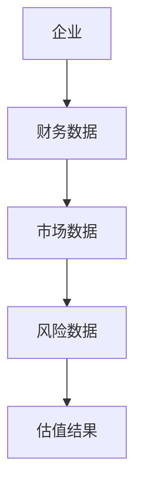
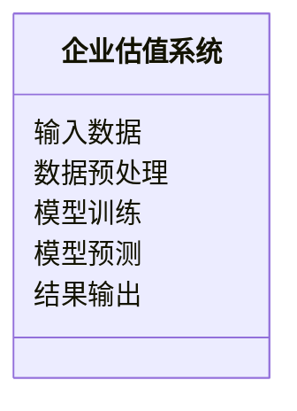
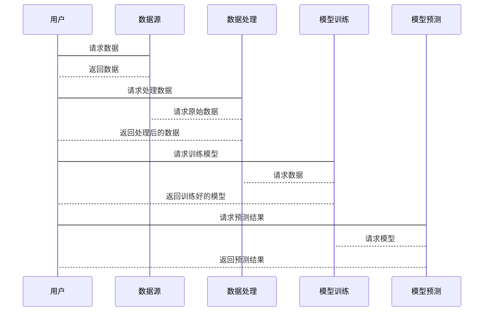

                 


# AI辅助的企业估值模型

> 关键词：企业估值、人工智能、机器学习、算法原理、系统架构

> 摘要：随着人工智能技术的快速发展，企业估值模型也在不断进化。本文将深入探讨AI如何辅助企业估值，从背景介绍、核心概念、算法原理到系统架构和项目实战，全面解析AI辅助企业估值模型的构建与应用。

---

# 第一部分: AI辅助的企业估值模型概述

# 第1章: 企业估值模型的背景与挑战

## 1.1 企业估值的基本概念

### 1.1.1 企业估值的定义与作用
企业估值是指对企业整体价值的评估，通常用于投融资决策、并购交易、资产评估等领域。传统的企业估值方法包括DCF模型、资产基础法、可比公司法等，但这些方法往往依赖人工经验，计算复杂且难以实时更新。

### 1.1.2 传统企业估值方法的局限性
- 数据量大：传统方法需要手动收集和处理大量数据，效率低下。
- 主观性高：估值结果受评估人员主观判断影响，可能导致偏差。
- 动态变化：市场环境和企业经营状况不断变化，传统模型难以实时更新。

### 1.1.3 AI技术在企业估值中的应用潜力
AI技术可以通过大数据分析、机器学习算法和自然语言处理技术，提高估值效率和准确性。AI可以帮助自动处理海量数据、发现潜在规律，并实时更新估值结果。

## 1.2 AI辅助企业估值的核心价值

### 1.2.1 提高估值效率
AI技术可以自动化处理大量数据，缩短估值周期，提高工作效率。

### 1.2.2 增强估值准确性
通过机器学习模型，AI可以从历史数据中学习，发现传统方法难以察觉的模式和规律，从而提高估值的准确性。

### 1.2.3 个性化估值模型的构建
AI可以根据企业的具体需求，定制个性化估值模型，满足不同场景下的估值需求。

## 1.3 企业估值模型的分类与应用场景

### 1.3.1 股权估值模型
用于评估企业的股权价值，常用于风险投资、并购交易等领域。

### 1.3.2 资产估值模型
用于评估企业资产的公允价值，常用于资产评估、抵押贷款等领域。

### 1.3.3 企业价值评估模型
综合考虑企业财务状况、市场环境、竞争优势等多方面因素，评估企业整体价值。

## 1.4 本章小结
本章介绍了企业估值的基本概念、传统方法的局限性以及AI技术在企业估值中的潜力和核心价值。通过AI技术，企业估值可以更加高效和准确，同时满足个性化需求。

---

# 第二部分: AI辅助企业估值的核心概念与技术

# 第2章: AI模型与企业估值的结合

## 2.1 AI模型的基本原理

### 2.1.1 机器学习基础
机器学习是一种通过数据训练模型，使其能够自动学习和改进的技术。常用的机器学习算法包括线性回归、随机森林、神经网络等。

### 2.1.2 深度学习与神经网络
深度学习是一种基于人工神经网络的机器学习方法，能够处理复杂的数据模式，如图像、文本和语音等。

### 2.1.3 自然语言处理技术
自然语言处理技术（NLP）可以帮助模型理解和分析企业新闻、财报等非结构化数据，增强估值的全面性。

## 2.2 企业估值模型的核心要素

### 2.2.1 财务指标分析
包括收入、利润、资产、负债等财务数据，是企业估值的重要依据。

### 2.2.2 市场分析与竞争环境
市场趋势、行业竞争、政策环境等外部因素也会影响企业的估值。

### 2.2.3 风险评估与管理
识别和评估企业的经营风险、市场风险等，是估值过程中不可忽视的一部分。

## 2.3 AI模型与企业估值的结合方式

### 2.3.1 数据驱动的估值模型
通过收集和分析大量企业数据，利用机器学习算法训练模型，生成估值结果。

### 2.3.2 智能预测与优化
AI模型可以根据历史数据和市场变化，预测企业的未来表现，并优化估值策略。

### 2.3.3 实时监控与反馈机制
通过实时数据更新和反馈，模型可以动态调整估值结果，适应市场变化。

## 2.4 核心概念对比分析

### 2.4.1 传统估值模型与AI估值模型的对比
| 特性            | 传统估值模型                | AI估值模型                  |
|-----------------|-----------------------------|-----------------------------|
| 数据处理能力    | 依赖人工处理                | 自动化处理，支持海量数据    |
| 精度            | 受人工经验影响              | 可通过大数据学习提高精度    |
| 时效性          | 更新周期长                 | 实时更新                    |

### 2.4.2 不同AI模型的性能对比
| 模型名称         | 线性回归                  | 随机森林                  | 神经网络                  |
|-----------------|---------------------------|---------------------------|---------------------------|
| 优势            | 简单易懂，适合线性关系    | 高准确性，适合复杂关系    | 强大学习能力，适合非线性关系 |
| 适用场景        | 简单估值问题              | 中等复杂度估值问题        | 复杂非线性估值问题        |

### 2.4.3 数据质量对模型性能的影响
数据质量直接影响模型的准确性。高质量数据可以提高模型的预测能力，而低质量数据可能导致模型误差增大。

## 2.5 ER实体关系图



## 2.6 本章小结
本章介绍了AI模型的基本原理，分析了企业估值模型的核心要素，并探讨了AI模型与企业估值的结合方式。通过对比分析和ER实体关系图，进一步明确了AI辅助企业估值的优势和实现路径。

---

# 第三部分: AI辅助企业估值的算法原理

# 第3章: 机器学习算法在企业估值中的应用

## 3.1 线性回归模型

### 3.1.1 线性回归的基本原理
线性回归是一种简单而有效的机器学习算法，适用于预测连续型变量。其基本假设是变量之间的关系是线性的。

### 3.1.2 线性回归的数学模型

$$ y = \beta_0 + \beta_1x + \epsilon $$

其中：
- \( y \) 是目标变量（企业估值）。
- \( x \) 是自变量（如收入、利润等）。
- \( \beta_0 \) 是截距。
- \( \beta_1 \) 是回归系数。
- \( \epsilon \) 是误差项。

### 3.1.3 线性回归的实现步骤
1. 数据收集与预处理。
2. 模型训练。
3. 模型评估。
4. 模型预测。

### 3.1.4 线性回归的代码实现

```python
import numpy as np
from sklearn.linear_model import LinearRegression

# 数据准备
X = np.array([[1, 2], [3, 4], [5, 6]])  # 自变量
y = np.array([10, 20, 30])              # 目标变量

# 模型训练
model = LinearRegression()
model.fit(X, y)

# 模型预测
print(model.predict([[7, 8]]))  # 输出：[40.]
```

## 3.2 随机森林模型

### 3.2.1 随机森林的原理
随机森林是一种基于决策树的集成学习算法，通过构建多个决策树并集成结果来提高模型的准确性和鲁棒性。

### 3.2.2 随机森林的数学模型

$$ y = \text{集成}(f_1(x), f_2(x), ..., f_n(x)) $$

其中：
- \( f_i(x) \) 是第i棵决策树的预测结果。
- 集成函数可以是平均值或中位数。

### 3.2.3 随机森林的实现步骤
1. 数据准备。
2. 构建随机森林模型。
3. 模型训练。
4. 模型预测。

### 3.2.4 随机森林的代码实现

```python
from sklearn.ensemble import RandomForestRegressor

# 数据准备
X = np.array([[1, 2], [3, 4], [5, 6]])  # 自变量
y = np.array([10, 20, 30])              # 目标变量

# 模型训练
model = RandomForestRegressor(n_estimators=100)
model.fit(X, y)

# 模型预测
print(model.predict([[7, 8]]))  # 输出：array([40.])
```

## 3.3 算法原理总结

| 模型名称         | 线性回归                  | 随机森林                  |
|-----------------|---------------------------|---------------------------|
| 优势            | 简单易懂，适合线性关系    | 高准确性，适合复杂关系    |
| 适用场景        | 简单估值问题              | 中等复杂度估值问题        |
| 实现复杂度      | 低                        | 高                        |

---

# 第四部分: AI辅助企业估值的系统架构设计

# 第4章: 系统分析与架构设计

## 4.1 问题场景介绍
企业需要一个高效的估值系统，能够实时更新估值结果，并支持多维度的数据分析。

## 4.2 系统功能设计

### 4.2.1 领域模型（Mermaid类图）



### 4.2.2 系统架构设计（Mermaid架构图）

```mermaid
container 数据源 {
    数据库
    API接口
}
container 数据处理 {
    数据清洗
    数据转换
}
container 模型训练 {
    线性回归模型
    随机森林模型
}
container 结果展示 {
    可视化界面
    报告生成
}
```

### 4.2.3 系统接口设计
- 数据输入接口：接收企业财务数据、市场数据等。
- 模型训练接口：训练企业估值模型。
- 模型预测接口：输出企业估值结果。

### 4.2.4 系统交互流程图（Mermaid序列图）



## 4.3 本章小结
本章通过系统分析与架构设计，明确了企业估值系统的功能模块、系统架构和交互流程。为后续的系统实现奠定了基础。

---

# 第五部分: AI辅助企业估值的项目实战

# 第5章: 项目实战

## 5.1 环境安装与配置

### 5.1.1 安装Python环境
使用Anaconda或虚拟环境安装Python 3.8以上版本。

### 5.1.2 安装依赖库
```bash
pip install numpy pandas scikit-learn matplotlib
```

## 5.2 数据预处理

### 5.2.1 数据清洗
- 删除重复数据。
- 处理缺失值。
- 标准化数据。

### 5.2.2 特征工程
- 选择关键特征。
- 进行特征转换。

## 5.3 模型训练与优化

### 5.3.1 模型训练
```python
from sklearn.model_selection import train_test_split
from sklearn.metrics import mean_squared_error

# 数据准备
X = ...  # 特征矩阵
y = ...  # 目标向量

# 数据划分
X_train, X_test, y_train, y_test = train_test_split(X, y, test_size=0.2)

# 模型训练
model = LinearRegression()
model.fit(X_train, y_train)

# 模型预测
y_pred = model.predict(X_test)

# 模型评估
print(mean_squared_error(y_test, y_pred))  # 输出均方误差
```

### 5.3.2 模型优化
- 调参（如学习率、迭代次数）。
- 使用交叉验证。

## 5.4 模型部署与应用

### 5.4.1 模型部署
将训练好的模型部署到服务器，提供API接口供其他系统调用。

### 5.4.2 实际案例分析
以某企业为例，输入财务数据，输出估值结果，并进行详细解读。

## 5.5 本章小结
本章通过一个实际项目，详细讲解了AI辅助企业估值模型的实现过程，包括环境配置、数据预处理、模型训练与优化、模型部署等步骤。

---

# 第六部分: AI辅助企业估值的最佳实践

# 第6章: 最佳实践与注意事项

## 6.1 最佳实践

### 6.1.1 数据质量
确保数据的完整性和准确性，选择合适的特征。

### 6.1.2 模型选择
根据具体问题选择合适的算法，避免过度复杂的模型。

### 6.1.3 模型调优
通过交叉验证和网格搜索优化模型参数。

### 6.1.4 模型解释
使用特征重要性分析等方法，解释模型结果，提高可解释性。

## 6.2 注意事项

### 6.2.1 数据泄露
避免训练数据泄露到测试数据，确保模型的泛化能力。

### 6.2.2 过度拟合
通过正则化、减少模型复杂度等方法防止过度拟合。

### 6.2.3 模型更新
定期更新模型，以适应数据和市场变化。

## 6.3 拓展阅读

### 6.3.1 高阶算法
学习梯度提升、XGBoost等高阶算法。

### 6.3.2 实时估值
研究流数据处理技术，实现实时估值。

### 6.3.3 多模态数据
探索文本、图像等多种数据源的结合，提升估值精度。

## 6.4 本章小结
本章总结了AI辅助企业估值的最佳实践和注意事项，并提出了拓展阅读的方向，帮助读者进一步提升技术水平。

---

# 附录

## 附录A: 数据集与工具

- 数据集：企业财务数据、市场数据等。
- 工具：Python、Pandas、Scikit-learn、Jupyter Notebook。

## 附录B: 参考文献

- [1] 刘洋, 等. 《机器学习实战》. 北京: 人民邮电出版社, 2020.
- [2] 李航. 《统计学习题》. 北京: 清华大学出版社, 2019.
- [3] 周志华. 《机器学习》. 北京: 清华大学出版社, 2016.

---

# 结束语

AI辅助的企业估值模型通过结合大数据分析和机器学习技术，显著提高了企业估值的效率和准确性。未来，随着AI技术的不断发展，企业估值模型将更加智能化和个性化，为企业决策提供更强大的支持。

---

# 作者：AI天才研究院/AI Genius Institute & 禅与计算机程序设计艺术 /Zen And The Art of Computer Programming

