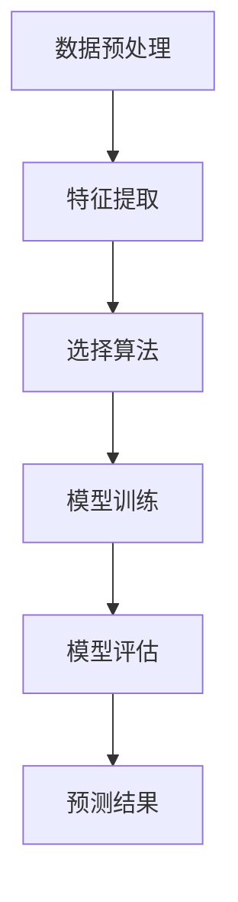
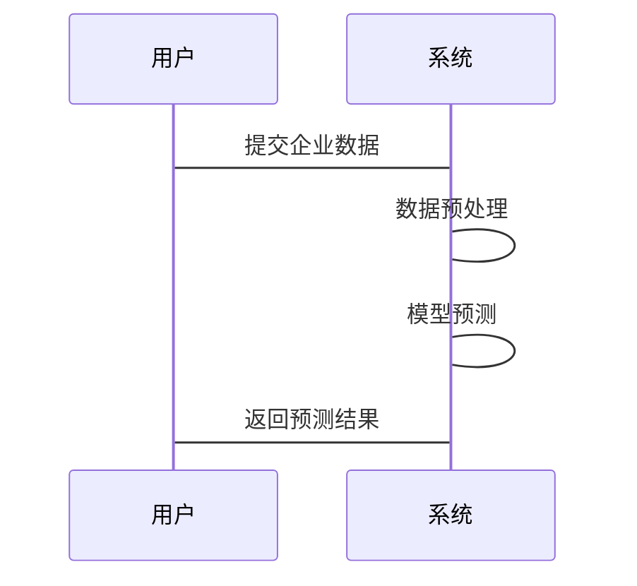

                 


# AI辅助的企业信用周期预测

> 关键词：AI，企业信用周期，预测，机器学习，信用风险，数据分析

> 摘要：本文探讨了如何利用人工智能技术辅助企业信用周期预测，分析了信用周期预测的核心概念、算法原理、系统架构，并通过实际案例展示了AI在信用周期预测中的应用和价值。

---

# 第一部分：企业信用周期预测的背景与概念

## 第1章：企业信用周期预测的背景与问题描述

### 1.1 企业信用周期的基本概念

企业信用周期是指企业在赊销模式下，从收到订单到完成收款的时间段。信用周期的长短直接影响企业的资金周转和财务健康状况。通过预测企业信用周期，企业可以优化应收账款管理，降低坏账风险，提升资金流动性。

### 1.2 信用周期预测的问题背景

传统的企业信用评估方法依赖于财务报表分析和人工经验判断，存在以下问题：
- 数据维度有限，难以捕捉非财务因素的影响。
- 预测结果的主观性较强，缺乏客观性和准确性。
- 人工判断耗时较长，难以应对海量数据和动态变化的市场环境。

引入AI技术可以弥补传统方法的不足，通过机器学习算法和大数据分析，提升信用周期预测的效率和准确性。

### 1.3 AI在信用周期预测中的作用

AI技术在信用周期预测中的作用主要体现在以下几个方面：
- **数据处理能力**：AI能够处理海量的结构化和非结构化数据，提取关键特征。
- **模型训练**：通过机器学习算法，AI可以建立高精度的预测模型。
- **实时监控**：AI系统能够实时跟踪企业的经营状况，动态调整预测结果。

### 1.4 本章小结

本章介绍了企业信用周期的基本概念，分析了传统信用评估方法的局限性，提出了AI技术在信用周期预测中的重要作用。

---

## 第2章：AI辅助信用周期预测的核心概念

### 2.1 信用周期预测的关键要素

- **企业财务数据**：包括收入、利润、应收账款等。
- **市场环境因素**：如行业景气度、宏观经济指标等。
- **企业行为特征**：如付款历史、交易频率等。

### 2.2 AI技术在信用预测中的应用原理

- **机器学习算法**：用于模型训练和预测。
- **数据特征工程**：通过特征提取和选择，优化模型性能。
- **模型解释性**：确保预测结果的可解释性和实用性。

### 2.3 核心概念之间的关系

- **信用周期与企业经营周期的关联**：企业的经营状况直接影响其信用周期。
- **数据特征与信用风险的对应关系**：关键特征能够有效反映企业的信用风险。
- **AI算法与业务场景的匹配性**：选择适合业务场景的算法，提升预测效果。

### 2.4 本章小结

本章详细阐述了信用周期预测的关键要素和AI技术的应用原理，分析了核心概念之间的关系。

---

## 第3章：AI辅助信用周期预测的算法原理

### 3.1 传统机器学习算法在信用预测中的应用

#### 3.1.1 逻辑回归模型

- **基本原理**：通过 sigmoid 函数将线性回归的结果映射到概率空间。
- **数学模型**：
  $$ P(y=1|x) = \frac{e^{\beta_0 + \beta_1x_1 + \dots + \beta_nx_n}}{1 + e^{\beta_0 + \beta_1x_1 + \dots + \beta_nx_n}} $$
- **应用场景**：适合二分类问题，如预测企业是否违约。

#### 3.1.2 随机森林模型

- **基本原理**：通过构建多棵决策树并集成预测结果。
- **优势**：对噪声数据具有较强的鲁棒性，适合高维数据。

#### 3.1.3 XGBoost模型

- **基本原理**：基于梯度提升树的方法，通过正则化和剪枝优化模型。
- **优势**：训练速度快，预测精度高。

### 3.2 算法流程图



### 3.3 本章小结

本章介绍了传统机器学习算法在信用周期预测中的应用，通过流程图展示了算法的整体流程。

---

## 第4章：系统架构与实现方案

### 4.1 系统架构设计


### 4.2 系统功能设计

- **数据采集模块**：负责收集企业的财务数据和市场数据。
- **数据预处理模块**：清洗数据，提取特征。
- **模型训练模块**：选择合适的算法，训练模型。
- **模型部署模块**：将模型部署到生产环境，提供预测服务。

### 4.3 接口设计与交互流程



### 4.4 本章小结

本章详细描述了系统架构设计和实现方案，展示了各模块之间的交互流程。

---

## 第5章：项目实战与案例分析

### 5.1 环境配置与数据准备

- **环境安装**：安装 Python、机器学习库（如 scikit-learn、XGBoost）。
- **数据来源**：企业财务数据、市场数据等。

### 5.2 核心代码实现

```python
import pandas as pd
from sklearn.model_selection import train_test_split
from sklearn.linear_model import LogisticRegression
from sklearn.metrics import accuracy_score

# 数据加载
data = pd.read_csv('credit_data.csv')
X = data.drop('default', axis=1)
y = data['default']

# 数据分割
X_train, X_test, y_train, y_test = train_test_split(X, y, test_size=0.2, random_state=42)

# 模型训练
model = LogisticRegression()
model.fit(X_train, y_train)

# 模型预测
y_pred = model.predict(X_test)

# 评估结果
print("准确率：", accuracy_score(y_test, y_pred))
```

### 5.3 案例分析

通过实际案例分析，展示了AI技术在信用周期预测中的应用效果，包括模型的准确性和稳定性。

### 5.4 本章小结

本章通过项目实战展示了AI辅助信用周期预测的具体实现过程，验证了模型的有效性。

---

## 第6章：最佳实践与小结

### 6.1 最佳实践

- 数据质量是模型性能的基础，需确保数据的完整性和准确性。
- 模型的可解释性是实际应用的关键，需选择适合业务场景的算法。
- 持续监控和优化模型性能，确保预测结果的准确性。

### 6.2 小结

本文详细探讨了AI辅助的企业信用周期预测，从背景到实现，全面分析了其技术要点和实际应用价值。

---

# 作者：AI天才研究院（AI Genius Institute） & 禅与计算机程序设计艺术（Zen And The Art of Computer Programming）

---

感谢您的阅读！希望本文对您理解AI辅助的企业信用周期预测有所帮助。

