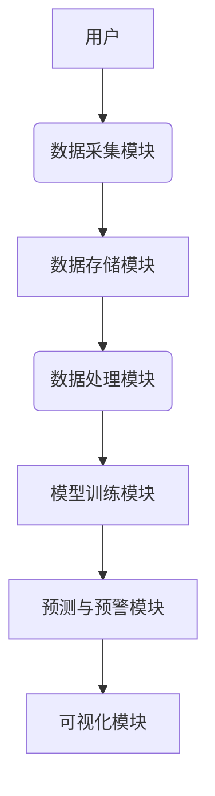

                 


# AI辅助的企业信用周期预测与风险管理

## 关键词：AI, 信用周期预测, 风险管理, 企业信用, 机器学习, 深度学习

## 摘要：  
本文探讨了人工智能在企业信用周期预测与风险管理中的应用，结合理论与实践，分析了信用周期预测的核心算法、风险管理的AI辅助模型以及两者的关联。通过系统架构设计、数学公式推导和代码实现，详细展示了AI如何助力企业信用周期预测与风险管理，为读者提供了从理论到实践的全面指导。

---

## 第一部分：企业信用周期预测与风险管理的背景与核心概念

### 第1章：信用周期与风险管理概述

#### 1.1 信用周期的基本概念  
信用周期是指企业在经济活动中，由于信用活动的波动而形成的一系列信用扩张与收缩的周期性变化。它反映了企业在经济环境变化下的信用行为特征。  

- **信用周期的定义与特征**  
  信用周期是企业信用活动的动态表现，其特征包括周期性、波动性和相关性。周期性指信用活动的扩张与收缩交替出现；波动性指信用活动的剧烈变化；相关性指信用周期与宏观经济环境密切相关。  

- **信用周期与企业经营的关系**  
  信用周期直接影响企业的资金链稳定性、融资成本以及经营风险。在信用扩张期，企业容易获得资金支持；在信用收缩期，企业可能面临资金链断裂的风险。  

- **信用周期对企业风险管理的影响**  
  企业风险管理的核心在于预测和应对信用周期的变化，从而降低信用风险、市场风险和流动性风险。  

#### 1.2 风险管理的核心概念  
风险管理是指通过识别、评估和应对各种风险，以降低其对组织目标的影响。  

- **风险管理的定义与目标**  
  风险管理是系统性地识别和处理潜在风险的过程，其目标是将风险控制在可接受范围内，确保企业稳健运营。  

- **风险管理的主要方法与工具**  
  常见方法包括风险评估矩阵、VaR（Value at Risk）模型、压力测试等。工具则包括风险管理系统、数据分析平台等。  

- **企业信用风险管理的现状与挑战**  
  当前，企业信用风险管理面临数据碎片化、模型复杂化、实时性要求高等挑战。传统方法难以应对复杂多变的信用周期变化，因此亟需引入AI技术提升风险管理能力。  

---

### 第2章：AI辅助信用周期预测与风险管理的核心概念  

#### 2.1 信用周期预测的AI技术基础  
AI技术在信用周期预测中的应用主要体现在以下方面：  

- **机器学习在信用周期预测中的应用**  
  机器学习通过分析历史信用数据，识别信用周期的变化规律，帮助预测未来的信用周期。常用的算法包括线性回归、支持向量机（SVM）、随机森林等。  

- **深度学习在信用周期预测中的优势**  
  深度学习（如LSTM、Transformer）能够捕捉时间序列数据中的非线性特征，适合处理复杂的信用周期预测任务。  

- **自然语言处理在信用信息分析中的作用**  
  NLP技术可用于分析企业财报、新闻资讯等非结构化数据，提取影响信用周期的关键信息。  

#### 2.2 风险管理的AI辅助模型  
AI辅助的信用风险管理模型主要包括以下几种：  

- **基于AI的风险评估模型**  
  利用机器学习算法对企业信用风险进行量化评估，输出风险等级。  

- **基于AI的风险预警系统**  
  通过实时监控企业信用数据，识别潜在风险信号，提前发出预警。  

- **基于AI的信用评分模型**  
  结合企业信用历史、财务数据等，生成信用评分，辅助决策。  

#### 2.3 信用周期预测与风险管理的关联  
信用周期预测与风险管理密切相关，AI技术的引入将两者紧密结合。  

- **信用周期预测在风险管理中的作用**  
  准确的信用周期预测有助于企业提前制定风险管理策略，降低信用风险。  

- **风险管理对信用周期预测的反馈机制**  
  风险管理的结果（如风险事件）可作为反馈，优化信用周期预测模型，提高预测精度。  

- **AI在信用周期预测与风险管理中的综合应用**  
  通过构建联合模型，AI技术能够同时优化信用周期预测和风险管理，实现企业信用管理的智能化和精准化。  

---

### 第3章：信用周期预测与风险管理的核心概念与联系  

#### 3.1 核心概念原理  
信用周期预测与风险管理的核心概念可以从以下几个方面进行分析：  

- **信用周期预测的数学模型**  
  时间序列分析模型（如ARIMA）是信用周期预测的基础方法。  

- **风险管理的AI辅助模型**  
  风险评估模型（如随机森林、XGBoost）是风险管理的核心工具。  

- **信用周期与风险管理的关联机制**  
  信用周期的变化直接影响企业的信用风险，而风险管理的反馈又进一步优化信用周期预测模型。  

#### 3.2 核心概念属性特征对比表  
以下表格对比了信用周期预测和风险管理的核心概念属性特征：  

| 特性       | 信用周期预测 | 风险管理         |
|------------|--------------|----------------|
| 输入数据   | 企业信用数据 | 风险因素数据     |
| 输出目标   | 预测周期     | 风险等级         |
| 方法论     | 时间序列分析 | 机器学习模型     |
| 应用目标   | 预测信用周期 | 降低信用风险     |
| 关联性     | 高           | 高             |

#### 3.3 ER实体关系图  
以下是一个简单的ER实体关系图：  

```mermaid
erDiagram
    customer[企业客户] {
        id : integer
        name : string
        industry : string
        credit_data : string
    }
    risk_management[风险管理机构] {
        id : integer
        name : string
        management_policy : string
    }
    credit_cycle[信用周期] {
        id : integer
        cycle_stage : string
        start_time : date
        end_time : date
    }
    risk_event[风险事件] {
        id : integer
        event_type : string
        event_time : date
    }
    customer -> credit_cycle : 参与
    risk_management -> credit_cycle : 监测
    credit_cycle -> risk_event : 引发
```

---

### 第4章：算法原理与数学模型  

#### 4.1 信用周期预测的算法原理  
信用周期预测的核心算法是时间序列分析。以下是一个简单的ARIMA模型公式：  

$$ ARIMA(p, d, q) $$  

其中，p为自回归阶数，d为差分阶数，q为移动平均阶数。  

#### 4.2 风险管理的AI辅助模型  
风险管理的AI辅助模型通常采用随机森林算法，其核心公式为：  

$$ \text{风险评分} = \sum_{i=1}^{n} w_i \cdot feature_i $$  

其中，$w_i$ 是特征 $feature_i$ 的权重，$n$ 是特征总数。  

#### 4.3 算法实现代码示例  

```python
import pandas as pd
from sklearn.ensemble import RandomForestClassifier
from sklearn.metrics import accuracy_score

# 加载数据
data = pd.read_csv('credit_data.csv')

# 特征与标签分离
X = data.drop(columns=['credit_cycle'])
y = data['credit_cycle']

# 模型训练
model = RandomForestClassifier(n_estimators=100)
model.fit(X, y)

# 预测与评估
y_pred = model.predict(X)
print("准确率：", accuracy_score(y, y_pred))
```

---

### 第5章：系统架构与设计  

#### 5.1 系统功能设计  
系统功能模块包括：  

1. 数据采集模块：收集企业信用数据和风险数据。  
2. 数据处理模块：清洗和预处理数据。  
3. 模型训练模块：训练信用周期预测和风险管理模型。  
4. 预测与预警模块：生成预测结果并发出预警。  
5. 可视化模块：展示预测结果和风险分析报告。  

#### 5.2 系统架构设计  
以下是系统架构的Mermaid图：  



---

### 第6章：项目实战与案例分析  

#### 6.1 项目环境安装  
需要安装的Python库包括：pandas、numpy、scikit-learn、xgboost。  

#### 6.2 核心代码实现  
以下是一个信用周期预测的代码示例：  

```python
import pandas as pd
from sklearn.model_selection import train_test_split
from sklearn.metrics import classification_report

# 加载数据
data = pd.read_csv('credit_cycle.csv')

# 特征与标签分离
X = data.drop(columns=['credit_cycle'])
y = data['credit_cycle']

# 划分训练集与测试集
X_train, X_test, y_train, y_test = train_test_split(X, y, test_size=0.2)

# 模型训练
from sklearn.ensemble import GradientBoostingClassifier
model = GradientBoostingClassifier()
model.fit(X_train, y_train)

# 预测与评估
y_pred = model.predict(X_test)
print(classification_report(y_test, y_pred))
```

---

### 第7章：总结与展望  

#### 7.1 总结  
本文详细探讨了AI在企业信用周期预测与风险管理中的应用，从理论到实践，系统地介绍了核心算法、系统架构和项目实现。通过AI技术的应用，企业能够更精准地预测信用周期，更有效地管理信用风险。  

#### 7.2 展望  
未来，随着AI技术的不断发展，信用周期预测与风险管理将更加智能化和个性化。结合区块链、联邦学习等新技术，企业信用管理将进入新的发展阶段。  

---

## 作者：AI天才研究院/AI Genius Institute & 禅与计算机程序设计艺术 /Zen And The Art of Computer Programming

