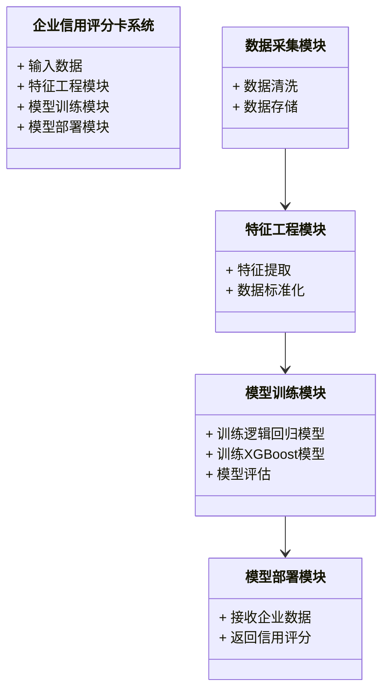
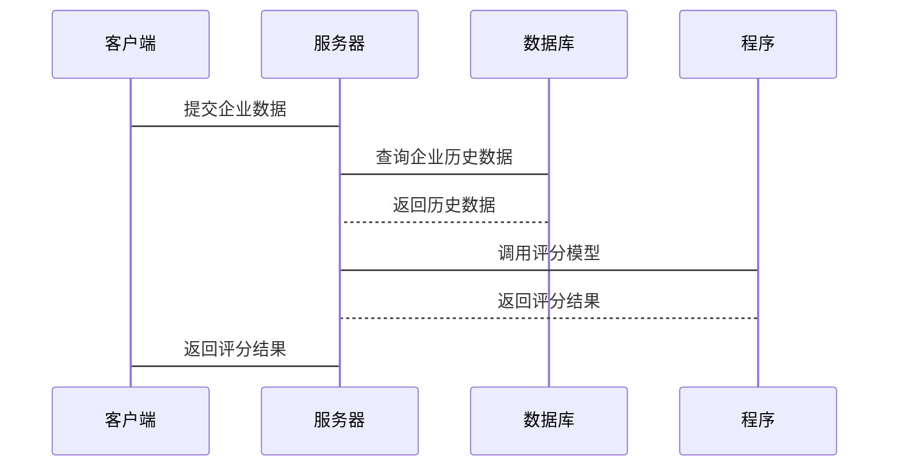

                 


# AI辅助的企业信用评分卡开发

> 关键词：AI，信用评分卡，企业信用，机器学习，评分模型，特征工程

> 摘要：本文将详细探讨AI在企业信用评分卡开发中的应用，从基本概念到算法实现，从系统设计到项目实战，全面解析如何利用人工智能技术提升企业信用评分的准确性和效率。通过本文的学习，读者将能够掌握企业信用评分卡的核心原理、AI算法的应用方法，以及实际开发中的最佳实践。

---

# 第一部分: AI辅助的企业信用评分卡开发背景与基础

## 第1章: 企业信用评分卡概述

### 1.1 企业信用评分卡的基本概念

#### 1.1.1 信用评分卡的定义与作用
信用评分卡是一种用于评估企业信用状况的工具，通过对企业经营状况、财务数据、市场表现等多维度信息的分析，生成一个综合评分，用以衡量企业的信用风险。其作用包括帮助企业筛选合作伙伴、优化供应链管理、降低金融风险等。

#### 1.1.2 企业信用评分卡的分类
企业信用评分卡可以根据不同的应用场景和评估维度进行分类，常见的类型包括：
- **财务表现评分卡**：基于企业的财务报表数据进行评分。
- **市场表现评分卡**：结合企业的市场地位、客户满意度等指标进行评分。
- **信用历史评分卡**：根据企业过去的信用记录进行评估。
- **综合评分卡**：结合多种维度的综合评估。

#### 1.1.3 企业信用评分卡的应用场景
企业信用评分卡广泛应用于金融、供应链、电子商务等领域。例如：
- **银行贷款审批**：通过评分卡评估企业的信用风险，决定是否批准贷款。
- **供应链管理**：评估供应商的信用状况，优化供应链合作关系。
- **风险管理**：帮助企业识别高风险客户，降低潜在损失。

### 1.2 AI在信用评分卡开发中的作用

#### 1.2.1 AI技术在信用评分中的优势
人工智能技术在信用评分卡开发中的优势主要体现在以下几个方面：
- **数据处理能力**：AI能够处理海量数据，提取复杂的特征，提高评分的准确性。
- **模型优化**：通过机器学习算法，AI可以自动优化评分模型，提升预测性能。
- **实时性**：AI技术能够实现实时数据分析和评分，满足企业对快速决策的需求。

#### 1.2.2 AI如何提升信用评分的准确性
AI通过以下方式提升信用评分的准确性：
- **特征工程**：利用机器学习算法自动提取关键特征，减少人工干预。
- **模型调优**：通过交叉验证等方法优化模型参数，提高预测精度。
- **非线性关系捕捉**：AI能够捕捉数据中的非线性关系，发现传统方法难以识别的模式。

#### 1.2.3 AI在信用评分卡开发中的具体应用
- **数据清洗与特征提取**：利用AI技术自动处理缺失值、异常值，提取有用的特征。
- **模型训练与部署**：使用机器学习算法训练评分模型，并将其部署到实际业务系统中。
- **实时监控与反馈**：通过AI技术实时监控评分结果，及时调整模型参数。

### 1.3 本章小结
本章介绍了企业信用评分卡的基本概念、分类及其应用场景，并重点阐述了AI技术在信用评分卡开发中的作用。通过AI技术的应用，企业能够更高效、更准确地进行信用评估，从而降低风险，优化业务流程。

---

# 第二部分: 企业信用评分卡的核心概念与AI联系

## 第2章: 信用评分卡的原理与模型

### 2.1 信用评分模型的基本原理

#### 2.1.1 评分模型的输入与输出
- **输入**：企业的财务数据、经营数据、市场数据等多维度信息。
- **输出**：一个综合评分，通常以分数形式表示，分数越高表示信用风险越低。

#### 2.1.2 评分模型的评价指标
- **准确率**：模型预测的准确程度。
- **召回率**：模型识别出真实阳性案例的能力。
- **AUC值**：衡量模型区分正负样本的能力。

#### 2.1.3 评分模型的优缺点对比
| 模型类型   | 优点                               | 缺点                               |
|------------|------------------------------------|------------------------------------|
| 逻辑回归   | 实现简单，解释性强                 | 对非线性关系的捕捉能力有限           |
| 支持向量机  | 分离能力强，适合小数据集           | 计算复杂，难以处理高维数据           |
| 随机森林    | 鲁棒性好，适合高维数据             | 解释性较差，难以直观理解模型决策依据 |
| XGBoost    | 高精度，支持正则化                | 对超参数敏感，需要仔细调优           |

### 2.2 AI算法在信用评分中的应用

#### 2.2.1 逻辑回归在信用评分中的应用
- **逻辑回归的数学模型**
  $$ P(y=1|x) = \frac{1}{1 + e^{-\beta x}} $$
  其中，$\beta$ 是模型参数，$x$ 是输入特征。

- **逻辑回归的损失函数与优化方法**
  $$ \text{损失函数} = -\sum_{i=1}^{n} [y_i \ln p_i + (1 - y_i) \ln (1 - p_i)] $$
  其中，$p_i$ 是预测概率，$y_i$ 是真实标签。

- **逻辑回归的决策边界**
  逻辑回归通过sigmoid函数将线性回归的输出映射到概率空间，决策边界由分类阈值决定。

#### 2.2.2 支持向量机在信用评分中的应用
- **支持向量机的原理**
  支持向量机通过找到一个超平面，将数据集分成两类，使得两类数据的间隔最大化。

- **支持向量机的核函数**
  使用核函数将低维数据映射到高维空间，提升模型的表达能力。

#### 2.2.3 随机森林与梯度提升树在信用评分中的应用
- **随机森林**
  随机森林通过集成多个决策树模型，提高模型的准确性和鲁棒性。

- **梯度提升树**
  梯度提升树通过逐步优化模型，捕捉数据中的复杂模式。

### 2.3 数据预处理与特征工程

#### 2.3.1 数据清洗与缺失值处理
- **删除法**：直接删除包含缺失值的样本或特征。
- **均值/中位数填充**：使用特征的均值或中位数填充缺失值。
- **插值法**：使用回归或分类模型预测缺失值。

#### 2.3.2 特征选择与降维
- **特征选择**：通过统计检验或模型系数选择重要特征。
- **降维方法**：使用主成分分析（PCA）等技术减少特征维度。

#### 2.3.3 数据标准化与归一化
- **标准化**
  $$ z = \frac{x - \mu}{\sigma} $$
  其中，$\mu$ 是均值，$\sigma$ 是标准差。
- **归一化**
  $$ x' = \frac{x - \min x}{\max x - \min x} $$

### 2.4 本章小结
本章详细讲解了信用评分模型的基本原理及其与AI技术的联系。通过对比不同模型的优缺点，阐述了如何选择合适的算法，并通过数据预处理和特征工程提升模型性能。

---

# 第三部分: AI算法在信用评分卡中的实现

## 第3章: 逻辑回归算法实现信用评分

### 3.1 逻辑回归算法原理

#### 3.1.1 逻辑回归的数学模型
$$ P(y=1|x) = \frac{e^{\beta x}}{1 + e^{\beta x}} $$

#### 3.1.2 逻辑回归的损失函数与优化方法
$$ \text{损失函数} = -\sum_{i=1}^{n} [y_i \ln p_i + (1 - y_i) \ln (1 - p_i)] $$

#### 3.1.3 逻辑回归的决策边界
通过调整分类阈值，将概率转化为类别标签。

### 3.2 逻辑回归在信用评分中的应用

#### 3.2.1 数据特征与模型训练
- **输入特征**：企业的财务数据、经营数据等。
- **模型训练**：使用梯度下降法优化模型参数。

#### 3.2.2 模型评估与调优
- **评估指标**：准确率、召回率、F1分数。
- **模型调优**：调整学习率、正则化参数等。

#### 3.2.3 模型部署与应用
- **部署环境**：将训练好的模型部署到生产环境，实时处理企业信用评分请求。

### 3.3 本章小结
本章通过具体案例展示了逻辑回归算法在信用评分中的实现过程，从数据准备到模型训练，再到模型部署，详细阐述了每一步的操作和注意事项。

---

## 第4章: XGBoost算法实现信用评分

### 4.1 XGBoost算法原理

#### 4.1.1 XGBoost的优化目标
$$ \text{目标函数} = \text{损失函数} + \text{正则化项} $$

#### 4.1.2 XGBoost的树模型结构
通过构造多棵决策树，逐步优化模型，提高预测精度。

#### 4.1.3 XGBoost的优化方法
- **正则化**：防止模型过拟合。
- **剪枝**：控制树的深度，减少过拟合风险。

### 4.2 XGBoost在信用评分中的应用

#### 4.2.1 数据特征与模型训练
- **输入特征**：与逻辑回归类似，包括企业的财务数据、市场数据等。
- **模型训练**：使用XGBoost算法训练评分模型。

#### 4.2.2 模型评估与调优
- **评估指标**：准确率、F1分数。
- **模型调优**：调整学习率、树的深度、正则化参数等。

#### 4.2.3 模型部署与应用
- **部署环境**：将XGBoost模型部署到生产环境，提供实时信用评分服务。

### 4.3 本章小结
本章介绍了XGBoost算法在信用评分中的应用，通过对比逻辑回归，展示了XGBoost算法在模型精度和复杂数据处理方面的优势。

---

# 第四部分: 系统分析与架构设计

## 第5章: 信用评分卡开发的系统架构设计

### 5.1 项目介绍
- **项目目标**：开发一个基于AI的企业信用评分卡系统，提升信用评估的准确性和效率。
- **项目范围**：包括数据采集、特征工程、模型训练、模型部署等模块。

### 5.2 系统功能设计

#### 5.2.1 领域模型设计


### 5.3 系统架构设计


### 5.4 系统接口设计
- **输入接口**：接收企业的信用数据。
- **输出接口**：返回企业的信用评分。

### 5.5 系统交互设计


### 5.6 本章小结
本章从系统架构的角度，详细设计了企业信用评分卡开发的各个模块，包括数据采集、特征工程、模型训练和模型部署，并通过图表展示了系统交互流程。

---

# 第五部分: 项目实战

## 第6章: 企业信用评分卡开发实战

### 6.1 环境配置

#### 6.1.1 安装Python与相关库
```bash
pip install python
pip install scikit-learn xgboost
```

#### 6.1.2 安装Jupyter Notebook
```bash
pip install jupyter
```

### 6.2 企业信用评分卡开发代码实现

#### 6.2.1 数据采集与清洗
```python
import pandas as pd

# 读取数据
data = pd.read_csv('enterprise_credit.csv')

# 删除缺失值
data.dropna(inplace=True)

# 填充缺失值
data['revenue'].fillna(data['revenue'].mean(), inplace=True)
```

#### 6.2.2 特征工程与模型训练
```python
from sklearn.model_selection import train_test_split
from sklearn.linear_model import LogisticRegression
from xgboost import XGBClassifier
from sklearn.metrics import accuracy_score

# 划分数据集
X_train, X_test, y_train, y_test = train_test_split(data.drop('credit_score', axis=1), data['credit_score'], test_size=0.2)

# 训练逻辑回归模型
lr_model = LogisticRegression()
lr_model.fit(X_train, y_train)

# 预测与评估
y_pred_lr = lr_model.predict(X_test)
print('逻辑回归准确率:', accuracy_score(y_test, y_pred_lr))

# 训练XGBoost模型
xgb_model = XGBClassifier()
xgb_model.fit(X_train, y_train)

# 预测与评估
y_pred_xgb = xgb_model.predict(X_test)
print('XGBoost准确率:', accuracy_score(y_test, y_pred_xgb))
```

#### 6.2.3 模型部署与应用
```python
# 部署逻辑回归模型
def predict_credit_score_lr(new_data):
    return lr_model.predict(new_data)

# 部署XGBoost模型
def predict_credit_score_xgb(new_data):
    return xgb_model.predict(new_data)
```

### 6.3 项目小结
本章通过实际案例展示了企业信用评分卡的开发过程，从环境配置到代码实现，再到模型部署，详细介绍了每一步的操作和实现细节。

---

# 第六部分: 最佳实践与总结

## 第7章: 开发经验总结与注意事项

### 7.1 开发经验总结
- **数据质量的重要性**：数据清洗和特征工程是模型性能的关键。
- **模型选择的灵活性**：根据数据特性和业务需求选择合适的算法。
- **模型部署的便捷性**：确保模型能够快速集成到现有系统中。

### 7.2 小结
企业信用评分卡的开发离不开AI技术的支持，通过合理选择算法和优化模型，可以显著提升信用评估的准确性和效率。

### 7.3 注意事项
- **数据隐私保护**：确保企业数据的安全性和隐私性。
- **模型的可解释性**：在复杂业务场景中，模型的可解释性尤为重要。
- **持续优化**：定期更新模型，适应业务变化和数据变化。

### 7.4 拓展阅读
- 《Hands-On Machine Learning with Scikit-Learn, Keras, and TensorFlow》
- 《深入浅出机器学习》

---

# 作者：AI天才研究院 & 禅与计算机程序设计艺术

---

# 附录: 更多资源与联系方式

## 附录A: 更多技术资源

- [AI天才研究院](https://www.example.com)
- [禅与计算机程序设计艺术](https://www.example.com)

## 附录B: 联系方式

- 邮箱：contact@example.com
- 微信：扫一扫下方二维码添加好友

---

通过本文的学习，读者可以系统地掌握AI辅助的企业信用评分卡开发的核心原理、实现方法和最佳实践，为实际应用提供有力的技术支持。

