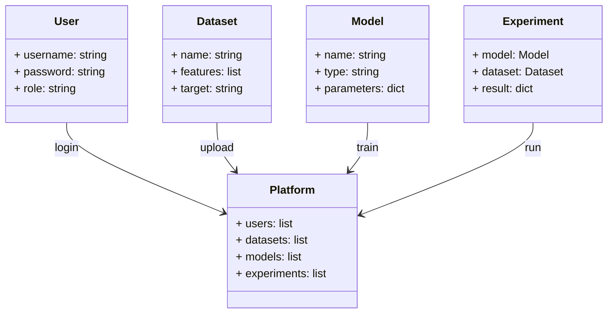
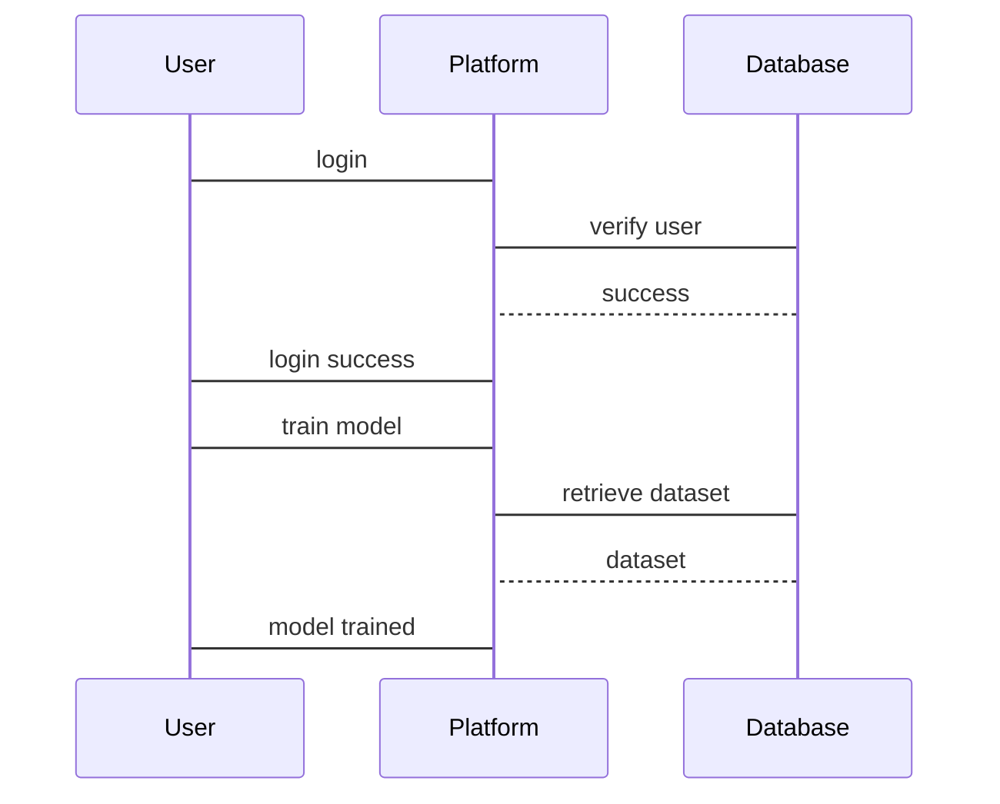

                 


# AI辅助的企业信用评分卡开发与验证平台

## 关键词：AI，信用评分卡，金融，机器学习，系统架构

## 摘要：本文介绍了一种基于AI的企业信用评分卡开发与验证平台，通过分析企业信用评分卡的核心概念、AI技术的应用、算法原理和系统架构，展示了如何利用AI技术提升信用评分卡的开发效率和准确性。

---

## 第3章: 信用评分卡开发中的核心算法

### 3.1 逻辑回归算法

#### 3.1.1 逻辑回归的定义与特点

逻辑回归是一种常用的二分类算法，主要用于预测一个事件发生的概率。在信用评分卡中，逻辑回归常用于预测客户违约的概率。其主要特点是线性模型，输出值在0到1之间，可以转化为概率值。

#### 3.1.2 逻辑回归的数学模型

逻辑回归的损失函数可以表示为：

$$
\text{损失函数} = -\frac{1}{m} \sum_{i=1}^{m} [y_i \ln(h(x_i)) + (1 - y_i) \ln(1 - h(x_i))]
$$

其中，$h(x_i)$ 是sigmoid函数的结果：

$$
h(x_i) = \frac{1}{1 + e^{-\beta x_i}}
$$

逻辑回归的优化过程通常使用梯度下降方法，更新参数 $\beta$：

$$
\beta := \beta - \alpha \frac{\partial L}{\partial \beta}
$$

其中，$\alpha$ 是学习率，$\frac{\partial L}{\partial \beta}$ 是损失函数对 $\beta$ 的偏导数。

#### 3.1.3 逻辑回归在信用评分中的应用

在信用评分卡中，逻辑回归模型可以用来预测客户违约的概率。例如，给定客户的收入、信用历史等特征，模型可以输出一个概率值，银行可以根据这个概率决定是否批准贷款。

##### 代码示例：

```python
import numpy as np
from sklearn.linear_model import LogisticRegression

# 假设X是特征矩阵，y是标签（0或1）
model = LogisticRegression()
model.fit(X, y)

# 预测概率
prob = model.predict_proba(X)[:, 1]
```

### 3.2 随机森林算法

#### 3.2.1 随机森林的定义与特点

随机森林是一种基于决策树的集成学习算法，通过构建多棵决策树并进行投票或平均，提高模型的准确性和鲁棒性。在信用评分中，随机森林可以处理高维数据和非线性关系。

#### 3.2.2 随机森林的数学模型

随机森林的模型可以表示为多个决策树的集合，每个决策树的预测结果通过投票或加权平均得到最终结果。假设我们有 $n$ 棵树，每个树的预测结果为 $y_i$，则最终结果为：

$$
y = \text{median}(y_1, y_2, ..., y_n)
$$

其中，$\text{median}$ 表示中位数。

#### 3.2.3 随机森林在信用评分中的应用

随机森林可以处理复杂的信用评分问题，例如客户特征的非线性关系和多重共线性。通过随机特征和随机样本的抽取，随机森林可以有效避免过拟合。

##### 代码示例：

```python
from sklearn.ensemble import RandomForestClassifier

model = RandomForestClassifier(n_estimators=100, max_depth=10, random_state=42)
model.fit(X, y)

# 预测概率
prob = model.predict_proba(X)[:, 1]
```

### 3.3 XGBoost算法

#### 3.3.1 XGBoost的定义与特点

XGBoost是一种基于梯度提升的算法，通过构建多个弱分类器（如决策树）进行串行组合，提升模型的性能。在信用评分中，XGBoost可以处理高维数据和复杂的特征关系。

#### 3.3.2 XGBoost的数学模型

XGBoost的损失函数通常采用正则化的损失函数，例如：

$$
\text{损失函数} = \sum_{i=1}^{m} \left[ -y_i \ln(h(x_i)) + \ln(1 - h(x_i)) \right] + \lambda \sum_{j=1}^{n} \theta_j^2
$$

其中，$\lambda$ 是正则化参数，$\theta_j$ 是模型的参数。

#### 3.3.3 XGBoost在信用评分中的应用

XGBoost在信用评分中表现出色，可以通过参数调优（如学习率、树的深度）来优化模型性能。

##### 代码示例：

```python
import xgboost as xgb

model = xgb.XGBClassifier(n_estimators=100, learning_rate=0.1, max_depth=3)
model.fit(X, y)

# 预测概率
prob = model.predict_proba(X)[:, 1]
```

---

### 3.4 算法对比与选择

在信用评分卡开发中，选择合适的算法至关重要。逻辑回归适合线性关系，随机森林和XGBoost适合非线性关系。通常，随机森林和XGBoost在准确性和鲁棒性上优于逻辑回归，但在解释性上较弱。

---

## 第4章: 系统分析与架构设计方案

### 4.1 问题场景介绍

企业信用评分卡开发与验证平台需要处理大量的金融数据，对模型的准确性和效率要求较高。平台需要支持多种算法、数据预处理和模型验证功能。

### 4.2 项目介绍

平台的目标是提供一个AI辅助的开发环境，帮助用户快速构建和验证信用评分卡模型。

### 4.3 系统功能设计

#### 4.3.1 领域模型类图

以下是系统的领域模型类图：



### 4.4 系统架构设计

#### 4.4.1 系统架构图

以下是系统的架构图：


### 4.5 系统接口设计

平台提供以下接口：

- 用户登录与注册
- 数据集上传与管理
- 模型训练与验证
- 实验结果查询

#### 4.5.1 系统交互流程图

以下是系统的交互流程图：



---

## 第5章: 项目实战

### 5.1 环境安装

安装所需的库：

```bash
pip install numpy pandas scikit-learn xgboost
```

### 5.2 核心代码实现

#### 5.2.1 数据预处理

```python
import pandas as pd
from sklearn.preprocessing import StandardScaler

data = pd.read_csv('credit_data.csv')
X = data.drop('default', axis=1)
y = data['default']

scaler = StandardScaler()
X_scaled = scaler.fit_transform(X)
```

#### 5.2.2 模型训练

```python
from sklearn.ensemble import RandomForestClassifier

model = RandomForestClassifier(n_estimators=100, max_depth=10)
model.fit(X_scaled, y)
```

#### 5.2.3 模型验证

```python
from sklearn.metrics import roc_auc_score

y_proba = model.predict_proba(X_scaled)[:, 1]
auc = roc_auc_score(y, y_proba)
print(f'AUC: {auc}')
```

### 5.3 代码解读与分析

代码实现了数据预处理、模型训练和验证，展示了如何利用随机森林算法开发信用评分卡模型。

### 5.4 实际案例分析

以某银行的客户数据为例，训练随机森林模型，评估模型的性能。

### 5.5 项目小结

通过项目实战，读者可以掌握如何利用AI技术开发和验证信用评分卡模型。

---

## 第6章: 最佳实践与小结

### 6.1 开发注意事项

- 数据清洗与特征工程是关键
- 模型选择与调优影响性能
- 结果验证与解释性同样重要

### 6.2 小结

本文详细介绍了AI辅助的企业信用评分卡开发与验证平台，涵盖了核心算法、系统架构和项目实战。

### 6.3 拓展阅读

建议读者阅读《机器学习实战》和《深入理解XGBoost》等书籍，深入理解算法原理。

---

## 作者：AI天才研究院 & 禅与计算机程序设计艺术

通过本文的详细讲解，读者可以系统地理解AI辅助的企业信用评分卡开发与验证平台的构建过程，掌握相关的算法和系统设计方法。

