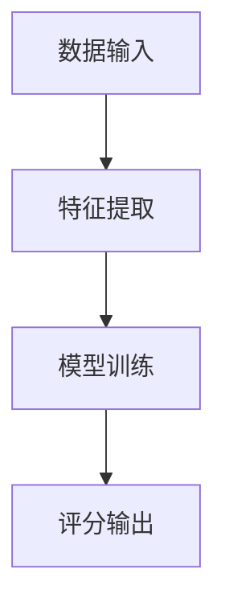
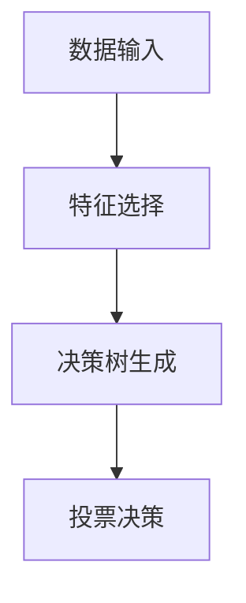
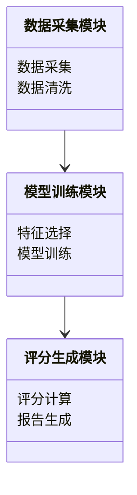
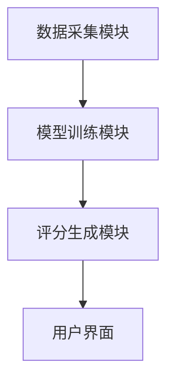
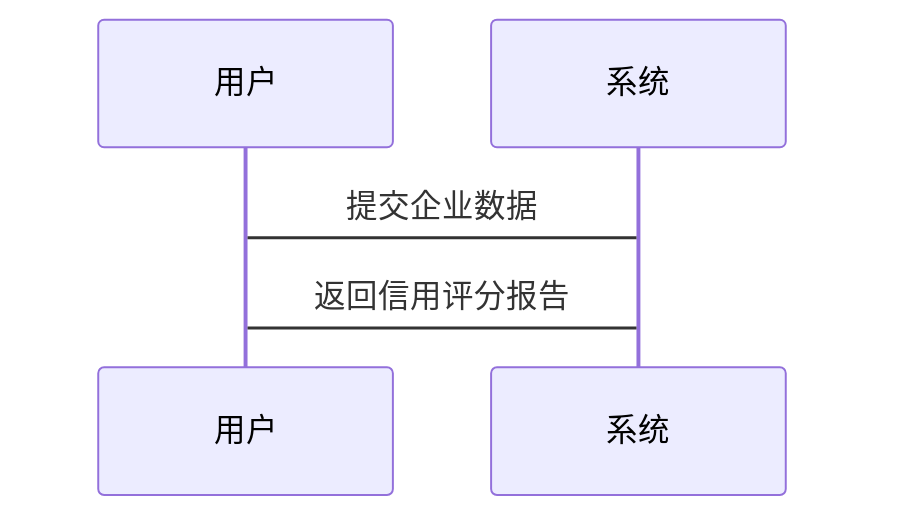

                 


# AI辅助的企业信用评分卡开发平台

> 关键词：企业信用评分卡，人工智能，机器学习，评分模型，评分系统，金融风控

> 摘要：本文详细探讨了AI辅助的企业信用评分卡开发平台的设计与实现，从背景介绍、核心概念、算法原理到系统架构、项目实战，全面解析了利用人工智能技术构建高效企业信用评分系统的各个方面。文章结合实际案例，深入浅出地分析了AI在信用评分中的应用价值、技术实现和未来发展方向。

---

## 第1章 企业信用评分卡的背景与需求

### 1.1 企业信用评分卡的背景

企业信用评分卡是金融机构评估企业信用风险的重要工具。传统的信用评分依赖于人工审核和经验判断，存在效率低、主观性强、风险高等问题。随着人工智能技术的快速发展，利用AI辅助构建企业信用评分卡成为行业趋势。

#### 1.1.1 传统信用评分卡的局限性
传统的信用评分卡主要依赖于人工分析和简单的统计模型，存在以下问题：
- 数据处理能力有限，难以应对海量数据。
- 模型复杂度低，难以捕捉非线性关系。
- 需要大量人工干预，效率低下。

#### 1.1.2 AI技术在信用评分中的应用前景
人工智能技术（如机器学习、深度学习）在信用评分中的应用，能够显著提升评分的准确性和效率。AI技术的优势包括：
- 处理海量数据的能力。
- 自动提取特征的能力。
- 实时更新模型的能力。

#### 1.1.3 企业信用评分卡的核心价值
企业信用评分卡的核心价值在于：
- 提高信用评估的准确性。
- 降低信用风险。
- 提升审批效率。

### 1.2 企业信用评分卡的需求分析

#### 1.2.1 企业信用评分的核心要素
企业信用评分的核心要素包括：
- 企业财务状况。
- 企业经营状况。
- 企业信用历史。
- 企业关联关系。

#### 1.2.2 企业信用评分的业务流程
企业信用评分的业务流程通常包括：
1. 数据采集。
2. 数据清洗。
3. 特征提取。
4. 模型训练。
5. 模型部署。

#### 1.2.3 AI辅助评分的必要性
AI辅助评分的必要性体现在：
- 提高评分效率。
- 提升评分准确性。
- 实现自动化、智能化的评分流程。

### 1.3 本章小结
本章介绍了企业信用评分卡的背景、需求及核心价值，为后续章节的分析奠定了基础。

---

## 第2章 企业信用评分卡的核心概念

### 2.1 企业信用评分卡的定义与特征

#### 2.1.1 企业信用评分卡的定义
企业信用评分卡是一种基于企业多维度信息的量化评估工具，用于预测企业在特定条件下的信用风险。

#### 2.1.2 评分卡的核心特征对比
以下是评分卡核心特征的对比：

| 特征 | 描述 |
|------|------|
| 数据来源 | 企业财务数据、经营数据、信用历史等 |
| 评估维度 | 财务状况、经营能力、信用记录等 |
| 评分范围 | 0到100分，分数越高信用风险越低 |

#### 2.1.3 评分卡的边界与外延
评分卡的边界包括：
- 数据范围：仅限于企业相关数据。
- 评估范围：仅针对信用风险。
- 使用范围：仅限于金融机构内部使用。

### 2.2 企业信用评分的核心要素

#### 2.2.1 企业信用评分的关键指标
企业信用评分的关键指标包括：
- 财务指标：如资产负债率、利润率。
- 经营指标：如市场份额、客户满意度。
- 信用指标：如还款记录、违约历史。

#### 2.2.2 评分模型的输入与输出
评分模型的输入包括：
- 企业财务数据。
- 企业经营数据。
- 企业信用历史。

评分模型的输出是：
- 信用评分。
- 信用等级。

#### 2.2.3 评分逻辑的结构化表达
评分逻辑的结构化表达可以用流程图表示：



### 2.3 企业信用评分卡的构建流程

#### 2.3.1 数据采集与处理
数据采集与处理流程如下：

1. 数据采集：从企业数据库中获取相关数据。
2. 数据清洗：处理缺失值、异常值。
3. 数据转换：将数据转换为适合模型训练的格式。

#### 2.3.2 模型训练与优化
模型训练与优化流程如下：

1. 特征选择：选择对信用评分影响较大的特征。
2. 模型训练：使用机器学习算法训练模型。
3. 模型优化：通过调整参数提升模型性能。

#### 2.3.3 评分结果的解释与应用
评分结果的解释与应用包括：
- 生成信用评分报告。
- 提供信用风险预警。

### 2.4 本章小结
本章详细讲解了企业信用评分卡的核心概念和构建流程，为后续章节的算法和系统设计奠定了基础。

---

## 第3章 机器学习算法在信用评分中的应用

### 3.1 传统机器学习算法

#### 3.1.1 逻辑回归模型
逻辑回归模型是一种常用的分类算法，适用于二分类问题。其数学模型如下：

$$ P(y=1|x) = \frac{1}{1 + e^{-\beta x}} $$

#### 3.1.2 支持向量机
支持向量机（SVM）是一种强大的分类算法，适用于高维数据。其核心思想是将数据映射到高维空间，并找到一个超平面将数据分为两类。

#### 3.1.3 随机森林
随机森林是一种基于决策树的集成算法，具有较强的抗过拟合能力。其流程如下：



### 3.2 神经网络与深度学习算法

#### 3.2.1 神经网络基础
神经网络是一种模拟人脑神经元结构的算法，其基本结构包括输入层、隐藏层和输出层。

#### 3.2.2 卷积神经网络
卷积神经网络（CNN）常用于图像处理，但在信用评分中也可用于特征提取。

#### 3.2.3 循环神经网络
循环神经网络（RNN）适用于处理序列数据，如时间序列信用评分。

### 3.3 算法选择与优化

#### 3.3.1 算法选择的依据
算法选择的依据包括：
- 数据类型。
- 数据规模。
- 业务需求。

#### 3.3.2 超参数优化方法
超参数优化方法包括：
- 网格搜索。
- 随机搜索。
- 贝叶斯优化。

#### 3.3.3 模型评估与验证
模型评估与验证方法包括：
- 准确率。
- 召回率。
- F1分数。

### 3.4 本章小结
本章介绍了常用的机器学习算法及其在信用评分中的应用，为后续章节的系统设计提供了算法基础。

---

## 第4章 系统架构与设计

### 4.1 评分卡开发平台的功能模块

#### 4.1.1 数据采集模块
数据采集模块负责从企业数据库中获取相关数据，并进行清洗和转换。

#### 4.1.2 模型训练模块
模型训练模块负责选择合适的算法，进行特征选择和模型训练。

#### 4.1.3 评分生成模块
评分生成模块根据训练好的模型，生成企业的信用评分。

### 4.2 系统架构设计

#### 4.2.1 系统功能设计
系统功能设计可以用类图表示：



#### 4.2.2 系统架构设计
系统架构设计可以用架构图表示：



### 4.3 系统接口设计

#### 4.3.1 接口描述
系统接口包括：
- 数据接口：用于数据采集和传输。
- 模型接口：用于模型训练和部署。
- 报告接口：用于生成和输出评分报告。

#### 4.3.2 交互流程
交互流程可以用序列图表示：



### 4.4 本章小结
本章详细讲解了评分卡开发平台的系统架构与设计，为后续章节的项目实战奠定了基础。

---

## 第5章 项目实战

### 5.1 环境安装与配置

#### 5.1.1 安装Python
安装Python 3.8及以上版本。

#### 5.1.2 安装依赖库
安装以下依赖库：
```bash
pip install numpy pandas scikit-learn xgboost
```

### 5.2 核心代码实现

#### 5.2.1 数据处理代码
数据处理代码如下：
```python
import pandas as pd

# 数据加载
data = pd.read_csv('enterprise_data.csv')

# 数据清洗
data.dropna(inplace=True)

# 数据转换
data['label'] = data['label'].astype(int)
```

#### 5.2.2 模型训练代码
模型训练代码如下：
```python
from sklearn.ensemble import RandomForestClassifier

model = RandomForestClassifier()
model.fit(X_train, y_train)
```

#### 5.2.3 评分生成代码
评分生成代码如下：
```python
import numpy as np

scores = model.predict_proba(X_test)[:, 1]
score_labels = np.where(scores > 0.5, 1, 0)
```

### 5.3 项目小结
本章通过实际案例展示了评分卡开发平台的核心代码实现，帮助读者理解如何将理论应用于实践。

---

## 第6章 最佳实践与小结

### 6.1 最佳实践 tips
- 数据预处理是关键。
- 模型调优不可忽视。
- 业务需求与技术实现要结合。

### 6.2 本章小结
本文总结了AI辅助的企业信用评分卡开发平台的核心内容，强调了数据处理、算法选择和系统设计的重要性。

---

## 作者信息

作者：AI天才研究院/AI Genius Institute & 禅与计算机程序设计艺术/Zen And The Art of Computer Programming

---

以上是《AI辅助的企业信用评分卡开发平台》的完整目录大纲和文章内容。

