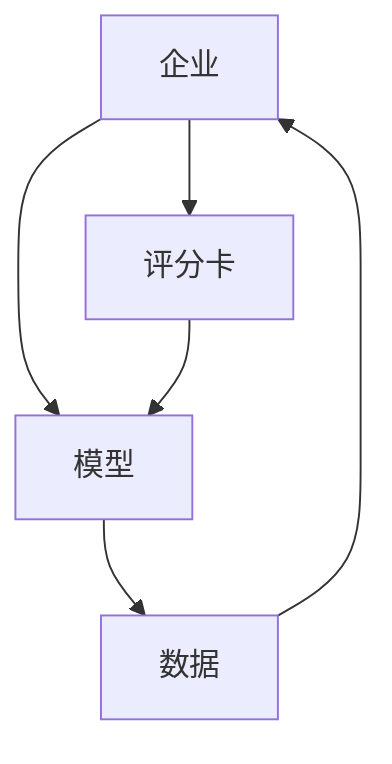

                 


# AI辅助的企业信用评分卡验证

> 关键词：企业信用评分卡，人工智能，机器学习，信用风险评估，评分卡验证，AI辅助

> 摘要：本文深入探讨了人工智能在企业信用评分卡验证中的应用，分析了传统方法的局限性，并详细讲解了AI辅助的原理、算法、系统架构及实际案例。通过对比和实例分析，展示了AI如何提升信用评分的准确性和效率，为企业信用风险管理提供了新的思路。

---

# 第一部分: 企业信用评分卡与AI辅助验证的背景介绍

## 第1章: 企业信用评分卡的基本概念

### 1.1 信用评分卡的定义与作用

#### 1.1.1 信用评分卡的定义
信用评分卡是一种量化评估企业信用状况的工具，通过收集和分析企业的财务数据、市场表现、经营状况等信息，生成一个综合评分，用以衡量企业的信用风险。

#### 1.1.2 信用评分卡在企业信用评估中的作用
信用评分卡帮助企业快速评估客户的信用风险，辅助企业在授信、贷款审批等决策中做出更准确的判断，从而降低风险和成本。

#### 1.1.3 信用评分卡的重要性与应用领域
信用评分卡在金融、银行、供应链管理等领域广泛应用，是企业信用风险管理的重要工具。准确的评分卡能够有效识别高风险客户，避免潜在的财务损失。

### 1.2 AI在信用评分卡验证中的应用

#### 1.2.1 AI技术在信用评分中的优势
AI技术能够处理大量非结构化数据，发现传统方法难以察觉的模式和关系，提高评分的准确性和效率。

#### 1.2.2 AI在信用评分卡验证中的具体应用
AI通过机器学习算法自动提取特征，优化模型，实时更新评分，提升信用评估的精准度。

#### 1.2.3 AI辅助信用评分卡验证的必要性
传统方法依赖人工经验，效率低且易受主观因素影响。AI辅助能够弥补这些不足，提高信用评估的客观性和效率。

### 1.3 传统信用评分卡验证方法的局限性

#### 1.3.1 传统信用评分卡验证的流程
传统方法主要依赖人工审核，流程繁琐，耗时长，且容易受人为因素影响。

#### 1.3.2 传统方法的局限性
传统方法难以处理复杂数据，模型简单，导致评分不够精准，且难以应对市场变化。

#### 1.3.3 AI技术如何弥补传统方法的不足
AI通过大数据分析和复杂模型，能够更好地捕捉风险因素，提供实时更新的评分，显著提升信用评估的效率和准确性。

---

# 第二部分: 企业信用评分卡验证的核心概念与联系

## 第2章: 企业信用评分卡验证的核心概念与联系

### 2.1 AI辅助信用评分卡验证的原理

#### 2.1.1 数据预处理与特征提取
AI通过清洗数据，处理缺失值，标准化特征，提取关键变量，为模型训练做好准备。

#### 2.1.2 模型训练与优化
使用机器学习算法训练模型，通过交叉验证和调参优化模型性能，提升评分的准确性。

#### 2.1.3 结果验证与评估
通过测试集验证模型效果，评估指标如准确率、召回率、F1分数等，确保模型的稳定性和可靠性。

### 2.2 核心概念对比表

| 对比维度         | 传统方法                     | AI辅助方法                     |
|------------------|-----------------------------|---------------------------------|
| 数据处理         | 手工处理，效率低             | 自动化处理，高效准确           |
| 模型复杂度       | 线性模型，简单               | 非线性模型，复杂               |
| 解释性           | 高                           | 较低                           |
| 处理速度         | 较慢                         | 快                             |
| 适应性           | 低                           | 高                             |

### 2.3 实体关系图



---

# 第三部分: 算法原理讲解

## 第3章: 常用算法及其原理

### 3.1 逻辑回归算法

#### 3.1.1 算法原理
逻辑回归通过 sigmoid 函数将线性组合映射到概率空间，用于分类问题。

$$ P(y=1|x) = \frac{1}{1 + e^{-wx}} $$

#### 3.1.2 优化过程
使用梯度下降优化损失函数，更新权重参数。

$$ L = -\sum y\log p + (1-y)\log(1-p) $$

### 3.2 随机森林

#### 3.2.1 算法原理
随机森林通过构建多棵决策树，集成预测结果，提高准确性和鲁棒性。

### 3.3 XGBoost

#### 3.3.1 算法原理
XGBoost采用提升树方法，通过正则化和剪枝优化模型，防止过拟合。

---

# 第四部分: 系统分析与架构设计方案

## 第4章: 系统架构设计

### 4.1 系统功能设计

#### 4.1.1 数据采集层
从企业系统中获取财务数据、交易记录等信息。

#### 4.1.2 数据处理层
清洗数据，特征工程，构建特征向量。

#### 4.1.3 模型训练层
训练机器学习模型，优化参数，保存模型。

#### 4.1.4 结果展示层
展示评分结果，生成报告，提供决策支持。

### 4.2 系统架构图


---

# 第五部分: 项目实战

## 第5章: 项目实战

### 5.1 环境安装

```bash
pip install numpy pandas scikit-learn xgboost
```

### 5.2 核心代码实现

```python
import pandas as pd
from sklearn.model_selection import train_test_split
from sklearn.metrics import accuracy_score
from xgboost import XGBClassifier

# 数据加载与处理
data = pd.read_csv('credit_data.csv')
X = data.drop('target', axis=1)
y = data['target']

# 数据分割
X_train, X_test, y_train, y_test = train_test_split(X, y, test_size=0.2)

# 模型训练
model = XGBClassifier()
model.fit(X_train, y_train)

# 模型预测
y_pred = model.predict(X_test)

# 评估结果
print("Accuracy:", accuracy_score(y_test, y_pred))
```

### 5.3 实际案例分析
通过实际数据集训练模型，评估其性能，调整参数优化结果，展示AI辅助在信用评分中的优势。

### 5.4 项目总结
总结项目的实施过程，强调AI辅助的优势，指出潜在问题及改进方向。

---

# 第六部分: 最佳实践、小结与展望

## 第6章: 最佳实践与小结

### 6.1 最佳实践 tips
- 数据预处理是关键，确保数据质量和特征有效性。
- 选择合适的算法，结合业务需求调整模型参数。
- 定期更新模型，适应市场变化。

### 6.2 小结
AI辅助信用评分卡验证显著提升了评估效率和准确性，为企业信用风险管理提供了有力工具。

### 6.3 展望
未来，AI技术将进一步融入信用评分，结合区块链等技术，构建更安全、智能的信用评估体系。

---

# 作者：AI天才研究院 & 禅与计算机程序设计艺术

---

这篇文章系统地介绍了AI在企业信用评分卡验证中的应用，从背景到算法，从系统设计到项目实战，为企业信用风险管理提供了全面的解决方案。

