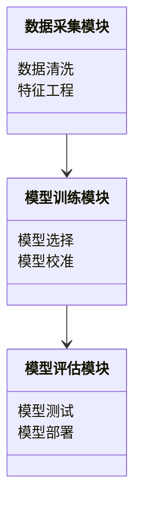
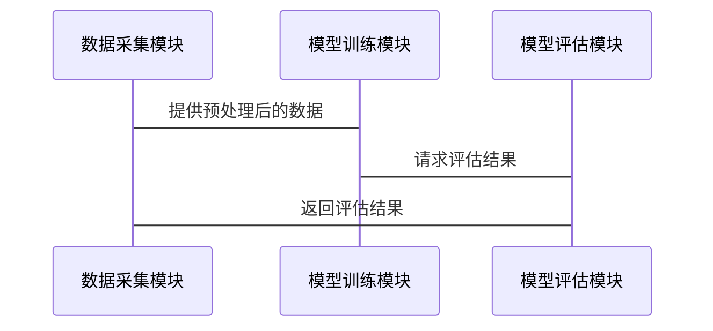

                 


# AI辅助的企业信用评级模型校准

## 关键词：企业信用评级，人工智能，模型校准，机器学习，深度学习，金融应用

## 摘要：  
本文详细探讨了如何利用人工智能技术优化企业信用评级模型的校准过程。从背景介绍到核心算法，从系统架构设计到实际项目实战，本文全面解析了AI在信用评级中的应用价值。通过数学公式、算法原理和系统设计的详细阐述，本文为读者提供了一套完整的AI辅助信用评级模型校准方案，帮助金融行业提升信用评估的效率和准确性。

---

# 第1章: 企业信用评级与AI辅助校准的背景

## 1.1 企业信用评级的定义与意义

企业信用评级是通过对企业的财务状况、经营能力、市场表现等多方面因素进行综合评估，确定其信用等级的过程。信用评级结果直接关系到企业的融资成本、投资决策以及金融机构的风险控制策略。在金融领域，信用评级是衡量企业信用风险的核心工具。

### 1.1.1 企业信用评级的基本概念  
企业信用评级是基于企业的财务数据、经营状况、行业地位等因素，评估其履行债务能力的过程。评级结果通常以等级形式呈现，如AAA、AA、A、BBB、BB、B、CCC、CC、C、D等，其中AAA为最高信用等级，D为最低。

### 1.1.2 信用评级在金融领域的核心作用  
信用评级直接影响企业的融资成本和金融机构的风险管理策略。高信用评级的企业更容易获得低成本的资金，而低信用评级的企业可能面临更高的融资门槛或利率。

### 1.1.3 企业信用评级的分类与标准  
企业信用评级可以分为内部评级和外部评级。内部评级由企业内部进行，主要用于内部管理；外部评级由专业的评级机构进行，具有更强的公信力。

---

## 1.2 AI技术在信用评级中的应用背景

### 1.2.1 传统信用评级的局限性  
传统信用评级方法主要依赖于财务数据和历史经验，存在以下问题：  
1. **数据维度有限**：传统方法主要依赖财务数据，忽略了非结构化数据（如社交媒体数据、新闻数据）的价值。  
2. **主观性较强**：评级结果可能受到评级机构主观判断的影响。  
3. **效率低下**：传统评级过程耗时较长，难以满足金融机构对实时评估的需求。

### 1.2.2 AI技术如何提升信用评级的准确性  
人工智能技术可以通过以下方式提升信用评级的准确性：  
1. **多源数据融合**：利用自然语言处理（NLP）技术，整合财务数据、新闻数据、社交媒体数据等多种数据源，提高评级结果的全面性。  
2. **自动化特征提取**：通过机器学习算法自动提取特征，发现传统方法难以察觉的潜在风险因素。  
3. **实时监控与预测**：基于流数据处理技术，实现对企业信用状况的实时监控和预测。

### 1.2.3 企业信用评级的数字化转型趋势  
随着大数据和AI技术的快速发展，企业信用评级正在从传统的经验驱动模式向数据驱动模式转变。数字化转型不仅提高了评级效率，还为金融机构提供了更精准的决策支持。

---

## 1.3 本章小结  
本章介绍了企业信用评级的基本概念、意义以及传统评级方法的局限性。同时，还探讨了AI技术在信用评级中的应用背景和数字化转型趋势，为后续章节的深入分析奠定了基础。

---

# 第2章: 信用评级模型的构建与校准

## 2.1 信用评级模型的构建流程

### 2.1.1 数据收集与特征选择  
数据收集是构建信用评级模型的第一步。数据来源包括企业的财务报表、行业数据、市场数据等。特征选择是数据预处理的重要环节，需要根据业务需求选择最具代表性的特征。

#### 数据预处理步骤：
1. 数据清洗：处理缺失值、异常值等问题。  
2. 特征工程：通过主成分分析（PCA）等方法降维，或通过特征组合技术提取新特征。

### 2.1.2 模型选择与训练  
模型选择是信用评级模型构建的核心环节。常见的模型包括逻辑回归、支持向量机（SVM）、随机森林、梯度提升树（GBDT）等。选择合适的模型需要考虑数据的特征、样本量以及模型的可解释性。

### 2.1.3 模型评估与验证  
模型评估是通过测试集或交叉验证的方法，评估模型的准确率、召回率、F1分数等指标。验证过程中需要特别关注模型的公平性，避免对特定行业或地区的过度拟合。

---

## 2.2 信用评级模型的校准方法

### 2.2.1 基于统计的方法  
基于统计的校准方法主要包括以下几种：  
1. **线性回归**：通过最小二乘法拟合模型，用于预测企业信用风险。  
2. **分位数回归**：用于估计不同分位数的信用风险。  
3. **洛伦兹曲线与皮尔森曲线**：用于评估模型的区分能力。

### 2.2.2 基于机器学习的方法  
基于机器学习的校准方法包括以下几种：  
1. **随机森林**：通过集成学习提升模型的准确性和稳定性。  
2. **梯度提升树（GBDT）**：通过逐步优化模型损失函数，提高预测精度。  
3. **XGBoost/LightGBM**：这些优化的梯度提升框架在信用评级中表现优异。

### 2.2.3 混合校准策略  
混合校准策略结合了统计方法和机器学习方法的优势，通过分阶段校准和模型融合技术，进一步提升信用评级模型的准确性和稳定性。

---

## 2.3 本章小结  
本章详细介绍了信用评级模型的构建流程和校准方法，强调了数据预处理、模型选择和评估验证的重要性。同时，还探讨了基于统计和机器学习的校准策略，为后续章节的模型实现提供了理论基础。

---

# 第3章: 信用评级中的机器学习算法

## 3.1 常见机器学习算法概述

### 3.1.1 线性回归  
线性回归是一种经典的回归算法，适用于预测连续型变量。其数学表达式为：  
$$ y = \beta_0 + \beta_1x + \epsilon $$  
其中，$\beta_0$是截距，$\beta_1$是回归系数，$\epsilon$是误差项。

### 3.1.2 支持向量机（SVM）  
支持向量机是一种强大的分类算法，适用于高维数据的分类问题。其核心思想是通过构建超平面将数据分成不同的类别。SVM的数学表达式为：  
$$ y = \text{sign}(w \cdot x + b) $$  
其中，$w$是权重向量，$b$是偏置项。

### 3.1.3 随机森林与梯度提升树  
随机森林是一种基于决策树的集成算法，通过随机采样和特征选择生成多棵决策树，并通过投票或平均的方式得出最终结果。梯度提升树是一种通过迭代优化损失函数的集成算法，适用于分类和回归问题。

---

## 3.2 神经网络与深度学习在信用评级中的应用

### 3.2.1 神经网络的基本原理  
神经网络是一种受生物神经元启发的计算模型，由输入层、隐藏层和输出层组成。其数学表达式为：  
$$ y = \sigma(w x + b) $$  
其中，$\sigma$是激活函数，$w$是权重，$b$是偏置项。

### 3.2.2 长短期记忆网络（LSTM）的应用  
LSTM是一种特殊的循环神经网络（RNN），适用于时间序列数据的预测。其数学表达式为：  
$$ c_t = \sigma(gate\_input) \cdot c_{t-1} + \sigma(gate\_forget) \cdot c_{t-1} $$  
其中，$gate\_input$和$gate\_forget$分别是输入门和遗忘门。

### 3.2.3 图神经网络的潜力  
图神经网络（GNN）通过图结构数据建模，适用于企业间的关系网络分析。其数学表达式为：  
$$ z_i = \sigma\left(\sum_{j \in \mathcal{N}(i)} w_{ij} z_j\right) $$  
其中，$\mathcal{N}(i)$是节点$i$的邻居节点集合。

---

## 3.3 本章小结  
本章介绍了信用评级中常用的机器学习算法，包括线性回归、SVM、随机森林、梯度提升树、神经网络和LSTM等。通过数学公式和算法原理的详细讲解，为后续章节的模型实现奠定了基础。

---

# 第4章: 信用评级模型的数学基础

## 4.1 线性回归模型

### 4.1.1 线性回归的数学表达式  
线性回归的数学表达式为：  
$$ y = \beta_0 + \beta_1x + \epsilon $$  
其中，$\beta_0$是截距，$\beta_1$是回归系数，$\epsilon$是误差项。

### 4.1.2 模型的优化与评估  
线性回归的优化目标是最小化预测值与真实值之间的平方误差之和：  
$$ \min_{\beta_0, \beta_1} \sum_{i=1}^n (y_i - (\beta_0 + \beta_1x_i))^2 $$  
评估指标包括均方误差（MSE）、均方根误差（RMSE）和决定系数（R²）。

---

## 4.2 分类模型的数学原理

### 4.2.1 逻辑回归的sigmoid函数  
逻辑回归的sigmoid函数为：  
$$ P(y=1|x) = \frac{e^{\beta x}}{1 + e^{\beta x}} $$  
其中，$\beta$是回归系数，$x$是输入特征。

### 4.2.2 支持向量机的几何解释  
支持向量机的目标是找到一个超平面，使得正负样本被正确分类。其数学表达式为：  
$$ y = \text{sign}(w \cdot x + b) $$  
其中，$w$是权重向量，$b$是偏置项。

---

## 4.3 深度学习模型的数学基础

### 4.3.1 神经网络的激活函数  
常见的激活函数包括sigmoid、ReLU、tanh等。激活函数的数学表达式为：  
$$ \sigma(x) = \frac{1}{1 + e^{-x}} $$  
$$ \text{ReLU}(x) = \max(0, x) $$  
$$ \text{tanh}(x) = \frac{e^x - e^{-x}}{e^x + e^{-x}} $$

### 4.3.2 损失函数与优化算法  
常见的损失函数包括交叉熵损失和均方损失。优化算法包括随机梯度下降（SGD）、Adam优化器等。损失函数的数学表达式为：  
$$ L = -\frac{1}{n}\sum_{i=1}^n y_i \log(p_i) + (1 - y_i)\log(1 - p_i) $$  
其中，$p_i$是模型的预测概率，$y_i$是真实标签。

---

## 4.4 本章小结  
本章详细介绍了信用评级模型的数学基础，包括线性回归、逻辑回归、支持向量机和神经网络的数学表达式及其优化算法。这些数学知识为后续章节的模型实现提供了理论支持。

---

# 第5章: 信用评级模型的系统架构设计

## 5.1 系统功能模块设计

### 5.1.1 数据采集与预处理模块  
数据采集模块负责从多种数据源（如财务报表、新闻数据）获取数据，并进行清洗和特征工程。  
- 数据清洗：处理缺失值、异常值等问题。  
- 特征工程：通过主成分分析（PCA）降维，或通过特征组合生成新特征。

### 5.1.2 模型训练与校准模块  
模型训练模块负责选择合适的算法，进行模型训练和校准。  
- 模型选择：根据数据特征和业务需求选择回归、分类或深度学习模型。  
- 模型校准：通过统计方法和机器学习方法结合，提升模型的准确性和稳定性。

### 5.1.3 模型评估与部署模块  
模型评估模块负责对模型进行测试和验证，并将评估结果输出。  
- 模型评估：通过测试集或交叉验证评估模型的准确率、召回率、F1分数等指标。  
- 模型部署：将模型部署到生产环境，提供实时信用评级服务。

---

## 5.2 系统架构图

### 5.2.1 系统功能模块类图  


### 5.2.2 系统交互序列图  


---

## 5.3 本章小结  
本章详细介绍了信用评级模型的系统架构设计，包括数据采集与预处理模块、模型训练与校准模块、模型评估与部署模块的功能设计和交互流程。系统架构图和交互序列图帮助读者更好地理解系统的组成部分和工作流程。

---

# 第6章: 项目实战——基于AI的企业信用评级模型实现

## 6.1 环境安装与配置

### 6.1.1 安装Python环境  
推荐使用Anaconda作为Python环境管理工具，安装步骤如下：  
1. 下载并安装Anaconda：[https://www.anaconda.com/products/individual](https://www.anaconda.com/products/individual)  
2. 创建新的虚拟环境：  
   ```bash
   conda create -n credit_rating python=3.8
   conda activate credit_rating
   ```

### 6.1.2 安装必要的库  
安装以下库：  
```bash
pip install pandas numpy scikit-learn xgboost tensorflow
```

---

## 6.2 系统核心实现源代码

### 6.2.1 数据预处理代码  
```python
import pandas as pd
import numpy as np

# 读取数据
data = pd.read_csv('credit_data.csv')

# 处理缺失值
data = data.dropna()

# 特征工程
from sklearn.preprocessing import StandardScaler
scaler = StandardScaler()
scaled_features = scaler.fit_transform(data[['revenue', 'profit', 'debt']])

# 标签转换
labels = data['rating'].map(lambda x: 1 if x >= 'B' else 0)
```

### 6.2.2 模型训练代码  
```python
from sklearn.model_selection import train_test_split
from sklearn.ensemble import RandomForestClassifier
from sklearn.metrics import accuracy_score

# 数据分割
X_train, X_test, y_train, y_test = train_test_split(scaled_features, labels, test_size=0.2)

# 模型训练
model = RandomForestClassifier(n_estimators=100, max_depth=5)
model.fit(X_train, y_train)

# 模型预测
y_pred = model.predict(X_test)
print('准确率:', accuracy_score(y_test, y_pred))
```

### 6.2.3 模型校准代码  
```python
from sklearn.calibration import CalibratedClassifierCV

# 校准模型
calibrated_model = CalibratedClassifierCV(model, method='sigmoid')
calibrated_model.fit(X_train, y_train)

# 校准后预测
calibrated_pred = calibrated_model.predict(X_test)
print('校准后准确率:', accuracy_score(y_test, calibrated_pred))
```

---

## 6.3 本章小结  
本章通过一个具体的项目实战，详细讲解了基于AI的企业信用评级模型的实现过程，包括环境安装、数据预处理、模型训练和校准等步骤。代码示例帮助读者更好地理解和应用所讲述的知识。

---

# 第7章: 最佳实践与总结

## 7.1 最佳实践

### 7.1.1 数据质量管理  
- 确保数据的完整性和准确性。  
- 处理缺失值和异常值，提取有用的特征。

### 7.1.2 模型选择与优化  
- 根据数据特征和业务需求选择合适的模型。  
- 通过网格搜索（Grid Search）和交叉验证优化模型参数。

### 7.1.3 模型部署与监控  
- 将模型部署到生产环境，提供实时信用评级服务。  
- 定期监控模型性能，及时更新模型。

---

## 7.2 本章小结  
本章总结了AI辅助企业信用评级模型校准的最佳实践，包括数据质量管理、模型选择与优化、模型部署与监控等方面的内容。这些实践经验和注意事项将帮助读者更好地应用AI技术提升信用评级的效率和准确性。

---

## 7.3 总结  
本文从背景介绍到系统实现，全面探讨了AI辅助企业信用评级模型校准的技术细节。通过数学公式、算法原理和系统设计的详细讲解，为读者提供了一套完整的AI辅助信用评级模型校准方案。未来，随着AI技术的不断发展，企业信用评级模型的准确性和效率将进一步提升，为金融行业的发展注入新的活力。

---

# 作者：AI天才研究院/AI Genius Institute & 禅与计算机程序设计艺术 /Zen And The Art of Computer Programming

