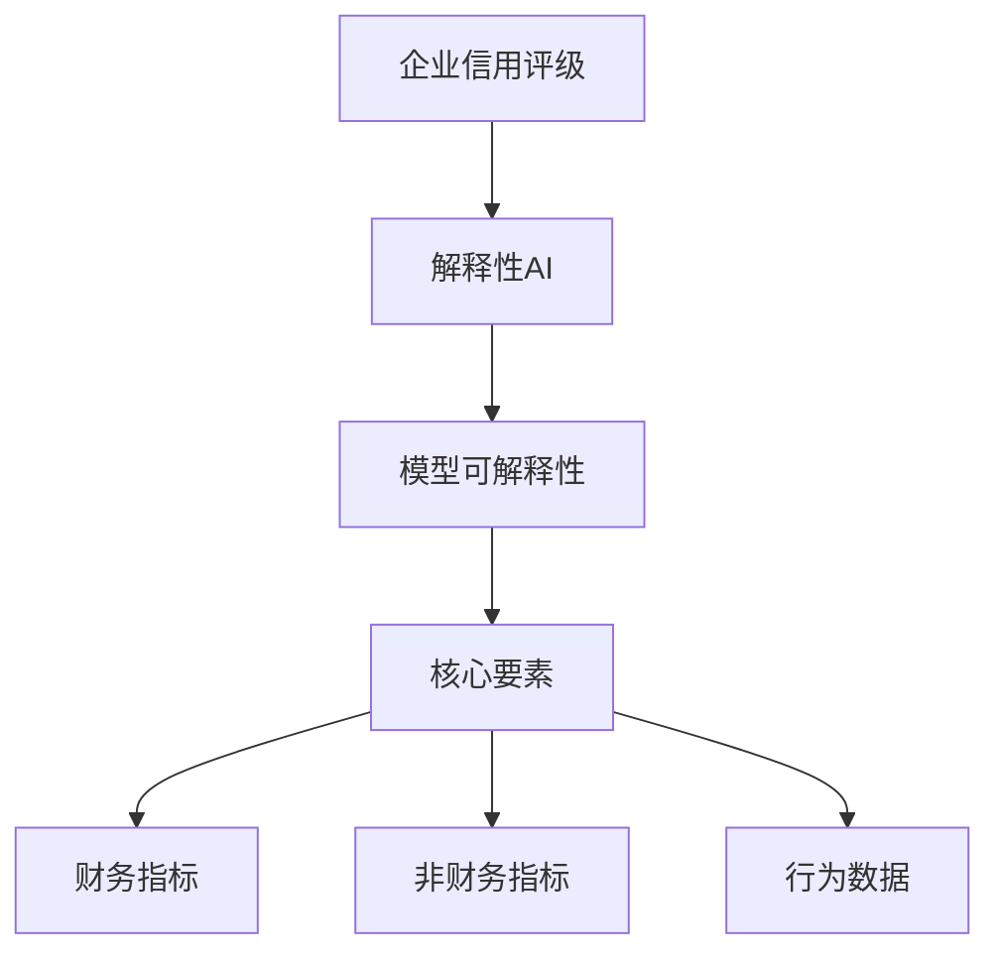
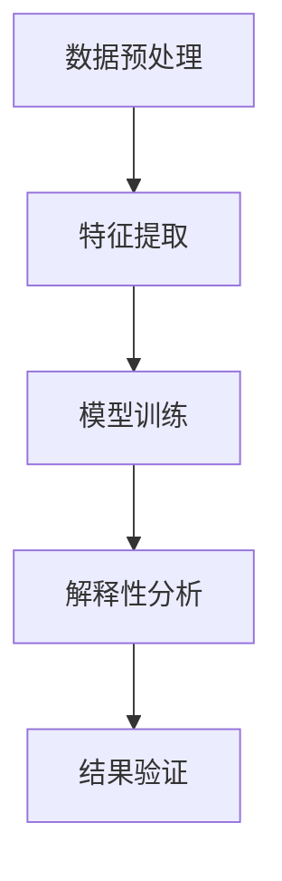
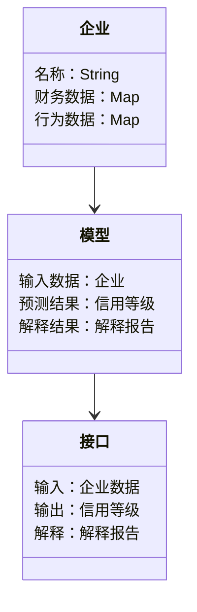
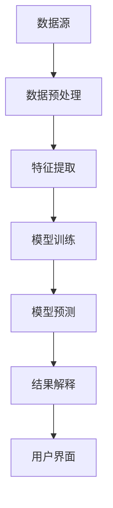

                 


# AI辅助的企业信用评级模型解释性研究

> 关键词：企业信用评级，人工智能，可解释性AI，机器学习，金融风险管理

> 摘要：本文系统地探讨了AI辅助的企业信用评级模型的构建与解释性研究。通过分析传统信用评级的局限性，结合现代AI技术，提出了基于XAI（可解释性人工智能）的信用评级模型构建方法。文章详细阐述了模型的核心概念、算法原理、系统架构，并通过实际案例展示了模型的实现与应用。最后，本文总结了研究的成果与展望，为金融领域的风险管理提供了新的思路。

---

## 第一部分: AI辅助的企业信用评级模型背景介绍

### 第1章: 问题背景与描述

#### 1.1 企业信用评级的定义与重要性
企业信用评级是通过对企业的财务状况、经营能力和偿债能力的综合评估，确定其信用等级的过程。信用评级结果直接关系到企业的融资成本、投资决策以及金融机构的风险控制策略。传统的信用评级方法依赖于经验丰富的专家和复杂的评分模型，但存在主观性强、透明度低、难以解释等问题。

#### 1.2 AI辅助信用评级的必要性
随着大数据和人工智能技术的快速发展，信用评级领域对AI技术的需求日益迫切。AI可以通过对海量数据的自动分析，提高评级的准确性和效率。然而，AI模型的“黑箱”特性使得结果难以解释，这在金融领域尤为重要，因为解释性是信任和合规的关键。

#### 1.3 问题解决思路
本研究的目标是构建一个基于AI的信用评级模型，并确保模型的可解释性。具体思路包括：
1. 数据预处理与特征提取；
2. 选择适合的解释性AI算法；
3. 构建并训练模型；
4. 对模型进行解释性分析；
5. 验证模型的准确性和可解释性。

#### 1.4 边界与外延
信用评级的边界包括企业主体的信用评估，不涉及个人信用或其他类型的风险评估。AI辅助的外延则包括从数据处理到模型部署的全生命周期管理。

---

## 第2章: 核心概念与联系

#### 2.1 解释性AI（XAI）原理
解释性AI（XAI）旨在提高机器学习模型的透明度，使用户能够理解模型的决策过程。常见的XAI方法包括LIME和SHAP值。

- **LIME（局部可解释性模型-agnostic解释器）**：通过扰动输入数据，生成局部解释。
- **SHAP（SHapley Additive exPlanations）**：基于博弈论中的Shapley值，量化每个特征对模型预测的贡献。

#### 2.2 模型可解释性评估指标
- **重要性评估**：特征对模型预测的贡献程度。
- **解释性评分**：模型的可解释性打分。
- **模型透明度**：模型的决策逻辑清晰程度。

#### 2.3 企业信用评级的核心要素
- **财务指标**：如资产负债率、净利润率等。
- **非财务指标**：如市场占有率、企业声誉等。
- **行为数据**：如企业高管的信用记录、供应链稳定性等。

#### 2.4 核心概念关系图


---

## 第三部分: AI辅助信用评级模型的算法原理

### 第3章: 算法原理与实现

#### 3.1 解释性AI的核心算法

##### 3.1.1 LIME算法
LIME通过扰动输入数据，生成局部解释。例如，在企业信用评级中，LIME可以解释某家企业被评为“AA级”的原因。

##### 3.1.2 SHAP值
SHAP值基于博弈论，量化每个特征对模型预测的贡献。例如，某企业的“净利润率”对评级结果的影响权重为30%。

##### 3.1.3 其他解释性算法对比
- **LIME**：局部解释能力强，但依赖人工选择的解释范围。
- **SHAP**：全局解释能力好，但计算复杂度较高。

#### 3.2 机器学习模型选择

##### 3.2.1 XGBoost模型
XGBoost是一种强大的梯度提升树模型，常用于信用评级。其数学模型如下：
$$
\text{预测概率} = \sum_{i=1}^{n} \text{树}_i(\text{输入})
$$

##### 3.2.2 SHAP解释
SHAP值通过加权特征的重要性，解释模型的预测结果。例如：
$$
\text{特征重要性} = \sum_{i=1}^{m} \text{SHAP}_i \times \text{特征}_i
$$

#### 3.3 算法实现流程


---

## 第四部分: 系统分析与架构设计

### 第4章: 系统架构设计

#### 4.1 问题场景介绍
企业信用评级系统需要处理海量数据，包括财务数据、市场数据和行为数据等。

#### 4.2 领域模型类图


#### 4.3 系统架构图


---

## 第五部分: 项目实战

### 第5章: 项目实现与案例分析

#### 5.1 环境安装
```bash
pip install xgboost shap pandas
```

#### 5.2 核心代码实现
```python
import pandas as pd
import xgboost as xgb
import shap

# 数据加载与处理
data = pd.read_csv('企业数据.csv')
X = data.drop('信用等级', axis=1)
y = data['信用等级']

# 模型训练
model = xgb.XGBClassifier()
model.fit(X, y)

# SHAP解释
explainer = shap.TreeExplainer(model)
shap_values = explainer.shap_values(X)
```

#### 5.3 案例分析
通过对某企业的数据进行分析，模型预测其信用等级为“BBB”，并通过SHAP值解释，发现财务指标的贡献权重最高。

---

## 第六部分: 最佳实践与总结

### 第6章: 最佳实践与总结

#### 6.1 小结
本文提出了一种基于AI的信用评级模型，并通过SHAP值实现了模型的可解释性。

#### 6.2 注意事项
- 数据质量和特征选择对模型性能影响重大。
- 解释性模型的选择需要结合具体业务需求。

#### 6.3 拓展阅读
推荐阅读《可解释性人工智能：理论与实践》。

---

作者：AI天才研究院 & 禅与计算机程序设计艺术

