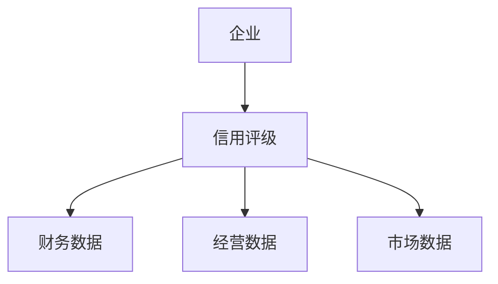
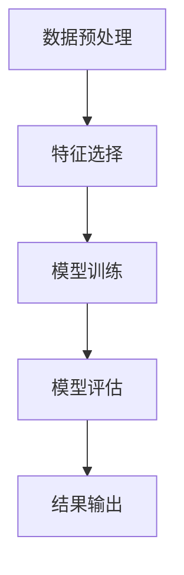
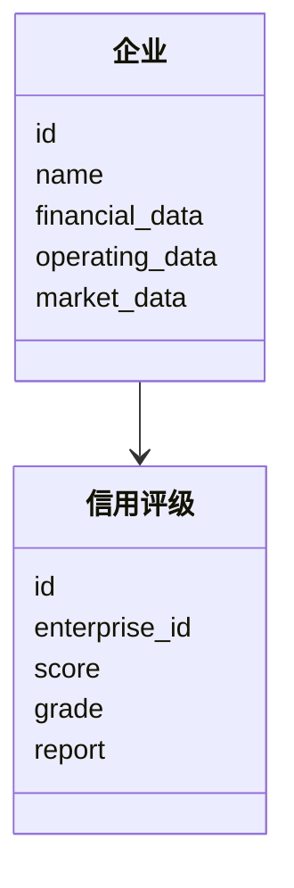
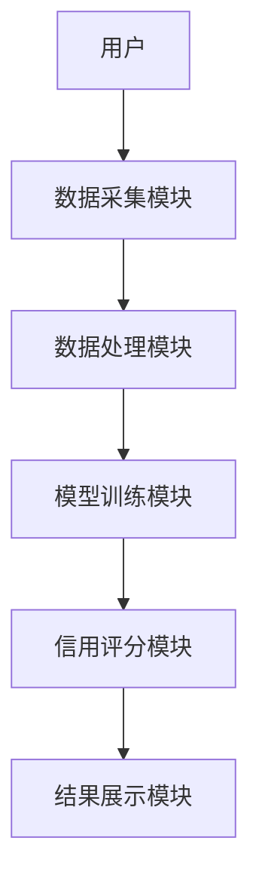
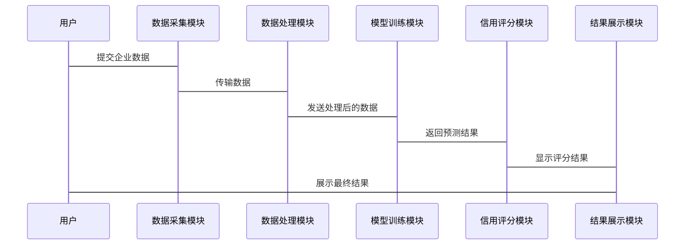

                 


# AI辅助的企业信用评级预警

> 关键词：企业信用评级、人工智能、信用预警、风险管理、机器学习、数据驱动

> 摘要：随着人工智能技术的快速发展，企业信用评级和预警领域正经历着从传统方法向数据驱动的智能化转型。本文详细探讨了AI在企业信用评级中的应用，包括核心概念、算法原理、系统架构及项目实战。通过分析和对比不同的模型算法，结合实际案例，展示了AI如何提升信用评级的准确性和效率。同时，本文也展望了未来的发展趋势，为读者提供了全面的技术视角和实践指导。

---

# 第一部分: AI辅助的企业信用评级预警概述

## 第1章: 企业信用评级与预警的背景介绍

### 1.1 企业信用评级的定义与重要性

#### 1.1.1 企业信用评级的基本概念
企业信用评级是对企业在经济活动中履行债务的能力和意愿的综合评价。评级结果通常以分数或等级形式呈现，反映了企业的信用风险程度。信用评级是企业融资、投资决策的重要参考依据。

#### 1.1.2 信用评级在企业融资中的作用
在企业融资过程中，信用评级直接影响贷款利率、融资额度和投资决策。高信用评级的企业更容易获得低成本资金，而低信用评级的企业则可能面临融资困难或高利率。

#### 1.1.3 信用评级对企业风险管理的意义
信用评级不仅帮助企业识别和管理自身风险，还能帮助债权人和投资者评估潜在损失，制定相应的风险管理策略。

---

### 1.2 企业信用评级的现状与挑战

#### 1.2.1 当前信用评级的主要方法
传统信用评级主要依赖财务报表分析、行业经验判断和专家评估。这种方法主观性强、效率低下，且难以应对海量数据的分析需求。

#### 1.2.2 传统信用评级中的问题与不足
- 数据维度有限，难以全面反映企业信用状况。
- 人工判断为主，容易受到主观因素影响。
- 更新周期长，难以及时捕捉企业信用变化。

#### 1.2.3 数字化时代信用评级的新需求
随着大数据和AI技术的发展，企业信用评级需要更高效、更精准的方法，以应对海量数据和复杂场景的分析需求。

---

### 1.3 AI技术在信用评级中的应用前景

#### 1.3.1 AI技术如何提升信用评级的效率
AI技术可以通过自动化数据处理和模型训练，快速生成信用评级结果，显著提高效率。

#### 1.3.2 数据驱动的信用评级新范式
AI技术能够整合企业内外部数据，构建多维度的信用评估模型，提供更全面的信用评级结果。

#### 1.3.3 AI辅助信用评级的潜在价值
通过AI技术，企业可以实现信用评级的实时监控和动态调整，降低风险，提高决策效率。

---

## 第2章: AI辅助信用评级的核心概念与联系

### 2.1 核心概念原理

#### 2.1.1 数据特征提取
数据特征是信用评级的基础，包括企业财务数据、经营数据、市场数据等。通过特征工程，可以提取对信用评级影响较大的关键特征。

#### 2.1.2 模型算法选择
选择合适的模型算法是AI辅助信用评级的关键。常用的算法包括逻辑回归、随机森林、神经网络等。

#### 2.1.3 评分标准制定
评分标准是信用评级结果的量化表现，通常采用分数或等级形式，反映了企业的信用风险程度。

---

### 2.2 核心概念对比分析

#### 2.2.1 数据特征与模型算法的对比
数据特征的丰富性和准确性直接影响模型的性能。选择合适的特征组合可以显著提升模型的预测精度。

#### 2.2.2 不同评分标准的优缺点
不同的评分标准有不同的优缺点。例如，分数型评分标准更便于量化分析，而等级型评分标准更便于直观理解。

#### 2.2.3 实际应用场景中的权衡
在实际应用中，需要根据具体场景和需求选择合适的评分标准和模型算法。

---

### 2.3 ER实体关系图



---

## 第3章: AI辅助信用评级的算法原理

### 3.1 算法原理概述

#### 3.1.1 逻辑回归
逻辑回归是一种常用的分类算法，适用于二分类问题。其核心思想是通过求解优化问题，找到最佳拟合曲线。

#### 3.1.2 支持向量机
支持向量机（SVM）是一种监督学习算法，适用于小样本数据的分类和回归问题。其核心思想是通过构建超平面，将数据分成不同类别。

#### 3.1.3 随机森林
随机森林是一种基于决策树的集成算法，具有高准确性和强健性。其核心思想是通过构建多个决策树，并将结果进行投票或平均，提高预测精度。

#### 3.1.4 神经网络
神经网络是一种模仿人脑结构和功能的算法，适用于复杂非线性关系的建模。其核心思想是通过多层神经元网络，学习数据的特征和模式。

---

### 3.2 算法实现流程



---

### 3.3 算法实现代码示例

```python
import pandas as pd
from sklearn.model_selection import train_test_split
from sklearn.linear_model import LogisticRegression

# 数据加载与处理
data = pd.read_csv('credit_data.csv')
X = data.drop('target', axis=1)
y = data['target']

# 数据分割
X_train, X_test, y_train, y_test = train_test_split(X, y, test_size=0.2, random_state=42)

# 模型训练
model = LogisticRegression()
model.fit(X_train, y_train)

# 模型预测
y_pred = model.predict(X_test)

# 模型评估
accuracy = model.score(X_test, y_test)
print(f'Accuracy: {accuracy}')
```

---

### 3.4 数学模型和公式

#### 3.4.1 逻辑回归的损失函数
逻辑回归的目标是最小化损失函数，常用的损失函数为对数损失函数：

$$ L = -\sum_{i=1}^{n} [y_i \ln(p_i) + (1 - y_i)\ln(1 - p_i)] $$

其中，$p_i$ 是第 $i$ 个样本的预测概率，$y_i$ 是标签。

#### 3.4.2 逻辑回归的优化方法
逻辑回归的参数优化通常采用梯度下降法，优化目标是最小化损失函数：

$$ \theta := \theta - \alpha \frac{\partial L}{\partial \theta} $$

其中，$\alpha$ 是学习率，$\theta$ 是模型参数。

---

## 第4章: 系统分析与架构设计方案

### 4.1 项目背景介绍

#### 4.1.1 问题场景介绍
本文以银行信用评级系统为例，探讨如何利用AI技术提升信用评级的效率和准确性。

#### 4.1.2 项目介绍
本项目旨在构建一个基于AI的企业信用评级系统，实现对企业信用风险的实时监控和预警。

---

### 4.2 系统功能设计

#### 4.2.1 领域模型（类图）



---

#### 4.2.2 系统架构设计



---

### 4.3 系统接口设计

#### 4.3.1 API接口设计
以下是信用评分模块的API接口示例：

```http
POST /api/v1/credit_score
Content-Type: application/json

{
    "enterprise_id": "12345",
    "financial_data": {
        "revenue": 1000000,
        "profit": 100000
    },
    "operating_data": {
        "employee_count": 50,
        "customer_count": 1000
    }
}
```

---

#### 4.3.2 数据接口设计
数据接口用于采集和处理企业数据，支持多种数据源，如数据库、API等。

---

### 4.4 系统交互设计



---

## 第5章: 项目实战

### 5.1 环境安装与配置

#### 5.1.1 安装Python和相关库
```bash
pip install numpy pandas scikit-learn
```

#### 5.1.2 数据集准备
数据集包括企业财务数据、经营数据、市场数据等。

---

### 5.2 系统核心实现

#### 5.2.1 数据预处理代码

```python
import pandas as pd
from sklearn.impute import SimpleImputer
from sklearn.preprocessing import StandardScaler

# 数据加载
data = pd.read_csv('credit_data.csv')

# 处理缺失值
imputer = SimpleImputer(strategy='mean')
data_imputed = imputer.fit_transform(data)

# 标准化处理
scaler = StandardScaler()
data_scaled = scaler.fit_transform(data_imputed)
```

---

#### 5.2.2 模型训练代码

```python
from sklearn.model_selection import train_test_split
from sklearn.ensemble import RandomForestClassifier

X = data_scaled
y = data['target']

X_train, X_test, y_train, y_test = train_test_split(X, y, test_size=0.2, random_state=42)

model = RandomForestClassifier(n_estimators=100, random_state=42)
model.fit(X_train, y_train)
```

---

#### 5.2.3 结果分析

```python
from sklearn.metrics import classification_report

y_pred = model.predict(X_test)
print(classification_report(y_test, y_pred))
```

---

### 5.3 实际案例分析

#### 5.3.1 案例背景
某银行希望通过AI技术提升其信用评级的效率和准确性。

#### 5.3.2 数据分析
通过对某企业的财务数据和市场数据进行分析，模型预测该企业的信用评分为B级。

#### 5.3.3 模型优化
根据实际效果，调整模型参数和数据特征，进一步提高预测精度。

---

## 第6章: 最佳实践与总结

### 6.1 小结

通过本文的详细讲解，我们了解了AI在企业信用评级中的应用，包括核心概念、算法原理、系统架构和项目实战。AI技术能够显著提升信用评级的效率和准确性，为企业风险管理提供有力支持。

---

### 6.2 注意事项

- 数据质量和完整性是模型性能的关键，需谨慎处理数据。
- 模型选择和调优需结合实际场景和数据特点。
- 结果解释和可解释性是信用评级的重要因素，需注重模型的可解释性。

---

### 6.3 未来趋势

随着AI技术的不断发展，企业信用评级将更加智能化和个性化。未来，可能会出现更多基于深度学习的模型，以及实时动态的信用评分系统。

---

### 6.4 拓展阅读

- 《机器学习实战》
- 《Python机器学习》
- 《信用评分模型》

---

## 作者：AI天才研究院/AI Genius Institute & 禅与计算机程序设计艺术 /Zen And The Art of Computer Programming

---

通过本文的详细讲解，我们了解了AI在企业信用评级中的应用，包括核心概念、算法原理、系统架构和项目实战。AI技术能够显著提升信用评级的效率和准确性，为企业风险管理提供有力支持。

