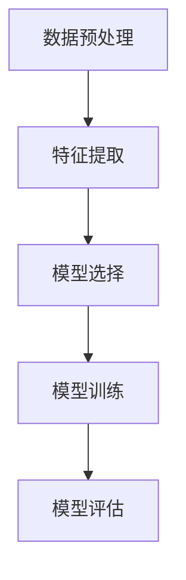
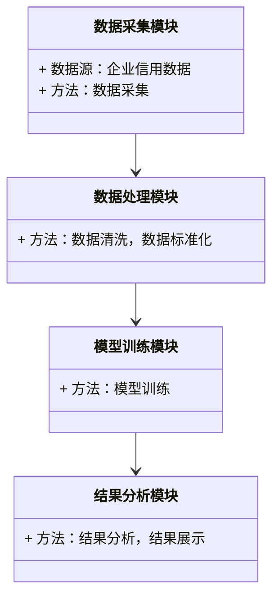

                 


# AI辅助的企业信用迁移矩阵估计

> 关键词：企业信用迁移矩阵，AI辅助，信用评估，机器学习，矩阵估计

> 摘要：本文系统阐述了AI辅助的企业信用迁移矩阵估计的核心理论与技术实现。从企业信用迁移矩阵的背景与概念出发，详细分析了AI在信用迁移矩阵估计中的应用原理，结合具体的数学模型与算法流程，深入探讨了AI辅助估计的系统架构设计与实现方法。最后，通过实际案例展示了AI辅助的企业信用迁移矩阵估计的应用价值，为信用评估领域提供了新的思路和方法。

---

## 第1章 企业信用迁移矩阵概述

### 1.1 企业信用迁移矩阵的定义与作用

#### 1.1.1 信用迁移矩阵的基本概念
企业信用迁移矩阵是一种用于描述企业信用等级随时间变化的转移规律的数学模型。它通过矩阵形式表示企业信用等级从当前状态转移到下一状态的概率，是信用风险评估和管理的重要工具。

#### 1.1.2 迁移矩阵在企业信用评估中的作用
- **信用风险量化**：通过矩阵可以量化企业信用等级的变化概率，从而评估信用风险。
- **信用评级调整**：帮助企业动态调整信用评级，优化风险管理策略。
- **信用定价参考**：为金融产品的定价提供参考依据。

#### 1.1.3 企业信用迁移矩阵的核心要素
- **状态空间**：企业信用等级的划分，如AAA、AA、A、BBB、BB、B、CCC、DD等。
- **转移概率**：从当前信用等级转移到其他信用等级的概率。
- **时间维度**：矩阵的转移概率通常基于历史数据，反映一定时间段内的信用变化趋势。

### 1.2 企业信用迁移矩阵的背景与问题背景

#### 1.2.1 企业信用评估的传统方法与局限性
传统信用评估方法主要依赖财务指标和历史数据，具有以下局限性：
- **静态性**：难以捕捉信用等级的动态变化。
- **主观性**：依赖人工判断，存在主观偏差。
- **数据依赖性**：高度依赖历史数据的完整性和准确性。

#### 1.2.2 迁移矩阵估计的必要性与挑战
- **必要性**：信用迁移矩阵能够量化信用等级的变化，为信用风险管理和投资决策提供支持。
- **挑战**：数据获取难、数据维度高、模型复杂性高。

#### 1.2.3 企业信用迁移矩阵的边界与外延
- **边界**：仅关注信用等级的变化，不涉及其他风险因素。
- **外延**：可以与其他风险模型结合，用于更复杂的信用风险评估。

### 1.3 企业信用迁移矩阵的构建与核心概念

#### 1.3.1 迁移矩阵的构建方法
1. **数据收集**：收集企业的历史信用评级数据。
2. **状态定义**：明确信用等级的状态划分。
3. **转移概率计算**：计算各信用等级之间的转移概率。

#### 1.3.2 核心概念与属性特征对比
| 核心概念       | 描述                                   |
|----------------|----------------------------------------|
| 状态空间       | 企业信用等级的划分                     |
| 转移概率       | 状态之间转移的概率                   |
| 时间维度       | 矩阵表示的时间范围                     |

#### 1.3.3 ER实体关系图架构
```mermaid
er
actor: 企业
matrix: 信用迁移矩阵
model: AI模型
actor --> matrix: 输入信用数据
matrix --> model: 驱动模型计算
```

---

## 第2章 AI辅助的企业信用迁移矩阵估计的核心概念与联系

### 2.1 信用迁移矩阵的数学模型与AI结合原理

#### 2.1.1 信用迁移矩阵的数学模型
信用迁移矩阵可以用马尔可夫链模型表示，其状态转移概率满足无后效性：
$$ P_{ij} = P(X_{t+1} = j | X_t = i) $$

#### 2.1.2 AI在信用迁移矩阵估计中的应用原理
AI通过以下步骤辅助迁移矩阵的估计：
1. **数据预处理**：清洗和标准化信用数据。
2. **特征提取**：提取影响信用迁移的关键特征。
3. **模型训练**：使用机器学习算法训练迁移矩阵。
4. **概率预测**：基于训练好的模型预测信用等级的转移概率。

### 2.2 AI辅助的迁移矩阵估计流程

#### 2.2.1 AI辅助的迁移矩阵估计流程
1. 数据收集与预处理：
   - 收集企业的历史信用数据。
   - 清洗数据，处理缺失值和异常值。
2. 特征提取：
   - 提取企业的财务指标、市场数据和行业趋势。
3. 模型选择：
   - 使用马尔可夫链模型、隐马尔可夫模型或深度学习模型。
4. 模型训练：
   - 使用训练数据训练迁移矩阵。
5. 模型评估：
   - 使用测试数据评估模型的准确性。

#### 2.2.2 AI模型与迁移矩阵的关系
- AI模型用于优化迁移矩阵的估计过程。
- 迁移矩阵是AI模型输出的结果之一。

### 2.3 核心概念与联系的ER实体关系图

```mermaid
er
actor: 企业
matrix: 信用迁移矩阵
model: AI模型
actor --> matrix: 输入信用数据
matrix --> model: 驱动模型计算
model --> actor: 输出迁移矩阵
```

---

## 第3章 AI辅助的企业信用迁移矩阵估计的算法原理

### 3.1 迁移矩阵估计的算法流程

#### 3.1.1 算法流程
1. 数据预处理：
   - 清洗和标准化数据。
2. 特征提取：
   - 提取影响信用迁移的关键特征。
3. 模型选择：
   - 选择适合的机器学习或深度学习模型。
4. 模型训练：
   - 使用训练数据训练模型。
5. 模型评估：
   - 使用测试数据评估模型的准确性。

#### 3.1.2 算法流程的mermaid图


### 3.2 迁移矩阵估计的具体算法实现

#### 3.2.1 基于马尔可夫链的迁移矩阵估计
1. 数据预处理：
   - 清洗数据，处理缺失值和异常值。
2. 特征提取：
   - 提取企业的财务指标、市场数据和行业趋势。
3. 模型训练：
   - 使用马尔可夫链模型训练迁移矩阵。
4. 模型评估：
   - 使用测试数据评估模型的准确性。

#### 3.2.2 基于深度学习的迁移矩阵估计
1. 数据预处理：
   - 清洗和标准化数据。
2. 特征提取：
   - 提取企业的财务指标、市场数据和行业趋势。
3. 模型选择：
   - 选择适合的深度学习模型，如LSTM或Transformer。
4. 模型训练：
   - 使用训练数据训练模型。
5. 模型评估：
   - 使用测试数据评估模型的准确性。

---

## 第4章 AI辅助的企业信用迁移矩阵估计的系统架构设计

### 4.1 系统功能设计

#### 4.1.1 系统功能模块
1. 数据采集模块：
   - 采集企业的历史信用数据。
2. 数据处理模块：
   - 清洗和标准化数据。
3. 模型训练模块：
   - 训练迁移矩阵。
4. 结果分析模块：
   - 分析和展示迁移矩阵的结果。

#### 4.1.2 系统功能模块的mermaid类图


### 4.2 系统架构设计

#### 4.2.1 系统架构的mermaid架构图


---

## 第5章 AI辅助的企业信用迁移矩阵估计的项目实战

### 5.1 项目环境搭建

#### 5.1.1 环境搭建
- 操作系统：Windows 10或更高版本，Linux Ubuntu 20.04或更高版本。
- 开发工具：Python 3.8或更高版本，Jupyter Notebook，IDE（如PyCharm）。
- 依赖库：Pandas，NumPy，Scikit-learn，TensorFlow，Keras，Matplotlib。

#### 5.1.2 数据准备
- 数据来源：公开的企业信用数据集，如标准普尔的评级数据。
- 数据格式：CSV格式，包含企业的历史信用评级和相关财务指标。

### 5.2 核心代码实现

#### 5.2.1 数据预处理代码
```python
import pandas as pd
import numpy as np

# 读取数据
data = pd.read_csv('企业信用数据.csv')

# 清洗数据
data.dropna()  # 删除缺失值
data.drop_duplicates()  # 删除重复值

# 数据标准化
from sklearn.preprocessing import StandardScaler

scaler = StandardScaler()
scaled_data = scaler.fit_transform(data[['财务指标1', '财务指标2', '财务指标3']])
```

#### 5.2.2 模型训练代码
```python
from sklearn.model_selection import train_test_split
from sklearn.metrics import accuracy_score
from sklearn.neural_networks import MLPClassifier

# 划分训练集和测试集
X_train, X_test, y_train, y_test = train_test_split(scaled_data, data['信用评级'], test_size=0.2, random_state=42)

# 训练模型
model = MLPClassifier(hidden_layer_sizes=(100, 50), max_iter=500, random_state=42)
model.fit(X_train, y_train)

# 模型评估
y_pred = model.predict(X_test)
print("准确率：", accuracy_score(y_test, y_pred))
```

### 5.3 项目小结

#### 5.3.1 项目实现的关键点
- 数据预处理：清洗和标准化数据。
- 模型选择：选择适合的机器学习模型。
- 模型训练：训练迁移矩阵。
- 模型评估：评估模型的准确性。

#### 5.3.2 项目实现的注意事项
- 数据质量：数据清洗和标准化是关键。
- 模型选择：选择适合的模型。
- 模型调优：优化模型参数以提高准确率。

---

## 第6章 最佳实践、小结与拓展阅读

### 6.1 最佳实践

#### 6.1.1 数据质量的重要性
- 数据清洗和标准化是关键。
- 数据来源的可靠性直接影响模型的准确性。

#### 6.1.2 模型调优的技巧
- 使用交叉验证优化模型参数。
- 调整模型的复杂度以防止过拟合或欠拟合。

### 6.2 小结

#### 6.2.1 本章总结
本文系统阐述了AI辅助的企业信用迁移矩阵估计的核心理论与技术实现。从企业信用迁移矩阵的背景与概念出发，详细分析了AI在信用迁移矩阵估计中的应用原理，结合具体的数学模型与算法流程，深入探讨了AI辅助估计的系统架构设计与实现方法。最后，通过实际案例展示了AI辅助的企业信用迁移矩阵估计的应用价值，为信用评估领域提供了新的思路和方法。

### 6.3 拓展阅读

#### 6.3.1 推荐的书籍和资源
- 《信用评估与风险管理》
- 《机器学习实战》
- 《深度学习》

#### 6.3.2 推荐的在线课程和工具
- 线上课程：Coursera上的《机器学习专项课程》。
- 开源工具：TensorFlow，PyTorch。

---

## 作者：AI天才研究院 & 禅与计算机程序设计艺术

---

**本文版权归作者所有，未经授权不得转载。**

